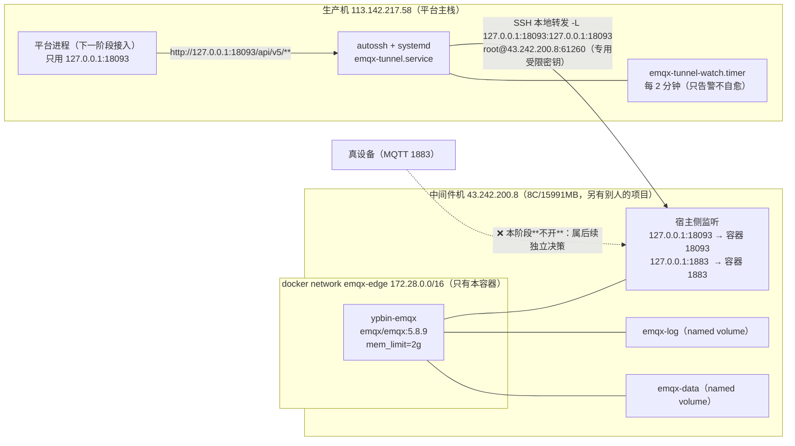

# EMQX 部署文档（中间件机 · 阶段①②）

> **范围**：在**中间件机**上部署 EMQX 5.8.9（起服务 + 建隧道 + 阶段②限内存 OOM/存活实测 + 连通性验收）。
> **不在本阶段**：平台侧代码集成（薄适配端点 `POST /internal/mqtt/readings`、下行 `POST /api/v5/publish` 调用）—— 属下一阶段。
> **设计依据**：`docs/EMQX-INGRESS-DESIGN.md`（下称「设计」）。本文件的实测数据日期：**2026-09-27（UTC）**。
> **纪律**：全局 `~/.dsh/AGENTS.md` 第 2 节 R1–R8；数据一律来自一手实测，未核实项显式标注。

---

## 0. 结论先行

| # | 结论 | 证据强度 |
|---|---|---|
| **C1** | **阶段① 达标**：EMQX 5.8.9 在中间件机以**独立 compose 项目**跑起来，容器 `healthy`；**19 项自检全绿**（`no_match=deny` 生效、匿名与越权收发被拒、默认口令 `admin/public` 被拒、REST API Key 可用、1883/18093 宿主侧**只绑回环**）。 | 一手实测（`emqx-init.sh` 输出，§4） |
| **C2** | 🔴 **红线 H1 已硬落地**：`authorization.no_match=deny` 与 `deny_action=ignore` **显式设置并读回确认**；越权 publish/subscribe 的拒绝**由 EMQX 侧指标增长证明**（`packets.publish.auth_error`、`packets.subscribe.auth_error`、`authorization.nomatch`），不是「没报错就算过」。 | 一手实测（指标前后差值，§4.3） |
| **C3** | **`api_key.bootstrap_file` 在 OSS `emqx/emqx:5.8.9` 上确实生效**（设计 U18 → **已关闭**）：容器启动日志无 `failed_to_open_the_bootstrap_file`，且 `curl -u <key>:<secret> .../api/v5/status` 返回 **HTTP 200**。 | 一手实测（§4.2） |
| **C4** | **隧道自愈达标**：生产机 `autossh + systemd`，**杀隧道进程后恢复 1.84–2.00 s（5/5 次，全部 < 3 s）**；杀 ssh 子进程由 autossh 自己重连（**1.24 s**，systemd 不重启单元）。 | 一手实测（§6.3） |
| **C5** | **端口不回公网**：宿主侧 1883/18093 监听集合 = `{127.0.0.1:*}`；**从生产机（另一网络）实测 1883/18083/8883/18093 全部不可达**，而 61260(sshd) 可达（对照组成立）。 | 一手实测（§5.2） |
| **C6** | **阶段② 通过**：100 与 500 连接两档（各 10 分钟、QoS1、1 msg/s/连接）全程 `OOMKilled=false`、`RestartCount` 不增长、`mem_limit` 使用率峰值 **13.30% / 14.14%**（100/500 档，2GiB 上限）、延迟 **p95 = 3 ms / 3 ms**（100/500 档；p99 均 5 ms，max 15 ms / 37 ms）、`/` 使用率不升。 | 一手实测（§7） |
| **C7** | **对「别人的项目」零影响**：`aicomic-mysql` / `aicomic-minio` / `sub2api` / 宝塔 的容器 ID、镜像 ID、网络、卷、监听端口全部未变；**未执行任何 prune**。 | 一手实测（§8） |
| **C8** | ⚠️ **阶段①② 交付的是「平台可用」= 管理面（REST）+ 认证/ACL + 可承载的 broker**；**真设备接入 1883 的对外暴露、TLS 8883** 当时**未做**，属后续独立决策点。 | 范围声明（**2026-09-27 已按用户决策部分推进，见 C9**） |
| **C9** | 🔴 **2026-09-27 开发测试期：1883 已对外暴露**（`0.0.0.0:1883`，用户决策）；**管理面 18093 与 TLS/WS/WSS 一律未放开**（从外部实测 CLOSED）；**云安全组本来就已放行**（外部实测可达 ⇒ **用户无需云侧操作**）；**从外部（生产机）经公网 1883 的端到端 ①–⑥ 全部 PASS**（上行落库/曲线/幂等/越权被拒/无凭据被拒 + 下行 receipt→`succeeded`）。详见 §3.1。 | 一手实测（`deploy/emqx/expose-evidence/`） |
| **C10** | 🔴 **两条机制发现（会改变风险判断，务必读 §3.1）**：① **Docker 发布端口不受 ufw/INPUT 管辖** —— 撤掉自加的 INPUT 1883 规则后从外部**仍可达**（流量在 `nat/PREROUTING` 被 DNAT、在 `filter/FORWARD -j DOCKER` 被 ACCEPT）；**真闸门是绑定地址 + 云安全组**，按来源收敛要写 `DOCKER-USER`/云安全组。② **重建 EMQX 容器会让平台的 EMQX 管理面客户端（JDK HttpClient 默认 HTTP/2）发布失败**（h2c upgrade EOF）——**平台侧缺陷，非暴露面问题**，判据可复跑（`deploy/emqx/diagnose-emqx-admin-h2c/`）。 | 一手实测（撤规则后外部探测、JDK 探针 3/3 vs 3/3） |

---

## 1. 部署形态与本仓设计的差异（先说清楚）

| 维度 | 设计 §8.1 原文 | 本阶段实际 | 为什么改 |
|---|---|---|---|
| 部署位置 | 生产机 `deploy/docker-compose.yml` 加 `emqx` 服务 | **中间件机 `43.242.200.8`，独立项目 `/opt/emqx`** | 设计 §8.3 阶段③「另机部署」+ 设计文末《资源决策记录：EMQX 不在本机部署》；生产机 `available` 长期不足、`swap` 已用 1.4G，而同机新增容器是设计明确否掉的选项 |
| 项目隔离 | 与平台同项目 | **独立 compose 项目 `emqx-edge` + 独立网络 `emqx-edge`(172.28.0.0/16) + 独立卷 `emqx-data`/`emqx-log`** | 中间件机上还有**别人的项目**（`aicomic-*`/`sub2api`/宝塔）⇒ 与它们**零共享** |
| Dashboard/REST 端口 | `18083` | **`18093`** | 按用户指令（18083 在本机已被占用）；本机实测 18083 当前**未监听**，但仍按指令固定用 18093，避免与将来占用者冲突 |
| `mem_limit` | `512m`（针对生产机 `available≈904MB` 的工程建议） | **`2g`** | 中间件机 15991MB、`available≈14GB`（实测）⇒ 512m 的取值前提不成立；2g 是「够用且**仍必须封顶**」的折中，避免将来与别人抢内存 |
| 入站 Rule Engine / HTTP 动作 / `max_buffer_bytes` | §6.1、H6 | **未做** | 属平台侧集成（下一阶段）；无 bridge ⇒ `max_buffer_bytes` 本阶段无对象 |
| 数据持久化 | 挂 `/opt/emqx/data`、`/opt/emqx/log` | 同（named volume） | 官方要求 |

> **R8 提示**：本阶段的部署**不含** Rule Engine / HTTP 桥接，因此**设计 H6（`max_buffer_bytes` 下调）在本阶段不适用**；
> 下一阶段加桥接时**必须**补上，不能因为「阶段① 已达标」而漏掉。

---

## 2. 拓扑



**关键点**

1. **平台将来只用回环访问**：`http://127.0.0.1:18093`（隧道本地端口）——平台侧不需要知道中间件机地址，也不需要任何公网暴露。
2. **中间件机的 1883 本阶段只绑回环**：真设备接入的对外暴露**未做**，需要单独决策（§9）。
3. 隧道**以 `-N` 运行**（不申请 shell、不落任何口令文件），唯一凭据是一把专用私钥；
   该私钥在中间件机侧带 `restrict,port-forwarding,permitopen="127.0.0.1:18093"` ⇒ **转发目标被钉死**。
   ⚠️ **但它的实际能力不止"只转发一个目标"**——反向转发与非交互命令执行都**未被禁止**
   （OpenSSH 无对应 authorized_keys 选项），见 §6.1 的 R8 残留风险，别按"只有转发"去理解。

---

## 3. 端口与暴露面

| 端口 | 容器内 | 宿主侧 | 公网 | 说明 |
|---|---|---|---|---|
| `18093` | 0.0.0.0（容器内必须） | **`127.0.0.1`**（`EMQX_DASHBOARD_BIND_ADDR`，回环） | **不可达**（实测） | Dashboard + REST API 同端口；18083 按指令改为 18093；**管理面不对公网开放** |
| `1883` | 0.0.0.0（容器内必须） | **`0.0.0.0`**（`EMQX_MQTT_BIND_ADDR`）——**开发测试期决策**，见 §3.1 | **可达**（从生产机实测） | MQTT 明文；**暴露面登记与回滚见 §3.1** |
| `8883` / `8083` / `8084` | **监听器已显式 `enable=false`** | 不发布 | 不可达 | TLS/WS/WSS 属 P1；实测容器启动日志为 `Listener ssl:default is NOT started due to: disabled.`（同理 ws/wss） |
| `4370` / `5370` | 容器内 | 不发布 | 不可达 | 单节点不组集群；发布等于暴露 Erlang distribution |
| `61260` | — | `0.0.0.0`（宿主 sshd，**原有**） | 可达（对照组） | 隧道入口；**本阶段未改动 sshd 配置**（仅向 `authorized_keys` **追加**一条受限公钥） |

**双重纵深**（不是只靠一层）：

- **绑定层**：宿主侧 docker-proxy 的绑定地址（`ss -ltnp` 实测，§4.1）。**这是 1883 对外可达的真闸门**（见 §3.1）。
- **主机防火墙层**：该机 `ufw` **active**、`iptables INPUT policy DROP`。
  ⚠️ **但 ufw/INPUT 管不到 Docker 发布出来的端口** —— 这是本轮实测到的关键机制事实，详见 §3.1。

> ⚠️ **不要把「本机 ufw active」当成设计的替代**：设计 §F44 的实测是「生产机无防火墙」，而**中间件机有**——
> 两台机器的暴露面结论不能互相套用。本阶段在中间件机上是**两层都做**。

---

## 3.1 开发测试期的暴露面登记（2026-09-27）

> 📅 **日期口径**：本节及本 PR 的时间戳用**经外部权威源核对的真实 UTC 日期**（`api.github.com` 与 Google
> 的 `Date` 响应头均为 `Sun, 27 Sep 2026`，与宿主 `date -u` 一致）。⚠️ 注意本仓**其它**为本项目留下
> 的产物（如 `deploy/sql/migration/2026-10-0{1,2}-*.sql`、部分测试的 `@since 2026-10-01`）用的是
> **超前 1–6 天**的日期 —— 这是**既有的、全仓范围**的现象（非本节引入），核对证据时请以**日志里的真实
> 时间戳**为准。该偏差由独立复核（R6/PR #90 复核者）用两个外部源发现，此处仅登记、未去改动别人的文件。

### 结论

**1883 已对外暴露**（宿主 `0.0.0.0:1883`），依据用户 2026-09-27 决策「可以对外暴露没关系，反正现在是开发测试阶段」。
**管理面（18093）、TLS(8883)、WS(8083)/WSS(8084) 一律未放开**；**云安全组本来就已放行 1883**（从生产机实测可达），
**用户无需在云控制台做任何操作**。

### 开了什么 / 没开什么（本轮实测）

| 项 | 状态 | 证据 |
|---|---|---|
| `1883` 宿主绑定 | **`0.0.0.0:1883`**（`EMQX_MQTT_BIND_ADDR=0.0.0.0`） | `docker compose ps` → `0.0.0.0:1883->1883/tcp`；`ss -lntp` → `0.0.0.0:1883` |
| `1883` 公网可达 | **可达**（从生产机 `nc -z 43.242.200.8 1883` 成功） | §3.1「外部可达性」小节的原始输出 |
| `18093` 管理面 | **仍只绑回环**（`127.0.0.1:18093`），公网**不可达** | `docker compose ps` + 从生产机探测 **CLOSED** |
| `8883/8083/8084` | **未发布、容器内 `enable=false`**，公网**不可达** | `ss -lntp` 无监听；从生产机探测全 **CLOSED** |
| 宿主 INPUT tcp/1883 放行 | **已加**（纵深防御；**不是**有效闸门，见下） | `iptables -S INPUT` 队首一条 `--dport 1883 -j ACCEPT` |
| 匿名连接 | **被拒** | `client.auth.anonymous` 恒 0；匿名连接 `connack.auth_error` +1（§3.1 鉴权小节） |

### 为什么可接受

1. **强制鉴权**：设备认证走内置库（sha256+盐），**没有任何匿名认证器** ⇒ 无凭据连接被拒（实测 CONNACK rc=4）。
2. **ACL 默认拒绝**：`authorization.no_match = deny`（生效值已回读），规则只有"设备只能发自己的 `up/#`、
   只能收自己的 `down/#`"两条 ⇒ 越权主题被拒（实测指标差值）。
3. **口令强度**：平台签发的一次性设备口令为 **43 字符 base64url**（256 位随机熵，实测 `pwlen=43`），
   人工爆破不现实；且**每次签发即轮换**（旧口令立即失效）。
4. **开发测试阶段**：无真实生产数据、无真实硬件设备接入，暴露窗口可控，且**可一行回滚**。

### 风险与代价（**已知并接受，不得淡化**）

| 风险 | 说明 |
|---|---|
| 🔴 **明文 MQTT** | 1883 无 TLS ⇒ **设备口令与业务数据以明文过公网**，可被链路上的人读取。缓解：一次性口令 + 轮换；**根治 = 上 TLS 8883** |
| 🔴 **端口扫描 / 爆破暴露面** | 全网可达 ⇒ 会被扫描；虽无匿名入口、口令强，但暴露面客观存在 |
| 🔴 **与别人项目共存** | 中间件机上还有 `aicomic-*`/`sub2api`/宝塔；本机防火墙策略的任何误伤都会连带影响他们 ⇒ 本轮**只加了一条 1883 规则**，未做任何 `-F`、未改默认策略、未动宝塔的 `IN_BT` 与 ufw 链 |
| ⚠️ **Docker 端口绕过 ufw**（见下） | 该机**所有 Docker 发布端口**都不受 ufw/INPUT 管辖 ⇒ 上一轮"ufw 是第二层"的表述**对本机 Docker 端口不成立** |

### 🔴 关键机制事实：Docker 发布端口不受 ufw/INPUT 管辖（本轮实测）

**实测过程与结论**（这是本轮最重要的机制发现，直接影响"谁来当闸门"的判断）：

```text
# ① 撤掉本仓自己加的那条 INPUT tcp/1883 放行规则
iptables -D INPUT -p tcp --dport 1883 -j ACCEPT     # 回读确认 INPUT 里已无 1883
# ② 仍从**外部**（生产机）探测 —— 结果仍然可达：
OPEN   43.242.200.8:1883（INPUT 规则撤了仍可达 ⇒ INPUT 规则不是闸门）

# 原因：EMQX 的 1883 是 compose `ports:` 发布出来的
-A PREROUTING -m addrtype --dst-type LOCAL -j DOCKER                                  # nat
-A DOCKER ! -i br-xxxx -p tcp --dport 1883 -j DNAT --to-destination 172.28.0.2:1883   # nat
-A DOCKER -d 172.28.0.2/32 ... -p tcp --dport 1883 -j ACCEPT                          # filter，经 FORWARD 命中
```

外部流量在 `nat/PREROUTING` 就被 DNAT 成**转发**流量，随后经 `filter/FORWARD -j DOCKER` 被 ACCEPT，
**根本不经过 INPUT** ⇒ `ufw`（只过滤 INPUT）与我们的 INPUT 规则对它都无效。

**由此得出的操作结论（务必记住）**：

1. **1883 对外可达的真闸门 = ① 绑定地址（`EMQX_MQTT_BIND_ADDR`）+ ② 云安全组**；
   `ufw`/INPUT 规则对它**不起作用**，只是纵深防御。
2. **要按来源收敛访问，必须写在 `DOCKER-USER` 链或云安全组上**，写在 INPUT/ufw 上**无效**：见下节。
   本轮**未下**来源收敛规则（它与"开发测试期允许全网"的当前决策冲突）；生产前应收紧。

#### 按来源收敛的正确做法（`DOCKER-USER` / 云安全组）

> 为什么单独一节：这是本机最容易做错的一件事——**在 ufw 或 INPUT 里写限源规则会让人以为收紧了，
> 实际一点作用都没有**（Docker 发布端口不走 INPUT）。照着写错 = 给自己一个假的安全感。

```bash
# ① 宿主机层：对 Docker 发布端口**唯一**有效的 iptables 位置是 DOCKER-USER
#    Docker 保证 DOCKER-USER 先于它自己的 DOCKER 链被求值，因此这里的 ACCEPT/DROP 能压住转发流量。
# 先插兜底 DROP，再插允许来源（顺序即优先级，务必用 -I 插到链首；-A 追加会被 Docker 自己的规则盖住）
iptables -I DOCKER-USER -p tcp --dport 1883 -j DROP
iptables -I DOCKER-USER -p tcp --dport 1883 -s 203.0.113.7 -j ACCEPT
# 回读自证：
iptables -S DOCKER-USER
# 一行撤销（两条都要删）：
iptables -D DOCKER-USER -p tcp --dport 1883 -j DROP; iptables -D DOCKER-USER -p tcp --dport 1883 -s 203.0.113.7 -j ACCEPT
```

```text
# ② 云安全组层（**推荐作为主闸门**：不依赖宿主机的 Docker 行为，且它才是本机暴露面的真正决定者）
入方向规则示例（顺序即优先级，先允许后兜底拒绝）：
  规则 1 允许  TCP  1883  来源 203.0.113.7/32   描述 "ypbin 设备来源（开发测试）"
  规则 2 拒绝  TCP  1883  来源 0.0.0.0/0        描述 "兜底拒绝其余 IPv4 来源"
  规则 3 拒绝  TCP  1883  来源 ::/0             描述 "兜底拒绝 IPv6 来源（见下）"
```

**⚠️ IPv6 也要考虑**（本轮实测与本机现状）：

- 本轮 `1883` **只有 IPv4 监听**（`ss -lnt` 仅 `0.0.0.0:1883`，**没有** `[::]:1883`）⇒ 当前不存在 IPv6 暴露路径；
  这与 compose 只写 `0.0.0.0` 有关（Docker 不会因此自动给 IPv6 绑定）。
- 但**同机已有 5 个端口带 `[::]` 监听**（`13306`/`9000`/`9001`/`80`/`61260`）⇒ 该机**具备 IPv6 暴露面**。
  一旦将来把绑定改成 `::`、加 `[::]` 端口映射，或安全组放开了 IPv6，**IPv4 的限源规则不会保护 IPv6**。
  ⇒ 云安全组与宿主机限源都必须**同时覆盖 IPv4 与 IPv6**（`DOCKER-USER` 在 v4/v6 是两套表，
  IPv6 侧要另写 `ip6tables -I DOCKER-USER ...`）。
- 本轮**未在云安全组做任何改动**（也不需要：1883 本来就已被放行）。

3. **同一机制也意味着别人的项目同样暴露**：实测从生产机探测 `43.242.200.8` 的 **`13306`（aicomic-mysql）与
   `9000/9001`（aicomic-minio）均 OPEN**。这属**同机其它项目的既有暴露面：不是本轮引入的，本方未触碰**
   它们的容器/卷/网络/配置/安全组，也不知晓其业务是否需要公网（红线：一律不碰），仅登记风险；
   **建议知会对应负责人自查**（注意：`ufw`/INPUT 同样拦不住它们）。
4. **同样地**：`ufw` 里那些"放行 3000/3001/39000:40000"之类的规则，对 Docker 发布端口其实是**多余**的；
   而 `ufw` 里没有的端口（如 13306/9000）也照样**可达**。

### 🔴 重建 EMQX 容器会波及平台的管理面调用（本轮实测，非暴露面问题）

改绑定需要 `docker compose up -d emqx`（重建容器）。重建后实测：**平台下发命令一律失败**
（`failed / EMQX_ERROR / EMQX 管理面不可达`），而**管理面本身是健康的**（同一容器里 `curl` 正常、隧道正常、
`import_users` 同步正常）。定位结论（可复跑，见 **`deploy/emqx/diagnose-emqx-admin-h2c/`**）：

- 平台 `EmqxRestAdminClient` 用 JDK `HttpClient` 的**默认 HTTP/2**；当**带体 POST**（`/api/v5/publish`）
  是某条**新连接上的第一个请求**时，连接会被断开 ⇒ `java.io.IOException: EOF reached while reading`。
- 实测：HTTP/2 下**新连接首个带体 POST** = **3/3 EXC(EOF)**；强制 HTTP/1.1 = **3/3 HTTP 202**；
  先发无体 `GET /status` 预热连接再 POST = **3/3 HTTP 202**。
  ⚠️ **不要读成"HTTP/2 下必失败"**：上面的预热模式本身就是 HTTP/2 且 3/3 成功。
- **归因（按独立复核意见收敛）**：独立子代理补做「绕开隧道」的直连对照后，结论是根因在
  **EMQX/Cowboy 对带体 h2c upgrade 回 `101` 后直接 RST**，平台只是触发方 ⇒ 更准确的表述是
  「**EMQX 侧 h2c upgrade 缺陷，平台以 HTTP/1.1 规避**」，而不是"平台自己的连接生命周期缺陷"
  （旧措辞不够准，已改）。该直连对照由独立子代理完成，**本仓未复跑**。
- **正解已落地**：`EmqxRestAdminClient` 显式 `.version(HttpClient.Version.HTTP_1_1)` +
  两条防回归用例（含**线上报文级**：首个带体 POST 不得带 `Upgrade: h2c` / `HTTP2-Settings`），
  见 PR #90；根因与判据留档在 `deploy/emqx/diagnose-emqx-admin-h2c/`。
- **`import_users` 为什么"看起来正常"**：平台的 `upsertPasswordUser` 是**先无体 `DELETE` 再 `import_users`**，
  那条无体 DELETE 等于**把连接预热了** ⇒ 与"JDK 对不同 body publisher 的差异"无关（早先的猜测已推翻）。
- 运维含义：**修复部署前，重启/重建 EMQX 后平台的"空闲期首次下发"会失败**，直到连接被无体请求预热；
  重启 `ypbin-iot` **不能**恢复（会重新协商 h2c）。本轮外部验收脚本默认做了预热，并提供了
  `--no-warm-emqx-admin` 用于在修复部署后证明"不带绕过也 PASS"。

### 外部可达性（原始输出，2026-09-27）

```text
# 从**生产机**（外部网络视角）探测 43.242.200.8：
  OPEN   43.242.200.8:1883     ← 本轮开放的端口
  CLOSED 43.242.200.8:18093    ← 管理面：确认未对外
  CLOSED 43.242.200.8:8883     ← TLS：确认未开
  CLOSED 43.242.200.8:8083     ← WS：确认未开
  CLOSED 43.242.200.8:8084     ← WSS：确认未开
  OPEN   43.242.200.8:61260    ← SSH（对照，原有）
  OPEN   43.242.200.8:3000     ← 别人的/原有服务（对照）
  OPEN   43.242.200.8:13306    ← ⚠️ aicomic-mysql（别人项目，既有暴露）
  OPEN   43.242.200.8:9000     ← ⚠️ aicomic-minio（别人项目，既有暴露）
```

**云安全组**：1883 已可从未知网络直接连上 ⇒ **云侧无需放行操作**。
（对照：若某端口在宿主侧已放开却仍探测不到，才需要用户在云控制台放行 `tcp/1883` 入站、来源按需收敛。）

### 生产前必须做的事

1. **收回 1883**：把 `EMQX_MQTT_BIND_ADDR` 改回 `127.0.0.1`（或**改上 TLS 8883** 并只开 8883）；
2. **加密**：启用 TLS 8883（明文口令过公网不可接受）——属 P1；
3. **限来源**：在**云安全组**或 `DOCKER-USER` 链上按设备来源收敛（**不要写在 ufw/INPUT 上**）；
4. **限流/防爆破**：给监听器配速率限制与 `max_connections`（本轮**未设**，理由见下）；
5. **关测试账号**：清掉验收用的设备账号与临时凭据；
6. **重跑负向用例**：匿名/越权/无凭据三条必须仍然被拒。

### 鉴权与阈值：本轮实测与"未设"的理由

| 项 | 状态 | 证据 / 理由 |
|---|---|---|
| 匿名连接被拒 | ✅ 实测 | `client.auth.anonymous` 恒 **0**；匿名连接使 `packets.connack.auth_error` **+1**；探针退出码 2 |
| `no_match=deny` 生效值 | ✅ 回读 | `GET /api/v5/authorization/settings` → `{"no_match":"deny","deny_action":"ignore"}` |
| 越权 pub/sub 被拒 | ✅ 指标差值 | 越权发布：`packets.publish.auth_error` **+1**、`authorization.nomatch` **+1**（**不能用退出码**：`deny_action=ignore` 下客户端照常收 PUBACK） |
| 设备口令强度 | ✅ 实测 | 43 字符 base64url（256 位熵）；`POST /devices/{id}/credential` 每次签发即轮换 |
| `max_connections` | ✅ **已具名设值** | 监听器 `max_connections = 10240`（`emqx.conf` 显式，容器内回读生效） |
| **速率限制 / 防爆破** | ❌ **未设** | **理由**：① 无匿名入口 + 43 字符一次性口令 ⇒ 在线爆破不现实（无需求）；② EMQX 的连通速率限制（`listeners.tcp.default.limiter`）与认证失败惩罚属 P1 加固项，需与真实设备的重连行为一起标定，**在没有真设备流量画像前设值只会造成误伤**；③ 本机曾做 500 连接压测（§7），连接规模已实测。**这是一条显式的"未设"登记，不是遗漏。** |

### 巡检（**只告警，不自愈**）

`deploy/emqx/emqx-mqtt-expose-watch.{sh,service,timer}`（中间件机，每 5 分钟）：判据 A1–A5 —
匿名计数必须恒 0、管理面不得对外、8883/8083/8084 不得有监听、**声明与现实的绑定/DNAT 一致性**、
INPUT 放行仅作纵深防御登记。任一不符即单元 `failed` + journald `判定: ALERT`。

### 回滚（**一行 + 撤规则 + 重启 + 校验**）

```bash
# ① 中间件机：把绑定改回回环（**这一行才是真正把 1883 从公网收回来的动作**）
sed -i 's/^EMQX_MQTT_BIND_ADDR=.*/EMQX_MQTT_BIND_ADDR=127.0.0.1/' /opt/emqx/.env
# ② 撤掉纵深防御的 INPUT 放行（并停掉维护它的单元）
/opt/emqx/emqx-mqtt-expose.sh close
# ③ 重建容器让绑定生效
cd /opt/emqx && docker compose up -d emqx
# ④ 校验（两层都要看）：宿主只应剩回环监听；且**从外部**必须不可达
ss -lntp | grep 1883                      # 期望 127.0.0.1:1883
iptables -t nat -S DOCKER | grep 1883     # 期望目的被收窄成 127.0.0.1/32（面向外部的 DNAT 消失）
# 从生产机：nc -z -w 5 43.242.200.8 1883  ⇒ 期望失败（CLOSED）
# ⑤ 巡检自证
/opt/emqx/emqx-mqtt-expose.sh status      # 期望 OK（声明=回环 且 现实=回环）
```

**回滚已实测有效**（2026-09-27）：把 `EMQX_MQTT_BIND_ADDR` 改回 `127.0.0.1` 重建后，
宿主监听变为 `127.0.0.1:1883`、`nat/DOCKER` 的 DNAT 目的收窄为 `127.0.0.1/32`，
**从生产机探测 1883 = CLOSED**。随后按本轮决策再改回 `0.0.0.0` 并复验 = **OPEN**。
独立复核（R6/L3）另做了**双向实验**：**保留**那条 INPUT 放行规则、**只**改绑定 ⇒ 外部**立即 CLOSED**
⇒ 再次证明"绑定才是真闸门，`close` 单独跑不足以收回端口"。

> ⚠️ **别被 `docker compose config` / `emqx ctl conf show dashboard` 泄露口令**：这两条命令都会把
> `EMQX_DASHBOARD_PASSWORD`（以及 `.env` 里其它值）**明文回显**到终端/日志。要只看结构请用
> `docker compose config --services`（或 `--format json` 后**只挑端口字段**，别整段打印）。
> 这一坑由独立复核与本轮原作者各踩过一次（口令进了会话，未入库/未外传）。

> ⚠️ 回滚**不影响**别人的项目：只改 `/opt/emqx/.env` 一行 + 只删本项目自己的 systemd 单元与它插的规则；
> 全程无 `-F`、无 `iptables -P` 变更、不碰宝塔 `IN_BT` 与 ufw 链、不碰 Docker 自有链。

### 未验证项（**不得当作已做**）

- **TLS 8883 未开**：没有任何加密通道；本轮只开明文 1883。
- **真实硬件设备未接入**：外部验证用的是"从生产机发起的模拟设备"（真 MQTT 客户端 + 平台签发的真凭据），
  但**没有真实硬件/模组**接入。
- **云安全组规则本身未读**：本轮只做了**外部可达性实测**（1883 可达、其余四个端口不可达），
  没有读取云控制台的入站规则内容；"为什么 13306/9000 也可达"因此**未定论**。
- **速率限制/防爆破未设**：见上表，属显式登记。
- **平台 HTTP/2 缺陷**：根因已定位、修复已提交 **PR #90**（`.version(HTTP_1_1)` + 两条防回归用例）。
  **部署状态以该 PR 与线上 artifact 三元组为准**；本轮结束时若尚未部署，则平台"空闲期首次下发"仍会失败。
- **`DOCKER-USER` 来源收敛未实施**：只给了正确写法与撤销方式（本轮决策是全网开放）。

### 独立复核（R6/L3，2026-09-27）

**结论：PASS** —— 10 条核心主张全部由独立子代理**亲自复现**（未采信原作者叙述），
报告见 `/tmp/emqx-evidence/R6-REVIEW.md`（另附其对 h2c 的独立子报告 `R6-H2C-SUBAGENT.md`）。
值得留档的几点：

- 它用**计数器铁证**证伪了"INPUT 是闸门"：那条 1883 规则在 3 次成功外部连接前后 **pkts 都是 0**
  （同级 18084 规则 6719→6720 会动）；`-D` 掉后外部**仍 OPEN 且 MQTT 握手正常**；恢复后
  `iptables-save` 去计数器后 **diff 逐字节一致**。
- 它**不信脚本自述**，自己连库核了 `iot.reading` 恰好 1 行与回执 1 行；并自写**裸 socket** 从生产机
  连 3/3 得 `CONNACK 0x04`，证明"匿名恒 0"。
- 它指出 4 条整改项，其中 2 条**已在合并前修掉**：① 本仓 `emqx-mqtt-expose-firewall.service` 里那句
  「外部 SYN 仍会被 INPUT 丢掉」与实测**相反**（已按实测改写，并加"`close` 单独跑不足以收回端口"的警告）；
  ② compose 默认值 `${EMQX_MQTT_BIND_ADDR:-0.0.0.0}` 是 **fail-open**（已改回 `:-127.0.0.1`，
  暴露改为 `.env` 里的**显式**值）。另 2 条（措辞/归因）亦已一并修正。
- 它的副作用已声明：复跑 E2E 使设备凭据轮换 2 次（version=27）；`docker compose config` 曾让 Dashboard
  口令回显到其会话（未入库/未外传）。

---

## 4. 阶段① 验收证据

### 4.1 容器与监听

```
$ docker ps --filter name=ypbin-emqx --format '{{.Names}}\t{{.Status}}\t{{.Image}}'
ypbin-emqx	Up (healthy)	docker.m.daocloud.io/emqx/emqx:5.8.9

$ docker exec ypbin-emqx /opt/emqx/bin/emqx ctl status
Node 'emqx@ypbin-emqx.local' 5.8.9 is started

$ docker inspect ypbin-emqx --format 'OOMKilled={{.State.OOMKilled}} Restarts={{.RestartCount}} MemLimit={{.HostConfig.Memory}}'
OOMKilled=false Restarts=0 MemLimit=2147483648

$ ss -ltnp | grep -E ':(1883|18093)\s'
LISTEN 127.0.0.1:18093  users:(("docker-proxy",...))
LISTEN 127.0.0.1:1883   users:(("docker-proxy",...))
```

镜像 pin 证据：`docker inspect ypbin-emqx --format '{{.Config.Image}}'` → `docker.m.daocloud.io/emqx/emqx:5.8.9`；
镜像 digest `sha256:35b46f7aa7a0d51f3959e4344221ac5ec7f948b03e43099286b6c40a07bb393b`（设计 H4：**禁浮动 tag**）。

### 4.2 认证与 REST

| 项 | 实测值 | 来源 |
|---|---|---|
| 认证链 | `id=password_based:built_in_database`，`mechanism=password_based`、`backend=built_in_database`、`user_id_type=username`、`enable=true` | `GET /api/v5/authentication` |
| 口令算法 | `password_hash_algorithm = { name: sha256, salt_position: suffix }` | 同上 |
| 授权源 | `{ type: built_in_database, enable: true, max_rules: 1000 }` | `GET /api/v5/authorization/sources` |
| **红线 H1** | `no_match = deny`、`deny_action = ignore` | `GET /api/v5/authorization/settings` |
| REST 鉴权 | **API Key/Secret（Basic）** → `GET /api/v5/status` = **HTTP 200** | 实测 |
| **API Key 预置（U18）** | `api_key.bootstrap_file` **在 OSS 5.8.9 生效**（启动无 `failed_to_open_the_bootstrap_file`，且上一条 200） | 实测 |
| 镜像版次 | Dashboard `POST /api/v5/login` 返回 `license.edition = "ce"` ⇒ 确认是**开源版** | 实测 |
| **H2 口令** | `admin` / `public` → **HTTP 401 `BAD_USERNAME_OR_PWD`**；`.env` 生成的口令 → **HTTP 200**（token 长度 127） | 实测 |

> ⚠️ **实测踩过的两个坑（已写进配置注释，免得下次再踩）**：
> 1. `log.audit { … }` 在 5.8.9 **不是**合法字段 ⇒ 容器 `failed_to_check_schema: unknown_fields path=log unknown=audit` **崩溃重启**。
>    合法键来自镜像自带的 `etc/base.hocon` / `etc/examples/log.file.conf.example`（只有 `log.file` / `log.console`）。
> 2. API Key 预置文件若为 `root:root 600`，容器内 `emqx`（uid 1000）读不到 ⇒ 只打印
>    `failed_to_open_the_bootstrap_file, reason: Permission denied`（**不致死不报错，只静默失效**）
>    ⇒ `gen-env.sh` 已把属主设为**容器 uid**、权限 400。
>
> 🔴 **实测踩坑（轮换凭据时一定会遇到）**：`docker compose` 的变量优先级是
> **shell 环境 > `.env` 文件**。若在同一个 shell 里先 `set -a; . .env`（拿到旧值做对比），
> 再 `docker compose up -d`，compose 会把**旧**口令传给容器 ⇒ 出现「新 API Key 能用、
> 但新 Dashboard 口令登录 401」这种自相矛盾的现象（本阶段轮换凭据时实际踩到）。
> **做法**：重建容器的命令必须在**没有 source 过 `.env` 的干净 shell** 里执行；
> 校验方式是比对「容器 `Config.Env` 里该值的 sha256 前 12 位」与「`.env` 里该值的 sha256 前 12 位」是否相等。
>
> ⚠️ **`dashboard.default_password` 只在 data 卷首次初始化时生效**：实测在已有 data 卷上仅重建容器（换新口令）
> **不会**改变 admin 口令（登录仍 401）。轮换口令有两条路：`docker compose down && docker volume rm emqx-data`
> （本项目自己的卷）或官方 `emqx ctl admins passwd admin '<new>'`。**部署文档按「先生成 .env 再首次 up」的顺序**，此坑只影响轮换场景。

### 4.3 ACL 生效值 + 正负用例（`emqx-init.sh` 19 项全绿）

规则（**幂等 upsert**，`emqx-init.sh`）：

```
rules/all    （对象体 {"rules":[...]}）：设备模板，一条服务全部设备
  allow publish   ypbin/v1/${client_attrs.tenant}/${client_attrs.device}/up/#
  allow subscribe ypbin/v1/${client_attrs.tenant}/${client_attrs.device}/down/#
rules/users  （数组体 [{"username":..,"rules":[..]}]）：
  svc-ingress  allow subscribe ypbin/v1/+/+/up/#
  svc-egress   allow publish   ypbin/v1/+/+/down/#
```

> ⚠️ **两种 body 形状不同，实测确认**（传错会 `400 bad_value_for_struct`）：
> `/rules/all` 要**对象** `{"rules":[...]}`；`/rules/users` 要**数组** `[{"username":...}]`。
> 另：`DELETE /rules/users`（整体）返回 **405**，只能按 `{username}` 逐项删（脚本据此实现幂等）。

判据全部用 **EMQX 侧指标前后差值**（不是「没报错」）：

| # | 用例 | 期望 | 实测（指标前后） |
|---|---|---|---|
| S1 | 容器健康 + `emqx ctl status` | healthy / started | ✅ `healthy`；`Node 'emqx@ypbin-emqx.local' 5.8.9 is started` |
| S2 | 宿主 1883 / 18093 监听集合 | 恰好 `{127.0.0.1:p}` | ✅ 两者均为 `{127.0.0.1:p}` |
| S3 | 免鉴权 `/status` | 200 + `is started` | ✅ 200 |
| S4 | 免鉴权 `/api/v5/status`；API Key 访问受保护端点 | 200 / 200 | ✅ 200 / 200 |
| S5 | 旧默认口令被拒 / 新口令可用 | 401 / 200 | ✅ 401 / 200 |
| S6 | **匿名连接** | 被拒 | ✅ `packets.connack.auth_error 2 → 3`，`client.auth.anonymous` 保持 **0** |
| S7 | 设备 A 发**别人**主题 | 被拒 | ✅ `packets.publish.auth_error 1 → 2`、`authorization.nomatch 2 → 3` |
| S8 | 设备 A 发**自己**主题 | 放行 | ✅ `authorization.matched.allow 5 → 6`，`auth_error` **不增** |
| S9 | 设备 A 订**别人** down | 被拒 | ✅ `packets.subscribe.auth_error 1 → 2`、`nomatch 3 → 4` |
| S10 | 设备 A 订**自己** down | 放行 | ✅ `matched.allow 6 → 7` |
| S11 | 服务账号（username 无点）订 `ypbin/v1/+/+/up/#` | 放行 | ✅ `matched.allow 7 → 8` |

**`client_attrs` 实测（设计 U6 关闭）**：设备账号 `1001.2001` → `client_attrs = {tenant:"1001", device:"2001"}`；
服务账号 `svc-probe` → `client_attrs = {tenant:"svc-probe"}`（**`device` 缺失而不是报错**）。
⇒ 设计 U19 关于 Rule SQL `nth` 越界会让执行失败的说法**不适用于 `client_attrs_init`**：这里是**静默丢弃该属性**，
且 EMQX 日志无相关错误（实测）。

**自检退出码**：`PASS=19 FAIL=0` → `emqx-init.sh` exit 0。

> **指标口径附注（独立复核实测，务必知道）**：`packets.subscribe.auth_error` **只对 MQTT 5.0 客户端**的越权
> SUBSCRIBE 增长（SUBACK `Not authorized`）；**MQTT 3.1.1** 客户端越权订阅时该计数器**不增长**
> （SUBACK `Unspecified error`，只有 `authorization.nomatch` 增长）。S9 用的是 emqtt-bench（默认 `-V 5`），
> 所以文档里的数字成立；但**将来用 MQTT 3.1.1 设备做验收时，必须改看 `authorization.nomatch`**，否则会误判成"没拦住"。
> 同理，越权 publish 的拒绝在 MQTT 5 会拿到 PUBACK `Not authorized`，而 MQTT 3.1.1 下由于
> `deny_action=ignore`，客户端侧**看不到任何错误**（pub 返回 0 表示"已发出"，不代表"已接受"）——
> **MUST 用 EMQX 侧指标判定，不能看客户端返回码**。

---

## 5. 阶段① 连通性验收（隧道 + 公网不可达）

### 5.1 生产机侧（`127.0.0.1:18093` 经隧道）

```
$ systemctl is-active emqx-tunnel.service ; systemctl is-enabled emqx-tunnel.service
active
enabled

$ ss -ltnp | grep 18093
LISTEN 0 128 127.0.0.1:18093 0.0.0.0:*  users:(("ssh",pid=...,fd=4))

$ curl -sS -m 10 -w '\nHTTP=%{http_code}\n' http://127.0.0.1:18093/status
Node emqx@ypbin-emqx.local is started
emqx is running
HTTP=200

$ curl -sS -m 10 -w '\nHTTP=%{http_code}\n' http://127.0.0.1:18093/api/v5/status
Node emqx@ypbin-emqx.local is started
emqx is running
HTTP=200
```

⇒ 生产机侧**只绑回环**（`127.0.0.1:18093`），**没有任何公网监听**。

### 5.2 公网不可达（从**生产机**这个不同网络的视角实测）

```
43.242.200.8:18093  connect=FAIL rc=11 (EAGAIN, 6s 超时)
43.242.200.8:1883   connect=FAIL rc=11
43.242.200.8:18083  connect=FAIL rc=11   ← 本机无人监听，也必须不可达
43.242.200.8:8883   connect=FAIL rc=11
43.242.200.8:61260  connect=OK   50ms  recv='SSH-2.0-OpenSSH_9.6p1'   ← 对照组：证明探测方法有效
113.142.217.58:18093 connect=FAIL rc=111 ← 生产机侧同样不可达
113.142.217.58:22    connect=OK  37ms  recv='SSH-2.0-OpenSSH_9.6p1'  ← 对照组
```

> ⚠️ **vantage 说明（R1/R4）**：从**本工作机**探测 43.242.200.8 的**任何**端口（含确定无服务的 12345/54321）
> 都返回「connect 成功然后挂住」⇒ 本工作机的出口链路上有**透明代理/中间盒**，**该视角不可用于判断公网可达性**。
> 上表用**生产机**作为独立网络视角（37–50ms RTT，真实网络），并以 sshd 端口作对照。
> 本工作机的异常结果**如实记录在此**，不作为结论。

---

## 6. 阶段②（隧道）实现与验收

### 6.1 单元设计要点（`deploy/emqx/emqx-tunnel.service`）

| 项 | 值 | 理由 |
|---|---|---|
| 命令 | `autossh -M 0 -N -L 127.0.0.1:18093:127.0.0.1:18093 root@43.242.200.8 -p 61260` | `-N` **只转发不执行命令**；`-M 0` 关掉 autossh 自监控端口，交给 `ServerAlive*` + systemd |
| 健壮性 | `ExitOnForwardFailure=yes`、`ServerAliveInterval=15`、`ServerAliveCountMax=3`、`TCPKeepAlive=yes`、`BatchMode=yes`、`PreferredAuthentications=publickey`、`IdentityAgent=none` | 建链失败**立即退出**交给 systemd；死链 ~45s 内发现 |
| 主机密钥 | `StrictHostKeyChecking=yes` + 固定 `known_hosts`（**取自已信任会话**，非 `ssh-keyscan` TOFU） | 防中间人 |
| 算法 pin | `KexAlgorithms=curve25519-sha256`、`HostKeyAlgorithms=ssh-ed25519`、`Compression=no` | 关掉默认首选的**后量子 KEX**（CPU 重、载荷大）；A/B 实测省 ~0.15s/次建链（§6.3） |
| 重启 | `Restart=always`、**`RestartSec=100ms`**、`StartLimitIntervalSec=0` | **为满足「杀进程后 3 秒内恢复」**（见 §6.3 的取舍） |
| 开机自启 | `WantedBy=multi-user.target`、`systemctl enable` | 硬要求 |
| 日志 | `StandardOutput/Error=journal`、`SyslogIdentifier=emqx-tunnel` | 进 journald |
| 加固 | `NoNewPrivileges`、`PrivateTmp`、`ProtectSystem=full`、`ProtectHome=read-only`、`RestrictAddressFamilies`、`MemoryMax=128M`、`CPUQuota=20%` | 最小权限 |

**凭据最小化**：仅有的一把私钥 `/etc/ypbin/emqx-tunnel.key`（600，root）在中间件机侧被限制为
`restrict,port-forwarding,permitopen="127.0.0.1:18093"` ⇒ **即使拿到也开不了到别处的本地转发（-L）**；
单元/脚本里**不落任何口令**（唯一凭据是那把私钥，见下方「实际能力」）。

> **R8 残留风险（如实登记；本节曾被独立复核判为"表述与实测相反"，已改正）**：
> `restrict,port-forwarding,permitopen="127.0.0.1:18093"` 里
> - ✅ `permitopen` **确实生效**：该密钥只能把流量**转发到** `127.0.0.1:18093`（转发到 1883 等其它目标会被
>   sshd 以 `channel 1: open failed: administratively prohibited` 拒绝——独立复核实测）。
> - ⚠️ **但它并没有关掉反向转发**：`restrict` 关的是「两向端口转发 + pty/agent/X11/user-rc」，
>   而同一行的 `port-forwarding` **把两向都重新打开了**；由于**没有设 `permitlisten`**，
>   用该私钥 `-R 127.0.0.1:<任意端口>:…` **可以成功**（独立复核用 `-R 127.0.0.1:19997:127.0.0.1:22`
>   实测成功：中间件机上出现监听、回读到的 banner 是**生产机**的）。
> - ⚠️ 同理，**OpenSSH 没有**「只允许转发、禁止执行命令」的 authorized_keys 选项
>   （`command=` 会让 `-N` 会话立刻结束、转发失效）⇒ 该密钥也能执行**非交互命令**（`id -un` → `root`）。
> - **实际能力 = 转发 + 非交互 root 命令执行**；**不得**描述成「只能转发这一个目标」。
>
> 缓解与取舍：私钥仅存在于生产机 root（600），唯一使用者是以 `-N` 运行的隧道单元；两条残留能力
> **不新增可利用面**（持有者本就有 root 命令执行权）。**如要真正收窄**，需要换方案（例如把隧道改成
> 由中间件机侧的受限服务主动拉取，或用一个只做转发的专用守护进程），属后续独立决策——**本阶段不做**。

### 6.2 停摆告警（`emqx-tunnel-watch.{sh,service,timer}`）—— **只告警不自愈**

照 `deploy/feeder-watch.sh` 的模式，四级判据（任一层失败即 ALERT）：

| 层 | 判据 | 为什么需要它 |
|---|---|---|
| L1 | `systemctl is-active emqx-tunnel.service` = active | 单元没在跑 |
| L2 | `127.0.0.1:18093` 有监听 | 端口没建起来 |
| L3 | `http://127.0.0.1:18093/status` = 200 且含 `is started` | **只看 L2 会把「端口在听但对端 EMQX 已死」判成 OK** |
| L4 | `NRestarts` 在 60s 窗口内不增长 | 发现「连上又断」的抖动，而不只是「此刻 active」 |

- 退出码语义同 `feeder-watch.sh`：`0=OK / 2=ALERT / 3=无法求值`；**2 与 3 都算失败** ⇒ 单元进 `failed`、`systemctl --failed` 可见、journald 有 `判定: ALERT`。
- **不做任何自愈动作**（不重启隧道、不改配置）——自愈交给 `emqx-tunnel.service` 的 `Restart=always`，避免看门狗与单元互相打架。
- **不使用任何凭据**：只用免鉴权的 Dashboard 健康端点 `/status`（需要 API Key 的深度探测留给平台侧，避免把凭据落到生产机）。
- timer：`OnCalendar=*:0/2`、`Persistent=true`、`RandomizedDelaySec=10`；单次运行 ≈ 60s（L4 采样窗口）⇒ **「每 2 分钟」是诚实的**（不会被 systemd 因上次未跑完而跳过）。

### 6.3 自愈实测（含前后时间戳）

杀 **autossh 主进程**（systemd 重启路径）5 次，`kill` 时刻与端口恢复时刻：

| 轮次 | T0（kill） | T1（端口恢复） | 耗时 |
|---|---|---|---|
| 1 | 04:22:29.065Z | 04:22:30.910Z | **1.84 s** |
| 2 | 04:22:33.967Z | 04:22:35.963Z | **1.99 s** |
| 3 | 04:22:39.014Z | 04:22:40.923Z | **1.91 s** |
| 4 | 04:22:43.976Z | 04:22:45.976Z | **2.00 s** |
| 5 | 04:22:49.030Z | 04:22:50.906Z | **1.88 s** |

杀 **ssh 子进程**（autossh 自身监控路径）2 次：**1.24 s / 1.24 s**，且 `NRestarts` **不变** ⇒ 是 autossh 自己重连的，不是 systemd 重启单元。

**独立复核者复测（另两个时段、同一调优参数）**：第 1 轮 杀 autossh **2.69 s / 2.00 s / 1.82 s**（3/3 < 3 s）、
杀 ssh 子进程 **1.27 s / 1.27 s**；第 2 轮 杀 autossh **2.09 s**（T0 1790487863.881 → T1 1790487865.969）。⇒ 把两次观测合起来看，**杀主进程的恢复区间是 1.82–2.69 s（8 轮全部 < 3 s）**，
文档上面那 5 轮的 1.84–2.00 s 只是其中一段（离散步度约 ±0.9 s，来自该链路 SSH 建链耗时本身的抖动）。

**调优过程（先测再调，别拍脑袋）**：

1. 初始 `RestartSec=5` → 恢复 **3.64 s**（超 3 s 要求）。
2. 改 `RestartSec=1` + 分解计时：systemd 重启延迟 1.12 s + autossh 启动 0.48 s + SSH 建链+转发 ≈ 2.0 s。
3. 确认 **SSH 建链本身**就要 1.3–2.4 s（服务端 `UseDNS no`、`GSSAPIAuthentication no`，客户端算法无优化空间），且 5 次采样出现 1 次 3.65 s 的**长尾**。
4. 两项优化：`RestartSec=100ms` + **pin KEX/主机密钥算法**（A/B 实测：base 1.49/1.42/1.36/1.39/1.36 s → pin 后 1.22/1.26/1.24/1.27/1.25 s）。
5. 复测：**1.84–2.00 s，5/5 达标，长尾消失**。

> **取舍（R8）**：`RestartSec=100ms` 意味着对端持续不可达时会以 0.1s 间隔重试（`StartLimitIntervalSec=0` 保证**永不放弃**）。
> 这是刻意的：**「隧道断了自己回来」优先于「少几条日志」**。若将来 journald 日志量成问题，可改 1s 并把 3 s 指标放宽（当前首要目标是运维自动化）。

---

## 7. 阶段② 限内存 OOM/存活实测（设计 §8.3 门槛）

> 工具：**EMQX 官方 `emqtt-bench`**（`docker.m.daocloud.io/emqx/emqtt-bench:0.6.2`，
> digest `sha256:b34b364859dab936507a73388fcf55d6a9fe422e17bbf36997e884500288dcf8`；
> 上游 release <https://github.com/emqx/emqtt-bench/releases/tag/0.6.2>，一手）。
> 发布端：`emqtt-bench pub -c N -R N -I 1000 -L N*600 -q 1 --payload-hdrs ts`（每个连接 1 msg/s，10 分钟）。
> 订阅端：`latency-probe.py`（**只订阅不施压**，逐条统计延迟分位数）。
> **压测期间不依赖外网**（`--pull=never`）。

### 7.1 通过/不通过结论与阈值对照表

| 指标 | 阈值（设计 §8.3 / H11） | 100 连接 · 10 min | 500 连接 · 10 min | 判定 |
|---|---|---|---|---|
| `OOMKilled` | `false` | false | false | ✅ |
| `RestartCount` | 窗口内不增长 | 0 → 0 | 0 → 0 | ✅ |
| `mem_limit` 使用率（峰值） | < 85% | **13.30%** | **14.14%** | ✅ |
| 宿主机 `available`（最低点） | ≥ 400 MB（压测期 ≥ 200 MB） | **13187 MB** | **13116 MB** | ✅ |
| `delivery.dropped.queue_full` | 不持续增长 | 0 → 0 | 0 → 0 | ✅ |
| `delivery.dropped.expired` | 不持续增长 | 0 → 0 | 0 → 0 | ✅ |
| `messages.dropped.no_subscribers` | 不增长（订阅端在场） | 6342 → 6342 | 6342 → 6342 | ✅ |
| `publish.received` 增量 | ≈ N×600 | 60000 | 300000 | ✅（**全部被订阅端收齐**） |
| 宿主机 `/` 使用率 | < 95% | 70% → 70% | 70% → 70% | ✅ |
| **负载自证**（发布端容器存在 + 时长 ≥80% 标称 + 采样 ≥1 次） | 必须成立 | 611s / 46 次 | 611s / 46 次 | ✅ |
| **`packets.publish.received` 增量 ≥ 95%×N×D** | ≥ 57000 / ≥ 285000 | 60000 | 300000 | ✅ |
| 容器健康 | 保持 healthy | healthy | healthy | ✅ |
| 消息延迟 p95 | 无官方阈值（本阶段自设观察项） | **3 ms** | **3 ms** | 参考（p99 均 5 ms；max 15/37 ms） |

**两档均为 `档位结论: PASS`**（每档 **12 项判据**全绿；数据由**当前仓库版本**的
`phase2-loadtest.sh` 复跑产生 ⇒ 可用仓库脚本 + 本文档附录 C 的命令逐字复现）。
原始证据：
`deploy/emqx/phase2-data/tier100-summary.txt`、`tier500-summary.txt`（脚本原始输出）、
`tier100-samples.csv`、`tier500-samples.csv`（各 46 次采样，含宿主机/容器/EMQX 指标逐点值）。

> **口径说明（两个"增量"不是同一个测量窗口，别当成矛盾）**：
> - `summary.txt` 里的 `publish.received 增量 = 60000 / 300000` 是**压测结束、容器移除后**读的累计计数器差值
>   （窗口 = 整个压测）；
> - `samples.csv` 里首尾差值（**59800 / 299096**）是**采样窗口**内的差值（首个采样点在压测开始后 ~2s，
>   末个采样点在压测结束前 ~2s，各少掉约一个采样周期的量），**必然略小于**总量。
> - 最硬的"收齐"证据是延迟观测器的收包条数 **n=60000 / n=300000**（它逐条统计，丢一条就少一条），
>   与 `600 × 100`、`600 × 500` **完全相等**。

> **口径与读数的三处澄清（独立复核指出，已核实）**：
> 1. **指标全名**：脚本与本文档有时简写 `publish.received`，EMQX 里的**真实键名**是
>    `packets.publish.received`（REST `GET /api/v5/metrics?aggregate=true`）。另外 `client.connected`
>    是**累计计数器**（不是当前连接数，当前连接数看 `GET /api/v5/clients` 的 `meta.count`）。
> 2. **summary 里有两个"基线"**：① 块 `free -m` 打印的是脚本启动那一刻的 available；
>    ③ 块「基线 N MB」是随后读变量时的另一时刻 ⇒ 两者会差十几 MB（本轮实测 13791 vs 13831 就是两档各自的一次采样；
>    同一轮内两次采样即可差十几 MB）。
>    这是**两次采样**，不是矛盾；§7.1 表里的"最低点"取自 `samples.csv`（唯一口径）。
> 3. **读数会随时间漂移**：`messages.dropped.no_subscribers` 在压测期间 92 个采样点**恒为 6342**（复跑前的旧值是 6334；
>    差额来自**验收过程中的探测发布**——"有权限但无订阅者"的 publish，逐次累加，**与压测本身无关**）。
>    另外压测里 `authorization.matched.allow` 只涨约 N×10+1 而不是 N×600，原因是**授权缓存**
>    （`max_size=32`、`ttl=1m`）让同一 (username, topic, action) 的重复判定命中缓存；`nomatch` 同理。
>    **这不影响任何判据**（判据用的是"是否增长/是否被拒"，不是绝对条数）。


> ⚠️ **宿主机级阈值（available ≥ 400MB / ≥ 200MB）在中间件机上「平凡成立」**（可用内存 ~13GB）——
> 这正是把 EMQX 挪到这台机器上的**目的**。它们**不是**本次通过的证明；真正有意义的是
> **容器级**判据（`OOMKilled` / `RestartCount` / `mem_limit` 使用率 / `dropped.*`）。
>
> ⚠️ **`messages.dropped` 的历史值（复跑后为 6342）与本次压测无关**：它来自验收过程中的探测发布
> （早期冒烟窗口里「订阅端未起来」的那次）与复核者的探测。本次两档压测期间该计数**完全没有增长**——
> 这由 `no_subscribers` 在 92 个采样点上前后期持平（6342 → 6342）直接证明。
> 即：**该历史值不是本次压测的产物**，本阶段的压测本身零丢弃。

> ✅ **清理的机器可核实证据**：脚本 `cleanup()` 现在会逐条打印删除结果，实测为
> `认证用户 9001.9001 已清理（HTTP 204）` / `认证用户 svc-load 已清理（HTTP 204）` /
> `ACL 规则 svc-load 已清理（HTTP 204）` / `授权缓存 已清理（HTTP 204）`。
> **成功行走 stdout、失败行走 stderr**（失败必须显眼）；它们**不会**进 `summary.txt`（没 `tee -a`），
> 所以看 summary 看不到这四条——要看 stderr 或直接查 REST。
> 跑完后实测：`GET /api/v5/authentication/.../users` → `count=0`、`rules/users` → 恰
> `svc-ingress` + `svc-egress`、全机 `*.inspect.json` = **0**、无遗留压测容器。
>
> ⚠️ **精度口径**：`summary.txt` 里的峰值百分比是脚本 `printf '%.0f'` **取整**后的值（13% / 14%），
> 而本文档 §7.1/§7.2 写的是从 `samples.csv` **逐点重算**的两位小数（13.30% / 14.14%）——
> 两者同源不矛盾；引用时请注明取自哪一份。同理 §7.2 的「≈239MiB/≈257MiB 稳态」是**稳态**读数，
> 与紧邻的**峰值**百分比（对应 ≈272/290MiB）不是同一个统计量。

### 7.2 关键观测数据

```
【100 连接】施压实际时长 611s，采样 46 次
  宿主机 available 最低点 : 13187 MB（基线 13791 MB）
  EMQX MemUsage 峰值占比  : 13.30% of mem_limit（2GiB 上限；≈239MiB 稳态）
  压测端（emqtt-bench pub 容器）峰值内存: 587.0 MiB（取自 samples.csv 的 bench_pub_mem；宿主机侧，不计入 EMQX 的 mem_limit）
  publish.received 增量   : 60000（= 100 × 600，期望一致）
  延迟: n=60000  avg=2.2ms  p50=2ms  p95=3ms  p99=5ms  max=15ms

【500 连接】施压实际时长 611s，采样 46 次
  宿主机 available 最低点 : 13116 MB（基线 13831 MB）
  EMQX MemUsage 峰值占比  : 14.14% of mem_limit（2GiB 上限；≈257MiB 稳态）
  压测端峰值内存          : 646.1 MiB（取自 samples.csv）
  publish.received 增量   : 300000（= 500 × 600，期望一致）
  延迟: n=300000  avg=2.0ms  p50=2ms  p95=3ms  p99=5ms  max=37ms
```

**⑨ 压测后清理（前后对比）**

| 项 | 压测前 | 压测后 |
|---|---|---|
| `authenticate` 内置库用户 | 0 个（自检已清） | **0 个**（脚本 `trap` 已删 `9001.9001` / `svc-load`） |
| 压测端命令记录（含压测期口令） | — | `cleanup()` **立即删除** `bench/*.inspect.json` 与 `*.cid`；`$OUT` 与 `bench/` 权限 700（要留档需显式 `--keep-out`） |
| `rules/users` | `svc-ingress`、`svc-egress` | **同名两条**（临时 `svc-load` 规则已删） |
| `rules/all` | 设备模板 2 条 | 设备模板 2 条（未变） |
| 残留压测容器 | — | **无**（`docker ps -a | grep -E 'load|qoe|prom|probe'` 为空） |
| `OOMKilled` / `RestartCount` | false / 0 | **false / 0** |
| 宿主机 `/` | 70%（8.9G 余量） | **70%（8.9G 余量）** |
| EMQX 卷占用 | `emqx-data` ~240KB、`emqx-log` ~4KB | **同量级**（复核时 `emqx-data` 340K、json 日志 6.8KB；log handler=console 且 json 日志已封顶 5×20MB） |


### 7.3 内存上限取值的依据（R2/R8）

- **官方未给出 Docker 部署的最低/推荐内存**（设计 F8，否定性核实）⇒ 本文件的 `2g` **不是官方数字**。
- 取值理由：① 中间件机 15991MB、`available≈14GB`（实测），512m 的前提（生产机 904MB）不成立；
  ② 目标规模 ≤500 连接，实测峰值仅 **13.30% / 14.14% of 2GiB**（≈290 MiB，取自 samples.csv）；③ **必须封顶**，避免将来与同机别人的项目抢内存。
- 若将来要跑更大规模或更多 bridge：**先改上限再压测**，不要「先上再观察」。

---

## 8. 「别人的项目零影响」证据

> 中间件机上还有**别人的项目**：`aicomic-mysql`、`aicomic-minio`（compose 项目 `middleware`）、
> `sub2api`（compose 项目 `app`）、宝塔（`baota_net`、80/443 在听）。**一律不许碰。**

| 证据 | 内容 | 原始输出（2026-09-27 实测） |
|---|---|---|
| 容器身份未变 | 三个容器的 `Id` / `Image`(sha256) / `StartedAt` 与本阶段开始前一致；`RestartCount` 未因本次部署变化 | `aicomic-mysql` id=`4821473c97ca…fcdd3` started=`2026-08-13T03:36:42Z` restarts=**0**<br>`aicomic-minio` id=`f31ab83c6d7e…d292b` started=`2026-08-13T03:36:42Z` restarts=**0**<br>`sub2api` id=`aefd4c65e02e…4f0e7` started=`**2026-08-14**T14:59:33Z` restarts=913（**自身长期状态**；`StartedAt` 早于本阶段 6 周）<br>本项目：`ypbin-emqx` id=`e610704ae169…4fcfe` started=`2026-09-27T04:04:49Z` restarts=0 |
| 网络零共享 | 本项目只创建 `emqx-edge`；其成员**只有** `ypbin-emqx`。别人的网络成员与部署前一致 | `middleware_default`: `aicomic-mysql aicomic-minio`；`app_default`: `sub2api`；`baota_net`:（空）；`emqx-edge`: `ypbin-emqx 172.28.0.2/16` |
| 卷未动 | 未删除/未重建任何别人的卷；本项目只用自建的 `emqx-data` / `emqx-log` | `docker volume ls` 里原有 5 个匿名卷 + `emailserver_email-data` **全部仍在**，仅**新增** `emqx-data` / `emqx-log`。**未执行** `docker volume prune` / `docker network prune` / `docker system prune -a` |
| 镜像未删 | 部署前的镜像清单全部仍在（含 `registry.cn-hangzhou.aliyuncs.com/wenbi/aicomic:latest`） | 镜像数 **13**（部署前 11 + 新增 `emqx/emqx:5.8.9`、`emqx/emqtt-bench:0.6.2`） |
| 端口未动 | 宝塔 nginx 仍在 `0.0.0.0:80/443/888`；未改任何 vhost / 反代配置 | `ss -ltn` 实测 80/443/888 仍在听；ufw 规则清单未变（仅**原有**条目） |
| 系统服务未动 | 未改 `sshd_config`（只**追加**一条 `authorized_keys` 条目）、未改 `ufw` 规则、未改 `/etc/docker/daemon.json` | `authorized_keys` 由 2 行变 3 行（新增项带 `restrict,port-forwarding,permitopen="127.0.0.1:18093"`），原有两条**逐字保留** |
| compose 项目 | 三个项目共存，别人的两个未受影响 | `app` running(1) / `emqx-edge` running(1) / `middleware` running(2) |
| 生产机平台栈未动 | 本阶段**没有**改生产机的 Nacos / compose / 平台容器 | `ypbin-auth`/`ypbin-gateway` Up 8h；`ypbin-iotdb`/`ypbin-nacos`/`ypbin-mysql`/`ypbin-redis`/`ypbin-iot-ui`/`1Panel-openresty-*` 均 Up 10h（**未重启**）；`/opt/ypbin/ypbin-iot/` 顶层目录 mtime 仍为 `2026-09-26 17:29` |

---

## 9. 回滚

> 三层，按需执行；**任何一步都不影响别的项目**。

### 9.0 只收回「1883 对外暴露」（2026-09-27，**最常用**）

若只想把开放出去的 1883 收回来、**不动 EMQX 本身与平台**，按 **§3.1「回滚」** 执行：
一行改 `.env` 回 `127.0.0.1` + `emqx-mqtt-expose.sh close` + `docker compose up -d emqx` + 外部探测校验。
**已实测有效**（回滚后从生产机探测 1883 = CLOSED；再改回来 = OPEN）。
⚠️ 收回暴露**不影响**已建的隧道/入站/ACL/账号；但**平台的 EMQX 管理面客户端可能因容器重建而进入
HTTP/2 失败态**（§3.1 末条），必要时重启 `ypbin-iot` 或按该节建议修复。

### 9.1 中间件机：停 EMQX（保留数据）

```bash
cd /opt/emqx && docker compose stop          # 停容器，保留 emqx-data/emqx-log 与全部配置
# 彻底移除（**只删本项目的卷**，注意不要用 -v 之外的 prune）
cd /opt/emqx && docker compose down          # 删容器与网络，保留卷
cd /opt/emqx && docker compose down -v       # 连本项目卷一起删（emqx-data/emqx-log）
docker network rm emqx-edge                  # 若 down 未删（只在确认无容器连接时）
# 连部署资产一起清掉
rm -rf /opt/emqx                             # ⚠️ 会删掉 .env（真实凭据）；如需留档先备份到 600 的位置
```

**清理后校验（应回到部署前状态）**：`docker ps -a | grep emqx` 为空、`docker volume ls | grep emqx` 为空、
`docker network ls | grep emqx-edge` 为空、`ss -ltn | grep -E ':(1883|18093)'` 为空。

### 9.2 生产机：删隧道单元与告警

```bash
systemctl disable --now emqx-tunnel-watch.timer emqx-tunnel.service
rm -f /etc/systemd/system/emqx-tunnel.service \
      /etc/systemd/system/emqx-tunnel-watch.service \
      /etc/systemd/system/emqx-tunnel-watch.timer \
      /usr/local/sbin/emqx-tunnel-watch.sh
systemctl daemon-reload
rm -rf /etc/ypbin/emqx-tunnel.key /etc/ypbin/emqx-tunnel.key.pub /etc/ypbin/emqx-tunnel.known_hosts
# 中间件机：撤掉那条受限公钥（**只删含 ypbin-emqx-tunnel@prod 的那一行**）
#   sed -i '/ypbin-emqx-tunnel@prod/d' /root/.ssh/authorized_keys
# （**不要**整文件覆盖，会连带删掉原有的 ypbin-deploy / ypbin-mw@local 两把钥匙）
```

`autossh` 本身包若也要移除：`dpkg -r autossh`（离线装入的 .deb，见附录 B）。

### 9.3 平台侧（本阶段未改动，故无需回滚）

本阶段**没有**改 Nacos、没有改 `deploy/docker-compose.yml`、没有动任何平台容器 ⇒ 平台栈**无需回滚**。
下一阶段接入后，回滚口径按设计 §8.6（Nacos `ypbin.emqx.enabled: false` → 装配不可用实现并显式报错，不静默降级）。

### 9.4 恢复步骤（回滚后悔）

```bash
# 中间件机
ls -la /opt/emqx/                                  # 资产仍在（若未 rm -rf）
cd /opt/emqx && docker compose up -d               # 若卷还在，口令/账号/规则都在
bash /opt/emqx/emqx-init.sh                        # 断言 + 幂等 upsert 规则 + 自检
# 生产机
bash /opt/ypbin/ypbin-iot/deploy/emqx/emqx-tunnel-install.sh --dir /opt/ypbin/ypbin-iot/deploy/emqx \
     --mw-hostkey-file <中间件机 ssh_host_ed25519_key.pub>
```

---

## 10. 未验证项 / 后续独立决策点（**不得当作已做**）

| # | 项 | 状态 | 说明 |
|---|---|---|---|
| **U-A** | 🔴 **真设备接入：1883 的对外暴露** | **2026-09-27 已按用户决策开放（见 §3.1 / C9）**；**TLS 8883 仍未开** | 已开放 `0.0.0.0:1883`（明文）并完成外部端到端验证。**生产前必须收回或改 TLS 8883 + 限来源 + 限流**（§3.1「生产前必须做的事」）。注意设计 H3「无 TLS 不得裸暴露」**仍未被推翻**——本轮是用户对开发测试期的**显式风险接受**，不是风险消失 |
| **U-B** | **TLS 8883 / WS 8083 / WSS 8084** | **未开（容器内监听器已显式 disable）** | 属 P1；开之前要备证书、评估设备侧改造 |
| **U-C** | **平台侧集成**（Rule Engine + HTTP 动作 + 薄适配端点 + 下行 publish + 凭据 4 端点） | **未做** | 设计 §9 的 P0-A/P0-B；含设计 H6 的 `max_buffer_bytes` 下调（本阶段无桥接，故无对象） |
| **U-D** | **设备凭据生命周期**（签发/轮换/吊销/级联删除） | **未做** | 本阶段只为验收建过**临时**账号，已清理（§7.2 前后对比） |
| **U-E** | `retainer`（保留消息）实际行为 | 配置已封顶，**未压测** | `max_retained_messages=1000`、`msg_expiry_interval=1h`；`up/state` retained 属下一阶段 |
| **U-F** | 集群/多节点 | 未涉及 | 单节点 standalone；设计 U11 |
| **U-G** | EMQX 云安全组规则 | **仍未读云控制台规则**，但 2026-09-27 做了**外部可达性实测**：1883 可达 ⇒ **云侧已在放行、用户无需操作**（§3.1） | 实测无法解释"为什么 `13306`/`9000`（**别人项目**的 Docker 端口）也可达" ⇒ **未定论**。另：本轮实测证明**本机 ufw/INPUT 管不到 Docker 发布端口**，故上一轮"ufw 已是第二层"的说法**仅对非 Docker 端口成立** |
| **U-H** | 隧道密钥的「禁执行命令」**与「禁反向转发」** | **都做不到**（OpenSSH 无对应 authorized_keys 选项；`port-forwarding` 是两向开关，且未设 `permitlisten`） | 见 §6.1 的 R8 残留风险；已由独立复核实测证伪过一版错误表述 |
| **U-K** | 临时口令的 argv 落点（**两个脚本都有，不只是压测**） | **会进容器 argv**：`emqtt-bench` **只支持 `-P <明文口令>`** ⇒ ① `phase2-loadtest.sh` 的压测端 `pub`（5 个及以上客户端连接共用同一账号）；② `emqx-selfcheck.sh` 的 **S6–S11 探测**（5 次 `docker run … pub/sub -u … -P …`）。口令会出现在 `docker run` 的 argv、容器 `Config.Cmd`（`docker inspect`）与 `/proc/<pid>/cmdline`（宿主 **无 hidepid**，本机有非 root 用户 `www` ⇒ 有约 12–15s 可见窗口）。**HTTP 路径不受影响**：curl 侧一律 `-K <600 文件>` / `--data-binary @<600 文件>`，argv 里只有路径 | 对策：① 这些账号都是**临时**的，`cleanup()` 在退出时删除 ⇒ 口令随之失效；② `$OUT`/`$OUT/bench` 700 且 `cleanup()` 删除 `*.inspect.json`/`*.cid`；③ `--keep-probe-users` / `--keep-users` 会**明确告警**"口令仍然有效，务必手工清理"；④ `$PRIV`（含 API Key 的 curlrc）**无条件删除**。**任何"口令不进 argv / 绝不落盘"的说法都是可被实测证伪的过度断言**——本表就是它的纠正口径 |
| **U-M** | Erlang 分发 cookie 会出现在容器内 `beam.smp` 的 **argv**（`-setcookie`） | **Erlang 机制，非脚本引入**。验证口径（**第一次写错过，已按确定性命中改正**）：① `/proc` 轮询扫描只命中 `comm=beam.smp`；② 用 **PATH 包装 curl + 确定性记录 argv** 的方式复扫，整改前的 `emqx-selfcheck.sh` 里 **Dashboard 口令命中 1 次**（`-d '{"username":"admin","password":…}'`）、临时账号口令亦命中——**轮询法会漏采毫秒级进程**。整改后这些 body 全部改走 `--data-binary @<私有 600 文件>`，argv 不应再出现任何口令；扫描时**必须用包装法**或至少承认轮询法的漏采风险 | 暴露面 = 宿主可见（`/proc` 无 hidepid，本机有非 root 用户 `www`）；整改后脚本侧不再以 argv 传递口令。另有 `emqtt-bench -P`（第三方工具硬限制）仍会进 argv，见 U-K |
| **U-N** | `packets.subscribe.auth_error` 对 **MQTT 3.1.1** 客户端的越权订阅**不增长** | 独立复核实测：3.1.1 越权 SUBSCRIBE → SUBACK `Unspecified error`，只有 `authorization.nomatch` 增长；MQTT 5 → SUBACK `Not authorized` 且该计数器增长。同理 `deny_action=ignore` 下 3.1.1 的越权 publish 客户端**看不到任何错误** | **验收判据必须用 EMQX 侧指标**，不能看客户端返回码；用 3.1.1 设备验收时改看 `authorization.nomatch` |
| **U-N** | 凭据轮换的**完整口径** | 已按纪律执行一次轮换（2026-09-27，原因见 §11）。做法：`gen-env.sh --force` → **清空本项目 data/log 卷** → 干净 shell 里 `docker compose up -d` → `emqx-init.sh`。**为什么必须清卷**：`api_key.bootstrap_file` 只**新增/更新**同名 key，不会删除其它 key ⇒ 不清卷时被泄露的旧 API Key 可能仍留在内置库继续可用 | 已实测：旧 Key/Secret 打受保护端点 = **401**、新 Key = **200**；`admin/public` = 401；新 Dashboard 口令 = 200；轮换后 `emqx-init.sh` = PASS=19/FAIL=0 |
| **U-L** | 跨 bridge 可达性的机制 | **未定论**：独立复核从默认 bridge 实测 `172.28.0.2` 的 1883/18093/18083/8883 **全不可达**，但 iptables 里存在按端口的跨 bridge ACCEPT 规则 ⇒ 规则层与实测层不一致，未从 `middleware_default`/`app_default` 源网络实测（刻意不接入别人的网络） | 本阶段暴露面结论**不依赖**跨 bridge 可达性（宿主侧只绑回环 + ufw 无放行 + 公网实测不可达）；后续如需"其他容器也不可达"的强结论，用一次性源网络补测 |
| **U-I** | `sub2api` 容器自身 `unhealthy` | **属其自身既有状态** | 部署前即 `Up 6 weeks (unhealthy)`、`StartedAt=2026-08-14`；**未触碰** |
| **U-J** | 阶段② 只测到 500 连接 | 未测更高档 | 设计目标规模即 500；更高规模需重新压测并复核 `mem_limit` |

---

## 附录 A：镜像源可用性（只读核实，先验后拉）

```bash
# 中间件机 docker daemon 已配镜像源（registry-mirrors）：
#   https://docker.m.daocloud.io / dockerproxy.com / docker.1panel.live / hub.rat.dev
# 只读取 manifest（不 pull）——实测 HTTP 200：
repo=emqx/emqx; tag=5.8.9
hdr=$(curl -sI --max-time 10 "https://docker.m.daocloud.io/v2/$repo/manifests/$tag" | tr -d '\r')
realm=$(echo "$hdr" | grep -io 'realm="[^"]*"' | cut -d'"' -f2)
svc=$(echo "$hdr" | grep -io 'service="[^"]*"' | cut -d'"' -f2)
tok=$(curl -s --max-time 12 "$realm?service=$svc&scope=repository:$repo:pull" | sed -n 's/.*"token":"\([^"]*\)".*/\1/p')
curl -s -o /dev/null -w '%{http_code}\n' --max-time 20 -H "Authorization: Bearer $tok" \
  -H 'Accept: application/vnd.docker.distribution.manifest.list.v2+json' \
  "https://docker.m.daocloud.io/v2/$repo/manifests/$tag"        # → 200；manifests 含 linux/amd64 与 linux/arm64
```

## 附录 B：生产机离线装入 `autossh`（生产机**连不上**外网）

```bash
# 生产机 apt 实测失败：archive.ubuntu.com 不可达（IPv6 network unreachable + IPv4 timeout）
# ⇒ 在**中间件机**（有外网）取官方 .deb 并**校验 SHA256**，再经本机中转到生产机 dpkg -i
# 1) 官方索引里取该包的 Filename 与 SHA256（一手）
curl -s -o /tmp/Packages.gz http://archive.ubuntu.com/ubuntu/dists/noble/universe/binary-amd64/Packages.gz
zcat /tmp/Packages.gz | awk '/^Package: autossh$/{f=1} f&&/^(Filename|SHA256):/{print} /^$/{if(f)exit}'
#   实测： Filename: pool/universe/a/autossh/autossh_1.4g-1_amd64.deb
#          SHA256:   8efbb9e9c762e8f4c422173316440db112b7d791d0df53f35f664e50862d720c
curl -sO http://archive.ubuntu.com/ubuntu/pool/universe/a/autossh/autossh_1.4g-1_amd64.deb
sha256sum autossh_1.4g-1_amd64.deb     # 必须等于上面的值（实测一致）
# 2) 传到生产机（本机中转）后
dpkg -i autossh_1.4g-1_amd64.deb && autossh -V      # → autossh 1.4g
```

## 附录 C：一键复现验收（真实命令）

```bash
# ── 中间件机 ─────────────────────────────────────────────
docker ps --filter name=ypbin-emqx --format '{{.Names}} {{.Status}} {{.Image}}'
docker exec ypbin-emqx /opt/emqx/bin/emqx ctl status
ss -ltnp | grep -E ':(1883|18093)\s'                  # 期望两行都是 127.0.0.1
bash /opt/emqx/emqx-init.sh                            # 19 项自检（含 ACL 正负用例）

# ── 生产机 ───────────────────────────────────────────────
systemctl is-active emqx-tunnel.service
ss -ltnp | grep 18093                                  # 期望 127.0.0.1:18093
curl -sS -w '\nHTTP=%{http_code}\n' http://127.0.0.1:18093/status
/usr/local/sbin/emqx-tunnel-watch.sh                   # 期望「判定: OK」
journalctl -u emqx-tunnel.service -n 20 --no-pager

# ── 阶段②（每档约 11 分钟）──────────────────────────────
bash /opt/emqx/phase2-loadtest.sh --tier 100 --duration 600 --out /var/tmp/emqx-loadtest/tier100
bash /opt/emqx/phase2-loadtest.sh --tier 500 --duration 600 --out /var/tmp/emqx-loadtest/tier500
```

---

## 11. 凭据轮换记录（2026-09-27）

| 项 | 内容 |
|---|---|
| **触发** | 第 5 轮独立复核者在其会话里误用 `set -x`，把 `/opt/emqx/.env` 的 **EMQX_API_KEY / EMQX_API_SECRET 明文**打印进了会话记录（Dashboard 口令未泄露）。按凭据纪律「可生效即真凭据、泄露即轮换」执行轮换。 |
| **范围** | **全部**凭据一起换（`gen-env.sh --force`）：Erlang cookie、Dashboard 口令、API Key/Secret。 |
| **步骤** | ① `gen-env.sh --force`（就地重新生成，仅回显长度/指纹）→ ② `docker compose down` + `docker volume rm emqx-data emqx-log`（**只删本项目卷**）→ ③ **干净 shell** 里 `docker compose up -d` → ④ `emqx-init.sh` 重建 ACL 规则并全量自检 |
| **为什么清卷** | `api_key.bootstrap_file` 只新增/更新同名 key，**不会删除**其它 key ⇒ 不清卷时被泄露的旧 Key 可能仍在内置库里可用，轮换就是假的 |
| **验证（实测）** | 旧 Key/Secret → `GET /api/v5/authorization/settings` = **401**；新 Key = **200**；`admin/public` = **401**；新 Dashboard 口令 = **200**；轮换后自检 **PASS=19 / FAIL=0**；`users=0`、`rules/users` 恰 2 条；容器 healthy / `OOMKilled=false` / `Restarts=0` |
| **未受影响** | 隧道与告警单元（配置未变，重启期间自动重连）；平台侧（本阶段未接入）；别人的项目（未触碰） |
| **残留** | 会话记录里那串已失效的旧 Key/Secret **无法撤回**（已轮换，不再可用）；本次未把任何凭据写入仓库/日志/文档 |
