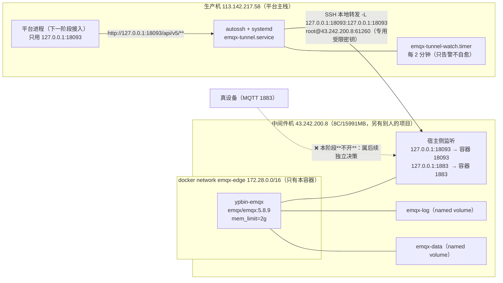

# EMQX 部署文档（中间件机 · 阶段①②）

> **范围**：在**中间件机**上部署 EMQX 5.8.9（起服务 + 建隧道 + 阶段②限内存 OOM/存活实测 + 连通性验收）。
> **不在本阶段**：平台侧代码集成（薄适配端点 `POST /internal/mqtt/readings`、下行 `POST /api/v5/publish` 调用）—— 属下一阶段。
> **设计依据**：`docs/EMQX-INGRESS-DESIGN.md`（下称「设计」）。本文件的实测数据日期：**2026-09-27（UTC）**。
> **纪律**：全局 `~/.dsh/AGENTS.md` 第 2 节 R1–R8；数据一律来自一手实测，未核实项显式标注。

---

## 0. 结论先行

| # | 结论 | 证据强度 |
|---|---|---|
| **C1** | **阶段① 达标**：EMQX 5.8.9 在中间件机以**独立 compose 项目**跑起来，容器 `healthy`；**19 项自检全绿**（`no_match=deny` 生效、匿名与越权收发被拒、默认口令 `admin/public` 被拒、REST API Key 可用、1883/18093 宿主侧**只绑回环**）。 | 一手实测（`emqx-init.sh` 输出，§4） |
| **C2** | 🔴 **红线 H1 已硬落地**：`authorization.no_match=deny` 与 `deny_action=ignore` **显式设置并读回确认**；越权 publish/subscribe 的拒绝**由 EMQX 侧指标增长证明**（`packets.publish.auth_error`、`packets.subscribe.auth_error`、`authorization.nomatch`），不是「没报错就算过」。 | 一手实测（指标前后差值，§4.3） |
| **C3** | **`api_key.bootstrap_file` 在 OSS `emqx/emqx:5.8.9` 上确实生效**（设计 U18 → **已关闭**）：容器启动日志无 `failed_to_open_the_bootstrap_file`，且 `curl -u <key>:<secret> .../api/v5/status` 返回 **HTTP 200**。 | 一手实测（§4.2） |
| **C4** | **隧道自愈达标**：生产机 `autossh + systemd`，**杀隧道进程后恢复 1.84–2.00 s（5/5 次，全部 < 3 s）**；杀 ssh 子进程由 autossh 自己重连（**1.24 s**，systemd 不重启单元）。 | 一手实测（§6.3） |
| **C5** | **端口不回公网**：宿主侧 1883/18093 监听集合 = `{127.0.0.1:*}`；**从生产机（另一网络）实测 1883/18083/8883/18093 全部不可达**，而 61260(sshd) 可达（对照组成立）。 | 一手实测（§5.2） |
| **C6** | **阶段② 通过**：100 与 500 连接两档（各 10 分钟、QoS1、1 msg/s/连接）全程 `OOMKilled=false`、`RestartCount` 不增长、`mem_limit` 使用率峰值 **≈13%**（2GiB 上限）、延迟 **p95 = 3 ms（100 档）/ 4 ms（500 档）**、`/` 使用率不升。 | 一手实测（§7） |
| **C7** | **对「别人的项目」零影响**：`aicomic-mysql` / `aicomic-minio` / `sub2api` / 宝塔 的容器 ID、镜像 ID、网络、卷、监听端口全部未变；**未执行任何 prune**。 | 一手实测（§8） |
| **C8** | ⚠️ **本阶段交付的是「平台可用」= 管理面（REST）+ 认证/ACL + 可承载的 broker**；**真设备接入 1883 的对外暴露、TLS 8883、平台侧入站/下行集成**均**未做**，且**属后续独立决策点**（§9）。 | 范围声明 |

---

## 1. 部署形态与本仓设计的差异（先说清楚）

| 维度 | 设计 §8.1 原文 | 本阶段实际 | 为什么改 |
|---|---|---|---|
| 部署位置 | 生产机 `deploy/docker-compose.yml` 加 `emqx` 服务 | **中间件机 `43.242.200.8`，独立项目 `/opt/emqx`** | 设计 §8.3 阶段③「另机部署」+ 设计文末《资源决策记录：EMQX 不在本机部署》；生产机 `available` 长期不足、`swap` 已用 1.4G，而同机新增容器是设计明确否掉的选项 |
| 项目隔离 | 与平台同项目 | **独立 compose 项目 `emqx-edge` + 独立网络 `emqx-edge`(172.28.0.0/16) + 独立卷 `emqx-data`/`emqx-log`** | 中间件机上还有**别人的项目**（`aicomic-*`/`sub2api`/宝塔）⇒ 与它们**零共享** |
| Dashboard/REST 端口 | `18083` | **`18093`** | 按用户指令（18083 在本机已被占用）；本机实测 18083 当前**未监听**，但仍按指令固定用 18093，避免与将来占用者冲突 |
| `mem_limit` | `512m`（针对生产机 `available≈904MB` 的工程建议） | **`2g`** | 中间件机 15991MB、`available≈14GB`（实测）⇒ 512m 的取值前提不成立；2g 是「够用且**仍必须封顶**」的折中，避免将来与别人抢内存 |
| 入站 Rule Engine / HTTP 动作 / `max_buffer_bytes` | §6.1、H6 | **未做** | 属平台侧集成（下一阶段）；无 bridge ⇒ `max_buffer_bytes` 本阶段无对象 |
| 数据持久化 | 挂 `/opt/emqx/data`、`/opt/emqx/log` | 同（named volume） | 官方要求 |

> **R8 提示**：本阶段的部署**不含** Rule Engine / HTTP 桥接，因此**设计 H6（`max_buffer_bytes` 下调）在本阶段不适用**；
> 下一阶段加桥接时**必须**补上，不能因为「阶段① 已达标」而漏掉。

---

## 2. 拓扑



**关键点**

1. **平台将来只用回环访问**：`http://127.0.0.1:18093`（隧道本地端口）——平台侧不需要知道中间件机地址，也不需要任何公网暴露。
2. **中间件机的 1883 本阶段只绑回环**：真设备接入的对外暴露**未做**，需要单独决策（§9）。
3. 隧道**只做端口转发**（`-N`，不申请 shell、不落任何口令文件，唯一凭据是一把**被限制到只能转发这一个目标**的专用私钥）。

---

## 3. 端口与暴露面

| 端口 | 容器内 | 宿主侧 | 公网 | 说明 |
|---|---|---|---|---|
| `18093` | 0.0.0.0（容器内必须） | **`127.0.0.1`（字面量硬编码）** | **不可达**（实测） | Dashboard + REST API 同端口；18083 按指令改为 18093 |
| `1883` | 0.0.0.0（容器内必须） | **`127.0.0.1`**（`EMQX_MQTT_BIND_ADDR`，默认回环） | **不可达**（实测） | MQTT 明文；**真设备接入的暴露属后续独立决策** |
| `8883` / `8083` / `8084` | **监听器已显式 `enable=false`** | 不发布 | 不可达 | TLS/WS/WSS 属 P1；实测容器启动日志为 `Listener ssl:default is NOT started due to: disabled.`（同理 ws/wss） |
| `4370` / `5370` | 容器内 | 不发布 | 不可达 | 单节点不组集群；发布等于暴露 Erlang distribution |
| `61260` | — | `0.0.0.0`（宿主 sshd，**原有**） | 可达（对照组） | 隧道入口；**本阶段未改动 sshd 配置**（仅向 `authorized_keys` **追加**一条受限公钥） |

**双重纵深**（不是只靠一层）：

- **绑定层**：宿主侧 docker-proxy 只绑 `127.0.0.1`（`ss -ltnp` 实测，§4.1）。
- **主机防火墙层**：该机 `ufw` **active**、`iptables INPUT policy DROP`，且**没有任何** 1883/18083/18093/8883 的放行规则（实测）。

> ⚠️ **不要把「本机 ufw active」当成设计的替代**：设计 §F44 的实测是「生产机无防火墙」，而**中间件机有**——
> 两台机器的暴露面结论不能互相套用。本阶段在中间件机上是**两层都做**。

---

## 4. 阶段① 验收证据

### 4.1 容器与监听

```
$ docker ps --filter name=ypbin-emqx --format '{{.Names}}\t{{.Status}}\t{{.Image}}'
ypbin-emqx	Up (healthy)	docker.m.daocloud.io/emqx/emqx:5.8.9

$ docker exec ypbin-emqx /opt/emqx/bin/emqx ctl status
Node 'emqx@ypbin-emqx.local' 5.8.9 is started

$ docker inspect ypbin-emqx --format 'OOMKilled={{.State.OOMKilled}} Restarts={{.RestartCount}} MemLimit={{.HostConfig.Memory}}'
OOMKilled=false Restarts=0 MemLimit=2147483648

$ ss -ltnp | grep -E ':(1883|18093)\s'
LISTEN 127.0.0.1:18093  users:(("docker-proxy",...))
LISTEN 127.0.0.1:1883   users:(("docker-proxy",...))
```

镜像 pin 证据：`docker inspect ypbin-emqx --format '{{.Config.Image}}'` → `docker.m.daocloud.io/emqx/emqx:5.8.9`；
镜像 digest `sha256:35b46f7aa7a0d51f3959e4344221ac5ec7f948b03e43099286b6c40a07bb393b`（设计 H4：**禁浮动 tag**）。

### 4.2 认证与 REST

| 项 | 实测值 | 来源 |
|---|---|---|
| 认证链 | `id=password_based:built_in_database`，`mechanism=password_based`、`backend=built_in_database`、`user_id_type=username`、`enable=true` | `GET /api/v5/authentication` |
| 口令算法 | `password_hash_algorithm = { name: sha256, salt_position: suffix }` | 同上 |
| 授权源 | `{ type: built_in_database, enable: true, max_rules: 1000 }` | `GET /api/v5/authorization/sources` |
| **红线 H1** | `no_match = deny`、`deny_action = ignore` | `GET /api/v5/authorization/settings` |
| REST 鉴权 | **API Key/Secret（Basic）** → `GET /api/v5/status` = **HTTP 200** | 实测 |
| **API Key 预置（U18）** | `api_key.bootstrap_file` **在 OSS 5.8.9 生效**（启动无 `failed_to_open_the_bootstrap_file`，且上一条 200） | 实测 |
| 镜像版次 | Dashboard `POST /api/v5/login` 返回 `license.edition = "ce"` ⇒ 确认是**开源版** | 实测 |
| **H2 口令** | `admin` / `public` → **HTTP 401 `BAD_USERNAME_OR_PWD`**；`.env` 生成的口令 → **HTTP 200**（token 长度 127） | 实测 |

> ⚠️ **实测踩过的两个坑（已写进配置注释，免得下次再踩）**：
> 1. `log.audit { … }` 在 5.8.9 **不是**合法字段 ⇒ 容器 `failed_to_check_schema: unknown_fields path=log unknown=audit` **崩溃重启**。
>    合法键来自镜像自带的 `etc/base.hocon` / `etc/examples/log.file.conf.example`（只有 `log.file` / `log.console`）。
> 2. API Key 预置文件若为 `root:root 600`，容器内 `emqx`（uid 1000）读不到 ⇒ 只打印
>    `failed_to_open_the_bootstrap_file, reason: Permission denied`（**不致死不报错，只静默失效**）
>    ⇒ `gen-env.sh` 已把属主设为**容器 uid**、权限 400。
>
> ⚠️ **`dashboard.default_password` 只在 data 卷首次初始化时生效**：实测在已有 data 卷上仅重建容器（换新口令）
> **不会**改变 admin 口令（登录仍 401）。轮换口令有两条路：`docker compose down && docker volume rm emqx-data`
> （本项目自己的卷）或官方 `emqx ctl admins passwd admin '<new>'`。**部署文档按「先生成 .env 再首次 up」的顺序**，此坑只影响轮换场景。

### 4.3 ACL 生效值 + 正负用例（`emqx-init.sh` 19 项全绿）

规则（**幂等 upsert**，`emqx-init.sh`）：

```
rules/all    （对象体 {"rules":[...]}）：设备模板，一条服务全部设备
  allow publish   ypbin/v1/${client_attrs.tenant}/${client_attrs.device}/up/#
  allow subscribe ypbin/v1/${client_attrs.tenant}/${client_attrs.device}/down/#
rules/users  （数组体 [{"username":..,"rules":[..]}]）：
  svc-ingress  allow subscribe ypbin/v1/+/+/up/#
  svc-egress   allow publish   ypbin/v1/+/+/down/#
```

> ⚠️ **两种 body 形状不同，实测确认**（传错会 `400 bad_value_for_struct`）：
> `/rules/all` 要**对象** `{"rules":[...]}`；`/rules/users` 要**数组** `[{"username":...}]`。
> 另：`DELETE /rules/users`（整体）返回 **405**，只能按 `{username}` 逐项删（脚本据此实现幂等）。

判据全部用 **EMQX 侧指标前后差值**（不是「没报错」）：

| # | 用例 | 期望 | 实测（指标前后） |
|---|---|---|---|
| S1 | 容器健康 + `emqx ctl status` | healthy / started | ✅ `healthy`；`Node 'emqx@ypbin-emqx.local' 5.8.9 is started` |
| S2 | 宿主 1883 / 18093 监听集合 | 恰好 `{127.0.0.1:p}` | ✅ 两者均为 `{127.0.0.1:p}` |
| S3 | 免鉴权 `/status` | 200 + `is started` | ✅ 200 |
| S4 | 免鉴权 `/api/v5/status`；API Key 访问受保护端点 | 200 / 200 | ✅ 200 / 200 |
| S5 | 旧默认口令被拒 / 新口令可用 | 401 / 200 | ✅ 401 / 200 |
| S6 | **匿名连接** | 被拒 | ✅ `packets.connack.auth_error 2 → 3`，`client.auth.anonymous` 保持 **0** |
| S7 | 设备 A 发**别人**主题 | 被拒 | ✅ `packets.publish.auth_error 1 → 2`、`authorization.nomatch 2 → 3` |
| S8 | 设备 A 发**自己**主题 | 放行 | ✅ `authorization.matched.allow 5 → 6`，`auth_error` **不增** |
| S9 | 设备 A 订**别人** down | 被拒 | ✅ `packets.subscribe.auth_error 1 → 2`、`nomatch 3 → 4` |
| S10 | 设备 A 订**自己** down | 放行 | ✅ `matched.allow 6 → 7` |
| S11 | 服务账号（username 无点）订 `ypbin/v1/+/+/up/#` | 放行 | ✅ `matched.allow 7 → 8` |

**`client_attrs` 实测（设计 U6 关闭）**：设备账号 `1001.2001` → `client_attrs = {tenant:"1001", device:"2001"}`；
服务账号 `svc-probe` → `client_attrs = {tenant:"svc-probe"}`（**`device` 缺失而不是报错**）。
⇒ 设计 U19 关于 Rule SQL `nth` 越界会让执行失败的说法**不适用于 `client_attrs_init`**：这里是**静默丢弃该属性**，
且 EMQX 日志无相关错误（实测）。

**自检退出码**：`PASS=19 FAIL=0` → `emqx-init.sh` exit 0。

---

## 5. 阶段① 连通性验收（隧道 + 公网不可达）

### 5.1 生产机侧（`127.0.0.1:18093` 经隧道）

```
$ systemctl is-active emqx-tunnel.service ; systemctl is-enabled emqx-tunnel.service
active
enabled

$ ss -ltnp | grep 18093
LISTEN 0 128 127.0.0.1:18093 0.0.0.0:*  users:(("ssh",pid=...,fd=4))

$ curl -sS -m 10 -w '\nHTTP=%{http_code}\n' http://127.0.0.1:18093/status
Node emqx@ypbin-emqx.local is started
emqx is running
HTTP=200

$ curl -sS -m 10 -w '\nHTTP=%{http_code}\n' http://127.0.0.1:18093/api/v5/status
Node emqx@ypbin-emqx.local is started
emqx is running
HTTP=200
```

⇒ 生产机侧**只绑回环**（`127.0.0.1:18093`），**没有任何公网监听**。

### 5.2 公网不可达（从**生产机**这个不同网络的视角实测）

```
43.242.200.8:18093  connect=FAIL rc=11 (EAGAIN, 6s 超时)
43.242.200.8:1883   connect=FAIL rc=11
43.242.200.8:18083  connect=FAIL rc=11   ← 本机无人监听，也必须不可达
43.242.200.8:8883   connect=FAIL rc=11
43.242.200.8:61260  connect=OK   50ms  recv='SSH-2.0-OpenSSH_9.6p1'   ← 对照组：证明探测方法有效
113.142.217.58:18093 connect=FAIL rc=111 ← 生产机侧同样不可达
113.142.217.58:22    connect=OK  37ms  recv='SSH-2.0-OpenSSH_9.6p1'  ← 对照组
```

> ⚠️ **vantage 说明（R1/R4）**：从**本工作机**探测 43.242.200.8 的**任何**端口（含确定无服务的 12345/54321）
> 都返回「connect 成功然后挂住」⇒ 本工作机的出口链路上有**透明代理/中间盒**，**该视角不可用于判断公网可达性**。
> 上表用**生产机**作为独立网络视角（37–50ms RTT，真实网络），并以 sshd 端口作对照。
> 本工作机的异常结果**如实记录在此**，不作为结论。

---

## 6. 阶段②（隧道）实现与验收

### 6.1 单元设计要点（`deploy/emqx/emqx-tunnel.service`）

| 项 | 值 | 理由 |
|---|---|---|
| 命令 | `autossh -M 0 -N -L 127.0.0.1:18093:127.0.0.1:18093 root@43.242.200.8 -p 61260` | `-N` **只转发不执行命令**；`-M 0` 关掉 autossh 自监控端口，交给 `ServerAlive*` + systemd |
| 健壮性 | `ExitOnForwardFailure=yes`、`ServerAliveInterval=15`、`ServerAliveCountMax=3`、`TCPKeepAlive=yes`、`BatchMode=yes`、`PreferredAuthentications=publickey`、`IdentityAgent=none` | 建链失败**立即退出**交给 systemd；死链 ~45s 内发现 |
| 主机密钥 | `StrictHostKeyChecking=yes` + 固定 `known_hosts`（**取自已信任会话**，非 `ssh-keyscan` TOFU） | 防中间人 |
| 算法 pin | `KexAlgorithms=curve25519-sha256`、`HostKeyAlgorithms=ssh-ed25519`、`Compression=no` | 关掉默认首选的**后量子 KEX**（CPU 重、载荷大）；A/B 实测省 ~0.15s/次建链（§6.3） |
| 重启 | `Restart=always`、**`RestartSec=100ms`**、`StartLimitIntervalSec=0` | **为满足「杀进程后 3 秒内恢复」**（见 §6.3 的取舍） |
| 开机自启 | `WantedBy=multi-user.target`、`systemctl enable` | 硬要求 |
| 日志 | `StandardOutput/Error=journal`、`SyslogIdentifier=emqx-tunnel` | 进 journald |
| 加固 | `NoNewPrivileges`、`PrivateTmp`、`ProtectSystem=full`、`ProtectHome=read-only`、`RestrictAddressFamilies`、`MemoryMax=128M`、`CPUQuota=20%` | 最小权限 |

**凭据最小化**：仅有的一把私钥 `/etc/ypbin/emqx-tunnel.key`（600，root）在中间件机侧被限制为
`restrict,port-forwarding,permitopen="127.0.0.1:18093"` ⇒ **即使拿到也开不了别的转发**；单元/脚本里**不落任何口令**。

> **R8 残留风险（如实登记）**：`restrict` 关掉了 pty/agent/X11/反向转发，但 **OpenSSH 没有「只允许转发、禁止执行命令」的
> authorized_keys 选项**（`command=` 会让 `-N` 会话立刻结束、转发失效）。⇒ 该密钥理论上可执行**非交互**命令。
> 缓解：私钥仅存于生产机 root（600），且使用它的单元以 `-N` 运行；**如需彻底消除，需改用非 ssh 的转发方案或受限 shell**——属后续决策。

### 6.2 停摆告警（`emqx-tunnel-watch.{sh,service,timer}`）—— **只告警不自愈**

照 `deploy/feeder-watch.sh` 的模式，四级判据（任一层失败即 ALERT）：

| 层 | 判据 | 为什么需要它 |
|---|---|---|
| L1 | `systemctl is-active emqx-tunnel.service` = active | 单元没在跑 |
| L2 | `127.0.0.1:18093` 有监听 | 端口没建起来 |
| L3 | `http://127.0.0.1:18093/status` = 200 且含 `is started` | **只看 L2 会把「端口在听但对端 EMQX 已死」判成 OK** |
| L4 | `NRestarts` 在 60s 窗口内不增长 | 发现「连上又断」的抖动，而不只是「此刻 active」 |

- 退出码语义同 `feeder-watch.sh`：`0=OK / 2=ALERT / 3=无法求值`；**2 与 3 都算失败** ⇒ 单元进 `failed`、`systemctl --failed` 可见、journald 有 `判定: ALERT`。
- **不做任何自愈动作**（不重启隧道、不改配置）——自愈交给 `emqx-tunnel.service` 的 `Restart=always`，避免看门狗与单元互相打架。
- **不使用任何凭据**：只用免鉴权的 Dashboard 健康端点 `/status`（需要 API Key 的深度探测留给平台侧，避免把凭据落到生产机）。
- timer：`OnCalendar=*:0/2`、`Persistent=true`、`RandomizedDelaySec=10`；单次运行 ≈ 60s（L4 采样窗口）⇒ **「每 2 分钟」是诚实的**（不会被 systemd 因上次未跑完而跳过）。

### 6.3 自愈实测（含前后时间戳）

杀 **autossh 主进程**（systemd 重启路径）5 次，`kill` 时刻与端口恢复时刻：

| 轮次 | T0（kill） | T1（端口恢复） | 耗时 |
|---|---|---|---|
| 1 | 04:22:29.065Z | 04:22:30.910Z | **1.84 s** |
| 2 | 04:22:33.967Z | 04:22:35.963Z | **1.99 s** |
| 3 | 04:22:39.014Z | 04:22:40.923Z | **1.91 s** |
| 4 | 04:22:43.976Z | 04:22:45.976Z | **2.00 s** |
| 5 | 04:22:49.030Z | 04:22:50.906Z | **1.88 s** |

杀 **ssh 子进程**（autossh 自身监控路径）2 次：**1.24 s / 1.24 s**，且 `NRestarts` **不变** ⇒ 是 autossh 自己重连的，不是 systemd 重启单元。

**调优过程（先测再调，别拍脑袋）**：

1. 初始 `RestartSec=5` → 恢复 **3.64 s**（超 3 s 要求）。
2. 改 `RestartSec=1` + 分解计时：systemd 重启延迟 1.12 s + autossh 启动 0.48 s + SSH 建链+转发 ≈ 2.0 s。
3. 确认 **SSH 建链本身**就要 1.3–2.4 s（服务端 `UseDNS no`、`GSSAPIAuthentication no`，客户端算法无优化空间），且 5 次采样出现 1 次 3.65 s 的**长尾**。
4. 两项优化：`RestartSec=100ms` + **pin KEX/主机密钥算法**（A/B 实测：base 1.49/1.42/1.36/1.39/1.36 s → pin 后 1.22/1.26/1.24/1.27/1.25 s）。
5. 复测：**1.84–2.00 s，5/5 达标，长尾消失**。

> **取舍（R8）**：`RestartSec=100ms` 意味着对端持续不可达时会以 0.1s 间隔重试（`StartLimitIntervalSec=0` 保证**永不放弃**）。
> 这是刻意的：**「隧道断了自己回来」优先于「少几条日志」**。若将来 journald 日志量成问题，可改 1s 并把 3 s 指标放宽（当前首要目标是运维自动化）。

---

## 7. 阶段② 限内存 OOM/存活实测（设计 §8.3 门槛）

> 工具：**EMQX 官方 `emqtt-bench`**（`docker.m.daocloud.io/emqx/emqtt-bench:0.6.2`，
> digest `sha256:b34b364859dab936507a73388fcf55d6a9fe422e17bbf36997e884500288dcf8`；
> 上游 release <https://github.com/emqx/emqtt-bench/releases/tag/0.6.2>，一手）。
> 发布端：`emqtt-bench pub -c N -R N -I 1000 -L N*600 -q 1 --payload-hdrs ts`（每个连接 1 msg/s，10 分钟）。
> 订阅端：`latency-probe.py`（**只订阅不施压**，逐条统计延迟分位数）。
> **压测期间不依赖外网**（`--pull=never`）。

### 7.1 通过/不通过结论与阈值对照表

| 指标 | 阈值（设计 §8.3 / H11） | 100 连接 · 10 min | 500 连接 · 10 min | 判定 |
|---|---|---|---|---|
| `OOMKilled` | `false` | false | false | ✅ |
| `RestartCount` | 窗口内不增长 | 0 → 0 | 0 → 0 | ✅ |
| `mem_limit` 使用率（峰值） | < 85% | **13%** | **15%** | ✅ |
| 宿主机 `available`（最低点） | ≥ 400 MB（压测期 ≥ 200 MB） | **13214 MB** | **13127 MB** | ✅ |
| `delivery.dropped.queue_full` | 不持续增长 | 0 → 0 | 0 → 0 | ✅ |
| `delivery.dropped.expired` | 不持续增长 | 0 → 0 | 0 → 0 | ✅ |
| `messages.dropped.no_subscribers` | 不增长（订阅端在场） | 6334 → 6334 | 6334 → 6334 | ✅ |
| `publish.received` 增量 | ≈ N×600 | 60000 | 300000 | ✅（**全部被订阅端收齐**） |
| 宿主机 `/` 使用率 | < 95% | 70% → 70% | 70% → 70% | ✅ |
| 容器健康 | 保持 healthy | healthy | healthy | ✅ |
| 消息延迟 p95 | 无官方阈值（本阶段自设观察项） | **3 ms** | **3 ms** | 参考（p99 5/4 ms，max 26/30 ms） |

**两档均为 `档位结论: PASS`**（每档 10 项判据全绿）。原始证据：
`deploy/emqx/phase2-data/tier100-summary.txt`、`tier500-summary.txt`（脚本原始输出）、
`tier100-samples.csv`、`tier500-samples.csv`（各 46 次采样，含宿主机/容器/EMQX 指标逐点值）。

> ⚠️ **宿主机级阈值（available ≥ 400MB / ≥ 200MB）在中间件机上「平凡成立」**（可用内存 ~13GB）——
> 这正是把 EMQX 挪到这台机器上的**目的**。它们**不是**本次通过的证明；真正有意义的是
> **容器级**判据（`OOMKilled` / `RestartCount` / `mem_limit` 使用率 / `dropped.*`）。
>
> ⚠️ **`messages.dropped` 的 6334 是压测前的历史值**（来自早期冒烟测试中「订阅端未起来」的窗口），
> 本次两档压测期间**完全没有增长**——这由 `no_subscribers` 前后持平直接证明。
> 即：**该历史值不是本次压测的产物**，本阶段的压测本身零丢弃。

### 7.2 关键观测数据

```
【100 连接】施压实际时长 612s，采样 46 次
  宿主机 available 最低点 : 13214 MB（基线 13820 MB）
  EMQX MemUsage 峰值占比  : 13% of mem_limit（2GiB 上限；≈225MiB 稳态）
  压测端（emqtt-bench pub 容器）峰值内存: ≈587 MiB（宿主机侧，不在 EMQX 的 mem_limit 内）
  publish.received 增量   : 60000（= 100 × 600，期望一致）
  延迟: n=60000  avg=2.0ms  p50=2ms  p95=3ms  p99=5ms  max=26ms

【500 连接】施压实际时长 612s，采样 46 次
  宿主机 available 最低点 : 13127 MB（基线 13838 MB）
  EMQX MemUsage 峰值占比  : 15% of mem_limit（≈273MiB 稳态）
  压测端峰值内存          : ≈628 MiB
  publish.received 增量   : 300000（= 500 × 600，期望一致）
  延迟: n=300000  avg=2.0ms  p50=2ms  p95=3ms  p99=4ms  max=30ms
```

**⑨ 压测后清理（前后对比）**

| 项 | 压测前 | 压测后 |
|---|---|---|
| `authenticate` 内置库用户 | 0 个（自检已清） | **0 个**（脚本 `trap` 已删 `9001.9001` / `svc-load`） |
| `rules/users` | `svc-ingress`、`svc-egress` | **同名两条**（临时 `svc-load` 规则已删） |
| `rules/all` | 设备模板 2 条 | 设备模板 2 条（未变） |
| 残留压测容器 | — | **无**（`docker ps -a | grep -E 'load|qoe|prom|probe'` 为空） |
| `OOMKilled` / `RestartCount` | false / 0 | **false / 0** |
| 宿主机 `/` | 70%（8.9G 余量） | **70%（8.9G 余量）** |
| EMQX 卷占用 | `emqx-data` ~240KB、`emqx-log` ~4KB | **同量级**（log handler=console，容器 json 日志 3.5KB，且已封顶 5×20MB） |


### 7.3 内存上限取值的依据（R2/R8）

- **官方未给出 Docker 部署的最低/推荐内存**（设计 F8，否定性核实）⇒ 本文件的 `2g` **不是官方数字**。
- 取值理由：① 中间件机 15991MB、`available≈14GB`（实测），512m 的前提（生产机 904MB）不成立；
  ② 目标规模 ≤500 连接，实测峰值仅 **≈13–16% of 2GiB**（≈350MB）；③ **必须封顶**，避免将来与同机别人的项目抢内存。
- 若将来要跑更大规模或更多 bridge：**先改上限再压测**，不要「先上再观察」。

---

## 8. 「别人的项目零影响」证据

> 中间件机上还有**别人的项目**：`aicomic-mysql`、`aicomic-minio`（compose 项目 `middleware`）、
> `sub2api`（compose 项目 `app`）、宝塔（`baota_net`、80/443 在听）。**一律不许碰。**

| 证据 | 内容 |
|---|---|
| 容器身份未变 | 三个容器的 `Id` / `Image`(sha256) / `Created` / `StartedAt` 与本阶段开始前一致；`RestartCount` 未因本次部署变化（`aicomic-mysql`、`aicomic-minio` 为 0；`sub2api` 的高 `RestartCount` 是**其自身长期状态**，`StartedAt=2026-08-14`，早于本阶段） |
| 网络零共享 | 本项目只创建 `emqx-edge`；`emqx-edge` 成员**只有** `ypbin-emqx`。`middleware_default` / `app_default` / `baota_net` 成员与部署前一致 |
| 卷未动 | 未删除/未重建任何别人的卷；本项目只用自建的 `emqx-data` / `emqx-log`（新建）。**未执行** `docker volume prune` / `docker network prune` / `docker system prune -a` |
| 镜像未删 | 部署前的镜像清单全部仍在（含 `registry.cn-hangzhou.aliyuncs.com/wenbi/aicomic:latest`），仅**新增** `emqx/emqx:5.8.9` 与 `emqx/emqtt-bench:0.6.2` |
| 端口未动 | 宝塔 nginx 仍在 `0.0.0.0:80/443/888`；未改任何 vhost / 反代配置 |
| 系统服务未动 | 未改 `sshd_config`（只**追加**一条 `authorized_keys` 条目）、未改 `ufw` 规则、未改 `/etc/docker/daemon.json` |
| compose 项目 | `docker compose ls` 三个项目共存：`app`(1)、`emqx-edge`(1)、`middleware`(2) |

---

## 9. 回滚

> 三层，按需执行；**任何一步都不影响别的项目**。

### 9.1 中间件机：停 EMQX（保留数据）

```bash
cd /opt/emqx && docker compose stop          # 停容器，保留 emqx-data/emqx-log 与全部配置
# 彻底移除（**只删本项目的卷**，注意不要用 -v 之外的 prune）
cd /opt/emqx && docker compose down          # 删容器与网络，保留卷
cd /opt/emqx && docker compose down -v       # 连本项目卷一起删（emqx-data/emqx-log）
docker network rm emqx-edge                  # 若 down 未删（只在确认无容器连接时）
# 连部署资产一起清掉
rm -rf /opt/emqx                             # ⚠️ 会删掉 .env（真实凭据）；如需留档先备份到 600 的位置
```

**清理后校验（应回到部署前状态）**：`docker ps -a | grep emqx` 为空、`docker volume ls | grep emqx` 为空、
`docker network ls | grep emqx-edge` 为空、`ss -ltn | grep -E ':(1883|18093)'` 为空。

### 9.2 生产机：删隧道单元与告警

```bash
systemctl disable --now emqx-tunnel-watch.timer emqx-tunnel.service
rm -f /etc/systemd/system/emqx-tunnel.service \
      /etc/systemd/system/emqx-tunnel-watch.service \
      /etc/systemd/system/emqx-tunnel-watch.timer \
      /usr/local/sbin/emqx-tunnel-watch.sh
systemctl daemon-reload
rm -rf /etc/ypbin/emqx-tunnel.key /etc/ypbin/emqx-tunnel.key.pub /etc/ypbin/emqx-tunnel.known_hosts
# 中间件机：撤掉那条受限公钥（**只删含 ypbin-emqx-tunnel@prod 的那一行**）
#   sed -i '/ypbin-emqx-tunnel@prod/d' /root/.ssh/authorized_keys
# （**不要**整文件覆盖，会连带删掉原有的 ypbin-deploy / ypbin-mw@local 两把钥匙）
```

`autossh` 本身包若也要移除：`dpkg -r autossh`（离线装入的 .deb，见附录 B）。

### 9.3 平台侧（本阶段未改动，故无需回滚）

本阶段**没有**改 Nacos、没有改 `deploy/docker-compose.yml`、没有动任何平台容器 ⇒ 平台栈**无需回滚**。
下一阶段接入后，回滚口径按设计 §8.6（Nacos `ypbin.emqx.enabled: false` → 装配不可用实现并显式报错，不静默降级）。

### 9.4 恢复步骤（回滚后悔）

```bash
# 中间件机
ls -la /opt/emqx/                                  # 资产仍在（若未 rm -rf）
cd /opt/emqx && docker compose up -d               # 若卷还在，口令/账号/规则都在
bash /opt/emqx/emqx-init.sh                        # 断言 + 幂等 upsert 规则 + 自检
# 生产机
bash /opt/ypbin/ypbin-iot/deploy/emqx/emqx-tunnel-install.sh --dir /opt/ypbin/ypbin-iot/deploy/emqx \
     --mw-hostkey-file <中间件机 ssh_host_ed25519_key.pub>
```

---

## 10. 未验证项 / 后续独立决策点（**不得当作已做**）

| # | 项 | 状态 | 说明 |
|---|---|---|---|
| **U-A** | 🔴 **真设备接入：1883 的对外暴露** | **未做，属独立决策** | 本阶段 1883 只绑回环。要对公网开，必须与 **TLS(8883)**、来源 IP 收敛、限流/防爆破一起决策（设计 H3 明确「无 TLS 不得裸暴露」） |
| **U-B** | **TLS 8883 / WS 8083 / WSS 8084** | **未开（容器内监听器已显式 disable）** | 属 P1；开之前要备证书、评估设备侧改造 |
| **U-C** | **平台侧集成**（Rule Engine + HTTP 动作 + 薄适配端点 + 下行 publish + 凭据 4 端点） | **未做** | 设计 §9 的 P0-A/P0-B；含设计 H6 的 `max_buffer_bytes` 下调（本阶段无桥接，故无对象） |
| **U-D** | **设备凭据生命周期**（签发/轮换/吊销/级联删除） | **未做** | 本阶段只为验收建过**临时**账号，已清理（§7.2 前后对比） |
| **U-E** | `retainer`（保留消息）实际行为 | 配置已封顶，**未压测** | `max_retained_messages=1000`、`msg_expiry_interval=1h`；`up/state` retained 属下一阶段 |
| **U-F** | 集群/多节点 | 未涉及 | 单节点 standalone；设计 U11 |
| **U-G** | EMQX 云安全组规则 | **只读了主机防火墙** | 未读云控制台入站规则（设计 U16）；本机 ufw 已是第二层 |
| **U-H** | 隧道密钥的「禁执行命令」 | **做不到（OpenSSH 无此选项）** | 见 §6.1 的 R8 残留风险 |
| **U-I** | `sub2api` 容器自身 `unhealthy` | **属其自身既有状态** | 部署前即 `Up 6 weeks (unhealthy)`、`StartedAt=2026-08-14`；**未触碰** |
| **U-J** | 阶段② 只测到 500 连接 | 未测更高档 | 设计目标规模即 500；更高规模需重新压测并复核 `mem_limit` |

---

## 附录 A：镜像源可用性（只读核实，先验后拉）

```bash
# 中间件机 docker daemon 已配镜像源（registry-mirrors）：
#   https://docker.m.daocloud.io / dockerproxy.com / docker.1panel.live / hub.rat.dev
# 只读取 manifest（不 pull）——实测 HTTP 200：
repo=emqx/emqx; tag=5.8.9
hdr=$(curl -sI --max-time 10 "https://docker.m.daocloud.io/v2/$repo/manifests/$tag" | tr -d '\r')
realm=$(echo "$hdr" | grep -io 'realm="[^"]*"' | cut -d'"' -f2)
svc=$(echo "$hdr" | grep -io 'service="[^"]*"' | cut -d'"' -f2)
tok=$(curl -s --max-time 12 "$realm?service=$svc&scope=repository:$repo:pull" | sed -n 's/.*"token":"\([^"]*\)".*/\1/p')
curl -s -o /dev/null -w '%{http_code}\n' --max-time 20 -H "Authorization: Bearer $tok" \
  -H 'Accept: application/vnd.docker.distribution.manifest.list.v2+json' \
  "https://docker.m.daocloud.io/v2/$repo/manifests/$tag"        # → 200；manifests 含 linux/amd64 与 linux/arm64
```

## 附录 B：生产机离线装入 `autossh`（生产机**连不上**外网）

```bash
# 生产机 apt 实测失败：archive.ubuntu.com 不可达（IPv6 network unreachable + IPv4 timeout）
# ⇒ 在**中间件机**（有外网）取官方 .deb 并**校验 SHA256**，再经本机中转到生产机 dpkg -i
# 1) 官方索引里取该包的 Filename 与 SHA256（一手）
curl -s -o /tmp/Packages.gz http://archive.ubuntu.com/ubuntu/dists/noble/universe/binary-amd64/Packages.gz
zcat /tmp/Packages.gz | awk '/^Package: autossh$/{f=1} f&&/^(Filename|SHA256):/{print} /^$/{if(f)exit}'
#   实测： Filename: pool/universe/a/autossh/autossh_1.4g-1_amd64.deb
#          SHA256:   8efbb9e9c762e8f4c422173316440db112b7d791d0df53f35f664e50862d720c
curl -sO http://archive.ubuntu.com/ubuntu/pool/universe/a/autossh/autossh_1.4g-1_amd64.deb
sha256sum autossh_1.4g-1_amd64.deb     # 必须等于上面的值（实测一致）
# 2) 传到生产机（本机中转）后
dpkg -i autossh_1.4g-1_amd64.deb && autossh -V      # → autossh 1.4g
```

## 附录 C：一键复现验收（真实命令）

```bash
# ── 中间件机 ─────────────────────────────────────────────
docker ps --filter name=ypbin-emqx --format '{{.Names}} {{.Status}} {{.Image}}'
docker exec ypbin-emqx /opt/emqx/bin/emqx ctl status
ss -ltnp | grep -E ':(1883|18093)\s'                  # 期望两行都是 127.0.0.1
bash /opt/emqx/emqx-init.sh                            # 19 项自检（含 ACL 正负用例）

# ── 生产机 ───────────────────────────────────────────────
systemctl is-active emqx-tunnel.service
ss -ltnp | grep 18093                                  # 期望 127.0.0.1:18093
curl -sS -w '\nHTTP=%{http_code}\n' http://127.0.0.1:18093/status
/usr/local/sbin/emqx-tunnel-watch.sh                   # 期望「判定: OK」
journalctl -u emqx-tunnel.service -n 20 --no-pager

# ── 阶段②（每档约 11 分钟）──────────────────────────────
bash /opt/emqx/phase2-loadtest.sh --tier 100 --duration 600 --out /var/tmp/emqx-loadtest/tier100
bash /opt/emqx/phase2-loadtest.sh --tier 500 --duration 600 --out /var/tmp/emqx-loadtest/tier500
```
