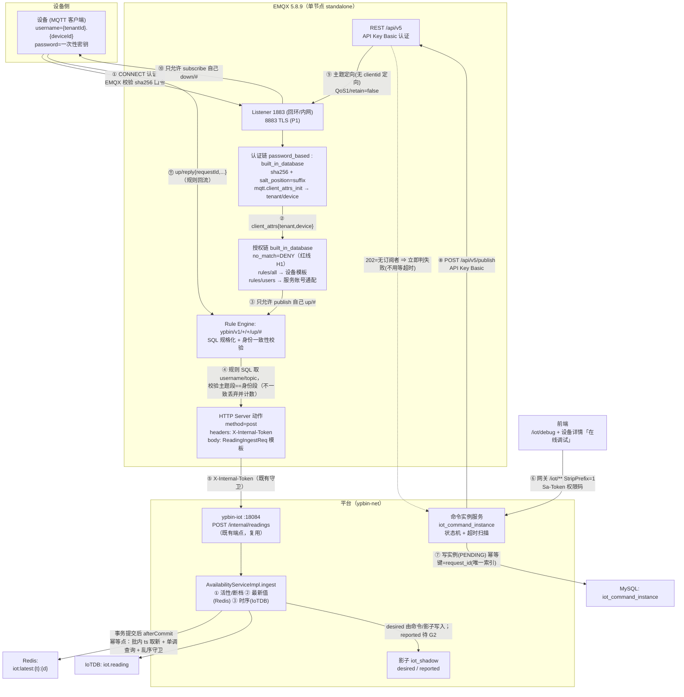
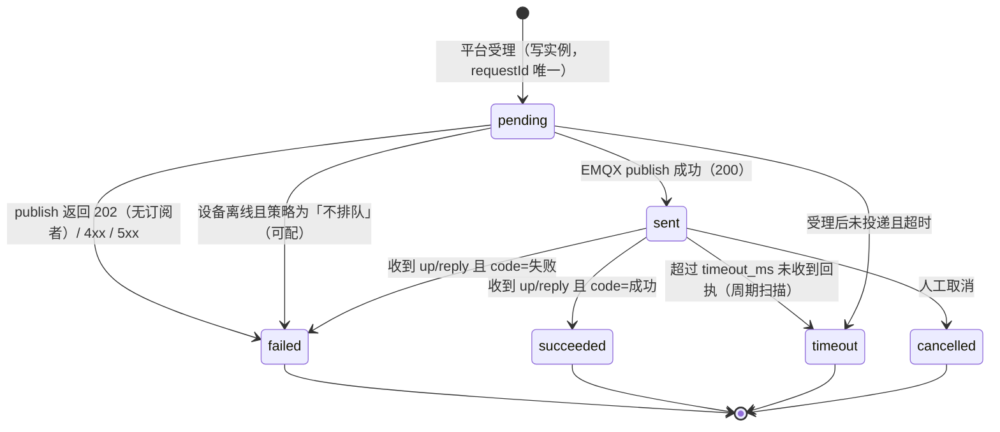

# EMQX 入站 + 在线调试/下行通道 · 设计与落地方案

> 状态：**方案（本轮不改业务代码、不改生产、不合并 PR）**
> 目标：把平台从「能看数据」推到「能管设备」——② EMQX 入站 + 在线调试/下行通道。
> 纪律：R1（不知道就是不知道）/ R2（只认一手）/ R3（引用必给出处）/ R4（独立客观）/ R8（多想一步）。
> 本文所有外部事实都带 **URL + 一手/二手 + 访问日期**；拿不到权威原文的一律进 **§10.2 未核实清单**，不进结论。
> 本文件是**新增文件**（`docs/` 下），不触碰从 upstream 继承的文件 ⇒ 不触发 Sync Whitelist 门禁；
> 但 §8 的部署改动会落在 `deploy/docker-compose.yml`（**在**白名单内，允许改）。

---

## 0. 结论先行

| # | 结论 | 强度 |
|---|---|---|
| **C1** | **入站主推：EMQX Rule Engine + HTTP Server 动作 → 复用既有 `POST /internal/readings`。** 规则 SQL 把一条上行消息规格化成 `ReadingIngestReq` 的**单元素 `items`**，**零新端点、零新落库链路**。备选：`ypbin-access` 自建 MQTT 消费者（`$share` 共享订阅）复用既有有界队列微批。 | 已核实（路径/字段/失败语义均有官方依据） |
| **C2** | **下行主推：`ypbin-iot` → `POST /api/v5/publish`（API Key Basic 认证，`qos=1`、`retain=false`）→ 设备。** 定向靠**主题**；官方**没有**「按 clientid 定向发布」的端点（`clientid` 字段已 `deprecated`）。 | 已核实 |
| **C3** | 🔴 **红线：EMQX 5.8 的授权默认是 `allow`，不是 deny-by-default。** `authorization.no_match` 默认 `allow` ⇒ **不显式设 `no_match = deny` 就等于「ACL 没配对时全放行」**。上线前硬条件。 | 已核实（官方原文） |
| **C4** | 🔴 **生产机内存余量不足以「默认配置」直接上 EMQX**：实测 **8 vCPU / 7939MB / swap=0 / available ≈ 904MB**，已有容器占 ~6.2GiB。**官方未给出最低内存/CPU 要求** ⇒ 不给官方数字，给**分阶段 + 可回滚**方案（§8.3）。 | 实测 + 否定性核实 |
| **C5** | 🔴 **新发现的幂等缺口（P0，单列 §6.4）**：`RedisLatestValueWriter.writeAll` 是**盲 `putAll`**、只做**批内** ts 取新 ⇒ **跨批乱序重放会把「最新值」回退**。EMQX at-least-once 重试会真实触发。 | 仓内代码级证据（文件:行号） |
| **C6** | **Topic 规范要改掉既有 `$iot/...` 约定**（设计文档 §4.2/§4.3/§6.1/§7）：`$` 开头的主题名是 MQTT 保留给服务端的命名空间，EMQX 自己的系统主题就是 `$SYS/`。改用 `ypbin/v1/{tenantId}/{deviceId}/up|down/...`，**运行时字段（requestId 等）放 payload 不放主题**。 | 已核实（EMQX 保留命名空间原文）；`$` 的 OASIS 条款原文本轮**未逐字取回** |
| **C7** | **凭据：明文一次性交付、永不回显。** 平台只在「签发/轮换」那一刻返回一次明文，之后只返回元数据（EMQX 内置库只存 hash）。`credential_ref` 存**非密引用**，不存明文。G10 需新增 4 个端点（§5.3）。 | 设计决策 + 官方存储语义 |
| **C8** | **主机侧无防火墙**（`ufw inactive`、`iptables INPUT policy ACCEPT`）⇒ 任何 `0.0.0.0` 发布的端口都直接暴露；EMQX 的 **18083 必须回环**（官方安全清单原文），**1883/8883 视接入面决定**（§8.2）。 | 实测 + 官方原文 |

---

## 1. 交付物与范围

- 本文：`ypbin-iot/docs/EMQX-INGRESS-DESIGN.md`（新增）。
- **本轮不做**：不写业务代码、不改生产、不合并 PR；SQL 与配置均为**草案**（只写方案不执行）。
- **不在本轮范围但已发现需另立批次**：§6.4 最新值乱序防护（P0）、G2 影子 `reported`、G4 点位映射挂产品。

---

## 2. 上线前必须满足的硬条件（Checklist）

> 逐条都可执行、可复验。任何一条不满足 ⇒ **不上线**。

| # | 条件 | 依据 | 验收方式 |
|---|---|---|---|
| **H1** | `authorization.no_match = deny` + `deny_action = ignore` **必须显式设置**（不能依赖默认值） | 官方：`no_match` … default: `allow`；安全清单：*use a deny-by-default posture … such as ending rules with `{deny, all}` and setting `authorization.no_match = deny`* —— [authz.html](https://docs.emqx.com/en/emqx/v5.8/guides/access-control/authz/authz.html)、[security-checklist.html](https://docs.emqx.com/en/emqx/v5.8/guides/access-control/security-checklist.html)（一手，2026-09-25） | `GET /api/v5/authorization/settings` 返回 `no_match=deny`；并跑**负向**用例：设备 A 发到设备 B 的主题必须被拒（`packets/publish/auth_error` 增长） |
| **H2** | Dashboard 默认口令 `admin` / `public` 必须改（官方首次登录**强制**改密） | [dashboard/introduction.html](https://docs.emqx.com/en/emqx/v5.8/guides/dashboard/introduction.html)：*use the default username `admin` and default password `public`*；*force you to change the default password*；[configuration/dashboard.html](https://docs.emqx.com/en/emqx/v5.8/guides/configuration/dashboard.html)：*must be changed from the Dashboard or CLI*（一手，2026-09-25） | 容器以 `EMQX_DASHBOARD__DEFAULT_PASSWORD` 起（映射 `dashboard.default_password`，[官方镜像 README](https://raw.githubusercontent.com/docker-library/docs/refs/heads/master/emqx/README.md)），改密后再开外部访问 |
| **H3** | **18083 只绑回环**（或走既有反代 + 鉴权）；`1883` 无 TLS ⇒ 不得裸暴露公网 | 官方：*Keep the Dashboard on trusted networks only. Prefer HTTPS … bind Dashboard listeners to localhost, a private interface, or a protected management network where possible.* —— [security-checklist.html](https://docs.emqx.com/en/emqx/v5.8/guides/access-control/security-checklist.html)（一手，2026-09-25） | `ss -ltnp` 显示 `127.0.0.1:18083`；从公网 `nc -z <ip> 18083` 必须不通 |
| **H4** | **禁止浮动 tag**：镜像 pin `emqx/emqx:5.8.9` | 实测 `5.8` 浮动 tag 的最后推送是 2025-03-25 且 digest 与 `5.8.6` 相同（**停更**）——[Docker Hub tags API](https://hub.docker.com/v2/repositories/emqx/emqx/tags?page_size=100&name=5.8)（一手，2026-09-25） | `docker inspect ypbin-emqx --format '{{.Config.Image}}'` 含 `:5.8.9` |
| **H5** | **必须创建 REST API Key**：EMQX 5.0.0 起 REST **不接受** Dashboard 用户凭据 | 官方：*starting from EMQX 5.0.0, you cannot use Dashboard user credentials to authenticate REST API requests. Instead, you need to create and use API keys* —— [guides/api.html](https://docs.emqx.com/en/emqx/v5.8/guides/api.html)（一手，2026-09-25） | `curl -u <key>:<secret> .../api/v5/status` 返回 200 |
| **H6** | **`max_buffer_bytes` 显式下调**（默认 `256MB` 在 available≈904MB 的机器上是危险值）+ `buffer_mode=memory_only` | 默认值见 §3 事实表 F12（官方 OpenAPI/官方 GitHub v5.8.0） | 桥接配置里 `max_buffer_bytes` 非 256MB |
| **H7** | 内存存活实测通过：`available ≥ 400MB`、`OOMKilled=false`、无 restart 抖动 | 本文 §8.3 的观测协议 | 见 §8.3 命令与阈值 |
| **H8** | 设备用户名必须满足 `^[0-9]+\.[0-9]+$`（防主题注入） | 官方安全清单要求校验 `${username}`/`${clientid}` 不得含 `+` `#` `/` —— [security-checklist.html](https://docs.emqx.com/en/emqx/v5.8/guides/access-control/security-checklist.html)（一手，2026-09-25）；本文 §5.4 | 签发端点的校验用例：非法 username 必须被拒 |
| **H9** | 设备删除/租户删除必须级联删除 EMQX 用户 | R8：EMQX 无租户概念，残留凭据仍可连 | 删除设备后原凭据连接必须失败 |

---

## 3. 一手事实表（R1/R2/R3）

> 除特别标注外，全部为**一手**（官方文档站 / 官方 REST OpenAPI / 官方 GitHub / 官方 Docker 仓库 / 本机实测）。
> **访问日期统一 2026-09-25（UTC）**。子代理核实项标注「（子代理一手核实）」，独立复核会重取原文。

### 3.1 镜像与版本

| # | 事实 | 原文/证据 | 出处 |
|---|---|---|---|
| F1 | 开源版 Docker 镜像：`docker pull emqx/emqx:5.8.9` | 官方 v5.8 开源 Docker 安装页原文命令 | [install-docker-ce.html](https://docs.emqx.com/en/emqx/v5.8/get-started/deploy/install-docker-ce.html) |
| F2 | Docker **官方镜像** `emqx` 支持 tag 为 `5.7.2 / 5.7 / 5.8.8 / 5.8 / 5 / latest`；**自 v5.9.0 起不再发布官方镜像**（OSS 与 Enterprise 合并为 BSL 1.1，只发 `emqx/emqx` 与 `emqx/emqx-enterprise`） | `DEPRECATION NOTICE` 原文 | [docker-library/docs emqx README](https://raw.githubusercontent.com/docker-library/docs/refs/heads/master/emqx/README.md) |
| F3 | `emqx/emqx:5.8.9` 存在（amd64+arm64，最后推送 2025-12-31）；`5.8` 浮动 tag 最后推送 2025-03-25 且 digest == `5.8.6` | Docker Hub tags API JSON | [hub.docker.com tags API](https://hub.docker.com/v2/repositories/emqx/emqx/tags?page_size=100&name=5.8) |
| F4 | 最终选型：**pin `emqx/emqx:5.8.9`**（5.8 线最后一版；避开 5.9+ 的许可变更与官方镜像停发） | 由 F1–F3 推出 | 本机判断 |

### 3.2 端口 / 卷 / 健康检查 / 资源

| # | 事实 | 原文/证据 | 出处 |
|---|---|---|---|
| F5 | 默认端口：`1883` MQTT/TCP、`8883` MQTT/TLS、`8083` MQTT/WS、`8084` MQTT/WSS、`18083` Dashboard **与 REST API**、`4370` Erlang distribution（`BasePort+Offset`）、`5370` 集群 RPC（**Docker 环境为 5369**） | 官方 "Port Usage" 表逐字（子代理一手核实）；集群页补充 *`5370` or `5369` if EMQX is deployed via Docker* | [deploy/install.html](https://docs.emqx.com/en/emqx/v5.8/get-started/deploy/install.html)、[cluster/security.html](https://docs.emqx.com/en/emqx/v5.8/guides/cluster/security.html) |
| F6 | 必须持久化 `/opt/emqx/data` 与 `/opt/emqx/log`；节点名必须稳定（`EMQX_NODE_NAME=emqx@<host>`，host 需为 IP/FQDN，**不能是短主机名**） | 官方 Docker 页原文 | [install-docker.html](https://docs.emqx.com/en/emqx/v5.8/get-started/deploy/install-docker.html) |
| F7 | 容器健康检查官方做法：`["CMD", "/opt/emqx/bin/emqx", "ctl", "status"]` | 官方 compose 示例里的 healthcheck | [install-docker.html](https://docs.emqx.com/en/emqx/v5.8/get-started/deploy/install-docker.html)、[install-docker-ce.html](https://docs.emqx.com/en/emqx/v5.8/get-started/deploy/install-docker-ce.html) |
| F8 | **官方未给出 Docker 部署的最低内存/CPU 要求** | 否定性核实：v5.8 `install.html` 的 "Hardware Specification" 段在 HTML 源码里被注释、线上不渲染；Docker 安装页与 Docker Hub 仓库描述均无 memory/CPU 字样（子代理一手核实） | [deploy/install.html](https://docs.emqx.com/en/emqx/v5.8/get-started/deploy/install.html) |

### 3.3 内置数据库认证与用户管理

| # | 事实 | 原文/证据 | 出处 |
|---|---|---|---|
| F9 | 认证 HOCON：`{backend="built_in_database", mechanism="password_based", password_hash_algorithm{name="sha256", salt_position="suffix"}, user_id_type="username", bootstrap_file="${EMQX_ETC_DIR}/auth-built-in-db-bootstrap.csv", bootstrap_type="plain"}` | 官方 "Configure with Configuration Items" 原文 | [authn/mnesia.html](https://docs.emqx.com/en/emqx/v5.8/guides/access-control/authn/mnesia.html) |
| F10 | 口令算法可选 `plain / md5 / sha / sha256 / sha512 / bcrypt / pbkdf2`；`salt_position` 可选 `suffix / prefix / disable`；bcrypt `salt_rounds` 默认 10（允许 5–10）；pbkdf2 `iteration_count` 默认 4096。**sha 系与 pbkdf2 的结果按十六进制串比较、大小写不敏感** | 官方原文 | [authn/mnesia.html](https://docs.emqx.com/en/emqx/v5.8/guides/access-control/authn/mnesia.html) |
| F11 | 用户管理 REST：全局链 `POST/GET /api/v5/authentication/{id}/users`（`{id}` 形如 `password_based%3Abuilt_in_database`）；导入 `POST /api/v5/authentication/{id}/import_users`（`multipart/form-data`，`user_id` 必填 + `password_hash` 必填 + `salt` 选填 + `is_superuser` 选填） | 官方 "User Management API Endpoints" 与 "Import Users" 原文 | [authn/user_management.html](https://docs.emqx.com/en/emqx/v5.8/guides/access-control/authn/user_management.html) |
| F12 | `bootstrap_file` 只在**创建认证器时**读取一次、`override=false`（不覆盖既有用户）、**读文件出错只告警不致失败** | 官方 "Runtime Behavior" 原文 | 同上 |
| F13 | 设备凭据在 EMQX 侧**只存 `password_hash`（+`salt`）**；平台无法从 EMQX 取回明文 | 由 F10/F11 的存储字段推出（EMQX 只接受 hash 或明文并由其哈希后存储） | [authn/user_management.html](https://docs.emqx.com/en/emqx/v5.8/guides/access-control/authn/user_management.html) |

### 3.4 授权（ACL）

| # | 事实 | 原文/证据 | 出处 |
|---|---|---|---|
| F14 | 源配置键是 `authorization.sources`（有序数组），每项用 **`type`**（`file` / `built_in_database` / …）标识；**`backend` 是 authentication 的键，不是 authorization 的键** | 官方原文 + HOCON 手册字段表（子代理一手核实） | [authz/authz.html](https://docs.emqx.com/en/emqx/v5.8/guides/access-control/authz/authz.html)、[hocon CE v5.8.7](https://docs.emqx.com/en/emqx/v5.8.7/hocon/) |
| F15 | 🔴 **`no_match` 默认 `allow`**（`deny_action` 默认 `ignore`）⇒ 默认非拒绝 | 官方原文：*`no_match` … default: `allow`*（子代理一手核实） | [authz/authz.html](https://docs.emqx.com/en/emqx/v5.8/guides/access-control/authz/authz.html) |
| F16 | 内置库规则字段：`topic`(必填)、`action`(必填 `publish`/`subscribe`/`all`)、`permission`(必填 `allow`/`deny`)、`qos`(选填，默认全 QoS)、`retain`(选填，默认允许)；`username`/`clientid` 是**外层分组键**，不在规则对象里 | 官方原文 + OpenAPI `emqx_authz_api_mnesia.rule_item`（子代理一手核实） | [authz/mnesia.html](https://docs.emqx.com/en/emqx/v5.8/guides/access-control/authz/mnesia.html)、[api-docs](https://docs.emqx.com/en/emqx/v5.8/admin/api-docs.html) |
| F17 | 规则 REST 路径（基址 `/api/v5`）：`/authorization/sources/built_in_database/rules/{all\|clients\|users}`，单项 `.../rules/users/{username}`（DELETE/GET/PUT）；改完建议 `DELETE /api/v5/authorization/cache` | OpenAPI 路径清单（子代理一手核实）；⚠️ 官方 mnesia.html 的 curl 示例用的是**旧路径** `.../built_in_database/clientid`，与 API 参考冲突（未核实旧路径是否仍作别名） | [api-docs](https://docs.emqx.com/en/emqx/v5.8/admin/api-docs.html)、[authz/mnesia.html](https://docs.emqx.com/en/emqx/v5.8/guides/access-control/authz/mnesia.html) |
| F18 | `built_in_database` 默认 `max_rules = 100` | HOCON 手册 `builtin_db` 子结构（子代理一手核实） | [hocon CE v5.8.7](https://docs.emqx.com/en/emqx/v5.8.7/hocon/) |
| F19 | 主题占位符为 `${username}` / `${clientid}` / `${client_attrs.NAME}`，且**可以只占主题的一段**：*Placeholders can be used as topic segments, like `a/b/${username}/c/d`*。**本轮未检索到 `%u`/`%c` 语法** | 官方原文（子代理一手核实） | [authz/authz.html](https://docs.emqx.com/en/emqx/v5.8/guides/access-control/authz/authz.html) |
| F20 | 两级动态主题（每设备只能收发自己的 up/down）需要 `client_attrs`：`mqtt.client_attrs_init = [{expression="nth(1, tokens(username, '.'))", set_as_attr=...}, …]`；官方示例正是 `up/${client_attrs.productId}/${client_attrs.deviceId}` | 官方原文（子代理一手核实；表达式函数 `nth`/`tokens` 逐字来自官方示例） | [client-attributes.html](https://docs.emqx.com/en/emqx/v5.8/develop/client-attributes/client-attributes.html) |
| F21 | 🔴 官方安全要求：ACL 主题模板里用 `${clientid}`/`${username}`/`${client_attrs.X}` 时**必须校验这些身份值不含 MQTT 通配符 `+`/`#` 与主题分隔符 `/`** | 官方原文（子代理一手核实） | [security-checklist.html](https://docs.emqx.com/en/emqx/v5.8/guides/access-control/security-checklist.html) |
| F22 | acl.conf 是「以句点结尾的 Erlang tuple 列表」；**5.8 无 acl.conf 专用重载 CLI**，官方口径是「可从 Dashboard 编辑并重载」，编辑后的规则存 `data/authz/acl.conf`、**原 `path` 文件不再被加载**；CLI 只有 `authz cache-clean` | 官方原文（子代理一手核实） | [authz/file.html](https://docs.emqx.com/en/emqx/v5.8/guides/access-control/authz/file.html)、[guides/cli.html](https://docs.emqx.com/en/emqx/v5.8/guides/cli.html) |

### 3.5 入站（设备 → 平台）

| # | 事实 | 原文/证据 | 出处 |
|---|---|---|---|
| F23 | 官方入站路径有三条：**Rule Engine + HTTP Server 动作**（= 常说的 Data Bridge to Webhook）、**简化版 Webhook**（Dashboard 触发器，不写 SQL）、**自建 MQTT 订阅者**（官方仅有 Client SDK 页，**未检索到「官方推荐自建订阅者」的措辞**） | 官方原文：*For users who need to integrate with HTTP services but do not require data processing using rules, we recommend using Webhook as it is simpler and easier to use.*（子代理一手核实） | [data-bridge-webhook.html](https://docs.emqx.com/en/emqx/v5.8/develop/data-integration/data-bridge-webhook.html)、[data-integration/webhook.html](https://docs.emqx.com/en/emqx/v5.8/develop/data-integration/webhook.html) |
| F24 | 规则 SQL 例：`SELECT * FROM "t/#"`；HTTP 动作字段 `method`(默认 `post`，可为模板)、`headers`(默认含 `content-type: application/json`，可为模板)、`body`(*If not provided, the body will be a JSON object of all the available fields*)、`url`（**path 可用模板，scheme/host/port 不可**）、`max_retries`(默认 `2`) | 官方 OpenAPI `bridge_http.*` 原文（子代理一手核实） | [api-docs](https://docs.emqx.com/en/emqx/v5.8/admin/api-docs.html)、[data-bridge-webhook.html](https://docs.emqx.com/en/emqx/v5.8/develop/data-integration/data-bridge-webhook.html) |
| F25 | body 模板语法 `${var}` / `${payload.temp}` / `${.}`；规则可用字段含 `clientid, username, payload, topic, qos, timestamp, publish_received_at, node, client_attrs` | 官方原文（子代理一手核实） | [data-bridges.html](https://docs.emqx.com/en/emqx/v5.8/develop/data-integration/data-bridges.html)、[rule-sql-events-and-fields.html](https://docs.emqx.com/en/emqx/v5.8/develop/data-integration/rule-sql-events-and-fields.html) |
| F26 | 创建桥接/动作的 REST：v1 `POST /api/v5/bridges`（`type` ∈ `["webhook","http"]`，源码注释 *`webhook` is kept for backward compatibility*）；v2 `POST /api/v5/connectors` + `POST /api/v5/actions`（`type=http`） | OpenAPI + 官方 GitHub v5.8.0 源码（子代理一手核实） | [api-docs](https://docs.emqx.com/en/emqx/v5.8/admin/api-docs.html)、`emqx/emqx` tag v5.8.0 |
| F27 | 投递语义键与默认值：`query_mode` 默认 `async`；`request_ttl` 默认 `45s`（进入缓冲起算，超时即过期）；`max_buffer_bytes` 默认 **`256MB`**；`worker_pool_size` 默认 16；`inflight_window` 默认 100；`health_check_interval` 默认 15s；`enable_queue` 默认 `false`（且 deprecated，*messages will be buffered on disk when the bridge connection is down. When disabled the messages are buffered in RAM only*）；`buffer_mode` 默认 `memory_only`；非 Kafka 的磁盘缓存目录为 `data/resource_worker` | 官方 OpenAPI + 官方 GitHub v5.8.0 schema 原文（子代理一手核实） | [data-bridges.html](https://docs.emqx.com/en/emqx/v5.8/develop/data-integration/data-bridges.html)、[api-docs](https://docs.emqx.com/en/emqx/v5.8/admin/api-docs.html) |
| F28 | **缓冲区溢出按 FIFO 丢弃**，且 `dropped = dropped.expired + dropped.queue_full + dropped.resource_stopped + dropped.resource_not_found`；异步模式下**订阅方可能已收到而外部系统尚未写入** | 官方原文（子代理一手核实） | [data-bridges.html](https://docs.emqx.com/en/emqx/v5.8/develop/data-integration/data-bridges.html) |
| F29 | **官方未对 HTTP 桥接给出 "at least once / at most once" 明文** ⇒ 重复投递由 `max_retries`+`request_ttl` 重发机制与 `retried.success` 指标佐证存在，但**语义无官方表述** | 否定性核实（子代理一手核实） | 同上 |
| F30 | 共享订阅：`$share/<group>/<topic>` 与 `$queue/<topic>`；*only one client within each subscription group receives the message at a time*；策略 `mqtt.shared_subscription_strategy` 默认 `round_robin`；官方建议共享订阅用 `clean_session=true` | 官方原文（子代理一手核实） | [mqtt-shared-subscription.html](https://docs.emqx.com/en/emqx/v5.8/get-started/messaging/mqtt-shared-subscription.html) |
| F31 | 官方 **HTTP 认证源**（v5.8.0 起响应可带 `acl` 字段）与 **HTTP 授权源**（请求模板含 `${username} ${clientid} ${topic} ${action} ${qos} ${retain}`；响应 `result` = `allow`/`deny`/`ignore`，`204` 视作 allow） | 官方原文（子代理一手核实） | [authn/http.html](https://docs.emqx.com/en/emqx/v5.8/guides/access-control/authn/http.html)、[authz/http.html](https://docs.emqx.com/en/emqx/v5.8/guides/access-control/authz/http.html) |

### 3.6 下行（平台 → 设备）

| # | 事实 | 原文/证据 | 出处 |
|---|---|---|---|
| F32 | `POST /api/v5/publish`（summary "Publish a message"），Basic(API Key)/Bearer；字段 `topic`(必填)、`payload`(必填)、`qos`(默认 0，0–2)、`retain`(默认 false)、`payload_encoding`(默认 `plain`，可 `base64`)、`properties`、`clientid`(**`deprecated: true`**)；批量 `POST /api/v5/publish/bulk` | 官方 OpenAPI 原文（子代理一手核实）；⚠️ OpenAPI **未给整体 JSON 示例**，只有字段级 example | [api-docs](https://docs.emqx.com/en/emqx/v5.8/admin/api-docs.html) |
| F33 | 响应码：`200` *delivered to at least one subscriber*；**`202` *No matched subscribers***；`400` invalid；`503` 投递失败 | 官方 OpenAPI 原文（子代理一手核实） | 同上 |
| F34 | 🔴 **没有「按 clientid 定向发布」的端点**（OpenAPI 193 条路径中无此端点；`clientid` 字段已 deprecated） | 否定性核实（子代理一手核实） | 同上 |
| F35 | QoS：0 至多一次可能丢；1 **至少一次、可能重复**；2 恰好一次 | 官方原文（子代理一手核实） | [mqtt-concepts.html](https://docs.emqx.com/en/emqx/v5.8/get-started/messaging/mqtt-concepts.html) |
| F36 | Retain：订阅时立刻收到该主题的保留消息；**默认永不过期**（需手动删） | 官方原文（子代理一手核实） | [mqtt-retained-message.html](https://docs.emqx.com/en/emqx/v5.8/get-started/messaging/mqtt-retained-message.html) |
| F37 | 离线投递：**取决于订阅端是否维持会话**。内有非零 `expiry interval` 的会话在断开后被保留，*Messages sent to the topics while the client was offline are delivered*（重连后在有效期内投递）；**Durable Sessions 默认关闭**（`durable_sessions.enable` 默认 false，v5.7.0 起，企业版功能，且*does not yet support the persistence of shared subscription sessions*）。内存队列相关默认：`max_mqueue_len = 1000`、`mqueue_store_qos0 = true`、`max_inflight = 32`、`session_expiry_interval = 2h`（仅非 MQTT 5.0 客户端） | 官方原文（子代理一手核实） | [durability_introduction.html](https://docs.emqx.com/en/emqx/v5.8/develop/durability_introduction.html)、[inflight-window-and-message-queue.html](https://docs.emqx.com/en/emqx/v5.8/develop/design/inflight-window-and-message-queue.html)、[configuration/mqtt.html](https://docs.emqx.com/en/emqx/v5.8/guides/configuration/mqtt.html) |

### 3.7 安全 / REST 鉴权

| # | 事实 | 原文/证据 | 出处 |
|---|---|---|---|
| F38 | Dashboard 默认 `admin`/`public`，**首次登录强制改密**；生产前必须改密 | 官方原文 | [dashboard/introduction.html](https://docs.emqx.com/en/emqx/v5.8/guides/dashboard/introduction.html)、[security-checklist.html](https://docs.emqx.com/en/emqx/v5.8/guides/access-control/security-checklist.html) |
| F39 | REST 鉴权两种：**API Key/Secret 作 Basic**、Bearer Token；**5.0.0 起不能用 Dashboard 用户凭据**；所有路径自 `/api/v5` 起 | 官方原文（API 页 Bearer 示例里的端口 `8483` 疑为 `18083` 笔误，**不采信该端口**） | [guides/api.html](https://docs.emqx.com/en/emqx/v5.8/guides/api.html) |

### 3.8 本仓/本机实测（一手，2026-09-25）

| # | 事实 | 证据 |
|---|---|---|
| F40 | 生产机 `113.142.217.58:22`：**8 vCPU / MemTotal 7939MB / Swap 0 / available ≈ 904MB**；`/` 已用 85%、剩 4.7GB | `nproc` / `free -m` / `swapon --show` / `df -h` |
| F41 | 已运行容器内存（`docker stats --no-stream`）：nacos 1.464GiB、iotdb 1.225GiB、iot 888MiB、system 695MiB、gateway 694MiB、auth 654MiB、mysql 486MiB、redis 6MiB、iot-ui 8MiB；合计 ≈ 6.2GiB | 同上 |
| F42 | 服务器**无法直连 Docker Hub / GitHub**（`registry-1.docker.io`、`hub.docker.com`、`github.com` 全为 HTTP `000`）；`.env` 中 `REGISTRY_PREFIX=docker.m.daocloud.io/`，`INTERNAL_BIND_ADDR=127.0.0.1`、`IOTDB_BIND_ADDR=127.0.0.1` | 只读 `curl -s -o /dev/null -w %{http_code}` + `grep '^REGISTRY_PREFIX'` |
| F43 | **镜像可拉性已实测**：`docker.m.daocloud.io/emqx/emqx:5.8.9` 经该镜像源 token 流取 manifest 返回 **HTTP 200** | 只读 `curl`（HEAD + token），未执行 `docker pull` |
| F44 | 主机**无防火墙**：`ufw Status: inactive`；`iptables -L INPUT` 策略 `ACCEPT` ⇒ 端口暴露面完全由 Docker 绑定地址决定 | 只读 `ufw status` / `iptables -L INPUT -n` |
| F45 | 服务器上存在**仓库外**的 `deploy/docker-compose.override.yml`（为 IoTDB 设 `MEMORY_SIZE: 768M`，理由：宿主 7939MB 且 swap=0，DataNode 默认按宿主内存算堆会 OOM）⇒ 同一风险对 EMQX 同样成立 | 只读读取该文件（已过滤敏感行） |

---

## 4. 总体架构

### 4.1 架构图（含每步认证方式与幂等点）



**逐跳幂等点小结**

| 跳 | 认证 | 幂等/重复风险 | 幂等依据 |
|---|---|---|---|
| ① 设备→EMQX | 内置库 sha256+salt | — | — |
| ③ publish 授权 | ACL built_in_database | — | 主题模板 + `no_match=deny` |
| ④→⑤ 规则→HTTP | `X-Internal-Token`（既有守卫） | **重复**（`max_retries`+`request_ttl` 重发；QoS1 至少一次） | 服务端**必须**可重放 |
| ⑤→AVAIL 活性/断档 | — | 重复安全（**已核实**） | 单调合并 `earliest()/latest()`（`:498`）+ 乱序守卫（有效数据早于断档起点则不闭合，`:481`）+ `clearOpenOutage` CAS（`:485`）—— `AvailabilityServiceImpl.java:466-502` |
| ⑤→Redis 最新值 | — | 🔴 **重复不安全（跨批乱序会回退）** | 仅批内 ts 取新 —— `RedisLatestValueWriter.java:74-81`；**见 §6.4** |
| ⑤→IoTDB 时序 | — | 重复安全（同 ts 覆盖，**未在本仓实测**） | 由 IoTDB 时间列语义决定，列入待验证 |
| ⑧ 下行 publish | EMQX API Key | 重复会让设备收到两次 | 命令实例 `request_id` 唯一 + 设备侧按 `requestId` 幂等回执 |
| ⑪ 回执回流 | `X-Internal-Token` | 重复回执 | `UPDATE ... WHERE status_code='sent'`（CAS），影响行数 0 即为重复 |

### 4.2 为什么是 Rule Engine 而不是「平台自建订阅者」（取舍）

| 维度 | 主推：Rule Engine + HTTP 动作 | 备选：`ypbin-access` 自建 MQTT 消费者 |
|---|---|---|
| 平台代码量 | **近零**（规则 + 桥接配置；服务端零改动，直接复用 `/internal/readings`） | 需在 access 增加 MQTT 客户端 + 租约联动订阅/退订 + 断线重连 + 测试 |
| 失败语义（平台宕机） | **较好**：EMQX 侧有重试与内存缓冲（`max_retries=2`、`request_ttl=45s`、`max_buffer_bytes`），宕机窗口内的消息保留在 broker | 较差：QoS1 只保证「投给订阅者」；订阅者不在线时只有**持久会话**才入队（`max_mqueue_len` 默认 1000） |
| 批量/背压 | **较弱**：一条 MQTT 消息 → 一次 HTTP 请求（`ReadingIngestReq.items` 只有 1 个元素）；官方未给出 HTTP 动作的批量聚合语义 | **强**：沿用既有「有界队列 → 微批 200/1s → 一次 HTTP」纪律（`HttpAccessReadingSink.java:72,83,99-101`） |
| 与租约模型一致性 | 不耦合租约（EMQX 推给平台，与哪个节点拥有租户无关） | 强耦合：可为每个已租约租户订阅其主题，退租即退订 —— 正好套用既有 `TenantLinkManager` 缝 |
| 队列膨胀风险 | EMQX 缓冲在 **EMQX 进程内存**里（本机内存紧张 ⇒ 必须下调 `max_buffer_bytes`） | 队列在 access 进程内（有界、满了丢弃并计数，不反压协议栈） |
| 平台侧身份可信度 | 由规则 SQL 从 `username` 派生并以 `WHERE` 校验主题段（见 §6.2） | 同左 |
| **结论** | **P0 选它**：先把链路端到端跑通，代价是每消息一次 HTTP（本批验收含吞吐压测，见 §8.3） | **P1 落地**：把吞吐/背压收回到仓内既有纪律；也是**批量属性上报**的唯一可行路径 |

> R8：这条与 `docs/IOT-ROADMAP.md:743` 的既有倾向（*EMQX 5.x … + iot 侧共享订阅消费者*）**不一致**。改判理由只有一条实测事实：**本机 available ≈ 904MB、swap=0**，而平台自建消费者在平台重启窗口内的消息只能靠 broker 的持久会话兜（默认队列 1000 条、Durable Sessions 默认关闭且是企业版）。Rule Engine 路径把这段窗口的**缓冲责任留在 broker 内存**，对「设备一断电就长时间离网」的现场更稳。**该取舍请随本 PR 一并评审**，若结论相反，把 §6.3 升为 P0 即可，§4–§5、§7–§9 的其余设计不受影响。

---

## 5. Topic 规范与凭据生命周期

### 5.1 Topic 规范（确切命名）

```
命名空间：ypbin            （不用 `$iot`：`$` 开头的主题名是 MQTT 保留给服务端的命名空间，
                            EMQX 自身的系统主题即为 `$SYS/` —— 官方原文
                            "EMQX periodically publishes its running status … to the system topic starting with `$SYS/`"，
                            见 https://docs.emqx.com/en/emqx/v5.8/guides/observability/mqtt-system-topics.html
                            （一手，2026-09-25）。OASIS 规范条款原文本轮**未逐字取回** ⇒ 见 §10.2 U15）

上行（设备 publish，平台 subscribe）
  ypbin/v1/{tenantId}/{deviceId}/up/property                     属性上报（单点位，契约见 §6.2）
  ypbin/v1/{tenantId}/{deviceId}/up/event/{identifier}           事件上报（identifier 来自物模型）
  ypbin/v1/{tenantId}/{deviceId}/up/reply                        命令回执（requestId 在 payload）
  ypbin/v1/{tenantId}/{deviceId}/up/state                        在线状态（LWT 遗嘱 + retained）

下行（平台 publish，设备 subscribe）
  ypbin/v1/{tenantId}/{deviceId}/down/property/set               属性设置（SET）
  ypbin/v1/{tenantId}/{deviceId}/down/property/get               读属性请求
  ypbin/v1/{tenantId}/{deviceId}/down/service/{identifier}       服务/命令调用（identifier 来自物模型）

平台服务账号（独立 username，非设备）
  subscribe  ypbin/v1/+/+/up/#        入站消费者 / 规则匹配
  publish    ypbin/v1/+/+/down/#      下行（若走平台自建消费者）
```

**为什么这样设计**

1. **第 3/4 段固定为平台内部 ID（`tenantId`/`deviceId`）**：与 `iot_device`（`id` 主键、`tenant_id`）**一一对应**，落库零翻译；也让 `ReadingObservationDto.deviceId`（`Long`，`ReadingObservationDto.java:42`）可直接从主题取到，不必新增「设备编码 → 内部 ID」的解析层。
2. **方向位 `up`/`down` 固定在段 5**：ACL 只需 `.../up/#` 与 `.../down/#` **两条过滤器**即可覆盖属性/事件/回执/状态与三类下行，**不需要为每个 identifier 建规则**——直接绕开内置库 `max_rules` 默认 **100** 的扩展性约束（F18）。
3. **运行时字段（`requestId`、命令参数、点位值）一律放 payload，不进主题**：主题里放 `requestId` 会让主题基数随命令次数**无界增长**；EMQX 的 route/主题表随不同主题数增长，本机内存余量下这是实打实的风险。代价是「按 requestId 订阅」不可行——由载荷解析替代。
4. **`up/state` 用 retained**：官方语义是「新订阅者立刻收到该主题的保留消息」（F36），正好让平台在重连/重启后立刻拿到设备最后状态，而不必等设备下次上报；平台侧订阅时**必须自己发一条空 payload 清除**（避免旧状态被误读为在线）。
5. **`event/{identifier}`、`down/service/{identifier}` 的 identifier 来自物模型**（`iot_event.identifier`、`iot_command.identifier`，均服务内唯一），基数由物模型定义**封顶**，可审计。
6. **⚠️ 与既有文档冲突（需改 spec）**：`docs/IOT-PLATFORM-DESIGN.md` §4.2 用 `$iot/dev/{t}/{d}/**`、§4.3 用 `$events/client_connected|disconnected`、§6.1 用 `$iot/dev/{t}/{d}/cmd/**`、§7 用 `$iot/svc/config/{t}/device-changed`。`$SYS/` 是 EMQX 的系统命名空间（官方原文已核实），应用主题占用 `$` 前缀至少会造成「通配符订阅不匹配、Dashboard 归类混乱」，最坏会被 broker 拒绝。**建议一并改为 `ypbin/...`**；本设计不依赖 `$events/*`（在线状态改走 `up/state` retained + P1 的 `$events` 订阅二选一）。

### 5.2 ACL 规则（最小可用）

`mqtt.client_attrs_init`（HOCON，`emqx.conf`，**不属于规则、只能写在配置里**）：

```hocon
mqtt {
  client_attrs_init = [
    { expression = "nth(1, tokens(username, '.'))" set_as_attr = "tenant" }
    { expression = "nth(2, tokens(username, '.'))" set_as_attr = "device" }
  ]
}

authorization {
  no_match    = deny        # ← 红线 H1：默认是 allow，必须显式改
  deny_action = ignore
  sources = [
    { type = built_in_database
      enable = true
      max_rules = 1000 }      # 默认 100；本轮规则数 < 10，但预留下调风险
  ]
}

authentication = [
  {
    mechanism = password_based
    backend   = built_in_database
    user_id_type = username
    password_hash_algorithm { name = sha256, salt_position = suffix }
    enable = true
  }
]
```

规则（REST，**规则不能写在 HOCON 里**——官方 mnesia.html 明言「通过 Dashboard 或 HTTP API 添加」）：

```http
### 1) 设备：只能发自己 up、只能订自己 down（一条规则服务全部设备，靠 client_attrs 模板）
POST /api/v5/authorization/sources/built_in_database/rules/all
[
  { "rules": [
      { "action": "publish",   "permission": "allow",
        "topic": "ypbin/v1/${client_attrs.tenant}/${client_attrs.device}/up/#" },
      { "action": "subscribe", "permission": "allow",
        "topic": "ypbin/v1/${client_attrs.tenant}/${client_attrs.device}/down/#" }
  ] }
]

### 2) 平台服务账号：入站订阅 / 下行发布（通配）
POST /api/v5/authorization/sources/built_in_database/rules/users
[
  { "username": "svc-ingress", "rules": [
      { "action": "subscribe", "permission": "allow", "topic": "ypbin/v1/+/+/up/#" } ] },
  { "username": "svc-egress",  "rules": [
      { "action": "publish",   "permission": "allow", "topic": "ypbin/v1/+/+/down/#" } ] }
]

### 3) 清缓存生效
DELETE /api/v5/authorization/cache
```

**为什么这样切分是安全的（不依赖规则顺序）**

- 设备账号 `username = {tenantId}.{deviceId}`（**两段数字**），`client_attrs.tenant/device` 由模板展开为**它自己的**主题；设备**没有** username 级规则 ⇒ 只命中 `rules/all` ⇒ 越权主题（例如发到别人设备）展开后不匹配 ⇒ **落入 `no_match = deny`**。
- 服务账号 `username = svc-ingress`（无点）⇒ `nth(2, …)` 取不到值，设备模板对它**不展开成任何真实主题**；它只命中 `rules/users` 的通配规则。
- 因此**两个规则集互不污染**，不需要赌 `rules/all` 与 `rules/users` 的求值先后 —— 这是刻意的设计，而不是对 EMQX 求值顺序的假设。
- ⚠️ **待实测确认**：`rules/all` 与 `rules/users` 是否都被求值、首个匹配是否即终局。本轮**未在本机验证**（见 §10.2 U7）；验收用例 H1 的负向测试即为此而设。

### 5.3 凭据生命周期与 G10 缺口

**不变量（D0.6）**：**用户名稳定、只轮换口令**。

| 阶段 | 谁生成 | 谁下发 | 交付方式 |
|---|---|---|---|
| **首次接入** | `ypbin-iot` 生成随机口令（32 字节 CSPRNG → base64url，≥ 24 字符） | 平台管理员在「设备详情 → 接入信息」触发签发 | **一次性明文**：接口响应里返回一次，前端展示 + 复制 + 二维码；**服务端与 EMQX 都不存明文** |
| **轮换** | 同上（重新生成） | 管理员触发 | `DELETE` EMQX 用户 + `POST` 建同名用户（新 hash）→ 返回一次性明文 → 踢旧会话 |
| **吊销** | — | 管理员触发 | 删除 EMQX 用户 + 踢会话；`credential_ref` 置空、状态置 revoked |

**为什么轮换用「DELETE + POST」而不是「POST 覆盖」**：官方 user_management 页只说明 HTTP API 可 create/update/delete/list/import（F11），**未给出 POST 对已存在 `user_id` 是否 upsert 的语义** ⇒ 不赌语义，用「先删后建」；`DELETE` 对不存在的用户返回 404 视为成功（幂等）。

**`credential_ref` 的语义（不存明文）**：填**非密引用**，形如
`emqx:password_based:built_in_database:{tenantId}.{deviceId}`
—— 它记录「凭据实体在何处」，符合既有契约（`IotDevice.java:56`：*凭据引用（不透明，access 本地解析，§4.2；明文永不下发）*），且**可安全落库/进日志**。

**需新增的表列（`iot_device`）**

```sql
ALTER TABLE iot_device
    ADD COLUMN credential_version    INT          NULL COMMENT '凭据版本号（每次轮换 +1）',
    ADD COLUMN credential_issued_at  DATETIME     NULL COMMENT '当前凭据签发时刻',
    ADD COLUMN credential_revoked_at DATETIME     NULL COMMENT '凭据吊销时刻（null=未吊销）';
```

**需新增的端点（补 G10）**

| 方法 | 路径 | 权限码 | 语义 |
|---|---|---|---|
| `POST` | `/iot/devices/{deviceId}/credential` | `iot:credential:issue` | 签发或轮换；**仅在响应中返回一次明文**；同时确保 EMQX 用户存在 |
| `GET` | `/iot/devices/{deviceId}/credential` | `iot:credential:get` | **只返回元数据**（username / 版本 / 签发时刻 / 是否吊销 / 是否存在）；**永不返回明文** |
| `DELETE` | `/iot/devices/{deviceId}/credential` | `iot:credential:revoke` | 吊销并踢会话 |
| `GET` | `/iot/devices/{deviceId}/connection` | `iot:credential:get` | 接入信息装配：broker host/port/TLS 开关、username、clientId 模板、上下行主题前缀（供「接入信息」弹窗与二维码；**不含口令**） |

> R8：**「查看凭据」只能看元数据、看不到口令**，这是**设计**不是缺陷（明文不落库是既有红线）。前端文案必须写清「口令仅在签发时展示一次，遗失请轮换」，否则会变成工单。
>
> R8：**设备删除 / 租户删除必须级联删除 EMQX 用户**（H9），否则凭据残留可继续连接——EMQX 没有租户概念，这层一致性只能由平台保证。

### 5.4 主题注入防护

`client_attrs` 来自 `tokens(username, '.')`；若 username 含 `/`、`+`、`#`，模板可能被扩展成更宽的主题。官方安全清单明确要求校验这一点（F21）。防护三层：

1. **签发端硬校验**：username 必须匹配 `^[0-9]+\.[0-9]+$`（由构造保证：两段都是数据库 BIGINT）。
2. **禁用 `bootstrap_file` 自由导入**：不引入外部 CSV 作为设备账号来源（F12 的 `override=false` + 出错只告警，不适合作为账号治理手段）。
3. **负向验收用例**：`username = "1.2/#"` 的连接必须**无法**认证（或即使通过也无法越权订阅），列入 H1 的测试集。

---

## 6. 入站实现方案

### 6.1 主推路径（P0）：Rule Engine + HTTP 动作 → 复用 `POST /internal/readings`

**不新增端点。** 既有端点与守卫（已核实）：

- `InternalReadingController` 路径 `/internal/readings`、方法 `POST`、返回 `R<Integer>` —— `ypbin-service/ypbin-iot/.../controller/InternalReadingController.java:36,48-51`
- 守卫：`registry.addInterceptor(...).addPathPatterns("/internal/**")`，请求头 `X-Internal-Token`，**凭证未配置即拒绝**（fail-closed），常量时间比较 —— `.../config/InternalTokenGuardWebConfig.java:31-33`、`InternalTokenGuardInterceptor.java:54,62-63`
- 服务侧：`AvailabilityServiceImpl.ingest`（`@Transactional(rollbackFor = Exception.class)`）→ 活性/断档 + `afterCommit` 写最新值/时序 —— `.../service/impl/AvailabilityServiceImpl.java:120-146`（`writeDerivedAfterCommit` 在 `:220`，实际写库在 `:243`）

**规则（P0 合约：一条上行消息 = 一个点位）**

```sql
SELECT
  payload,
  username,
  clientid,
  topic,
  qos,
  timestamp,
  nth(1, tokens(username, '.')) AS tenant,
  nth(2, tokens(username, '.')) AS device,
  nth(6, tokens(topic, '/'))    AS kind
FROM
  "ypbin/v1/+/+/up/#"
WHERE
  -- 纵深防御：主题段必须与认证身份一致（ACL 已挡，这里是防 ACL 配置漂移导致越权写）
  nth(3, tokens(topic, '/')) = nth(1, tokens(username, '.'))
  AND nth(4, tokens(topic, '/')) = nth(2, tokens(username, '.'))
```

**HTTP 动作 body 模板**（规格化成既有契约的单元素 `items`）：

```json
{"items":[{"deviceId":"${device}","propertyId":"${payload.propertyId}","value":"${payload.value}","quality":"${payload.quality}","ts":${payload.ts},"pollIntervalMs":${payload.pollIntervalMs}}]}
```

**设备上行 payload 契约（P0，新增）**

```json
{ "propertyId": "temperature", "value": 23.4, "quality": "GOOD",
  "ts": 1758768000000, "pollIntervalMs": 30000 }
```

- `ts` 为 **epoch 毫秒**，与既有 `ReadingObservationDto.ts`（`Long`）一致；`quality` 取值沿用既有枚举名（`GOOD|UNCERTAIN|BAD|STALE|NOT_CONNECTED|CONFIG_ERROR`，见 `ReadingObservationDto.java:73`）。
- `deviceId` 在模板里是字符串（规则引擎取出的主题段是字符串），由 Jackson 反序列化到 `Long` —— **这是本设计的假设，列入待实测**（§10.2 U8）；若不成立，改成在规则 SQL 里做数值转换。
- **多属性一条消息不在 P0**：`items` 的展开需要服务端或规则引擎做循环，而 HTTP 动作的 body 模板**不支持数组展开** ⇒ 多属性请发多条，或等 P1 走备选路径（自建消费者可自行展开数组）。这是主推路径的真实代价，写在这里而不是留给实施者踩。

**桥接配置要点（每一条都有事实依据）**

| 键 | 建议值 | 依据 |
|---|---|---|
| `url` | `http://ypbin-iot:18084/internal/readings` | 同 `ypbin-net`，容器名即服务名（`docker-compose.yml` 中 ypbin-iot 有固定 IP `172.20.0.24` 与网络别名）；`url` 的 scheme/host/port 不能用模板（F24） |
| `method` | `post`（默认） | F24 |
| `headers` | `content-type: application/json` + `X-Internal-Token: <INTERNAL_TOKEN>` | 守卫头名见 `InternalTokenGuardInterceptor.java:62`；header 支持模板（F24） |
| `body` | 上面的模板 | 官方：不提供 body 则默认发**全部字段**（F24）——那会把 `username`/`clientid` 一起发给平台，反而更好？**不**：服务端契约是 `ReadingIngestReq`，多余字段会被 Jackson 忽略，但**显式 body 更小更可控**，且避免把内部身份面暴露给未来的契约演化 |
| `max_retries` | `2`（默认）或按压测调 | F24；重试是**重复投递的来源**，与 §6.4 直接相关 |
| `request_ttl` | `30s`（默认 `45s`） | F27；缩短可减少「迟到重放」触发 §6.4 的窗口 |
| `max_buffer_bytes` | **`16MB`**（默认 `256MB`，必须下调） | F27 + 本机 available≈904MB（F40）；`buffer_mode=memory_only` |
| `inflight_window` | `1`（若需**同设备严格有序**） | F27 原文：*this config has to be set to 1 if messages from the same MQTT client have to be strictly ordered* —— **这是 §6.4 乱序的官方缓解手段之一**，代价是吞吐下降 |
| `query_mode` | `async`（默认） | F27；异步下「订阅方可能已收到而外部系统尚未写入」（F28） |

> 🔴 **内部凭证落在 EMQX 配置里**：`X-Internal-Token` 会写进桥接配置（存于 EMQX 配置库）。一旦 18083 暴露或 Dashboard 弱口令，等于**把平台 `/internal/**` 的写权限交出去**。这正是 H2/H3 被列为硬条件的原因。R8 建议（P1）：给入站单独签发**只允许调这一个端点**的凭证，或改成 mTLS/网关签名，而不是复用全局 `INTERNAL_TOKEN`。

### 6.2 失败重试、死信与限流

| 关注点 | 方案 | 依据/边界 |
|---|---|---|
| 重试 | 交给 EMQX（`max_retries` + `request_ttl`）。**平台侧不做二次重试** | 仓内既有纪律：`HttpAccessReadingSink` 刻意「失败即丢弃不重试」，避免占住线程放大远端压力（`HttpAccessReadingSink.java:35-39`） |
| 死信 | **P0 不引入死信表**；改用**计数 + 告警**：EMQX 侧看 `dropped.*`（F28）、平台侧看 `iot.access.egress.failed` 与 5xx 响应 | 引入死信表要先有「重放工具」和「幂等键」，否则是负债；R8：**P2** 再评估 |
| 限流 | P0 不做平台侧限流；用 EMQX `limiter`（官方有 Limiter 配置页）与设备侧 `keepalive` 倒逼 | EMQX 确有 `guides/configuration/limiter.html`（**本轮未核实其字段**，故不写具体键） |
| 循环内 DB/RPC | **零新增循环内 DB/RPC**：主推路径不写 Java；服务端 `ingest` 的既有实现按批聚合，批量查询用一次 `IN`（`resolveTenants`/`filterCollectible`，`AvailabilityServiceImpl.java:306,584`） | 仓内铁律 |
| 批量 | P0 无批量（1 msg = 1 HTTP）；**P1** 走备选路径获得 200 条/批 | §4.2 |

### 6.3 备选路径（P1）：`ypbin-access` 自建 MQTT 消费者

- 复用既有缝：`AccessReadingSink`（生产者侧）+ `HttpAccessReadingSink`（有界队列 → 微批 200/1s → `POST /internal/readings`）+ `ypbin.access.egress.*` 配置（`deploy/nacos/ypbin-access.yaml`，**该文件是 iot 新增文件，不受 Sync Whitelist 限制**）。
- 既有注释已为这条路径留位：*M-2 在这里换成「有界队列 → 微批 → HTTP 上报 /internal/readings」（EMQX 待 Q4）* —— `AccessReadingSink.java:15`。
- 订阅策略：**不用共享订阅**，改为按已租约租户订阅 `ypbin/v1/{tenantId}/+/up/#`，退租即退订（套用既有 `TenantLinkManager` 建链/断链语义）。这样「同一租户同一时刻只有一个 access 节点在收」由**租约**保证，而不是靠 broker 的 round_robin。
- 若确实需要多副本共同消费（例如将来 access 不再按租户切分），再改用 `$share/<group>/…`（官方语义：组内仅一个成员收到，F30），并注意官方建议共享订阅使用 `clean_session=true`。
- 凭据：服务账号 `svc-ingress`（§5.2 规则 2）；QoS 1。
- 代价：平台重启窗口的消息只能依赖**持久会话**（`session_expiry_interval>0` / `clean_session=false`）与 broker 队列（`max_mqueue_len` 默认 1000，F37）。**这是它排在备选的原因。**

### 6.4 🔴 单列 P0：最新值「跨批乱序回退」幂等缺口

**现象**

`RedisLatestValueWriter.writeAll` 对每个 `iot:latest:{tenant}:{device}` 做**无条件 `putAll`**：

- **批内去重有**：`if (known != null && known >= item.ts()) continue;` —— `RedisLatestValueWriter.java:74-81`
- **跨批没有**：写之前不读旧值、不比较 ts —— 同文件 `:86` 直接 `redisTemplate.opsForHash().putAll(...)`

读取侧明确承认这一点：*「写入器本身只保证批内取新，跨批次靠 ts 判断」* —— `LatestValueQueryService.java:171-174`（该注释指的是把 `ts` 交给下游判断，而 `LatestValueResp` 只有一个点位一条记录，**没有可比较的旧值**）。

**触发条件（EMQX 入站后必然出现）**

1. QoS1 至少一次 + `max_retries=2` + `request_ttl=45s` 的重发 ⇒ 同一 `(deviceId, propertyId)` 的**旧 ts 消息可能晚于新 ts 消息到达**（F27/F35）；
2. EMQX 规则动作 `query_mode=async`、`inflight_window=100` ⇒ 同一客户端的消息**默认不保证严格有序**（F27 原文明确：需要严格有序才把 `inflight_window` 设为 1）；
3. 设备侧网络抖动重传（`ts` 沿用原采样时刻）。

**影响（用户可见）**

设备详情「概览」的最新值表与基于最新值的任何展示会**显示一个更旧的值**（`ts` 也更旧），且**不会自愈**——直到该点位下一条更新的数据到达。可用率/断档**不受影响**（`applyBatch` 有单调合并与乱序守卫，已核实）。

**修法（三选一，给取舍）**

| 方案 | 做法 | 取舍 |
|---|---|---|
| **A. 写侧 Lua CAS（推荐）** | 一段 Lua：`local old = redis.call('HGET', KEYS[1], ARGV[1]); if (not old) or (cjson.decode(old).ts < ARGV[2]) then redis.call('HSET', ...) end` | **正确性最强**（原子、跨批有效）；代价：引入 Lua 脚本 + `cjson` 依赖，写入路径变复杂，需补脚本缓存与失败计数。**注意 `cjson.decode` 对既有 `{"v":…,"q":…,"ts":…}` 的兼容性需实测** |
| **B. HGET + 比较 + HSET** | 读旧值 → 比 ts → 再写 | 改动最小、可读；**非原子**：并发写同一 field 仍有极小概率回退（同 key 的并发写在本仓是「同一设备同一批/相邻批」，概率低但非零）。适合作为**过渡**（P0 立刻止血） |
| **C. 入站侧水位丢弃** | 在 `ingest` 入队前按 `(deviceId, propertyId)` 维护 ts 水位，低于水位的直接丢 | 不引入 Redis 原子操作；但水位是**进程内状态**（多副本/重启失效），且会**误丢**「设备时钟回拨」后的合法数据。**不推荐单独使用** |

**推荐路径**：P0 先上 **B**（止血）+ 加指标 `iot.ingest.latest.regressed`（每次「旧 ts 后到」计数）；P1 换 **A**（原子化）。无论选哪个，**`LatestValueQueryService` 的注释与 `RedisLatestValueWriterTest` 的断言必须同步改成「跨批不回退」**，否则注释会说谎。

**验收口径（可复现）**

1. 单测（新增）：先写 `ts=2000` 再写 `ts=1000`（**分两次调用 `writeAll`**，模拟跨批），断言 Redis 中该 field 的 `v/ts` 仍为 `ts=2000`；**变异验证**：把比较注释掉后该用例必须转红。
2. 端到端：用两条 MQTT 消息向同一设备同一 `propertyId` 依次发 `ts=T2`、`ts=T1(T1<T2)`，间隔 >1 个 flush 周期；`GET /iot/devices/{id}/latest` 返回的 `ts` 必须为 `T2`。
3. 指标：上述用例不得使 `iot.ingest.latest.regressed` 增长（若实现为「拒绝写入」而非「计数放行」）。

---

## 7. 下行 / 在线调试方案

### 7.1 命令实例数据模型（与物模型定义区分）

`iot_command`（`deploy/sql/006-iot-schema.sql:183-202`）是**定义**（挂 `service_id`，含 `identifier`/`input_params`/`output_params`/`timeout_ms`），**没有任何运行期记录**。新增**运行期命令实例**表：

```sql
CREATE TABLE iot_command_instance
(
    id              BIGINT       NOT NULL COMMENT '主键',
    tenant_id       BIGINT       NOT NULL COMMENT '租户 ID',
    device_id       BIGINT       NOT NULL COMMENT '设备 ID（iot_device.id）',
    command_id      BIGINT       NULL     COMMENT '物模型命令定义 ID（iot_command.id；属性类可为空）',
    identifier      VARCHAR(64)  NOT NULL COMMENT '命令/属性标识（冗余自物模型，便于无关联查询与审计）',
    kind            VARCHAR(16)  NOT NULL COMMENT '类型：property_set | property_get | service_call',
    request_id      VARCHAR(64)  NOT NULL COMMENT '请求 ID（幂等键；下发时平台生成，随 payload 下发）',
    payload         TEXT         NULL     COMMENT '下行报文体（JSON，含 requestId）',
    reply_payload   TEXT         NULL     COMMENT '上行回执体（JSON）',
    status_code     VARCHAR(16)  NOT NULL COMMENT '状态码：pending | sent | succeeded | failed | timeout | cancelled',
    error_code      VARCHAR(32)  NULL     COMMENT '可区分失败原因码：DEVICE_OFFLINE | NO_SUBSCRIBER | EMQX_ERROR | DEVICE_REJECTED | TIMEOUT',
    error_msg       VARCHAR(500) NULL     COMMENT '失败说明（面向人的文案，不含凭据）',
    timeout_ms      INT          NOT NULL COMMENT '超时（毫秒；取物模型 timeout_ms，缺省用全局默认）',
    retry_count     INT          NOT NULL DEFAULT 0 COMMENT '已重发次数（仅手动重发计数，不做自动重试）',
    emqx_message_id VARCHAR(64)  NULL     COMMENT 'EMQX publish 返回的消息 ID（溯源用）',
    source          VARCHAR(16)  NOT NULL COMMENT '来源：console | rule | api',
    operator_user_id BIGINT      NULL     COMMENT '下发人（来源为 console 时）',
    sent_at         DATETIME     NULL     COMMENT '实际投递到 EMQX 的时刻',
    finished_at     DATETIME     NULL     COMMENT '终态时刻',
    create_user     BIGINT       NULL     COMMENT '创建人',
    create_time     DATETIME     NULL     COMMENT '创建时间',
    update_user     BIGINT       NULL     COMMENT '更新人',
    update_time     DATETIME     NULL     COMMENT '更新时间',
    status          TINYINT      NOT NULL DEFAULT 1 COMMENT '状态：1 启用 0 停用',
    is_deleted      TINYINT      NOT NULL DEFAULT 0 COMMENT '逻辑删除',
    PRIMARY KEY (id),
    -- 幂等键：同一租户同一 requestId 只允许一行 ⇒ 重复下发/重复回执都撞唯一键
    UNIQUE KEY uk_iot_command_instance_request (tenant_id, request_id),
    -- 页面「下发/上报记录」：按设备倒序分页
    KEY idx_iot_command_instance_device (tenant_id, device_id, create_time),
    -- 超时扫描：只扫非终态
    KEY idx_iot_command_instance_status (status_code, sent_at)
) COMMENT 'IoT 运行期命令实例（下行请求与回执）';
```

> 与既有表的关系：**不动** `iot_command`（定义）与 `iot_shadow`（期望/上报）。命令实例只记录「这一次下发的请求与回执」，通过 `request_id` 与设备侧关联。

### 7.2 状态机



**关键设计点**

- **`202 No matched subscribers` 是官方语义明确的响应码（F33）** ⇒ 平台**不必等到超时**就能把「设备没连上」判成 `failed/NO_SUBSCRIBER`，界面上立刻给出可区分原因。这直接解决 UX 里那条 `超时(未在线)` 的体验问题。
- **不做自动重试**（默认）：MQTT 设备的属性写/服务调用**不保证幂等**，自动重试会把「设备已执行但回执丢了」变成「执行两次」。改为：`timeout`/`failed` 状态下由人在页面上**手动重发**（产生**同一条实例**的 `retry_count+1` 与新的 `emqx_message_id`，**requestId 不变**，由设备侧按 requestId 幂等）。
- 超时扫描：**周期批量扫描**（借鉴 `AvailabilityServiceImpl.scanAndOpenOutages()` 的形态：先算一次 `now`（数据库时钟）、按状态与 `sent_at` 批量取候选、按批 `LIMIT`、**批量更新**）。**严禁**为每个命令起定时线程，也**严禁**在循环里逐条 update（仓内铁律）。
- 回执幂等：`UPDATE iot_command_instance SET status_code=?, finished_at=? WHERE request_id=? AND status_code='sent'`；影响行数 `0` ⇒ 重复回执，**记日志不报错**。

### 7.3 与影子的配合

| 步骤 | 动作 | 既有能力 |
|---|---|---|
| ① 平台下发期望 | 写属性时可勾选「同时写入影子 desired」→ `PUT /iot/devices/{id}/shadow` | **已有**：`IotShadowController` `/devices/{deviceId}/shadow`，权限 `iot:shadow:update`；`IotShadowServiceImpl.updateDesired`（`IotShadowServiceImpl.java:79-93`） |
| ② 下发命令 | 构造 `down/property/set`，payload 含 `requestId` 与 `{properties:{...}}` | 本方案新增 |
| ③ 设备上报 | 设备发 `up/property`（走 §6 入站）→ 更新**最新值 + 时序 + 活性** | **已有链路**（`AvailabilityServiceImpl.ingest`，`AvailabilityServiceImpl.java:120`） |
| ④ `reported` 更新 | 影子 `reported` 写入 | 🔴 **G2 未完成**：`iot_shadow.reported` 目前**生产代码无写入方**（`updateDesired` 只写 `desired`）⇒ `merged ≡ desired` |
| ⑤ merged 对比 | 页面展示 `desired` / `reported` / `merged` 与「是否一致」 | **已有读接口** `GET /shadow`；一致性标记为前端计算 |

> R8：**不要**让「命令成功」依赖 `reported`。命令状态由**回执**决定（`up/reply`），影子一致性是**另一条**展示轴（设备是否如实上报了期望值）。两者混在一起会把「设备不报数」误判成「命令失败」。G2 落地前，UI 必须如实标注 `reported` 为空是**能力缺失**而不是「设备没上报」。

### 7.4 下行端点

| 方法 | 路径 | 权限码 | 说明 |
|---|---|---|---|
| `POST` | `/iot/devices/{deviceId}/commands` | `iot:debug:send` | 下发（`kind` + `identifier` + `params` + `timeoutMs` + `writeDesired`）；返回 `requestId` + 初始状态 |
| `GET` | `/iot/devices/{deviceId}/commands` | `iot:debug:get` | 分页查询下发/回执记录（页面表格） |
| `POST` | `/iot/devices/{deviceId}/commands/{requestId}/resend` | `iot:debug:send` | 手动重发（同一 `requestId`，`retry_count+1`） |
| `POST` | `/internal/command-replies` | `X-Internal-Token`（既有守卫） | 设备回执入口（由 EMQX 规则回流，`up/reply`） |

> ⚠️ `iot:debug:*` 是 `docs/IOT-UX-PROPOSAL.md:529` 已建议的权限码（*需新增（如 `iot:debug:send`）*），此处沿用，避免另造一套命名。

### 7.5 前端「在线调试」页交互

沿用已评审的 IA（`docs/PLATFORM-IA-PROPOSAL.md:441`：`在线调试 /iot/debug`，属「④ 数据与调试」）与设备详情第 5 个页签（`docs/IOT-UX-PROPOSAL.md:762`）。落地文件（**已核实的既有结构**）：`apps/web-antd/src/views/iot/devices/modules/detail.vue` 旁新增 `detail-debug.vue`，API 放 `apps/web-antd/src/api/iot/command.ts`（与既有 `point.ts`/`shadow.ts` 同构）。

```
┌─ 在线调试（设备详情页签 / /iot/debug 独立页复用同一组件）────────────────────┐
│ 类型 [① 读属性 GET ▾]  目标 [temperature ▾]  ⏱ 超时 [10s]  ☑同时写入 desired │
│ 参数（按物模型 input_params 生成骨架，可手改）                              │
│ ┌──────────────────────────────────────────────────────────────────────┐  │
│ │ { "value": 25.0 }                                                    │  │
│ └──────────────────────────────────────────────────────────────────────┘  │
│ [发送指令]                                        ⓘ 仅可写项（accessMode ∈ W|RW） │
│                                                                            │
│ 下发 / 上报记录（GET /iot/devices/{id}/commands，倒序分页）                  │
│ ┌ 时刻     │方向 │类型        │标识       │状态           │耗时  │操作     ┐ │
│ │13:24:02 │↓下行│service_call│setTemp    │❌失败·无订阅者 │ 12ms │[重发]   │ │
│ │13:23:41 │↑上行│reply       │setTemp    │✅成功 code=200 │ 340ms│[看报文] │ │
│ │13:23:10 │↑上行│property    │temperature │—              │   —  │[看报文] │ │
│ └──────────────────────────────────────────────────────────────────────┘ │
│ 状态徽标：待发/已发/成功/超时/失败（+ 可区分原因码文案，不用「超时(未在线)」兜底）│
└────────────────────────────────────────────────────────────────────────────┘
```

**交互要点与数据来源**

1. **目标下拉**：属性取 `GET /iot/products/{productId}/services` + `.../properties`（**已有**），按 `accessMode ∈ {W, RW}` 过滤可写项；命令取 `.../commands`（已有）。**注意**：G4（点位映射挂设备）不影响这里——调试用的是**物模型定义**，不是点位映射。
2. **参数骨架**：按 `input_params`/`dataType` 生成 JSON 骨架，只做**展示层**建议；服务端**必须**按物模型再校验一次（不信任前端）。
3. **实时性**：P0 用**轮询**（2s，仅在有非终态实例时轮询；全部终态则停）；P1 再上 SSE/WS。理由：本机资源紧张，SSE 需要长连接与推送通道，不值得在 P0 引入。
4. **报文查看**：展示下行 / 上行原始 JSON（**脱敏**：不得包含凭据；`X-Internal-Token` 永不出现）。
5. **占位纪律**：`docs/IOT-UX-PROPOSAL.md:1166` 的 R4「**不得做成假按钮**」继续保持：后端未上线前该页签**不出现**。

---

## 8. 部署方案

### 8.1 compose 服务（新增，`deploy/docker-compose.yml` —— 在白名单内，允许改）

```yaml
  # ---------- EMQX（MQTT 接入，D0.6：5.x + 内置库认证 + REST 管理）----------
  # 镜像 pin 到具体补丁版：官方镜像 emqx 自 v5.9.0 起停发（BSL 1.1），5.8 线最后一版为 5.8.9；
  # `5.8` 浮动 tag 实测停更在 5.8.6。见 docs/EMQX-INGRESS-DESIGN.md §3.1 与 H4。
  emqx:
    image: ${REGISTRY_PREFIX:-}emqx/emqx:5.8.9
    container_name: ypbin-emqx
    hostname: ypbin-emqx
    environment:
      # 节点名必须稳定且为 FQDN/主机名形态（官方要求），且与 hostname 一致，否则 Mnesia 数据目录漂移
      EMQX_NODE_NAME: emqx@ypbin-emqx
      # 首次启动即设非默认口令（官方默认 admin/public，且首登强制改密）
      EMQX_DASHBOARD__DEFAULT_PASSWORD: ${EMQX_DASHBOARD_PASSWORD:?请在 deploy/.env 设置 EMQX_DASHBOARD_PASSWORD}
    ports:
      # 1883：设备接入面。默认只绑回环 —— 要对外必须先满足 H3 并显式改 EMQX_MQTT_BIND_ADDR
      - "${EMQX_MQTT_BIND_ADDR:-127.0.0.1}:1883:1883"
      # 18083：Dashboard 与 REST API。永远只绑回环（官方安全清单：bind Dashboard listeners to localhost）
      - "127.0.0.1:18083:18083"
    volumes:
      - ypbin-emqx-data:/opt/emqx/data
      - ypbin-emqx-log:/opt/emqx/log
      # 认证/授权/client_attrs 的 HOCON 片段（新增文件，随仓走，便于审计）
      - ./emqx/emqx.conf:/opt/emqx/etc/emqx.conf:ro
    # ⚠️ 官方未给出最低内存要求（§3.2 F8）⇒ 这里不是「官方推荐值」，是本机实测校准的**上限闸门**：
    #    依据是 available≈904MB 与 iotdb 的同类覆盖先例（override 里 MEMORY_SIZE=768M）。
    #    必须经 §8.3 的实测确认，不得把 904MB 当「够用」。
    mem_limit: ${EMQX_MEM_LIMIT:-512m}
    healthcheck:
      # 官方 compose 示例用的就是这条
      test: ["CMD", "/opt/emqx/bin/emqx", "ctl", "status"]
      interval: 15s
      timeout: 10s
      retries: 10
      start_period: 60s
    restart: unless-stopped
    networks:
      # 172.20.0.14 空闲（已用：.10 nacos/.11 redis/.12 mysql/.13 iotdb/.20-.24/.26/.30/.40/.41）
      ypbin-net:
        ipv4_address: 172.20.0.14
```

并在 `volumes:` 段追加 `ypbin-emqx-data:` / `ypbin-emqx-log:`；在 `deploy/.env.example`（**白名单内**）追加
`EMQX_DASHBOARD_PASSWORD=` / `EMQX_API_KEY=` / `EMQX_API_SECRET=` / `EMQX_MEM_LIMIT=512m` / `EMQX_MQTT_BIND_ADDR=127.0.0.1`。

### 8.2 端口与暴露面（本机无防火墙，见 F44）

| 端口 | 绑定 | 理由 |
|---|---|---|
| `18083` | **`127.0.0.1`（硬编码，不给变量）** | Dashboard + REST 同端口；官方要求仅可信网络；本机 `ufw inactive` + `INPUT ACCEPT` ⇒ `0.0.0.0` 等于裸奔 |
| `1883` | 默认 `127.0.0.1`，要对外须显式设 `EMQX_MQTT_BIND_ADDR` | 明文 MQTT；先用回环 + SSH 隧道做端到端联调（P0），对外接入放到 P1 与 TLS 一起做 |
| `8883` | P1 起启用（TLS） | 设备长期接入应该走 TLS；本轮**不**启用（证书与设备侧改造不在本轮范围） |
| `8083/8084` | **不发布** | 本轮无浏览器直连 MQTT 需求（前端走 `/iot/**` 的 HTTP 接口） |
| `4370/5370` | **不发布** | 单节点 standalone，不组集群；发布等于暴露 Erlang distribution |
| `8083`… 若将来要 WS | 走既有 1Panel OpenResty 反向代理（已挂载 `stream.d`/`conf.d`，见只读实测） | 「用既有反代」而不是新开公网端口 |

> R8：`deploy/docker-compose.yml` 里多数服务用的是 `${INTERNAL_BIND_ADDR:-0.0.0.0}`，而生产 `.env` 已把它设成 `127.0.0.1`（实测 F42）——**EMQX 不应跟随那个默认值**：万一某次 .env 丢失，`INTERNAL_BIND_ADDR` 会回落到 `0.0.0.0`，MQTT 明文端口就裸奔了。所以 18083 用**字面量** `127.0.0.1`，1883 用**独立变量**且默认回环（与 IoTDB 用 `IOTDB_BIND_ADDR` 的先例一致）。

### 8.3 资源：分阶段、可回滚（无官方数字，按实测调）

**事实**：F40（8 vCPU / 7939MB / swap=0 / available≈904MB）+ F41（已占 ~6.2GiB）+ F8（官方无最低内存要求）。
**结论**：**不允许**把 904MB 当「够用」直接上；按下面三步走，任一步不达标即回滚。

**阶段 1：限内存 + 最小面启动（可回滚）**

- `mem_limit: 512m`（**工程建议，非官方数字**）；`max_buffer_bytes: 16MB`、`buffer_mode: memory_only`；只发布 1883（回环）与 18083（回环）。
- 关掉不需要的能力：不配置任何 Data Bridge 之外的集成、不启用 gateway 协议接入、不发布 8083/8084。
  ⚠️ 「关闭插件」的确切手段本轮**未核实**（EMQX 5.x 的插件/功能开关名未取回原文）⇒ **不作为本阶段的必需步骤**，只在实测内存仍紧时再查文档。

**阶段 2：OOM / 存活实测（必须做，不可跳过）**

观测命令（宿主机）：

```bash
# 基线（起 EMQX 前）
free -m
docker stats --no-stream --format '{{.Name}}\t{{.MemUsage}}'

# 起 EMQX 后立即观察启动期峰值
docker compose -f deploy/docker-compose.yml up -d emqx
for i in $(seq 1 12); do date +%T; free -m | sed -n 2p; \
  docker stats --no-stream --format '{{.Name}} {{.MemUsage}}' ypbin-emqx; sleep 10; done

# 关键判据：是否被 OOM 杀过 / 是否反复重启
docker inspect ypbin-emqx --format 'OOMKilled={{.State.OOMKilled}} ExitCode={{.State.ExitCode}} Restarts={{.RestartCount}}'
docker exec ypbin-emqx /opt/emqx/bin/emqx ctl status
```

负载（连接数与消息量按最小可用规模起压）：

```bash
# 压测工具的可获得性需先核实（镜像源已实测可用，见 F43）；不可得则用平台侧 Java MQTT 客户端脚本
# 目标规模：先 100 连接 / 每连接 1 msg/s 持续 10 分钟；再 500 连接 / 每连接 1 msg/s 持续 10 分钟
# 每档记录：available、ypbin-emqx 的 MemUsage、OOMKilled、docker RestartCount、EMQX 侧 dropped.*
```

**通过阈值（本方案的验收线，工程判据非官方数字）**

| 指标 | 阈值 |
|---|---|
| 空闲稳定后宿主机 `available` | **≥ 400MB** |
| 压测期间 `available` 最低点 | **≥ 200MB** |
| `OOMKilled` | **false** |
| `RestartCount` | 压测窗口内 **不增长** |
| `ypbin-emqx` 的 `MemUsage` | **< mem_limit 的 85%**（留余量避免贴边 OOM） |
| EMQX `dropped.queue_full` / `dropped.expired` | 不持续增长（持续增长说明 `max_buffer_bytes` 或平台侧吞吐不足） |

**阶段 3：不达标时的三选项（按代价排序）**

| 选项 | 做法 | 代价/风险 |
|---|---|---|
| **① 腾内存** | 下调 Nacos / IoTDB 的内存上限（IoTDB 已有 `MEMORY_SIZE=768M` 覆盖先例） | 影响**已在跑的业务**（nacos 1.46GiB 是注册中心 + 配置中心，压缩它可能影响现有服务）；需逐个实测，风险外溢到别的容器 ⇒ 需用户批准 |
| **② 另机部署 EMQX** | EMQX 放到另一台机器，平台侧通过内网/公网连 broker | 最稳（不动现有栈）；代价：跨机网络抖动与延迟进入数据面、需要新的部署与监控、`/internal/readings` 的调用要从 EMQX 跨机回平台（**要么平台内网可达（需评估公网暴露）**，要么改用备选路径由 access 主动外连 broker）；成本与运维面上升 |
| **③ 暂缓入站、先做下行** | ⚠️ **不成立**：EMQX 是下行的前置（没有 broker 就没有设备连接）。真正可「暂缓」的是**入站路径的切换**——保持现有 HTTP 上报兜底（`/internal/readings` 已上线），只上 EMQX + 认证/ACL + **下行**，入站仍走 HTTP，直到内存问题解决 | 设备要同时走 HTTP 上报 + MQTT 下行（双通道），设备侧复杂度上升；但**平台侧风险最低**，是内存不达标时最现实的选择 |

> 明确表态（R4）：**在拿到阶段 2 的实测数据之前，本方案不建议把 EMQX 与其入站链路一起上生产。** 若必须推进，选 **③ 的降级形态**（EMQX 只做下行 + 认证/ACL，入站继续 HTTP）。

### 8.4 Nacos 配置项

写在 `deploy/nacos/ypbin-iot.yaml`（**iot 新增文件，不在 Sync Whitelist 检查范围**）：

```yaml
ypbin:
  emqx:
    # 开关：false 时装配「不可用实现」并在调用点显式报错（不静默降级）
    enabled: true
    # 管理面（下行发布 + 凭据签发），容器内直连，不经网关
    base-url: http://ypbin-emqx:18083
    api-key: ${EMQX_API_KEY}
    api-secret: ${EMQX_API_SECRET}
    # 远程调用必须显式超时（仓内铁律）
    connect-timeout-ms: 2000
    read-timeout-ms: 5000
    # 下行
    downlink-qos: 1
    downlink-retain: false
    default-command-timeout-ms: 10000
    command-scan-interval-ms: 15000
    command-scan-batch-size: 200
    # 凭据
    credential-password-length: 32
```

⚠️ **占位符如何落地（两选一，必须显式选）**

- **方案 α（推荐，零改 install.sh）**：`${EMQX_API_KEY}`/`${EMQX_API_SECRET}` **由 Spring 在运行时从容器环境变量解析**（`.env` → compose `environment:` → 容器 env → Spring Environment）。`install.sh` 的 sed 只替换 4 个固定键（`MYSQL_ROOT_PASSWORD`/`REDIS_PASSWORD`/`INTERNAL_TOKEN`/`GATEWAY_SIGN_TOKEN`），不会碰新占位符，Nacos 里就原样存 `${...}`，由 Spring 解析。
  **风险**：本仓既有约定是「install.sh 导入前替换占位符」，方案 α 依赖 Spring 的 Environment 占位符解析 —— **本轮未在本机实测**（§10.2 U9）。落地时必须先跑一次「Nacos 里是 `${EMQX_API_KEY}`、容器 env 里有该变量」的端到端验证。
- **方案 β（符合仓内既有约定）**：在 `deploy/install.sh` 的 sed 键列表里加 `EMQX_API_KEY`/`EMQX_API_SECRET`，并在 `.env` 生成逻辑里加 `rand_hex`。`install.sh` **在 Sync Whitelist 白名单内**（允许改），但它确实是改 upstream 文件 ⇒ 需要在 PR 说明里写明「这是白名单内的第 9 处用途」。

### 8.5 初始化脚本（失败即显式报错）

`deploy/emqx/emqx-init.sh`（**新增文件**），幂等、`set -euo pipefail`、每步校验 HTTP 状态、非 2xx 打印响应体并 `exit 1`：

```
1) 等健康：轮询 `docker exec ypbin-emqx /opt/emqx/bin/emqx ctl status`（官方健康检查命令）直到成功，超时即 exit 1
2) 鉴权源：确保 authentication 链存在（password_based : built_in_database）
   —— 认证器走 HOCON（§5.2 的 emqx.conf），本步只做**读回校验**
3) 授权红线：PUT /api/v5/authorization/settings  {"no_match":"deny","deny_action":"ignore"}
   读回校验必须为 deny，否则 exit 1（H1）
4) 授权源：POST /api/v5/authorization/sources {"type":"built_in_database","enable":true}
5) 设备规则：POST /api/v5/authorization/sources/built_in_database/rules/all     （§5.2 规则 1）
6) 服务账号：POST /api/v5/authorization/sources/built_in_database/rules/users   （§5.2 规则 2）
7) DELETE /api/v5/authorization/cache
8) 负向自检（本脚本的"证明它真的生效"）：用一个**故意越权**的测试账号尝试 publish 到别的设备主题，
   必须被拒；若被放行 ⇒ exit 1（否则脚本会"绿色通过"但实际没保护，见教训七/八）
```

🔴 **首次部署的人工前置（无法自动化的部分）**：REST API **不接受 Dashboard 用户凭据**（F39），所以 **API Key 必须先在 Dashboard 里手工创建**（或核实是否存在 HOCON 预置手段 —— 见 §10.2 U10；**未核实，不得写成可自动化**）。因此：

- 首次部署流程 = 起容器（`EMQX_DASHBOARD__DEFAULT_PASSWORD` 已设）→ 登录 Dashboard 改密（官方强制）→ 手工创建 API Key → 把 key/secret 写入 `deploy/.env` → 再跑 `emqx-init.sh`。
- **凭据纪律**：API Key/Secret、设备口令一律只进 `deploy/.env`（已 gitignore）与运行期内存；不得出现在文档、日志、SQL、提交历史里。

### 8.6 回滚

| 层次 | 回滚动作 | 影响 |
|---|---|---|
| 配置/容器 | `docker compose -f deploy/docker-compose.yml stop emqx`；需要时 `rm -rf` 两个卷（`ypbin-emqx-data`/`ypbin-emqx-log`） | 设备 MQTT 接入中断；**入站若已切到 MQTT 则会断流** ⇒ 必须先把设备切回 HTTP 上报 |
| 平台配置 | Nacos 里 `ypbin.emqx.enabled: false` → 装配「不可用实现」，调用点显式报错（不静默降级）；重导 Nacos 再重启 ypbin-iot | 下行接口返回明确错误；**不影响** `/internal/readings` 既有 HTTP 上报 |
| 数据 | 新增表回滚脚本：`deploy/sql/rollback/<date>-iot-command-instance-rollback.sql`（`DROP TABLE iot_command_instance`；`ALTER TABLE iot_device DROP COLUMN credential_*`） | 命令历史丢失（不可逆，须先导出）；设备凭据元数据丢失（EMQX 侧用户仍在，需一并清理） |
| 发布顺序 | 先加列/加表（向后兼容）→ 再发服务 → 最后切设备。**任何一步失败都停在「设备仍走 HTTP」** | 保证入站始终有一条可用通道 |

---

## 9. 改造清单与排期

> 标注：**[前端]** / **[后端]** / **[中间件]** / **[数据]**
> 每项都给**验收口径**（状态码 / 行数 / 可复现步骤）。SQL 一律**双写**（`006/007` 全新安装 + `migration/*-iot-*.sql` 增量），否则 `tools/check-iot-sql-equivalence.sh` 会红。

### P0（本轮之后的第一批实施）

| # | 项 | 类型 | 验收口径 |
|---|---|---|---|
| P0-1 | **EMQX 容器 + 卷 + HOCON + 初始化脚本 + Nacos 配置** | [中间件][后端] | `docker compose ps emqx` 为 `healthy`；`emqx-init.sh` 退出码 0；`GET /api/v5/authorization/settings` → `no_match=deny`；**越权负向用例被拒**（§8.5 步骤 8） |
| P0-2 | **资源实测与调参**（§8.3 阶段 1/2） | [中间件] | 100/500 连接两档压测下 `available≥200MB`、`OOMKilled=false`、`RestartCount` 不增长、`MemUsage<85%×limit`；把实测数字回填本文档 |
| P0-3 | **凭据签发/查看/吊销/接入信息 4 端点 + `iot_device` 3 列** | [后端][数据] | `POST /iot/devices/{id}/credential` 返回 200 且**响应含一次性明文**、库中 `credential_ref='emqx:password_based:built_in_database:{t}.{d}'`、`credential_version=1`；`GET` 返回 200 且**响应绝不含明文**（断言 JSON 里无 password 字段）；`DELETE` 后设备原凭据连接失败；重复 `DELETE` 返回 200（幂等）。行数：`SELECT count(*) FROM iot_device WHERE credential_ref IS NOT NULL` = 已签发设备数 |
| P0-4 | **ACL/REST 客户端**（签发用户、发布消息；显式 connect/read 超时；错误码映射） | [后端] | 单测覆盖：EMQX 返回 4xx/5xx/超时 → 平台抛出**可区分**错误（`EMQX_ERROR`），**不静默降级**；`202` 映射为 `NO_SUBSCRIBER` |
| P0-5 | **入站：规则 + HTTP 动作 → `/internal/readings`**（配置，无 Java 改动）+ `up/property` 契约 | [中间件] | 端到端：用测试设备发 1 条 `up/property` → `GET /iot/devices/{id}/latest` 返回该点位（HTTP 200）；`SELECT count(*) FROM device_liveness WHERE device_id=?` = 1；IoTDB `reading` 表新增 1 行 |
| P0-6 | 🔴 **最新值乱序防护（§6.4）** —— **单列、独立批次** | [后端] | §6.4「验收口径」1/2/3 全过；**变异验证**：注掉 ts 比较后新用例必须转红 |
| P0-7 | **命令实例表 + 下发/查询/重发端点 + 超时扫描 + 回执端点**（§7.1–7.4） | [后端][数据] | 下发返回 `requestId` 且库中 1 行 `status_code='pending'→'sent'`；模拟设备回执（`POST /internal/command-replies`）后该行 `succeeded`；**重复回执**（同 requestId 再发一次）不改变状态且不新增行；对离线设备下发得 `failed/NO_SUBSCRIBER`（publish 返回 202）；超时用例：不回执 → 扫描后 `timeout` |
| P0-8 | **权限码与菜单**：`iot:credential:issue/get/revoke`、`iot:debug:send/get` | [数据] | `SELECT count(*) FROM sys_menu WHERE auth_code LIKE 'iot:credential:%' OR auth_code LIKE 'iot:debug:%'` = 5；`sys_role_menu` 给角色 1、`sys_template_menu` 给模板 1 各 5 行；`migration` 与 `007` 语句逐字等价（跑 `tools/check-iot-sql-equivalence.sh` 退出码 0） |
| P0-9 | **前端：设备详情「在线调试」页签 + `/iot/debug` 页 + 「接入信息」弹窗（一次性口令展示）** | [前端] | 用真实设备跑通：选属性 → 填参数 → 发送 → 表格出现「下行」行；设备回执后同一行变「成功」；口令弹窗**关掉即不可再看**（刷新后 `GET` 不返回口令） |

### P1

| # | 项 | 类型 | 验收口径 |
|---|---|---|---|
| P1-1 | **备选入站路径**：access 自建 MQTT 消费者（§6.3），获得批量与背压 | [后端] | 停掉 HTTP 上报、只留 MQTT，读数仍进最新值/时序；`iot.access.egress.dropped` 在压测下不异常增长；租约转移后**只有新节点**在收（旧节点订阅已退订） |
| P1-2 | TLS（8883）与设备侧证书/端口切换；对外暴露面评审 | [中间件] | 设备用 `mqtts://` 连接成功；`1883` 从公网不可达 |
| P1-3 | 属性批量上报（一条消息多点位） | [后端] | 一条含 3 点位的消息 → 最新值 3 行、时序 3 行、**只有 1 次 HTTP 请求** |
| P1-4 | 在线状态（`up/state` retained；或订阅 `$events/client_connected\|disconnected`） | [后端] | 设备断连 30s 内 `iot_device.online_status` 变 `offline`；重连变 `online` |
| P1-5 | 入站凭证最小化（不复用全局 `INTERNAL_TOKEN`） | [后端][中间件] | §6.1 R8 的整改：泄露入站凭证不足以写其它内部端点 |
| P1-6 | `emqx-init.sh` 的 API Key 自动签发（**先核实** HOCON 是否支持预置 API Key，§10.2 U10） | [中间件] | 无人工 Dashboard 步骤即可从零到可用 |

### P2

| # | 项 | 类型 |
|---|---|---|
| P2-1 | G4：点位映射挂产品（同型号免逐台重复配置） | [后端][数据] |
| P2-2 | G2：影子 `reported` 写入接入入站链路 | [后端] |
| P2-3 | 命令批量下发 + 规则引擎联动（告警 → 命令） | [后端] |
| P2-4 | 设备日志/消息跟踪（对标阿里云云端运行日志，7 天可查） | [后端][中间件] |
| P2-5 | 死信表与重放工具（先有幂等键与重放工具再引表，§6.2） | [后端] |
| P2-6 | spec 同步：把 `docs/IOT-PLATFORM-DESIGN.md` 的 `$iot/...` 全量改为 `ypbin/...`（PR 评审通过后） | [文档] |

---

## 10. 风险与未核实

### 10.1 风险

| # | 风险 | 影响 | 缓解 |
|---|---|---|---|
| **RK1** | **内存不足 + swap=0**（available≈904MB，官方无最低要求） | EMQX 被 OOM 杀 → MQTT 接入全断；极端情况影响同机其它容器 | §8.3 三阶段；`mem_limit` + `max_buffer_bytes=16MB`；不达标走「③ 降级形态」 |
| **RK2** | **公网暴露**：本机 `ufw inactive`、`INPUT ACCEPT`（F44），端口暴露面完全靠 Docker 绑定 | 18083 暴露 ⇒ 内部 token 与设备凭据管理面外泄；1883 明文 ⇒ 口令被嗅探 | H3 硬条件；18083 字面量回环；1883 默认回环 + P1 再开 TLS |
| **RK3** | **QoS/重复投递**：QoS1 至少一次 + 桥接 `max_retries` | 重复写入；**且会触发 §6.4 的最新值回退** | P0-6 必须与 P0-5 **同批或先于**入站上线 |
| **RK4** | **离线消息语义易被误解**：REST publish 返回 200 只代表「投给了至少一个订阅者」，离线设备**默认收不到** | 界面显示「已发送」而设备实际没收到 | 用 `202` 区分「无订阅者」；设备端启用持久会话（`session_expiry_interval>0`）；UI 文案区分「已投递」与「设备已确认」 |
| **RK5** | **EMQX 版本/文档差异**：5.9+ 改 BSL 且停发官方镜像；5.8 文档自身有冲突（mnesia.html 示例路径 vs OpenAPI；`backend` 属 authentication 而非 authorization）；`5.8` 浮动 tag 停更 | 照抄旧示例会 404；升 5.9 触发许可问题 | pin `5.8.9`（H4）；只采信 API 参考与 `/v5.8/` 页面；升级前重跑全部核实 |
| **RK6** | **与租户模型耦合**：EMQX 无租户概念；ACL 依赖 `client_attrs_init` + `rules/all` 与 `rules/users` 的合并语义 | 规则未生效 ⇒ 越权或全拒 | `no_match=deny` + 负向用例；U7 待实测；H9 级联删除 |
| **RK7** | **明文口令不可回显是设计**，但容易被当成 bug | 工单与信任成本 | UI 明示「仅展示一次」；`GET` 只回元数据 |
| **RK8** | **镜像供给**：生产机无法直连 Docker Hub，依赖 `docker.m.daocloud.io`（已实测 200） | 镜像源故障即无法部署/重建 | 部署前 `docker manifest inspect` 预检；必要时 `docker save/load` 离线导入 |
| **RK9** | **入站凭证复用全局 INTERNAL_TOKEN** | 一处泄露 = 内部写面全泄 | P1-5 最小化；H2/H3 |
| **RK10** | **单节点无高可用**：EMQX 单点 | broker 挂了设备全掉 | 明确声明本轮为单节点；集群化属后续课题（且需重新核实内置库的集群复制语义，见 U11） |

### 10.2 未核实清单（**不得当作已核实使用**）

| # | 未核实项 | 性质 | 影响 |
|---|---|---|---|
| **U1** | HTTP 桥接的官方 **"at least once / at most once" 明文措辞** | 否定性核实（文档未见） | 我们**只能**按「可能重复」设计；不得声称官方保证 exactly-once |
| **U2** | Docker 部署的**官方最低内存/CPU 要求** | 否定性核实（官方未给） | §8.3 的 512m 是**工程建议**，不是官方数字；阈值同理 |
| **U3** | 「**按 clientid 定向发布**」的官方端点 | 否定性核实（OpenAPI 无） | 定向只能靠主题；`clientid` 字段 deprecated，不得依赖 |
| **U4** | ACL 占位符 **`%u`/`%c`** | 官方 5.8 页未检索到（官方为 `${username}`/`${clientid}`） | 一律用 `${...}` |
| **U5** | **acl.conf 专用重载 CLI** | 官方 CLI 只列 `authz cache-clean` | 规则变更走 REST + `DELETE /authorization/cache` |
| **U6** | `mqtt.client_attrs_init` 表达式（`nth`/`tokens`）在 **5.8.9 容器内的实测行为** | 仅有官方文档原文，未在本机验证 | **上线前必须实测**：起容器 → 用 `1.123` 连接 → 检查 `client_attrs` 是否被正确抽出（可直接用一条越权用例反证） |
| **U7** | `rules/all` 与 `rules/users` 是否**都被求值**、首个匹配是否**即终局** | 未核实 | §5.2 的设计已刻意**不依赖顺序**；但需用负向用例证明 |
| **U8** | 规则引擎模板产出的 `deviceId` 是**字符串**，能否被 Jackson 反序列化为 `Long` | 未实测（Jackson 默认支持数字字符串→Long，但**未在本项目实测**） | 若不成立，需在规则 SQL 里做数值转换 |
| **U9** | Nacos 配置里的 `${EMQX_API_KEY}` 能否由 **Spring 从容器 env 解析**（方案 α） | 未实测 | 落地前必须端到端验证；否则改用方案 β（改 install.sh） |
| **U10** | 是否存在 **HOCON 预置 API Key** 的手段（`api_key.bootstrap_file` 之类） | 未核实 | 未知 ⇒ 首次部署的 API Key 是**人工步骤**（§8.5） |
| **U11** | 内置数据库（Mnesia）在**集群**下的规则/用户复制语义 | 未核实（D0.6 的 ⚠️ 已提示） | 本轮**单节点**，不涉集群；集群化前必须重核 |
| **U12** | 生成 Docker 镜像的**默认容量上限**（`max_mqueue_len=1000` 等）在多租户下的叠加影响 | 部分核实（默认值来自官方配置页），叠加影响未算 | 备选路径（§6.3）的容量规划需实测 |
| **U13** | EMQX 侧 `limiter`（限流）的**确切配置键** | 未核实（只确认有该文档页） | §6.2 不写具体键 |
| **U14** | IoTDB 同 ts 覆盖写入语义 | 未在本仓实测（属既有链路的既有假设） | 影响「重复投递是否污染时序」的结论强度 |
| **U15** | `$` 前缀的 **OASIS 规范条款原文**（`$` 保留给服务端） | 本轮只核实了「EMQX 系统主题是 `$SYS/`」；OASIS 条款未逐字取回 | 该结论按**未完全核实**处理；但本设计**不使用** `$` 前缀，故不影响设计正确性 |
| **U16** | 生产机**云安全组**入站规则 | 只读了主机防火墙（`ufw`/`iptables`），未读云控制台 | 若安全组另有收敛，RK2 的严重度下降；但**不能假设有** |

---

## 附录 A：SQL 草案（只写方案，不执行）

> 必须**双写**：增量脚本进 `deploy/sql/migration/2026-09-28-iot-emqx-ingress.sql`（文件名含 `-iot-`，否则等价性检查会漏），
> 等价语句同时追加进 `deploy/sql/007-iot-data.sql`（或 `006-iot-schema.sql`，与既有分界保持一致）。
> 回滚脚本进 `deploy/sql/rollback/`。

```sql
-- ============ 1) 设备凭据生命周期（G10）============
ALTER TABLE iot_device
    ADD COLUMN credential_version    INT      NULL COMMENT '凭据版本号（每次轮换 +1）',
    ADD COLUMN credential_issued_at  DATETIME NULL COMMENT '当前凭据签发时刻',
    ADD COLUMN credential_revoked_at DATETIME NULL COMMENT '凭据吊销时刻（null=未吊销）';

-- ============ 2) 运行期命令实例（G3 下行）============
CREATE TABLE iot_command_instance
(
    id               BIGINT       NOT NULL COMMENT '主键',
    tenant_id        BIGINT       NOT NULL COMMENT '租户 ID',
    device_id        BIGINT       NOT NULL COMMENT '设备 ID（iot_device.id）',
    command_id       BIGINT       NULL     COMMENT '物模型命令定义 ID（iot_command.id；属性类可为空）',
    identifier       VARCHAR(64)  NOT NULL COMMENT '命令/属性标识（冗余自物模型，便于无关联查询与审计）',
    kind             VARCHAR(16)  NOT NULL COMMENT '类型：property_set | property_get | service_call',
    request_id       VARCHAR(64)  NOT NULL COMMENT '请求 ID（幂等键）',
    payload          TEXT         NULL     COMMENT '下行报文体（JSON，含 requestId）',
    reply_payload    TEXT         NULL     COMMENT '上行回执体（JSON）',
    status_code      VARCHAR(16)  NOT NULL COMMENT '状态码：pending | sent | succeeded | failed | timeout | cancelled',
    error_code       VARCHAR(32)  NULL     COMMENT '失败原因码：DEVICE_OFFLINE | NO_SUBSCRIBER | EMQX_ERROR | DEVICE_REJECTED | TIMEOUT',
    error_msg        VARCHAR(500) NULL     COMMENT '失败说明（不含凭据）',
    timeout_ms       INT          NOT NULL COMMENT '超时（毫秒）',
    retry_count      INT          NOT NULL DEFAULT 0 COMMENT '已重发次数',
    emqx_message_id  VARCHAR(64)  NULL     COMMENT 'EMQX publish 返回的消息 ID',
    source           VARCHAR(16)  NOT NULL COMMENT '来源：console | rule | api',
    operator_user_id BIGINT       NULL     COMMENT '下发人',
    sent_at          DATETIME     NULL     COMMENT '投递到 EMQX 的时刻',
    finished_at      DATETIME     NULL     COMMENT '终态时刻',
    create_user      BIGINT       NULL     COMMENT '创建人',
    create_time      DATETIME     NULL     COMMENT '创建时间',
    update_user      BIGINT       NULL     COMMENT '更新人',
    update_time      DATETIME     NULL     COMMENT '更新时间',
    status           TINYINT      NOT NULL DEFAULT 1 COMMENT '状态：1 启用 0 停用',
    is_deleted       TINYINT      NOT NULL DEFAULT 0 COMMENT '逻辑删除',
    PRIMARY KEY (id),
    UNIQUE KEY uk_iot_command_instance_request (tenant_id, request_id),
    KEY idx_iot_command_instance_device (tenant_id, device_id, create_time),
    KEY idx_iot_command_instance_status (status_code, sent_at)
) COMMENT 'IoT 运行期命令实例（下行请求与回执）';

-- ============ 3) 权限码与菜单（P0-8；按 007 + migration 双写）============
-- 沿用既有 id 段：3200 设备菜单下挂按钮；3210 段留给"数据与调试"分组（IA 方案 3240/3250 尚未落地，
-- 故本批先挂 3200 与 3204（IoT 平台 catalog），待 IA 模块化迁移落地后再调 pid —— 这一点必须与
-- docs/PLATFORM-IA-PROPOSAL.md §3240 的实施批次对齐，避免两批同时改 pid 造成菜单漂移。
INSERT INTO sys_menu (id, pid, name, type, platform_only, auth_code, title, sort, create_time, status, is_deleted)
VALUES (320019, 3200, 'IotCredentialGet',    'button', 0, 'iot:credential:get',    'page.iot.credential.get',    19, NOW(), 1, 0),
       (320020, 3200, 'IotCredentialIssue',  'button', 0, 'iot:credential:issue',  'page.iot.credential.issue',  20, NOW(), 1, 0),
       (320021, 3200, 'IotCredentialRevoke', 'button', 0, 'iot:credential:revoke', 'page.iot.credential.revoke', 21, NOW(), 1, 0),
       (320022, 3200, 'IotDebugSend',        'button', 0, 'iot:debug:send',        'page.iot.debug.send',        22, NOW(), 1, 0),
       (320023, 3200, 'IotDebugGet',         'button', 0, 'iot:debug:get',         'page.iot.debug.get',         23, NOW(), 1, 0);

-- 授权：平台管理员角色（role 1）与租户可授菜单（template 1）—— 与 007 既有做法一致
INSERT INTO sys_role_menu (role_id, menu_id)
SELECT 1, id FROM sys_menu WHERE is_deleted = 0 AND id IN (320019, 320020, 320021, 320022, 320023);

INSERT INTO sys_template_menu (template_id, menu_id)
SELECT 1, id FROM sys_menu WHERE is_deleted = 0 AND id IN (320019, 320020, 320021, 320022, 320023);
```

**未包含在草案里的**（有意为之，避免越界）：

- **G4（点位映射挂产品）**：属 P2-1，需先定「产品模板 + 设备覆盖」的合并语义与迁移策略（既有 `iot_point_mapping.device_id NOT NULL` + `uk (tenant_id, device_id, property_id, raw_address)`，见 `deploy/sql/006-iot-schema.sql:230-253`），不在本轮给草案。
- **G2（影子 `reported`）**：由另一批补，本方案只在 §7.3 声明依赖关系。

---

## 附录 B：可复现的核实命令

```bash
# ---- 镜像可拉性（生产机，只读，不 pull）----
hdr=$(curl -sI --max-time 10 "https://docker.m.daocloud.io/v2/emqx/emqx/manifests/5.8.9" | tr -d '\r')
realm=$(echo "$hdr" | grep -io 'realm="[^"]*"' | cut -d'"' -f2)
svc=$(echo "$hdr" | grep -io 'service="[^"]*"' | cut -d'"' -f2)
tok=$(curl -s --max-time 12 "$realm?service=$svc&scope=repository:emqx/emqx:pull" \
      | sed -n 's/.*"token":"\([^"]*\)".*/\1/p')
curl -s -o /dev/null -w '%{http_code}\n' --max-time 15 -H "Authorization: Bearer $tok" \
  -H 'Accept: application/vnd.docker.distribution.manifest.list.v2+json,application/vnd.oci.image.index.v1+json' \
  "https://docker.m.daocloud.io/v2/emqx/emqx/manifests/5.8.9"      # 期望 200

# ---- 资源现状（生产机，只读）----
nproc; free -m; swapon --show; df -h /
docker stats --no-stream --format '{{.Name}}\t{{.MemUsage}}'

# ---- 暴露面（生产机，只读）----
ufw status; iptables -L INPUT -n | head -5
ss -ltnp | awk '{print $4}' | sort -u

# ---- 上线后：ACL 红线自检 ----
curl -s -u "$EMQX_API_KEY:$EMQX_API_SECRET" \
  http://127.0.0.1:18083/api/v5/authorization/settings     # 期望 no_match=deny

# ---- 上线后：端到端入站 ----
# 设备侧（测试账号）发一条 up/property，然后：
curl -s -H "Authorization: <前端登录态>" \
  http://127.0.0.1:18080/iot/devices/<deviceId>/latest      # 期望返回该点位与 ts
```

---

## 附录 C：本方案对既有文档的**改动请求**（R4/R8）

| 既有位置 | 现值 | 建议 | 理由 |
|---|---|---|---|
| `docs/IOT-PLATFORM-DESIGN.md` §4.2 | `$iot/dev/{t}/{d}/**` | `ypbin/v1/{t}/{d}/up\|down/...` | `$` 前缀属服务端保留命名空间（EMQX 系统主题为 `$SYS/`） |
| 同上 §4.3 | 订阅 `$events/client_connected\|disconnected` | `up/state` retained（P0）/ `$events`（P1，若采用则**不得**改前缀，那是 EMQX 自有主题） | 需区分「EMQX 自有事件主题」与「应用主题」 |
| 同上 §6.1 | MQTT pub `$iot/dev/{t}/{d}/cmd/**` | `ypbin/v1/{t}/{d}/down/service/{identifier}` | 统一命名 + identifier 来自物模型 |
| 同上 §7 | `$iot/svc/config/{t}/device-changed` | `ypbin/v1/{t}/svc/config/device-changed`（P2 一并对齐） | 同上 |
| `docs/IOT-ROADMAP.md:743` | 「iot 侧共享订阅消费者」 | 主推 Rule Engine 入站、备选 access 自建消费者（§4.2） | 内存实测导致的取舍；请随本 PR 评审 |
| `docs/IOT-PLATFORM-DESIGN.md` §4.2 ⚠️ | D0.6 要求「必须核实持久化配置并在部署文档写明」 | 已在 §8.1/§8.6 落：持久化 = 挂 `/opt/emqx/data` 与 `/opt/emqx/log`（官方要求）；单节点无集群复制问题；集群化前须重核 U11 | 关闭 D0.6 的实施前置 |
