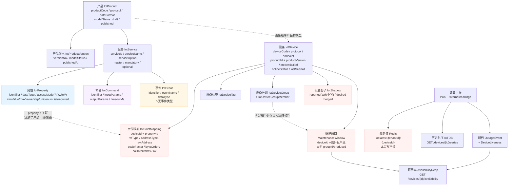
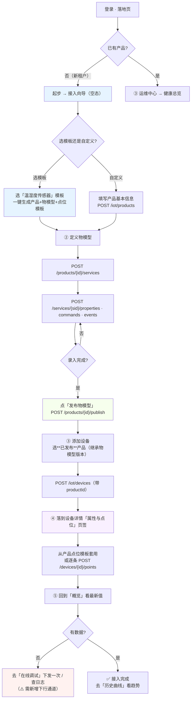
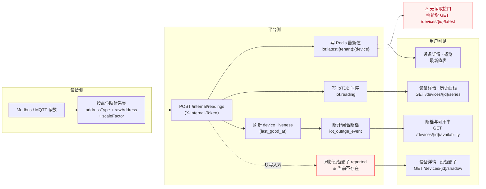
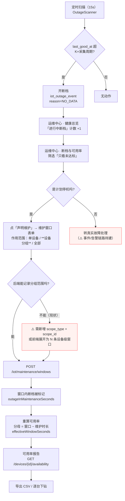

# ypbin-iot · IoT 平台信息架构与交互设计方案（UX / IA Proposal）

| 项 | 值 |
|---|---|
| 版本 | v1.0（设计稿，待评审） |
| 日期 | 2026-09-25 |
| 范围 | `ypbin-iot`（后端）+ `ypbin-iot-ui`（前端）的**信息架构与交互设计** |
| 本轮**不做** | 不改任何业务代码；不新增接口；不建表。只产出文档 + 静态原型 |
| 交付物 | `docs/IOT-UX-PROPOSAL.md`（本文）· `docs/ux-mock/index.html`（可点击原型）· `docs/ux-mock/README.md` |
| 事实基准 | 对 `ypbin-iot` / `ypbin-iot-ui` 两仓的**实际源码检索**（非推测），检索命令见附录 A |

---

## 0. 结论先行

### 0.1 五条核心结论

1. **问题不是「页面太少」，而是「后端能力已就绪、前端只暴露了其中 1/3」。**
   后端已有 `15` 个 IoT 控制器、`18` 张实体表；前端只做了 **4 个列表页 + 6 个模块组件（含 3 个功能抽屉）**，
   连 `productId` 都从未在任何一个视图里被赋值或展示 —— 所以「产品/设备/物模型看不出关联」不是感觉，是**代码事实**。

2. **菜单其实「孤立」得比看上去更严重：SQL 里已经准备好了 14 个能力权限码，却只有 4 个页面。**
   `deploy/sql/007-iot-data.sql` 已经写入 `iot:point:*`、`iot:shadow:*`、`iot:tag:*`、
   `iot:product:tsl-import/export`、`iot:availability:get`、`iot:series:get`、`iot:ledger:*` 等权限，
   并按「挂为设备菜单 3200 下的按钮」处理（注释原文：「挂一个点不开的页面菜单才是更差的体验」）。
   **这些权限码在前端视图里出现次数为 0** —— 权限树里有一堆点不开的按钮。

3. **「配置 → 设备 → 数据 → 运维」这条主线在我方是断裂的，不是缺失的。**
   四个现有页面 `设备台账 / 产品与物模型 / 设备分组 / 维护窗口` 之间**没有任何一条跳转链路**：
   产品页没有「添加设备」，设备表单没有「所属产品」，维护窗口列表把设备显示成**雪花 ID 数字**。

4. **有 12 处数据模型/接口缺口必须在设计前承认**，其中最关键的 4 处是：
   **最新值只写不读**（Redis 无读取接口）、**影子 reported 永不写入**（只有单测会写）、
   **下行/在线调试通道完全不存在**（全仓零命中）、**点位映射挂在设备而非产品**（同型号设备要逐台重复配置）。
   方案里凡涉及这四项的页面，均已明确标注「需新增接口」，**没有假装它们存在**。

5. **物模型不要对外称「等价于阿里云 TSL」。**
   经字段级比对，我方结构（产品 → 服务 → 属性/命令/事件 + `devices`/`services`/`serviceTypeCapabilities`）
   与**华为云 IoTDA 的离线产品模型**同构；而阿里云 TSL 是**「模块下的平级三元（属性/服务/事件）」**。
   两者最大差异是**点位映射的归属层级**：阿里云在产品的 TSL 扩展信息里，我方在设备级的独立表里。

### 0.2 数据模型缺口清单（12 条，全部经仓内检索确认）

> 图例：**缺接口** = 后端无端点；**缺字段** = 表/实体无该列；**半实现** = 有写入无读取或无生产写入方；**缺页面** = 后端就绪、前端无 UI。

| # | 缺口 | 证据（仓内实际位置） | 影响的设计 | 级别 |
|---|---|---|---|---|
| G1 | **最新值只写不读** | `RedisLatestValueWriter` 写 `iot:latest:{tenantId}:{deviceId}`；全仓 `grep KEY_PREFIX\|iot:latest` **除 writer 外零命中**，无任何 controller 读取 | 设备详情「概览/最新值」、设备台账「最新值」列 | **P0** |
| G2 | **影子 reported 永不写入** | 生产代码中 `setReported(...)` **只出现在 `IotShadowServiceImplTest`**；`IotShadowServiceImpl` 只写 `desired` | 设备影子页（半影子）、`merged ≡ desired` | **P0** |
| G3 | **下行 / 在线调试通道不存在** | `grep -i "downlink\|下发\|dispatch"` 在 `ypbin-service/ypbin-iot` + `ypbin-iot-api` 中**只命中一条注释**；`IotCommand` 是物模型**定义**（挂 `service_id`），无运行时命令实例 | 「在线调试」页整体 | **P0** |
| G4 | **点位映射挂在设备、不挂产品** | `IotPointMapping`：`deviceId` + `propertyId` + `rawAddress`…；`GET\|POST /iot/devices/{deviceId}/points` | 「产品级点位模板」（新概念）、设备创建向导 | **P0** |
| G5 | **维护窗口无分组/产品范围** | `MaintenanceWindow` 字段仅 `deviceId / startTs / endTs / source / reason`；`deviceId` 可空 = 租户级 | 维护窗口「按分组声明」 | **P1** |
| G6 | **运行期事件流整链路缺失** | `IotEvent` 是物模型**定义**（`service_id` 外键）；无事件实例表、无上报端点、无查询接口 | 「事件与告警」页整体 | **P1** |
| G7 | **无读取保留期配置 / 触发清理的接口** | `RetentionProperties` 是 `@ConfigurationProperties`（只读绑定）；`RetentionCleanupServiceImpl` 只有 `@Scheduled`，**无 Controller** | 「数据保留与清理」页 | **P1** |
| G8 | **设备响应缺 productName / groupName；查询缺 productId / groupId 过滤** | `IotDeviceResp` 字段无 productName/groupName；`IotDeviceQuery` 只有 `keyword`/`protocol` | 设备台账「所属产品/分组」列与筛选、产品详情「设备」页签 | **P0** |
| G9 | **设备表单无产品选择器** | `apps/web-antd/src/views/iot/devices/data.ts` 的 `useFormSchema()` **无 `productId` 字段**；`productId` 在前端仅出现于 `api/iot/device.ts` 的类型声明（**0 处视图使用**） | 接入向导第 3 步、设备新增 | **P0** |
| G10 | **设备凭据不可见 / 不可签发** | `credential_ref` 列存在但**无任何签发、查看、重置的接口**（仅被 `AccessDeviceSpecResp` 读出给 access 节点） | 设备详情「设备信息」、接入调试 | **P2** |
| G11 | **无 TSL 版本差异对比** | 有 `POST /iot/products/{id}/draft`、`/{id}/publish`、`GET /{id}/versions`，**无 diff 接口** | 产品详情「版本」页签 | **P2** |
| G12 | **`iot_device.shadow_json` 是死列** | DDL 与实体都有该列，但 `grep shadow_json\|shadowJson` **除 DDL 注释与实体字段外零命中** —— 与 `iot_shadow` 表语义重复 | 影子实现取舍（需明确，否则双写/双读混乱） | **P2** |

### 0.3 附带发现（不影响本轮交付，但应记录）

- **`sys_menu` 3204（「IoT 平台」父目录）不在仓库 SQL 里。**
  `grep -rn "3204"` 在 `ypbin-iot`、`ypbin-iot-ui`、`ypbin-admin` 三仓只命中 `docs/DEMO-DATA.md` 的说明文字；
  `deploy/sql/007-iot-data.sql` 里 `3200/3201/3202/3203` 仍是 `pid=0` 的**顶级菜单**。
  而 `ypbin-iot-ui` 的提交 `7d66907` 明确写「后端 `sys_menu` id=3204」。⇒ **活库与仓库 SQL 已漂移，缺少可重放的迁移脚本。**

---

## 1. 研究方法与信源声明（R1 / R2 / R3）

### 1.1 方法

- **一手优先**：第 2 节对 7 个主流平台的描述，全部来自**官方文档**（厂商帮助中心 / 官方 API 参考 / 官方规范仓库）。
- **实际打开页面**：每条结论均由 `web_fetch` 真实抓取页面后摘录，**不以搜索摘要为依据**。
  本轮实际打开的官方页面：阿里云 26+ 页、华为云 11 页、腾讯云 8 页、AWS 17 页、Azure 16 页（含微软官方 GitHub 规范原文）。
- **访问日期**：**2026-09-25**（如无特别说明，第 2 节所有引用均为该日访问）。
- **标注格式**：`[来源性质 | URL | 访问日期]`。
- **未核实即声明**：凡未能由官方文档证实的，一律标注「未核实」，**不臆造界面截图、按钮文案与 tab 名称**。

### 1.2 来源性质说明（重要，影响结论强度）

| 情况 | 说明 |
|---|---|
| 阿里云 `help.aliyun.com` | 部分 URL 返回 `unsupported content type`（页面 JS 渲染），改用**同一官方文档中心**的国际站镜像 `alibabacloud.com/help/…`。内容与面包屑一致，仍属**一手官方**；但**未逐字比对两个站点是否存在区域差异**。 |
| 控制台真实界面 | **本轮无人登录任何厂商控制台。** 下文凡出现「设备详情页有 N 个区块」，均来自**官方文档文字描述**（"文档所述版式"），**未与线上控制台截图逐项核对**。 |
| 二手来源 | 本轮结论**未采用任何**博客 / CSDN / 知乎 / 自媒体内容。搜索命中的 `developer.aliyun.com/article/*`、`blog.csdn.net` 等**仅作线索、未采信**。 |
| 仓内既有报告 | `iotda-product-model-report.md`（仓库外，母目录，2026-09-19 访问）提供华为云字段级比对。本文引用它时会明确标注为「仓内既有报告，其官方链接**本轮未逐一重访**」。 |

### 1.3 未能核实事项（汇总，详见 §10）

1. 阿里云 `help.aliyun.com/zh/iot/` 站点标题带**「文档停止维护」**标记，但多个子页更新时间显示 **2026 年**（如日志转储页 2026-07-24）—— 二者矛盾，**未能核实**是站点级弃用标记还是产品线切换。**因此本方案不把「完全对齐阿里云」作为目标**。
2. 「**温湿度传感器一键创建模板**」在阿里云官方文档中**未找到依据**；官方模板机制叫「**所属品类 / 标准品类**」（文档原文标注"相当于产品模板"），且官方温控器示例是**手工**添加两个自定义属性。→ **不采信「一键创建」这一说法**，本方案的模板化设计按「品类 + 预定义功能（必选/可选）」建模。
3. 各家**控制台真实界面的 tab 顺序、图标、按钮文案**：全部**未核实**。
4. **AWS 控制台 thing 详情页的 tab 排布**：官方文档**查无描述** → 明确未核实。
5. **Azure IoT Central 设备详情页完整 panel 清单**：官方描述分散在多个页面，**未核实**是否有固定内建区块。
6. **华为云「产品模型含事件」**：本轮核实的 11 个官方页面中，「事件」**未被列为产品模型构成要素**，且零出现「物模型」一词；但仓内既有报告记载 IoTDA **API 层** `ServiceCapability` 含 `events` 字段、且官方注明 `Currently, event customization is not supported`。两者不冲突（结构有槽位 / 离线格式无 / 官方不支持自定义），但**本轮未重访该 API 页**，标注为**部分未核实**。
7. **AWS「没有强制物模型层」**：这是**依据官方文档的推断**，非官方原句；可引用的官方原句只有 thing type 是 `optional`、`You don't need to create a thing in the registry to connect a device to AWS IoT.`。
8. **腾讯云「设备分组」**：8 个已核实页面中不存在，**无一手证据支持其存在** → 未核实。

---

## 2. 主流平台对照（一手来源）

### 2.1 对照总表

> 「设备详情页区块」一列中的 **〔文档所述〕** 表示来自官方文档文字描述、未与真实控制台核对；**未核实** 表示官方文档中查无描述。

| 平台 | 主线（信息架构主干） | 物模型怎么建模 | 产品 ↔ 设备怎么关联 | 新手引导 / 模板 | 设备详情页区块 |
|---|---|---|---|---|---|
| **阿里云 IoT** | 官方快速入门 **6 步**：创建企业版实例 → 创建产品和设备 → 设备接入和上报数据 → 数据转发到表格存储 → 服务端订阅 → 云端下发指令。「定义物模型」**嵌在第 2 步内部**。[1] | TSL = **模块下的平级三元**：产品 → 模块（默认/自定义，≤20）→ `properties` / `services` / `events`。属性有 `identifier`/`accessMode(r,rw)`/`dataType.specs`；服务有 **`callType(sync/async)`** + `inputData`/`outputData`；事件有 **`type(info/alert/error)`** + `outputData`。[2][3] | 产品 = 同型号设备集合，设备继承产品功能。设备证书 = **ProductKey + DeviceName + DeviceSecret**；一机一密（官方"推荐"）vs 一型一密（预注册/免预注册，有泄露风险）。[4][5] | 官方**文档区**有「快速入门」+「学习路径图」（6 模块）；**控制台内是否有引导向导：未核实**。模板 =「**所属品类**」（文档标注"相当于产品模板"），标准品类预定义功能，分**必选/可选**。[6] | **〔文档所述〕10 个区块**：设备信息 / Topic列表 / **物模型数据**（运行状态·事件管理·服务调用）/ **设备影子** / 文件管理 / 日志服务 / **在线调试** / 子设备管理 / **分组** / 任务。[7] |
| **华为云 IoTDA** | 创建产品 →（开发产品模型 → 开发编解码插件）→ 在线调试 → 注册设备。快速入门编号步骤数**未核实**（HTML 页 404）。[8] | 官方术语是「**产品模型 Product Model**」= 产品信息 + **服务能力**（服务 → 属性 / 命令）。属性有数据类型（int/long/decimal/string/dateTime/jsonObject/enum/boolean/stringList）、**访问权限（可读/可写）**、范围、步长、单位；命令有下发参数与**响应参数**。**「事件」未被列为构成要素**。[9][10] | 设备「归属于某个产品下的设备实体」，注册后即使用控制台定义的产品模型 ⇒ **继承**。鉴权支持**密钥与 X.509 两种**。[8][11] | 有平台预置模板：「**导入库模型**（标准模型 + 厂商模型）」；共 **4 种**开发方法（自定义在线开发 / 上传模型文件 / Excel 导入 / 导入库模型）。[8][10] | 官方可核实到的区块：**设备影子**、**消息跟踪**、**群组**、**标签**。命令下发/OTA/运行日志仅列为平台级能力，**完整 tab 排布未核实**。[12][13] |
| **腾讯云 IoT Explorer** | **明确 6 步**：新建产品 → 定义物模型 → 创建设备 → 查看设备 → 模拟设备调试 → 查看设备状态。[14] | 物模型 = **属性 / 事件 / 行为**（**「行为」取代了「服务」**，含请求参数 + 返回参数，设备须 **5 秒内响应**）。事件类型 = **信息 / 告警 / 故障**；属性**读写 / 只读**。标识符产品内唯一。[15][16] | 平台按**设备三元组**（产品ID、设备名称、设备密钥）自动计算「设备连接参数」供复制。认证方式可选证书认证 / 密钥认证。[17] | 有 **6 步**编号快速入门 + 「快速入门总览」目标导航页。模板能力 = **导入物模型 JSON（覆盖式）**，官方警告量产产品慎用；**「一键创建产品模板」无一手证据**。[15][14] | 官方可核实区块：**物模型数据（属性/事件/行为）**、**云日志**（内容日志、上下线日志）、设备标签、设备连接参数。**完整 tab 排布未核实**。[16][18] |
| **AWS IoT Core** | 以 API/CLI 为主线；控制台是**线性向导**：Connect → Connect one device → Register and secure → 下载 connection kit → 跑示例 → MQTT test client（Quick connect 5 步，15–20 分钟）。[19] | **无强制物模型层**（推断，非官方原句）。建模能力分散在：thing type `attributes`、Device Shadow、**IoT SiteWise asset model**（measurement/transform/metric/attribute/hierarchy，不能嵌 asset model，需 component model）、**TwinMaker** entity/component/knowledge graph（PartiQL）。**AWS IoT Things Graph 已停服**。[20][21][22] | thing = registry 条目（**不建 thing 也能连设备**）→ thing type（**可选**；无 type 上限 3 attributes，有 type 上限 50；一个 thing 只能一个 type）→ thing group（静态可嵌套 / 动态查询驱动）。一个 thing 最多属 **10** 组。[20][23][24] | 4 条并行入口（Quick connect / Interactive / Hands-on / MQTT messages）；官方提示重复做 tutorial 前要先删上次建的 thing。**thing name 创建后不可改**。[19][25] | **官方文档未描述 thing 详情页 tab → 未核实。** 文档确实存在的功能点：证书/principal、影子、Jobs、Device Defender、连接状态、策略与有效权限。[23][26] |
| **Azure IoT Hub / IoT Central** | IoT Hub = 消息枢纽（D2C / 文件上传 / direct methods）；IoT Central = **aPaaS**，用 Hub 作云网关 + 内部 DPS 管连接。**原官方「IoT Hub vs IoT Central」对照页已 302 → 现行逐项对照表未核实。**[27][28] | **DTDL**（JSON-LD）：六大元模型类 **Interface / Command / Component / Property / Relationship / Telemetry**。ADT 支持 v2 与 v3，**IoT Central 用 v2 + 扩展**。ADT 明确**不支持 Commands**、`writable` 不生效、**组件嵌套仅一层**。[29][30] | IoT Hub device twin 四段（tags / desired / reported / device identity）。**关键：`IoT Hub does not impose a specific schema for the device twin desired and reported properties`** —— DTDL 是靠 **IoT Plug and Play 约定**（`modelId`、组件 `"__t":"c"`、`$metadata`）**叠加**上去的。[31][32] | IoT Central 引导式：**device template**（device model + views）→ 必须 **Publish** 才能连设备；分配有 4 种方式，自动分配分三档（已发布 / 去公共 repository 找 / 标 **Unassigned**）；可从 **featured device templates** 导入或 **autogenerate**。另有**行业化应用模板**（Retail/Energy/Government/Healthcare）。[33][34][35] | 官方未给完整 panel 清单 → **未核实**。已核实：**详情页 = 该模板所有 views 的容器**；默认三视图 **Commands / Overview / About**；左侧导航 13 项（Devices / Device groups / Device templates / … / Permissions / Customization）。[36][37] |
| **涂鸦 Tuya IoT** | 产品开发 **8 步**：Function definition → Panel configuration → Hardware development → Embedded development → Product configuration → Flashing and authorization → Product testing → Product release。另有「**5 分钟快速开始**」：创建产品 → 添加产品功能 → 选 App 面板 → 下载 SmartLife App → 试装。创建产品本身 **4 子步**：选品类（标准类目 / 行业解决方案）→ 选智能化方式（TuyaOS / TuyaLink）→ 选产品方案（零代码 / 自定义）→ 填产品信息。[38][39] | **功能点 DP**（官方字段名**不叫**「读写权限」）：DP ID / 功能名称 / **标识符（产品 DP Code）** / **数据传输类型（可下发可上报 · 只上报 · 只下发）** / 数据类型（Bool/Value/Enum/Fault/String/Raw）/ 功能属性（范围·间距·单位）/ 备注。官方原话是「基于产品功能**生成云端控制对接模型**」（EN: `things data models`）。**「DP ≡ 物模型」不成立**（官方无等价或包含表述）。[40][41] | **PID** = 产品级身份（关联该产品的 DP、App 面板、采购信息，官方称 "identity card"）；**Device ID** = 设备激活后云端生成。设备记录含 `product_id`；设备 `status[].code` 官方注释即 "the identifier of a **data point (DP)**"。⚠️ 官方**未使用「继承」措辞**。[42][41] | 官方称谓是「**方案中心 / 行业解决方案（By Business Type）/ 免开发方案**」，**没有「产品模板」「一键创建」**。温湿度传感器**确有**官方免开发方案（方案中心 > 温湿度传感器方案），但官方措辞是「**流程化标准配置**」。真正省力的机制是**必选 DP 按品类预置**（`Required` DP 不可删）。[43][44] | **官方文档未描述 tab 排布 → 未核实。** 官方可核实的是导航路径与按钮：`产品 > 设备 > 设备调试`（含「切换产品」/「上报」）、设备管理操作列 `Details` / `Logs` / `QR Code Binding` / `Manage Sub-Devices`；另有 Device Message Statistics（**每设备每日 3500 条**上限）与 Device Health Check。[45][46] |
| **ThingsBoard** | 实体层级：System Administrator（**不拥有** IoT 实体）→ **Tenant**（顶级组织，拥有与管理全部资源）→ **Customer**（租户内的逻辑子组织，用于范围划分与安全委派）→ User。实体三类数据：Attributes / Time-series / Relations。[47][48] | **没有「物模型」层**；用 **Device Profile / Asset Profile** 承载跨界行为配置（transport protocol / rule chain / queue / alarm rules / provisioning）。**关系（Relations）** 才是建模主力：`from` / `to` / `type`（**自由文本，"Any string is valid"**）/ `additionalInfo`；**关系没有时间戳**（结构性链接而非事件）；方向语义 = `from` 列 children、`to` 列 parents。内置约定 4 个：**Contains / Manages / Uses / Supports**。[49] | Device = "Physical or virtual thing that publishes telemetry and handles RPC commands"；Asset = "Abstract object (building, field, vehicle) used to group and aggregate data"。官方层级示例：`Building (Asset) → Floor (Asset) → Thermostat (Device)`。官方隔离原则："each entity belongs to **exactly one tenant**"。[47][50] | 未作为主要对标项（面向开发者，而非「引导式」）。 | **官方明确 9 个 tab**：Attributes / Latest Telemetry / Calculated Fields / Alarm Rules / **Alarms** / **Events** / **Relations** / **Audit Logs** / Version Control。另注：**Attributes 只存最新值 + 时间戳，"there is no history"**；三种作用域 Server-side / Shared / Client-side，且 **"Client-side attributes cannot be created or modified from the UI"**。[51][52] |
| **EMQX**（可选） | **「设备」不是一等实体** —— Dashboard 的一等实体是 **Client**（含尚未过期的会话）。「设备」抽象在 **Neuron 南向驱动节点**：**一个节点 = 一台设备或一组设备**。[53][54] | — | Neuron 驱动节点有**双状态模型**（官方明示相互独立）：**Running state**（Init / Ready / Running / Stopped）与 **Link state**（Connected / Disconnected）。新建节点在配好 tags 前一直是 Disconnected。[54] | — | Client Details 四个 tab：**Information / Session Info / Metrics / Subscriptions**；列表可按 Client ID/username 模糊搜索、按连接状态与 IP 过滤、`Kick Out` 强制断开。[53] |

**表内引用编号**对应 §2.3 的链接清单。

### 2.2 逐平台要点补充

**阿里云 IoT —— 与本方案直接相关的三个细节**

1. **点位映射在「产品级」**：属性的「**扩展信息 Extended Information**」用于「指定连接协议与设备标准 TSL 模型的映射」；
   选 Modbus 时要在**属性**上配置操作类型（离散输入/线圈/保持寄存器/输入寄存器及其读写下标）、
   寄存器地址（`0x0`~`0xFFFF`）、原始数据类型、位、**缩放因子**、高/低字节交换、寄存器位序交换；
   选 OPC UA 时填节点名。→ **这正对应我方 `iot_point_mapping` 的 `addressType`/`rawAddress`/`scaleFactor`/`byteOrder` 字段，
   但归属层级不同（我方在设备级）。**
   [一手官方 | https://help.aliyun.com/zh/iot/user-guide/add-a-tsl-feature | 2026-09-25]
2. **发布前有「查看差异」**：Edit Draft → Release online → 填版本号与说明 →「**View Differences**」查看当前版本与线上版本差异 → 勾选确认 → 发布。
   → 我方有 draft/publish/versions，**缺 diff**。
   [一手官方 | https://help.aliyun.com/zh/iot/user-guide/add-a-tsl-feature | 2026-09-25]
3. **分组的官方用途**（回答"分组用来干什么"）：① 查询分组管理的设备；② 数据服务（SQL 分析对象、DataWorks+MaxCompute）；
   ③ 监控运维（**OTA 升级批次可按分组**、**设备任务可按分组选对象**）。分静态组（手动/可三级嵌套）与**动态组**（规则匹配、仅华东2企业版与新版公共实例）。
   [一手官方 | https://help.aliyun.com/zh/iot/user-guide/device-groups | 2026-09-25]

**华为云 IoTDA —— 群组与调试**

- **群组**：静态群组（手动、可嵌套；≤1000 群组、单组 ≤20000 设备、单设备 ≤10 组、嵌套 ≤5 级）；
  **动态群组**（**类 SQL 设备查询规则**自动进出，仅标准版/企业版，≤10 个，**规则创建后不可改**，TPS ≤1/S）。
  能力 = **批量 OTA** + 批量绑定/解绑（一次 ≤100）。**批量命令下发未核实**。
  [一手官方 | https://support.huaweicloud.com/usermanual-Iothub/iot_01_0020.html | 2026-09-25]
- **在线调试**提供**应用模拟器 + 设备模拟器**；官方限制「**仅基础版和标准版支持 MQTT 协议的在线调试**」；
  **每款产品只能创建一个虚拟设备**；真实设备调测**没有**设备模拟器。
  [一手官方 | https://support.huaweicloud.com/devg-iothub/iot_02_9988.html | 2026-09-25]
- **消息跟踪**：用于鉴权/命令下发/数据上报/转发的故障定位；**单用户同时跟踪设备上限 10**；
  路径「设备 > 所有设备 > 详情 > **消息跟踪**页签」；失败点有「定位建议」。
  [一手官方 | https://support.huaweicloud.com/usermanual-Iothub/iot_01_0030_0.html | 2026-09-25]

**AWS —— 三条对 IA 有直接启发的事实**

1. **「注册表 + 可选类型 + 分组」是可渐进增强的模型**：官方原文 `You don't need to create a thing in the registry to connect a device to AWS IoT.`
   → 对应我方「设备必须先绑已发布产品」的强约束（`IotDeviceServiceImpl.requirePublishedProduct`），
   我方是**强物模型**路线，比 AWS 严格，取舍要在方案里说清（见 §5.4）。
   [一手官方 | https://docs.aws.amazon.com/iot/latest/developerguide/iot-thing-management.html | 2026-09-25]
2. **动态分组必须依赖索引**：动态 thing group 需 **fleet indexing 已启用**，且官方明列「未注册设备不索引」「复杂类型不索引」「null 不索引」。
   → 我方要做的「按分组批量运维」若也想支持规则式动态分组，**必须有索引/查询能力**，不是加个字段就行。
   [一手官方 | https://docs.aws.amazon.com/iot/latest/developerguide/dynamic-thing-groups.html | 2026-09-25]
3. **影子有 `delta` 而非只有 `merged`**：官方约定「设备只写 reported，应用只写 desired」，平台计算 **`delta` = 在 desired 不在 reported 的字段**（嵌套差异含到根的完整路径；**数组按值整体处理**）。
   → 我方 `IotShadowResp` 只有 `reported/desired/merged`，**没有 delta**；且因 G2（reported 永不写），`merged` 恒等于 `desired`，**delta 概念在当前实现下没有意义**。
   [一手官方 | https://docs.aws.amazon.com/iot/latest/developerguide/device-shadow-document.html | 2026-09-25]

**Azure IoT Central —— 「模板 → 设备」引导式流程的完整机制（本方案模板化的主要对标）**

- **device template = device model（+ views）**，是「一类设备的蓝图」；符合模板的遥测叫 `modeled data`，不符合的叫 `unmodeled data`。
- 设备分配到模板有 **4 种方式**：注册时指定 / 批量导入时统一指定 / 连接后手工指派 / **自动分配（设备首连发 model ID）**。
  自动分配分三档：模板已 **published** → 直接分配；未发布 → 去**公共 device model repository** 找，找到则生成**基础模板**；找不到 → 标 **Unassigned**，可**根据数据 autogenerate**。
- **必须 Publish**：官方原文 `Before you can connect a device that implements your device model, you must publish your device template.`
- 创建路径 **5+1**：UI 设计 / 从 **featured device templates** 导入 / 上报 model ID 由服务去 repository 取 / **autogenerate** / 手写 DTDL 导入 / REST API。
- 编辑器三区 **Model / Raw data / Views**；Views 可 **Generate default views**（默认 **Commands / Overview / About**）。
  [一手官方 | https://learn.microsoft.com/en-us/azure/iot-central/core/concepts-device-templates | 2026-09-25]
  [一手官方 | https://learn.microsoft.com/en-us/azure/iot-central/core/howto-set-up-template | 2026-09-25]
- **device group 是动态查询**：`属性 + 比较运算符 + 值`，多条件为 **AND**；`A device group can only contain devices from a single device template and organization.`；
  官方原文 `The device group is a dynamic query. Every time you view the list of devices, there might be different devices in the list.`
  用途 = **Jobs**（批量）与 **Data explorer**（聚合分析）。
  [一手官方 | https://learn.microsoft.com/en-us/azure/iot-central/core/tutorial-use-device-groups | 2026-09-25]

**涂鸦 Tuya IoT —— DP 的字段级构成（与本方案「功能点编辑」直接相关）**

官方 DP 定义表逐字段（中文页原文）：

| 字段 | 官方说明要点 |
|---|---|
| **DP ID** | 「DP 是产品功能在设备应用程序中的简称……一般为整数型，例如 1、2、101。**设备与云端的功能数据通过 DP ID 进行传输**」 |
| 功能名称 | 多语言，**仅用作平台展示** |
| **标识符** | **又称产品 DP Code**；字母/数字/下划线，**以字母开头**（例 `color_mode`） |
| **数据传输类型** | **可下发可上报 / 只上报 / 只下发**（EN: Send and report / Report only / Send only） |
| **数据类型** | **Bool / Value / Enum / Fault / String / Raw** |
| 功能属性 | 数值型的取值范围、间距、单位 |
| 备注 | 协作说明 |

> ⚠️ **术语更正（重要）**：涂鸦官方**没有「读写权限」这个词**，该维度官方名叫「**数据传输类型**」；
> `mode`（如 `"mode":"rw"`）只出现在**接口层**的设备状态返回里。
> 引用涂鸦时若写「读写权限」，属**事实错误**。

**六种数据类型的官方约束**：`Fault` 是 **bitmap** 格式且**只能只上报**；`String` ≤ **255 字节**；`Raw` ≤ **255 字节**且官方「**不推荐**」；
`Enum` 值只能小写字母/数字/下划线、**code 从 0 开始**、单值 ≤15 字符、**最多 10 个**；
官方建议**标准 + 自定义功能总数 ≤ 40**；**零代码方案不能加自定义功能**。
[一手官方 | https://developer.tuya.com/en/docs/iot/custom-functions?id=K937y38137c64 | 2026-09-25]

**「上报方式」的四项特殊配置**（同页官方原文）：**Passive Reporting 被动上报** / **Repeated Reporting 重复上报** /
**DP Routing（蜂窝优先 / 蓝牙优先 / 强制蓝牙）** / **Cloudless 无云**（仅 BLE 直连 App 场景）。

**标准功能不可改的字段**：因绑定 App 组件，标准功能**不允许改 Identifier / Data Type / Data Transfer Type**，只能改 DP Name 与 Remarks
（零代码方案连编辑都不支持）。→ 这与我方「产品模板功能分必选/可选」的设计意图一致，值得借鉴「**模板预置项锁定关键字段**」的做法。
[一手官方 | https://developer.tuya.com/en/docs/iot/standard-functions?id=K914jp5h3j6s8 | 2026-09-25]

**ThingsBoard —— 设备详情 9 个 tab（本方案 §8 的重要对标）**

官方 device details 的 9 个 tab：**Attributes**（"**Client, server, and shared** key-value pairs"）/ **Latest Telemetry** /
Calculated Fields / Alarm Rules / **Alarms** / **Events**（"Lifecycle events, logs, warnings, and errors"）/
**Relations**（"Directed connections to other entities (assets, dashboards, rule chains)"）/ **Audit Logs** / Version Control。

两条对本方案有直接约束力的官方结论：

1. **Attributes 没有历史**：官方原文 "stores only the **latest value and its timestamp**… **there is no history**"，
   且「**Client-side attributes cannot be created or modified from the UI**」。
   → 这正好印证我方 `iot:latest:*` 的定位：**最新值是一类独立于时序的存储，必须单独提供接口，且要明确它没有历史**
   （用户若想查历史必须走时序查询）。本方案据此把「最新值」与「历史曲线」放在设备详情的**两个不同页签**，而不是混在一起。
2. **「关系」在 ThingsBoard 是一等公民且类型自由文本**：`type` 官方明示 "**Any string is valid**"，
   且「关系**没有时间戳** —— 它们表示结构性链接，而不是事件」。
   → 我方**没有**通用的实体关系表（只有外键）。本方案的做法是**用外键 + 显式 UI 表达关系**，
   而**不**引入通用关系表（避免过度设计）；若未来要做「设备-资产-拓扑」，再考虑单独立项。
   [一手官方 | https://thingsboard.io/docs/user-guide/devices/ · …/digital-twins/relations/ | 2026-09-25]

**EMQX —— 为什么它的 IA 不适用于我方（反面对照）**

EMQX Dashboard 的一等实体是 **Client**（含尚未过期的会话），**不是 Device**；
「设备」抽象出现在 **Neuron 南向驱动节点**（「一个驱动节点对应一台设备或一组设备」），
并有**双状态模型**：Running state（Init/Ready/Running/Stopped）与 Link state（Connected/Disconnected）。

→ 对方案的启示：**EMQX 是「连接视角」，我方是「台账视角」**。
我方 `IotDevice.onlineStatus` 只有 `online / offline / unknown` 三值，
**无法表达「链路已连但采集未就绪」这种中间态**（Neuron 用双状态表达）。
本方案**不**现在引入双状态（会牵动断档算法口径），但在 §10 记为**待评估项**：
若现场出现大量「连上了但读不到点位」的工单，应把「连接状态」与「采集状态」拆成两个字段。
[一手官方 | https://docs.emqx.com/en/emqx/latest/guides/dashboard/connections.html · https://docs.emqx.com/en/neuronex/latest/configuration/south-devices/south-devices.html | 2026-09-25]

### 2.3 第 2 节链接清单（一手官方，访问日期均为 2026-09-25）

| # | 平台 | 链接 | 来源性质 |
|---|---|---|---|
| 1 | 阿里云 | https://help.aliyun.com/zh/iot/getting-started/overview-41 | 一手官方文档 |
| 2 | 阿里云 | https://help.aliyun.com/zh/iot/user-guide/what-is-a-tsl-model | 一手官方文档 |
| 3 | 阿里云 | https://help.aliyun.com/zh/iot/user-guide/tsl-parameters · https://help.aliyun.com/zh/iot/user-guide/add-a-tsl-feature | 一手官方文档 |
| 4 | 阿里云 | https://help.aliyun.com/zh/iot/user-guide/create-a-product | 一手官方文档 |
| 5 | 阿里云 | https://help.aliyun.com/zh/iot/user-guide/unique-certificate-per-device-verification · …/unique-certificate-per-product-verification | 一手官方文档 |
| 6 | 阿里云 | https://help.aliyun.com/zh/iot/getting-started/create-a-product-and-device · https://www.alibabacloud.com/tc/getting-started/learningpath/iot | 一手官方文档 |
| 7 | 阿里云 | https://help.aliyun.com/zh/iot/user-guide/view-device-information | 一手官方文档 |
| 8 | 华为云 | https://support.huaweicloud.com/usermanual-Iothub/iot_01_0054.html | 一手官方文档 |
| 9 | 华为云 | https://support.huaweicloud.com/devg-iothub/iot_01_0017.html | 一手官方文档 |
| 10 | 华为云 | https://support.huaweicloud.com/devg-iothub/iot_02_0005.html | 一手官方文档 |
| 11 | 华为云 | https://support.huaweicloud.com/usermanual-Iothub/iot_01_0015.html · …/iot_01_0019.html | 一手官方文档 |
| 12 | 华为云 | https://support.huaweicloud.com/usermanual-Iothub/iot_01_0049.html | 一手官方文档 |
| 13 | 华为云 | https://support.huaweicloud.com/usermanual-Iothub/iot_01_0020.html · …/iot_01_0030.html | 一手官方文档 |
| 14 | 腾讯云 | https://cloud.tencent.com/document/product/1081/122424 · …/1081/134731 | 一手官方文档 |
| 15 | 腾讯云 | https://cloud.tencent.com/document/product/1081/103588 | 一手官方文档 |
| 16 | 腾讯云 | https://cloud.tencent.com/document/product/1081/126554 | 一手官方文档 |
| 17 | 腾讯云 | https://cloud.tencent.com/document/product/1081/103586 | 一手官方文档 |
| 18 | 腾讯云 | https://cloud.tencent.com/document/product/1081/126559 · …/1081/34741 | 一手官方文档 |
| 19 | AWS | https://docs.aws.amazon.com/iot/latest/developerguide/iot-quick-start.html · …/iot-gs.html | 一手官方文档 |
| 20 | AWS | https://docs.aws.amazon.com/iot/latest/developerguide/iot-thing-management.html · …/thing-types.html | 一手官方文档 |
| 21 | AWS | https://docs.aws.amazon.com/iot-sitewise/latest/userguide/create-asset-models.html · https://docs.aws.amazon.com/iot-twinmaker/latest/guide/tm-knowledge-graph.html | 一手官方文档 |
| 22 | AWS | https://docs.aws.amazon.com/boto3/latest/reference/services/iotthingsgraph.html（Things Graph 已停服） | 一手官方文档 |
| 23 | AWS | https://docs.aws.amazon.com/iot/latest/developerguide/thing-groups.html · …/dynamic-thing-groups.html | 一手官方文档 |
| 24 | AWS | https://docs.aws.amazon.com/iot/latest/developerguide/managing-fleet-index.html · …/managing-index.html | 一手官方文档 |
| 25 | AWS | https://docs.aws.amazon.com/iot/latest/developerguide/create-iot-resources.html · …/iot-gs-first-thing.html | 一手官方文档 |
| 26 | AWS | https://docs.aws.amazon.com/iot/latest/developerguide/iot-device-shadows.html · …/device-shadow-document.html | 一手官方文档 |
| 27 | Azure | https://learn.microsoft.com/en-us/azure/iot/iot-services-and-technologies | 一手官方文档 |
| 28 | Azure | https://learn.microsoft.com/en-us/azure/iot-central/core/howto-faq | 一手官方文档 |
| 29 | Azure | https://learn.microsoft.com/en-us/azure/digital-twins/concepts-models | 一手官方文档 |
| 30 | Azure | https://raw.githubusercontent.com/Azure/opendigitaltwins-dtdl/master/DTDL/v3/DTDL.v3.md | 一手官方规范（微软官方仓库） |
| 31 | Azure | https://learn.microsoft.com/en-us/azure/iot-hub/iot-hub-devguide-device-twins | 一手官方文档 |
| 32 | Azure | https://learn.microsoft.com/en-us/previous-versions/azure/iot/concepts-digital-twin | 一手官方文档（归档页） |
| 33 | Azure | https://learn.microsoft.com/en-us/azure/iot-central/core/concepts-device-templates | 一手官方文档 |
| 34 | Azure | https://learn.microsoft.com/en-us/azure/iot-central/core/howto-set-up-template | 一手官方文档 |
| 35 | Azure | https://learn.microsoft.com/en-us/azure/iot-central/core/quick-deploy-iot-central · …/overview-iot-central | 一手官方文档 |
| 36 | Azure | https://learn.microsoft.com/en-us/azure/iot-central/core/overview-iot-central-tour | 一手官方文档 |
| 37 | Azure | https://learn.microsoft.com/en-us/azure/iot-central/core/howto-manage-devices-individually · …/howto-manage-devices-in-bulk | 一手官方文档 |
| 38 | 涂鸦 | https://developer.tuya.com/en/docs/iot/product-development?id=Kbev5cy070nwq | 一手官方文档 |
| 39 | 涂鸦 | https://developer.tuya.com/en/docs/iot/device-intelligentize-in-5-minutes?id=K914joxbogkm6 · https://developer.tuya.com/en/docs/iot/create-product?id=K914jp1ijtsfe | 一手官方文档 |
| 40 | 涂鸦 | https://developer.tuya.com/cn/docs/iot/define-product-features?id=K97vug7wgxpoq | 一手官方文档 |
| 41 | 涂鸦 | https://developer.tuya.com/en/docs/iot/custom-functions?id=K937y38137c64 · https://developer.tuya.com/en/docs/iot/device-manger?id=K9wj0vb68htna | 一手官方文档 |
| 42 | 涂鸦 | https://developer.tuya.com/en/docs/iot/introduction-of-tuya/terms?id=K914joq6tegj4 | 一手官方文档 |
| 43 | 涂鸦 | https://developer.tuya.com/cn/docs/iot/temperature-and-humidity-sensor?id=Kaiuzlhx1nrj1 | 一手官方文档 |
| 44 | 涂鸦 | https://developer.tuya.com/en/docs/iot/solution?id=K93vuyt4zl8a3 · https://developer.tuya.com/en/docs/iot/standard-functions?id=K914jp5h3j6s8 | 一手官方文档 |
| 45 | 涂鸦 | https://developer.tuya.com/cn/docs/iot/device_debug?id=Kbrcqod1qa730 · https://developer.tuya.com/en/docs/iot/total_device_manage?id=Kbrcqbsc89m37 | 一手官方文档 |
| 46 | 涂鸦 | https://developer.tuya.com/en/docs/iot/message-reporting-total?id=Kbuemg6s7vkej · …/message-reporting-test?id=Kbuemcpfebg27 | 一手官方文档 |
| 47 | ThingsBoard | https://thingsboard.io/docs/user-guide/digital-twins/entities/ | 一手官方文档 |
| 48 | ThingsBoard | https://thingsboard.io/docs/concepts/multi-tenancy/ | 一手官方文档 |
| 49 | ThingsBoard | https://thingsboard.io/docs/user-guide/digital-twins/relations/ | 一手官方文档 |
| 50 | ThingsBoard | https://thingsboard.io/docs/concepts/digital-twin-model/ | 一手官方文档 |
| 51 | ThingsBoard | https://thingsboard.io/docs/user-guide/devices/ | 一手官方文档 |
| 52 | ThingsBoard | https://thingsboard.io/docs/user-guide/digital-twins/attributes/ | 一手官方文档 |
| 53 | EMQX | https://docs.emqx.com/en/emqx/latest/guides/dashboard/connections.html · https://docs.emqx.com/en/emqx/latest/guides/dashboard/introduction.html | 一手官方文档 |
| 54 | EMQX | https://docs.emqx.com/en/neuronex/latest/configuration/south-devices/south-devices.html | 一手官方文档 |

> **抓取说明（供后续同类研究复用）**：涂鸦与 EMQX 官方文档站支持在路径后追加 `.md` 取得纯文本正文，比解析 HTML 干净；
> ThingsBoard 是 Astro SSR，正文需从 `<main>` 提取。以上页面本轮均由 `web_fetch` 实际打开并阅读。

### 2.4 我方能否支撑：逐项判定（R4 如实判断，不为方案好看而假设）

> 「支撑」= 现有数据模型 + 现有接口**不改代码**就能表达；「部分」= 需要加字段/加接口；「否」= 数据模型层面就不存在。

| 主流平台的能力 | 我方对应物（仓内实际） | 判定 | 依据 / 缺口 |
|---|---|---|---|
| 阿里云 TSL 属性 | `IotProperty`（`identifier`/`dataType`/`accessMode`/`minValue`/`maxValue`/`step`/`maxLength`/`unit`/`enumList`/`required`） | ✅ **支撑** | 同构，字段齐全；仅命名与阿里云不同（我方 `accessMode=R/W/RW`，阿里云 `accessMode=r/rw` 两值） |
| 阿里云 TSL 服务（含 sync/async） | `IotService` + `IotCommand` | ⚠️ **部分** | 结构有（服务 → 命令 + `paras`/`responses`），但**没有「调用方式 sync/async」字段** |
| 阿里云 TSL 事件（含 info/alert/error） | `IotEvent`（`identifier`/`eventName`/`dataType`/`maxLength`/`unit`/`enumList`） | ⚠️ **部分** | 事件槽位有，但**无「事件类型」字段**，也**无「输出参数数组」**（我方是单值 + dataType） |
| 阿里云 TSL 模块（Module） | 无 | ❌ **否** | 我方层级是「产品 → 服务」，没有「模块」这一中间分组层 |
| 阿里云属性的「扩展信息」（Modbus/OPC UA 点位） | `IotPointMapping`（独立表） | ⚠️ **层级不同** | 字段能覆盖（`addressType`/`rawAddress`/`scaleFactor`/`byteOrder`/`pollIntervalMs`/`rw`），但**挂在设备而非产品** |
| 阿里云「标准品类」模板 | 无 | ❌ **否** | 全仓无 template 实体与端点 |
| 阿里云 TSL 导入导出 | `GET\|POST /iot/products/{productId}/tsl` + `TslDocument` | ✅ **支撑** | 已实现 |
| 阿里云「发布前查看差异」 | 有 draft/publish/versions | ⚠️ **部分** | **无 diff 接口**（G11） |
| 阿里云设备证书（ProductKey/DeviceName/DeviceSecret） | `IotDevice.credentialRef`（不透明引用） | ⚠️ **部分** | 列存在，但**无签发/查看/重置接口**（G10）；access 节点本地解析，明文不下发 |
| 阿里云/华为云设备影子（desired + reported） | `IotShadow`（`deviceId`/`reported`/`desired`/`reportTs`/`desiredTs`）+ `GET\|PUT /iot/devices/{id}/shadow` | ⚠️ **半实现** | 接口齐全，但 **reported 无生产写入方**（G2）⇒ 实际只有 desired 是活的 |
| 影子 metadata / timestamp / version（乐观锁） | 无 | ❌ **否** | 三者皆无 |
| AWS 影子 delta | `IotShadowResp.merged` | ❌ **否** | 无 delta 语义 |
| 阿里云在线调试（属性调试/服务调用/远程登录，RRPC 下行） | 无 | ❌ **否** | **下行通道完全不存在**（G3） |
| 华为云消息跟踪 / 阿里云日志服务 | 无 | ❌ **否** | 无日志采集/存储/查询 |
| 运行期设备事件（阿里云「事件管理」/华为云 events/up / 腾讯云设备事件） | 无（`IotEvent` 是物模型定义） | ❌ **否** | 无事件实例表/上报路径/查询接口（G6） |
| 设备分组（跨产品分类 + 批量运维对象） | `IotDeviceGroup` + `IotDeviceGroupMember` + `GET\|POST\|DELETE /iot/groups/{id}/members` | ✅ **后端支撑** | 后端齐全；**前端 0 处使用 members** |
| 分组的**用途**（阿里云：OTA 按分组、设备任务按分组） | 无批量动作 | ❌ **否** | 分组目前只是成员关系，**没有任何批量运维动作**；维护窗口也不支持分组（G5） |
| Azure 动态设备组（查询式） | 无 | ❌ **否** | 无查询/索引能力 |
| 腾讯云设备标签 / 华为云标签 | `IotDeviceTag` + `/iot/devices/{deviceId}/tags` | ✅ **后端支撑** | 后端齐全；前端 0 处使用 |
| 最新值（last known value） | Redis `iot:latest:{tenantId}:{deviceId}` | ⚠️ **半实现** | **只写不读**（G1） |
| 时序遥测 | IoTDB + `GET /iot/devices/{deviceId}/series` | ✅ **支撑** | 已实现（含 `propertyId` 必填、`from`/`to` epoch 毫秒、`limit` 1~5000） |
| 可用率 / 断档（含维护窗口口径） | `GET /iot/devices/{deviceId}/availability` | ⚠️ **单设备** | 口径完整（`effectiveWindowSeconds` 已扣维护），但**只有单设备端点**，批量会 N+1 |
| 保留期与清理 | `RetentionProperties` + `@Scheduled` | ⚠️ **半实现** | 无 Controller（G7）；且**只清 MySQL 的断档与维护窗口，不清 IoTDB 时序** |
| 设备连接双状态（EMQX Neuron：Running state + Link state） | `IotDevice.onlineStatus` 单字段三值 | ❌ **否** | 无法表达「链路已连但采集未就绪」；本方案**不引入**（会牵动断档口径），记为 §10 待评估项 |
| 实体关系表（ThingsBoard Relations：from/to/type 自由文本） | 仅外键，无通用关系表 | ❌ **否** | 本方案**不引入**（避免过度设计）；关系用外键 + UI 表达。若未来做「设备-资产-拓扑」再单独立项 |
| 属性作用域三分（ThingsBoard Server-side / Shared / Client-side） | 无作用域概念（`IotPointMapping.rw` 是「点位读写」不是「谁可写」） | ❌ **否** | 本方案不引入；但注意**别把 `rw` 误当成权限模型**（它描述的是「这个点位能不能写设备」，不是「谁有权写」） |

---

## 3. 现状问题诊断（逐条对应「菜单孤立 / 表单堆叠 / 无关系 / 无引导」）

### 3.1 「菜单彼此孤立」

**症状**：菜单点进去都是各自独立的列表页，互相之间没有路径。

**代码证据**：

| 检查项 | 实际结果 |
|---|---|
| 前端 IoT 视图文件 | 只有 `devices/`、`products/`、`groups/`、`maintenance/` 四个目录，共 **10 个 `.vue`**（4 个 `index.vue` 列表页 + 6 个 `modules/*.vue`） |
| 菜单 SQL 中已有的 IoT 权限码 | `320001-320017` 等共 **28 个按钮权限**（`type='button'` 计数）+ 4 个 `type='menu'`，覆盖 point/shadow/tag/tsl/availability/series/ledger |
| 前端视图里这些权限码的出现次数 | **全部为 0** |

具体验证命令与输出见附录 A.2。结论：**权限树里有一批「点不开的能力」**，
而 SQL 注释本身也承认了这点：

> `-- 本端点没有独立前端页面，故按影子/标签的既有做法挂为设备菜单 3200 下的按钮权限（挂一个点不开的页面菜单才是更差的体验）。`
> —— `deploy/sql/007-iot-data.sql` 第 85–86 行

### 3.2 「全是独立表单，表单堆叠」

**症状**：每个页面都是「一个表格 + 一个抽屉表单」，信息在表单里，关系不在页面上。

**代码证据**：

- 四个页面结构完全同构：`index.vue`（vxe-grid + toolbar「新增」按钮 + 操作列）+ `modules/form.vue`（抽屉表单）。
- 设备表单字段（`views/iot/devices/data.ts`）：`deviceCode`、`deviceName`、`protocol`、`endpoint`、`remark` —— **5 个字段，没有 `productId`**。
- 产品表单字段（`views/iot/products/data.ts`）：`productCode`、`productName`、`protocol`、`dataFormat`、`deviceType`、`manufacturerName`、`remark` —— **没有一个字段与物模型相关**。
- 产品的操作列只有 3 个动作：**发布 / 编辑 / 删除**。i18n 里已经写好了 `page.iot.product.tslImport` 与 `tslExport`（`page.json` 中确实存在这两个键），
  但 `grep tslImport` 在 `views/iot/` 下**命中 0 个文件** —— **文案准备了，按钮没做**。

### 3.3 「产品 / 设备 / 物模型看不出关联」

这是四条里**最硬的一条**，有三处独立证据：

**证据 1：`productId` 在前端从未被使用。**

```
$ grep -rn "productId\|productVersion" apps/web-antd/src/views/iot/ apps/web-antd/src/api/iot/
api/iot/device.ts:13:    productId?: string;      ← 仅类型声明
api/iot/device.ts:14:    productVersion?: string; ← 仅类型声明
api/iot/device.ts:33:    productId?: string;      ← 仅类型声明
api/iot/device.ts:34:    productVersion?: string; ← 仅类型声明
```

⇒ **设备表单不设置产品，设备列表不显示产品**。后端 `IotDeviceServiceImpl.requirePublishedProduct(productId)`
（会校验「仅可绑定已发布物模型的产品」）**在 UI 上永远走不到**。

**证据 2：设备列表响应里根本没有产品名。**

`IotDeviceResp` 字段：`id / deviceCode / deviceName / protocol / endpoint / productId / productVersion / onlineStatus / lastSeenAt / remark / createTime`
—— 只有 `productId`（雪花 ID），**没有 `productName`**；也没有 `groupName`。
即便前端想显示产品名，也必须自己再查一次（N+1）。

**证据 3：维护窗口列表把设备显示成裸雪花 ID。**

`views/iot/maintenance/data.ts`：

```ts
{ field: 'deviceId', title: $t('page.iot.maintenance.device'), minWidth: 160,
  formatter: ({ cellValue }) => cellValue || $t('page.iot.maintenance.tenantWide') }
```

`formatter` **只处理了空值**（空 = 「租户全部设备」），非空时直接渲染后端返回的 `deviceId`（一个 Long 型雪花 ID 的字符串）。
用户在维护窗口列表里看到的是 `1856…` 这样的数字，**不是设备名**。

### 3.4 「普通用户不知道从哪下手」

**症状**：新租户打开「IoT 平台」，看到四个并列的列表页，没有入口顺序、没有空态引导、没有「下一步」。

**代码证据**：

- 无任何 onboarding / empty-state 组件或文案：`views/iot/**` 下无 `Empty`、无 `Guide`、无 `Steps` 相关引用。
- 无产品模板：无 template 实体、无 template 端点、无 template 文案。
- **四个页面之间零跳转**：
  - 产品页没有「添加设备」；
  - 设备页没有「去配点位」；
  - 分组页只能管分组本身（**连成员都管不了** —— 后端 `members` 接口在、前端 `api/iot/group.ts` 未导出）；
  - 维护窗口页只能管窗口本身。
- **菜单顺序也不构成主线**：现有 `sort` 是 `设备台账=6 / 产品与物模型=7 / 设备分组=8 / 维护窗口=9`，
  **「设备台账」排在「产品与物模型」之前** —— 而数据上设备依赖产品（必须先有已发布产品），
  即**菜单顺序与数据依赖顺序相反**。

### 3.5 诊断小结（问题 ↔ 根因 ↔ 本方案的哪一节解决）

| 问题 | 根因（已验证） | 本方案对应节 |
|---|---|---|
| 菜单孤立 | 后端能力已就绪但前端无页面；权限码空挂 | §4 IA 重排、§9 P0 清单 |
| 表单堆叠 | 只有「列表 + 抽屉表单」一种信息形态；无详情页 | §6 关键页面线框、§8 设备详情分区 |
| 无关系 | `productId` 全仓无视图使用；响应缺 productName/groupName；维护窗口显示裸 ID | §5 关系模型与 UI 表达、§9 中 G8/G9 |
| 无引导 | 无空态、无模板、页面间零跳转；菜单顺序与数据依赖相反 | §4.2 导航分组理由、§6.1 引导空态、§7.1 主流程 |

---

## 4. 目标信息架构（IA）

### 4.1 导航树（一级 / 二级 / 三级）

> 全部挂在现有顶级目录「IoT 平台」（`sys_menu` id=**3204**）之下。
> 「来源」列：**复用** = 现有页面/接口直接用；**新增页** = 需新建页面（接口已就绪）；**新增接口** = 后端需补能力。
> `menu id` 为**建议值**（现有已占用 3200–3204、320001–320017、3201xx、3202xx、3203xx）。

```
IoT 平台 (3204)                                     ← 顶级目录（⚠️ 该行不在仓库 SQL 中，见 §0.3）
│
├── 🚀 起步
│   └── 接入向导                    /iot/onboarding        [新增页]   三步引导 + 空态（无需权限码，所有角色可见）
│
├── ① 接入配置                      (3210 目录)
│   ├── 产品模板中心                /iot/templates         [新增接口] 模板列表/套用
│   └── 产品与物模型                /iot/products          [复用 3201] 列表 + 详情（5 页签）
│       └── 产品详情                /iot/products/:id      [新增页]   概览/物模型/点位模板/设备/版本
│
├── ② 设备管理                      (3220 目录)
│   ├── 设备台账                    /iot/devices           [复用 3200] 列表（补产品列/分组列/最新值/筛选）
│   │   └── 设备详情                /iot/devices/:id       [新增页]   7 个区块（见 §8）
│   └── 设备分组                    /iot/groups            [复用 3202] 列表 + 成员管理
│
├── ③ 运维中心                      (3230 目录)
│   ├── 健康总览                    /iot/overview          [新增接口] 聚合统计
│   ├── 断档与可用率                /iot/availability      [新增接口] 批量端点
│   ├── 维护窗口                    /iot/maintenance       [复用 3203] 增加「作用范围」三选一
│   └── 事件与告警                  /iot/alerts            [新增接口] 事件实例整链路（G6）
│
├── ④ 数据与调试                    (3240 目录)
│   ├── 时序查询                    /iot/series            [复用 iot:series:get] 跨设备时序入口
│   ├── 在线调试                    /iot/debug             [新增接口] 下行通道（G3）
│   └── 设备影子                    /iot/shadow            [复用 iot:shadow:get|update] 但 reported 恒空（G2）
│
└── ⑤ 系统                          (3250 目录)
    ├── 数据保留与清理              /iot/retention         [新增接口] 配置读写 + 手动清理（G7）
    └── 租户接入台账                /iot/tenant-ledger     [复用 iot:ledger:list|update] 平台级（platform_only=1）
```

**权限码映射（全部沿用现有码，不新造）**

| 页面 / 能力 | 权限码 | 现状 |
|---|---|---|
| 产品与物模型（列表/详情） | `iot:product:list` / `iot:product:update` | 已有 |
| 物模型属性/命令/事件 CRUD | `iot:product:list` + `iot:product:update` | 已有（`IotThingModelController` 用这两个码） |
| TSL 导入 / 导出 | `iot:product:tsl-import` / `iot:product:tsl-export` | 已有（SQL `320105/320106`） |
| 发布物模型 / 新草稿 | `iot:product:publish` / `iot:product:update` | 已有 |
| 点位映射 CRUD | `iot:point:list\|create\|update\|delete` | 已有（SQL `320003-320006`） |
| 设备影子读 / 写 | `iot:shadow:get` / `iot:shadow:update` | 已有（SQL `320007/320008`） |
| 设备标签 CRUD | `iot:tag:list\|create\|update\|delete` | 已有（SQL `320009-320012`） |
| 可用率 / 断档 | `iot:availability:get` | 已有（SQL `320016`） |
| 历史时序 | `iot:series:get` | 已有（SQL `320017`） |
| 维护窗口 | `iot:maintenance:list\|create\|close` | 已有（SQL `320301/320302`） |
| 租户接入台账 | `iot:ledger:list\|update` | 已有（SQL `320014/320015`，`platform_only=1` 只授角色 1） |
| **在线调试 / 下发** | — | **需新增**（如 `iot:debug:send`） |
| **事件与告警** | — | **需新增**（如 `iot:event:list` / `iot:event:ack`） |
| **保留期与清理** | — | **需新增**（如 `iot:retention:list\|update\|run`） |
| **健康总览** | — | **需新增**（或复用 `iot:device:list` + `iot:availability:get` 组合） |

### 4.2 分组理由（为什么是这五组，而不是按技术分层）

1. **「接入配置 → 设备管理 → 运维中心 → 数据与调试 → 系统」的顺序 = 数据依赖顺序 = 用户心智顺序。**
   设备必须绑一个已发布的产品 ⇒ **配置在设备之前**。这直接修正了现状里「设备台账 sort=6 排在产品 sort=7 之前」的倒置。
2. **按「用户此刻要干什么」分组，而不是按后端服务分组。**
   反面例子：把「点位映射」「设备影子」「设备标签」都挂在**设备菜单**下（现状 SQL 就是这么做的）。
   结果是权限树里出现「设备菜单里管租户采集开关」这样的错位（`iot:ledger:*` 挂在 `3200` 设备菜单下）。
   本方案把这三者放回它们各自该在的语义位置：点位 → 设备详情内；影子 → 数据与调试；台账 → 系统。
3. **「数据与调试」独立成组**，因为「看数据」和「下发指令」是两类不同的动作，
   且现有实现里它们是「逐台设备行内抽屉」（可用率/历史曲线），**无法跨设备使用**。
4. **「起步 → 接入向导」放在最前且不需要权限码**：新租户落地即可见，
   用来解决「打开平台不知道从哪下手」；它天然是一个**状态驱动的页面**（有产品/无产品显示不同内容）。
5. **「参考 → 关系图与口径」不占菜单**（原型里放在最后只为方便评审）：
   真实实现建议做成**帮助抽屉**，从产品详情与设备详情右上角 `?` 打开，而不是一个独立菜单项 —— 避免又增加一个「点进去看一眼就走」的孤立页面。

---

## 5. 关系模型与 UI 表达

### 5.1 实体关系图（mermaid，本平台**实际**结构）



**读图要点（设计结论）**

- **虚线 `PR -.-> PT` 是本方案最需要解释的一条边**：属性定义在**产品**上，点位（寄存器地址）却配在**设备**上，
  中间靠 `propertyId`（雪花 ID）关联。这意味着：
  - 「继承」只发生在**语义层**（属性叫什么、什么类型、什么单位）；
  - **「怎么读」这一层完全没有继承** —— 同型号 100 台设备要逐台配同样的 `0x0000 / 0.1 / big`。
  - UI 上必须把这条边**显式画出来**（见 §5.2），否则用户永远搞不清"为什么改产品不生效"。
- **`G -.-> M` 的虚线是缺口**：分组不参与任何运维动作，维护窗口也不接受分组范围。
- 三处红色节点 = 本方案认定的**必须新增才能闭环**的能力。

### 5.2 每个节点在 UI 上用什么交互表达关系

| 关系 | UI 表达 | 具体交互 | 现状 |
|---|---|---|---|
| 我在哪（层级） | **面包屑** | `IoT 平台 / 设备管理 / 设备台账 / 一号车间温湿度-01`，每级可点回上一级 | 需新增（vben 已有 Page 组件承载能力） |
| 产品 → 设备（一对多） | **设备台账「所属产品」列 + 产品详情「设备」页签** | 列表列可点，直接跳到产品详情；产品详情的「设备（N）」页签反向列出 | 缺字段（G8）+ 缺页面 |
| 产品 → 设备（创建） | **从产品一键「+ 添加设备」** | 在产品列表行内与产品详情右上各放一个；点击后跳到设备表单并**预选该产品**（URL 带 `?productId=`） | 缺字段（G9） |
| 设备 → 产品（反跳） | **设备详情标题旁的产品链接** | 「产品：温湿度传感器 TH-100 v1.2」可点，跳到产品详情 | 缺页面 |
| 产品 → 物模型（服务 → 属性/命令/事件） | **产品详情「物模型」页签内的三层嵌套表** | 每个服务一张卡片，卡内三张表（属性/命令/事件），行内「编辑」开抽屉 | 缺页面（后端 `IotThingModelController` 已就绪） |
| 属性 → 点位（语义继承 + 设备级配置） | **设备详情「属性与点位」并排表** | 左侧列是**只读**的属性（来自产品物模型），右侧列是**可编辑**的点位；未映射的属性用橙色 `未映射` 标签标出 | 缺页面（后端 `IotPointMappingController` 已就绪） |
| 设备 → 分组（多对一） | **设备台账「分组」列 + 分组页「成员」** | 未分组显示灰色 `未分组` 标签（可点去分组页）；分组页「管理成员」用穿梭框 | 缺页面（后端 `members` 已就绪） |
| 分组 → 运维作用域 | **维护窗口「作用范围」三选一** | 选「设备分组」后展开该分组的设备清单预览 | 缺字段（G5） |
| 设备 → 数据（最新值 / 时序 / 影子 / 事件） | **设备详情 7 个页签** | 概览（最新值）/ 属性与点位 / 历史曲线 / 事件与断档 / 在线调试 / 设备影子 / 日志 | 缺页面；最新值、在线调试、日志需新增接口 |
| 设备 → 凭据 | **设备详情「设备信息」里的凭据引用** | 显示「已签发 / 未签发」并给「重置凭据」动作 | 缺接口（G10） |
| 运维动作 → 设备 | **就地动作按钮** | 「断档与可用率」每行的「声明维护」直接跳维护窗口并预填设备；事件列表每行的「声明维护窗口」同理 | 缺页面 |

### 5.3 物模型等价性判断（如实，R4）

**结论：我方物模型在结构上更接近「华为云 IoTDA 的离线产品模型」，而不是「阿里云 TSL」。**

| 维度 | 阿里云 TSL | 华为云 IoTDA | **本平台** | 是否等价 |
|---|---|---|---|---|
| 顶层组织 | 产品 → **模块** → {属性, 服务, 事件}（**平级三元**） | 产品（`devices[]`）→ **服务**（`services[]`）→ {属性, 命令, 事件} | 产品 → **服务** → {属性, 命令, 事件} | **与 IoTDA 同构**；与阿里云**不同构** |
| 属性标识符 | `identifier` | `propertyName`（离线 JSON） | `identifier`（实体） / `propertyName`（TSL DTO） | 命名自创，语义一致 |
| 属性读写 | `accessMode`：`r` / `rw` | `method`：R / W / E 及组合 | `accessMode`：`R` / `W` / `RW`（无 E） | 近似，**缺"变化可订阅 E"语义** |
| 服务调用方式 | **有** `callType`：`sync` / `async` | 响应参数结构 | **无** | **缺** |
| 事件类型 | **有** `type`：`info` / `alert` / `error` | 官方"不支持自定义事件"（API 层有 slots） | **无** | **缺** |
| 事件输出参数 | `outputData[]`（多参数，≤50） | — | 单值 `dataType` + `maxLength`/`unit`/`enumList` | **缺**（我方是单值事件） |
| 点位/协议映射 | 属性/服务/事件的 **Extended Information**（**产品级**） | 编解码插件 / 产品模型 | **独立表 `iot_point_mapping`（设备级）** | **不等价（层级不同）** |
| 描述字段 | 属性/服务/事件都有 Description | 有 | `IotService.description` 有；**`IotProperty` / `IotEvent` 无 description** | **缺**（不一致） |
| 版本与发布 | draft → 发布，保留最近 10 版，**发布前看差异** | 导出/导入 zip 或 Excel | draft → published + versions，**无 diff** | 部分 |

**支撑材料**：
- 我方 TSL DTO 的字段命名（`propertyName` / `method` / `maxLength` / `enumList` / `defaultValue`；
  `devices[]` / `services[]` / `serviceTypeCapabilities[]` / `serviceType` / `option`）
  与 IoTDA 离线产品模型格式一致 —— 详见仓内既有报告 `iotda-product-model-report.md`（**该报告的官方链接本轮未逐一重访**，属「仓内既有材料」，标注为**部分未核实**）。
- 阿里云 TSL 的「模块下平级三元」与「扩展信息含 Modbus 寄存器映射」已由本轮一手抓取确认：
  [一手官方 | https://help.aliyun.com/zh/iot/user-guide/add-a-tsl-feature | 2026-09-25]。

**对外表述建议（直接影响 UI 文案）**：
不要在产品页写「物模型（TSL）」而不解释；建议写「**物模型（属性 / 命令 / 事件）**」，
TSL 一词只出现在「导入 / 导出 TSL」按钮上，并在 tooltip 里说明「与华为云 IoTDA 离线产品模型格式对齐」。

### 5.4 与主流平台的三条结构性差异（本方案据此做的取舍）

| 差异 | 主流做法 | 我方现状 | 本方案的取舍 |
|---|---|---|---|
| **强物模型 vs 宽接入** | AWS：`You don't need to create a thing in the registry to connect a device`（thing type 可选） | 我方**强约束**：`requirePublishedProduct` 要求设备必须绑**已发布**产品 | **保留强约束**（工业场景需要物模型约束才能算点位与可用率），但必须在 UI 上**把约束前置**：设备表单的产品下拉只列已发布产品、并给出「还没有产品？去创建」的引导。**不能靠后端报错教育用户**。 |
| **点位在产品级 vs 设备级** | 阿里云把 Modbus 寄存器映射放进**产品**的 TSL 扩展信息；IoTDA 放编解码插件 | 我方在**设备级**独立表 | **不推翻现有表**（改动大且 access 侧已依赖），改为**新增「产品级点位模板 + 设备级覆盖」**：模板只作默认值，创建设备时可一键套用。这样既保留设备级灵活性，又消除逐台重复配置。 |
| **分组是"成员关系" vs "运维作用域"** | 阿里云：OTA 批次、设备任务可选分组；华为云：批量 OTA 按群组；Azure：Jobs 按 device group（动态查询） | 我方分组**只是成员关系**，无任何批量动作 | **先把"作用域"落到已有的运维动作上**（维护窗口支持分组范围），**不引入动态查询分组**（那需要索引能力，成本高，见 §9 P2）。 |

---

## 6. 关键页面线框（ASCII）

> 每个线框下方统一给三行：**进入**（从哪来）/ **点**（点哪个按钮）/ **下一步**（点完发生什么）。
> 线框只画**结构与信息优先级**，不画视觉细节；可点击版本见 `docs/ux-mock/index.html`。

### 6.1 接入向导 / 空态（解决「不知道从哪下手」）

```
┌──────────────────────────────────────────────────────────────────────────────┐
│ IoT 平台 / 起步 / 接入向导                                                    │
├──────────────────────────────────────────────────────────────────────────────┤
│  三步把第一台设备接上云                                                       │
│  新租户没有任何产品/设备时，「健康总览」与「设备台账」都显示同一入口。          │
│                                                                              │
│   ①────────────   ②────────────   ③────────────                            │
│   新建产品          定义物模型        添加设备并调试                           │
│   选模板或自定义     属性/命令/事件    绑产品→配点位→看数据                     │
│   (当前)                                                                     │
│                                                                              │
│  ┌── 第一步：新建产品（或选一个模板） ──────────────────────────────────────┐ │
│  │ 「产品」是同一型号设备的集合。物模型定义在**产品**上，设备从产品继承。      │ │
│  │ 没有模板时选「自定义产品」；有模板时一键生成产品 + 物模型 + 点位模板。      │ │
│  │                                                                          │ │
│  │  [📦 温湿度传感器模板（推荐）] [📦 三相电表模板] [✎ 自定义产品]            │ │
│  │                                                                          │ │
│  │  ┌── 温湿度传感器 ──────┐ ┌── 三相电表 ──────────┐                      │ │
│  │  │ Modbus · JSON · 传感器│ │ Modbus · JSON · 电表 │                      │ │
│  │  │ 属性 3 命令 1 事件 2  │ │ 属性 3 命令 1 事件 1 │                      │ │
│  │  │ 点位模板 3            │ │ 点位模板 3           │                      │ │
│  │  │ [用此模板新建产品]    │ │ [用此模板新建产品]   │                      │ │
│  │  └──────────────────────┘ └──────────────────────┘                      │ │
│  └──────────────────────────────────────────────────────────────────────────┘ │
└──────────────────────────────────────────────────────────────────────────────┘
```

- **进入**：登录后左侧「起步 → 接入向导」；或「健康总览」在零设备时自动跳到这里。
- **点**：`📦 温湿度传感器模板（推荐）`（或 `✎ 自定义产品`）。
- **下一步**：跳到第 ② 步，产品与物模型已被预填，用户只需确认或微调 → 点「下一步：添加设备并调试」。

```
┌── 第三步：添加设备并调试 ──────────────────────────────────────────────────┐
│  设备台账里新增设备 → 选**已发布**的产品（自动继承物模型版本）→ 进详情配点位  │
│                                                                            │
│  设备编码 * [th-100-001        ]  设备名称 * [一号车间温湿度-01      ]      │
│  接入协议 * [Modbus TCP      ▾]                                            │
│  所属产品 * [温湿度传感器 TH-100（v1.2 已发布）              ▾]            │
│             └ 只列出「已发布」物模型的产品；设备继承该产品的属性/命令/事件   │
│  端点 URI * [modbus://10.0.0.11:502]   所属分组 [一号车间            ▾]     │
│                                                                            │
│  [创建并进入设备详情]   [稍后再说，先去设备台账]                            │
└────────────────────────────────────────────────────────────────────────────┘
```

- **进入**：第 ② 步点「下一步」。
- **点**：`创建并进入设备详情`。
- **下一步**：直接落到**该设备详情页的「属性与点位」页签**（而不是回到列表让用户自己找）—— 因为「配点位」是此刻唯一还没做的事。

### 6.2 设备台账（一屏看出归属与健康）

```
┌───────────────────────────────────────────────────────────────────────────────────────────┐
│ IoT 平台 / 设备管理 / 设备台账                                                            │
├───────────────────────────────────────────────────────────────────────────────────────────┤
│ 搜索[设备编码/名称] 产品[全部 ▾] 分组[全部 ▾] 状态[全部 ▾]        [+ 新增设备]            │
├───────────────────────────────────────────────────────────────────────────────────────────┤
│ 设备                    │ 所属产品           │ 分组     │在线  │最近在线  │最新值  │可用率│断档│操作│
│ ────────────────────────┼────────────────────┼──────────┼──────┼──────────┼────────┼──────┼────┼────│
│ 一号车间温湿度-01        │ 温湿度传感器 TH-100│ 一号车间 │●在线 │13:22:41  │t=23.4  │1.0000│正常│详情│
│ demo-dev-online          │ v1.2               │          │      │          │h=58    │      │    │    │
│ ────────────────────────┼────────────────────┼──────────┼──────┼──────────┼────────┼──────┼────┼────│
│ 一号车间温湿度-02        │ 温湿度传感器 TH-100│ 一号车间 │●离线 │10:05:03  │t=21.0  │0.8627│进行│详情│
│ demo-dev-offline         │ v1.2               │          │      │          │(stale) │  ↓红 │ 中 │    │
│ ────────────────────────┼────────────────────┼──────────┼──────┼──────────┼────────┼──────┼────┼────│
│ 临时接入温湿度           │ 温湿度传感器 TH-100│ 未分组⚠ │●在线 │13:19:55  │t=19.8  │  —   │正常│详情│
│ 新装未上报温湿度         │ 温湿度传感器 TH-100│ 未分组⚠ │○未激活│   —     │无数据  │1.0000│正常│详情│
│ 已停用温湿度             │ 温湿度传感器 TH-100│ 二号车间 │已停用│09-22     │   —    │  —   │ —  │详情│
│ 配电柜电表-01            │ 三相电表 PM-300    │ 一号车间 │●在线 │13:23:02  │U=228.6 │0.9985│正常│详情│
└───────────────────────────────────────────────────────────────────────────────────────────┘
```

- **进入**：左侧「② 设备管理 → 设备台账」；或「健康总览」点任一设备名。
- **点**：顶部筛选（产品/分组/状态）缩小范围；点**设备名**进详情；点「未分组」标签去分组页。
- **下一步**：进「设备详情 → 属性与点位」配点位，或直接看「概览」的最新值。

> **设计说明**：把**四个信息维度**（归属 / 在线 / 数据 / 健康）压进一行。
> 现状只有「编码、名称、协议、端点、在线、最近在线、创建时间、操作」——
> 其中**「端点」占 200px 而「所属产品」完全没有**，是典型的「后端字段视角」而非「用户任务视角」。

### 6.3 设备详情（7 个区块，本项目最关键的一页）

```
┌───────────────────────────────────────────────────────────────────────────────────┐
│ ← 返回设备台账                                                                    │
│ 一号车间温湿度-01  demo-dev-online                                                │
│ ●在线 · 产品 温湿度传感器 TH-100 v1.2 · 分组 一号车间 · modbus · modbus://10.0.0.11:502 │
├───────────────────────────────────────────────────────────────────────────────────┤
│ [概览] [属性与点位] [历史曲线] [事件与断档] [在线调试] [设备影子] [日志]            │
├───────────────────────────────────────────────────────────────────────────────────┤
│                                                                                   │
│  ┌── 概览 ────────────────────────────────────────────────────────────────────┐   │
│  │ ┌─在线状态──┐ ┌─24h 可用率─┐ ┌─进行中断档─┐ ┌─24h 事件──┐                 │   │
│  │ │ ●在线     │ │ 1.000000   │ │ 0          │ │ 1         │                 │   │
│  │ │ 13:22:41  │ │ 24h·维护0m │ │ 窗口内无   │ │ 13:10:00  │                 │   │
│  │ └───────────┘ └────────────┘ └────────────┘ └───────────┘                 │   │
│  │ ┌── 最新值（Redis）──────────────┐ ┌── 设备信息 ──────────────────────┐   │   │
│  │ │ 属性        │值     │质量│时刻  │ │ 编码/产品/版本/分组/协议/端点     │   │   │
│  │ │ temperature │23.4℃ │good│13:22 │ │ 状态：启用                        │   │   │
│  │ │ humidity    │58%    │good│13:22 │ │ 凭据：cred-ref-001  [重置凭据]    │   │   │
│  │ │ battery     │86%    │good│13:10 │ │ [编辑] [停用]                     │   │   │
│  │ └────────────────────────────────┘ └──────────────────────────────────┘   │   │
│  │ ┌── 最近 24h temperature（℃）──────────────────────────────────────────┐   │   │
│  │ │                    ╱╲                                                │   │   │
│  │ │        ╱╲    ╱╲  ╱  ╲    ╱╲                                          │   │   │
│  │ │  ╱╲╱╲╱  ╲╱╲╱  ╲╱    ╲╱╲╱  ╲                                         │   │   │
│  │ └──────────────────────────────────────────────────────────────────────┘   │   │
│  └───────────────────────────────────────────────────────────────────────────┘   │
└───────────────────────────────────────────────────────────────────────────────────┘
```

- **进入**：设备台账点设备名 / 健康总览点设备名 / 产品详情「设备」页签点设备名。
- **点**：切页签；「属性与点位」配点位，「在线调试」下发指令，「事件与断档」声明维护窗口。
- **下一步**：配完点位回「概览」核对最新值，或去「历史曲线」验证数据真的上来了。

```
│  ┌── 属性与点位 ──────────────────────────────────────────────────────────────┐  │
│  │ 属性来自产品物模型（只读）· 点位是**设备级**配置（可编辑）                  │  │
│  │ 属性         │类型    │读写│单位│引用类型│地址类型│原始地址│周期  │缩放│启用│ │  │
│  │ temperature  │decimal │RW  │℃  │property│holding │0x0000  │15000 │0.1 │是  │ │  │
│  │ humidity     │int     │R   │%   │property│holding │0x0001  │15000 │1   │是  │ │  │
│  │ battery      │int     │R   │%   │property│input   │0x0008  │60000 │1   │是  │ │  │
│  │ [+ 添加点位映射] [从产品模板套用] [批量复制到同产品其他设备]                 │  │
│  └────────────────────────────────────────────────────────────────────────────┘  │
│                                                                                  │
│  ┌── 历史曲线 ────────────────────────────────────────────────────────────────┐  │
│  │ 点位[temperature ▾] 起[2026-09-24 14:00] 止[2026-09-25 14:00] 上限[1000▾]  │  │
│  │ [查询] [导出 CSV]                                                          │  │
│  │ ┌── 折线图 ─────────────────────────────────────────────────────────────┐ │  │
│  │ │  25 ╱╲    ╱╲                                                          │ │  │
│  │ │  23   ╲╱╲╱  ╲╱╲                                                       │ │  │
│  │ │  21 ╲╱        ╲╱                                                      │ │  │
│  │ └───────────────────────────────────────────────────────────────────────┘ │  │
│  │ 共 24 个点 · 质量码均为 good                                              │  │
│  └────────────────────────────────────────────────────────────────────────────┘  │
│                                                                                  │
│  ┌── 事件与断档 ──────────────────────────────────────────────────────────────┐  │
│  │ 运行期事件 │ 时刻     │事件      │级别       │详情                │处理      │  │
│  │            │ 13:10:00 │lowBattery│警告 warn  │battery=12% <15%   │[声明维护]│  │
│  │ 断档记录   │ 开始     │结束      │时长       │原因码             │         │  │
│  │            │ （窗口内无断档）                                            │  │
│  └────────────────────────────────────────────────────────────────────────────┘  │
│                                                                                  │
│  ┌── 在线调试 ────────────────────────────────────────────────────────────────┐  │
│  │ 类型[① 读属性 GET ▾] 目标[temperature ▾]  参数[JSON 文本框]  [发送指令]     │  │
│  │ ┌── 下发 / 上报记录 ─────────────────────────────────────────────────────┐ │  │
│  │ │ 时刻     │方向      │报文                              │结果          │ │  │
│  │ │ 13:24:02 │●下行     │thing.service.property.set {...}   │超时(未在线)  │ │  │
│  │ │ 13:23:41 │●上行     │thing.event.property.post t=23.4   │code=200      │ │  │
│  │ └───────────────────────────────────────────────────────────────────────┘ │  │
│  └────────────────────────────────────────────────────────────────────────────┘  │
│                                                                                  │
│  ┌── 设备影子 ────────────────────────────────────────────────────────────────┐  │
│  │ ┌── reported（设备上报）──┐ ┌── desired（云端期望）────────────────────┐  │  │
│  │ │ （空）                  │ │ temperature    25.0                    │  │  │
│  │ │ 上报时刻：—             │ │ reportInterval 30                      │  │  │
│  │ │                         │ │ 写入时刻：2026-09-25 09:12:00          │  │  │
│  │ │                         │ │ [编辑 desired] [清空 desired]          │  │  │
│  │ └─────────────────────────┘ └────────────────────────────────────────┘  │  │
│  │ merged ≡ desired（因为 reported 恒为空）                                  │  │
│  └────────────────────────────────────────────────────────────────────────────┘  │
│                                                                                  │
│  ┌── 日志 ────────────────────────────────────────────────────────────────────┐  │
│  │ ⚠️ 后端无日志采集/存储/查询能力 → 本区块为占位，实现前不建议给假界面        │  │
│  └────────────────────────────────────────────────────────────────────────────┘  │
```

### 6.4 产品详情 · 物模型编辑器

```
┌───────────────────────────────────────────────────────────────────────────────────┐
│ IoT 平台 / 接入配置 / 产品与物模型 / 温湿度传感器 TH-100  demo-th-sensor           │
│ modbus · JSON · 传感器 · ●已发布 v1.2 · 关联设备 6 台                              │
│                    [导入 TSL] [导出 TSL]        [+ 添加设备] [发布物模型]          │
├───────────────────────────────────────────────────────────────────────────────────┤
│ [概览] [物模型] [点位模板] [设备（6）] [版本]                                      │
├───────────────────────────────────────────────────────────────────────────────────┤
│ ┌── 服务：基础测量  basic  主服务  ────────────────────────────────────────────┐ │
│ │ 属性 Properties（3）                                                        │ │
│ │ 标识符      │名称    │类型   │读写│范围/步长     │单位│必选│说明        │     │ │
│ │ temperature │温度    │decimal│RW  │-20 ~ 60 / 0.1│℃  │必选│环境温度    │[编辑]│ │
│ │ humidity    │湿度    │int    │R   │0 ~ 100 / 1   │%   │必选│相对湿度    │[编辑]│ │
│ │ battery     │电池电量│int    │R   │0 ~ 100 / 1   │%   │可选│剩余电量    │[编辑]│ │
│ │ 命令 Commands（1）                                                          │ │
│ │ setReportInterval│设置上报周期│interval:int(10~3600)│accepted:bool│5000ms│[编辑]│ │
│ │ 事件 Events（2）                                                            │ │
│ │ 标识符     │名称    │事件类型   │类型   │单位│说明       │                 │ │
│ │ overTemp   │超温告警│告警 alert │decimal│℃  │温度超上限 │[编辑]           │ │
│ │ lowBattery │低电量  │警告 warn  │int    │%   │电量<15%   │[编辑]           │ │
│ │ [+ 添加属性] [+ 添加命令] [+ 添加事件]                                       │ │
│ └─────────────────────────────────────────────────────────────────────────────┘ │
└───────────────────────────────────────────────────────────────────────────────────┘
```

- **进入**：左侧「① 接入配置 → 产品与物模型」→ 点产品名。
- **点**：「物模型」页签 → `+ 添加属性` / `+ 添加命令` / `+ 添加事件`；或 `导入 TSL`。
- **下一步**：录完点右上 `发布物模型` 生成新版本 → 切到「设备（N）」页签点 `+ 添加设备`。

### 6.5 健康总览（一屏回答「现在有没有事」）

```
┌───────────────────────────────────────────────────────────────────────────────┐
│ IoT 平台 / 运维中心 / 健康总览                                                │
├───────────────────────────────────────────────────────────────────────────────┤
│ ┌─设备总数──┐ ┌─进行中断档┐ ┌─24h事件─┐ ┌─产品/已发布┐ ┌─点位映射─┐ ┌─未分组─┐│
│ │    8     │ │    1      │ │   4     │ │   2 / 2    │ │   6     │ │   2    ││
│ │在线5 离线2│ │[查看明细→]│ │[查看→]  │ │[产品与物模型]│ │属性 10个│ │[去分组]││
│ │未激活1停用1│ │          │ │         │ │            │ │         │ │        ││
│ └──────────┘ └───────────┘ └─────────┘ └────────────┘ └─────────┘ └────────┘│
│ ┌── 设备健康明细（按「有问题优先」排序）────────────────────────────────────┐│
│ │ 设备           │产品        │分组    │状态    │24h可用率│进行中断档        ││
│ │ 一号车间温湿度-02│TH-100     │一号车间│●离线   │0.8627 ↓ │进行中            ││
│ │ 一号车间温湿度-01│TH-100     │一号车间│●在线   │1.0000   │无                ││
│ │ ...                                                                    ││
│ └────────────────────────────────────────────────────────────────────────┘│
└───────────────────────────────────────────────────────────────────────────────┘
```

- **进入**：左侧「③ 运维中心 → 健康总览」；或登录后的默认落地页（有设备时）。
- **点**：`进行中断档` 卡片上的 `查看明细 →`；或设备名。
- **下一步**：进「断档与可用率」看全部设备，或进「设备详情」看单台。

### 6.6 维护窗口（补上「按分组」）

```
┌───────────────────────────────────────────────────────────────────────────────┐
│ IoT 平台 / 运维中心 / 维护窗口（计划停机）                                    │
├───────────────────────────────────────────────────────────────────────────────┤
│ ┌── 声明维护窗口 ──────────────────────┐ ┌── 现有窗口（3）───────────────────┐│
│ │ 作用范围 * [设备分组（⚑ 需新增） ▾]  │ │ 范围            │开始    │结束    ││
│ │            ├ 单台设备                │ │ 一号车间温湿度03│12:00   │13:00   ││
│ │            ├ 设备分组（⚑ 需新增）    │ │ 分组：二号车间  │09-26 01│09-26 03││
│ │            └ 全部设备（租户级）      │ │ 租户全部设备    │09-20 00│09-20 02││
│ │ 设备分组 * [二号车间（2 台）      ▾] │ │                                    ││
│ │            └ 选中后展开该分组的设备  │ │ ⚠️ 现状：deviceId 列直接渲染雪花 ID ││
│ │ 开始 * [2026-09-26 01:00]            │ │    用户看到的是 1856… 而不是设备名 ││
│ │ 结束   [留空 = 进行中（手动关闭）]   │ │                                    ││
│ │ 说明   [二号车间停电检修]            │ │                                    ││
│ │ [声明维护窗口]                       │ │                                    ││
│ └──────────────────────────────────────┘ └────────────────────────────────────┘│
└───────────────────────────────────────────────────────────────────────────────┘
```

- **进入**：左侧「③ 运维中心 → 维护窗口」；或从「断档与可用率」「事件与告警」每行的 `声明维护` 带设备/分组跳进来。
- **点**：作用范围选「设备分组」→ 选分组 → 填时间 → `声明维护窗口`。
- **下一步**：回「断档与可用率」刷新，该分组设备的可用率分母已剔除维护时长。

---

## 7. 交互流程图（mermaid，3 条关键流程）

### 7.1 流程一：新建产品 → 物模型 → 设备 → 调试（新手主路径）



**普通用户视角的关键设计点**：第 ④ 步**不回到设备列表**，而是直接落到「属性与点位」——
因为此刻用户唯一还没做的事就是配点位；回列表会让他再找一遍设备。

### 7.2 流程二：设备接入上报 → 最新值 / 影子 → 时序



**三个断点（图中标红/虚线）**：
1. `R1 → U1` 之间**缺读取接口**（G1）；
2. `R → R5` **没有写入方**（G2）；
3. 断档口径里 `R4` 已经把维护窗口算进去（`effectiveWindowSeconds`），**但只支持单设备查询**，批量页需新增端点。

### 7.3 流程三：断档 → 维护窗口 → 可用率报告



---

## 8. 设备详情页分区设计（最关键的一页）

> 对标依据：阿里云设备详情〔文档所述〕**10 个区块**、ThingsBoard 官方 **9 个 tab**（见 §2.1）。
> 我方取 **7 个区块**：合并「设备信息」进「概览」、合并「点位」进「属性与点位」、暂不做「文件/任务/子设备」。
> **「数据来源」一列是本方案最重要的部分** —— 它决定这项工作能不能落地。

| # | 区块 | 放什么（用户视角） | 数据来源（**已有接口 / 需新增**） | 状态 |
|---|---|---|---|---|
| 1 | **概览** | 在线状态 / 最近在线 / 24h 可用率 / 进行中断档 / 24h 事件数；**最新值表**；**设备信息**（编码·产品·版本·分组·协议·端点·状态·凭据）；最近 24h 主曲线 | 在线状态与最近在线：`IotDeviceResp.onlineStatus` / `.lastSeenAt`（**已有**）<br>可用率与断档：`GET /iot/devices/{deviceId}/availability`（**已有**）<br>设备信息：`GET /iot/devices` 分页结果里的字段（**已有**，但缺 productName/groupName → **需新增 G8**）<br>**最新值：`GET /iot/devices/{deviceId}/latest` → 需新增（G1）**<br>主曲线：`GET /iot/devices/{deviceId}/series`（**已有**）<br>24h 事件数：**需新增（G6）** | ⚠️ 部分需新增 |
| 2 | **属性与点位** | 左列 = 产品物模型属性（**只读**）；右列 = 该设备的点位映射（**可编辑**）；未映射属性用橙色标签标出 | 属性清单：`GET /iot/products/{productId}/services` + `.../services/{serviceId}/properties`（**已有**）<br>点位映射：`GET\|POST /iot/devices/{deviceId}/points`、`PUT\|DELETE .../points/{id}`（**已有**）<br>「从产品模板套用」「批量复制到同产品其他设备」：**需新增（G4）** | ✅ 主体可复用 |
| 3 | **历史曲线** | 点位选择 + 时间范围 + 条数上限 + 折线/明细 + CSV 导出 | `GET /iot/devices/{deviceId}/series?propertyId=&from=&to=&limit=`（**已有**，权限 `iot:series:get`）<br>⚠️ 三点契约注意：① 后端 Long **按字符串**序列化，`ts` 是 epoch 毫秒需 `Number()`；② `propertyId` **必填**；③ 时序库未启用时返回的是**业务错误**（HTTP 200 但 `R.code != 200`），**不是空数组**，UI 必须如实展示 message | ✅ 完全复用 |
| 4 | **事件与断档** | 上半：运行期事件（级别/详情/确认/声明维护）；下半：断档记录（开始/结束/时长/原因码，含「进行中」） | 断档：`GET /iot/devices/{deviceId}/availability` 响应内已含 `outages[]`（**已有**）<br>维护窗口：`GET /iot/maintenance/windows?deviceId=`（**已有**）<br>**运行期事件：整链路缺失 → 需新增（G6）** | ⚠️ 事件需新增 |
| 5 | **在线调试** | 读属性 GET / 写属性 SET / 调用命令；参数 JSON 编辑；下发与上报记录表 | 目标/参数清单：物模型属性与命令接口（**已有**，且可用 `accessMode=W\|RW` 过滤出可写项）<br>**下发通道、命令实例表、`request_id`/状态/超时/回执、权限码：全部需新增（G3）** | ❌ 需新增 |
| 6 | **设备影子** | `reported`（设备上报）/ `desired`（云端期望）并排 + 时间戳；编辑/清空 desired | `GET /iot/devices/{deviceId}/shadow`（**已有**，权限 `iot:shadow:get`）<br>`PUT /iot/devices/{deviceId}/shadow`（**已有**，权限 `iot:shadow:update`）<br>⚠️ **reported 恒为空**（生产代码无写入方，G2）⇒ `merged ≡ desired`；且**无 metadata / timestamp / version** | ⚠️ 半实现 |
| 7 | **日志** | 设备日志 / 云端交互日志（按 TraceId、业务类型、状态过滤） | **无任何日志能力 → 需新增（未列入 G 编号，属独立课题）**<br>对标：阿里云云端运行日志（可查 7 天）+ 设备本地日志 + 日志转储；华为云消息跟踪（单用户同时跟踪上限 10，失败点有「定位建议」） | ❌ 需新增 |

**为什么是这 7 个而不是照搬阿里云的 10 个**：
- 去掉「文件管理」「任务」「子设备管理」—— 我方**没有**文件上传、批量任务、网关子设备这三块数据模型，画上去就是空页面。
- 去掉「Topic 列表」—— 我方协议是 `tcp/modbus/mqtt/opcua` 混合，**不只有 MQTT**，Topic 列表对 Modbus 设备没有意义。
- 合并「设备信息」进概览 —— ThingsBoard 的「详情」本身也不是 tab，而是 details panel + header actions。
- **保留「日志」，但明确标为占位** —— 因为「设备不报数」是这类平台最高频的工单，
  没有日志就只能靠猜；但**在没有后端能力前不给假界面**（§10 风险 R4）。

---

## 9. 对现有代码 / 接口的影响与增量改造清单

> **原则**：优先复用现有接口；能前端解决的绝不改后端；改后端必须给出**具体字段/端点**而不是「需要增强」。
> 「复用度」一列说明哪些是**零后端改动**。

### 9.1 P0 —— 让「配置 → 设备 → 数据」主线闭环（不做则方案无效）

| # | 事项 | 层 | 复用 / 新增 | 验收标准（可机械验证） |
|---|---|---|---|---|
| P0-1 | **设备详情页骨架 + 4 个可落地区块**（概览 / 属性与点位 / 历史曲线 / 设备影子） | 前端·新页 | **零后端改动**：`/devices/{id}/points` + `/{id}/series` + `/{id}/shadow` + `/{id}/availability` 全部已存在 | 新增 `views/iot/devices/detail/index.vue` + 4 个子组件；页签可切换且无控制台报错 |
| P0-2 | **设备表单加「所属产品」（只列已发布）与「所属分组」** | 前端·改 | `getProductOptions()` 已存在（需前端按 `modelStatus==='published'` 过滤）；分组用 `getGroupList()` | `views/iot/devices/data.ts` 的 `useFormSchema()` 含 `productId` 且 `grep -c productId views/iot/devices/` > 0 |
| P0-3 | **设备台账加「所属产品 / 分组 / 最新值」列 + 三个筛选** | 前端·改 | 产品/分组名需后端补字段（P0-5），否则前端会 N+1 | 列表出现三列；筛选区出现三个下拉 |
| P0-4 | **维护窗口列表 `deviceId` → 设备名** | 前端·改 | `getDeviceOptions()` 已存在，前端建 `id→name` 映射即可；**零后端改动** | `views/iot/maintenance/data.ts` 的 `deviceId` 列不再直接渲染裸 ID |
| P0-5 | **`IotDeviceResp` 补 `productName` / `groupName`；`IotDeviceQuery` 补 `productId` / `groupId` / `onlineStatus`** | 后端·字段 | 新增字段（`productName`/`groupName` 需 join，注意 N+1 → 批量 IN） | 设备分页响应含 `productName`；带 `productId=` 查询能过滤 |
| P0-6 | **新增 `GET /iot/devices/{deviceId}/latest`（读 Redis 最新值）** | 后端·接口 | **全新**（G1）。读 `iot:latest:{tenantId}:{deviceId}` 哈希，返回 `属性 → {value, quality, ts}` | 有端点且有权限码；设备详情概览能显示最新值 |
| P0-7 | **产品详情页 5 页签骨架 + 物模型编辑器**（服务 → 属性/命令/事件 CRUD） | 前端·新页 | **零后端改动**：`IotThingModelController` 的 services/properties/commands/events 端点全部已存在 | 新增 `views/iot/products/detail/**` 与 `api/iot/thingmodel.ts`；能增删改属性/命令/事件 |
| P0-8 | **「从产品一键添加设备」** | 前端·改 | 跳设备台账并带 `?productId=` 预筛（P0-5 就绪后） | 产品列表行内与产品详情右上各有该按钮 |
| P0-9 | **接入向导 / 空态页（三步）** | 前端·新页 | 复用产品与设备的新增流程；**模板可先用前端内置静态 JSON** | 无产品/无设备时健康总览与设备台账都显示该入口 |
| P0-10 | **菜单 SQL 补 3204 父目录 + 新分组目录（3210/3220/3230/3240/3250）并修正顺序** | DB·迁移 | 新增迁移脚本（**⚠️ 3204 当前只存在于活库，仓库无脚本**）；`sort` 改为「配置 < 设备 < 运维 < 数据 < 系统」 | 提供可重放脚本；空库执行后菜单树与 §4.1 一致 |
| P0-11 | **设备台账行操作改以「详情」为主入口**，可用率/历史曲线保留为快捷入口 | 前端·改 | 零后端改动 | 操作列首项为「详情」 |

### 9.2 P1 —— 让「数据 → 运维」闭环，并补齐物模型缺口

| # | 事项 | 层 | 复用 / 新增 | 说明 |
|---|---|---|---|---|
| P1-1 | **分组成员管理**（穿梭框） | 前端·新页 | **零后端改动**：`GET\|POST /iot/groups/{id}/members`、`DELETE .../members/{memberId}` 已存在 | 需在 `api/iot/group.ts` 补导出的 API 函数 |
| P1-2 | **健康总览页** | 前端·新页 + 后端·接口 | 后端需新增聚合端点（如 `GET /iot/overview/summary`），否则前端逐台调用会 N+1 | 一屏给出总数/在线/离线/进行中断档/未分组 |
| P1-3 | **断档与可用率批量页** | 前端·新页 + 后端·接口 | 后端新增 `GET /iot/availability?productId=&groupId=&from=&to=&page=`，**复用同一套 `AvailabilityCalculator` 口径**（严禁两套算法） | 一屏看完并就地「声明维护」 |
| P1-4 | **维护窗口支持「设备分组」范围** | 后端·字段 | `MaintenanceWindow` 加 `scope_type` + `scope_id`（推荐）；或前端展开为 N 条设备级窗口（不改表但列表膨胀、新增设备不自动纳入） | 与 §6.6 线框一致 |
| P1-5 | **运行期事件链路** | 后端·接口 | 新增事件实例表 + 上报写入路径 + `GET /iot/devices/{id}/events` + `GET /iot/events` + 确认状态流转 + 权限码 | 对应 §6.5 / §6.3「事件与断档」上半部 |
| P1-6 | **在线调试 / 下行通道** | 后端·接口 | 新增命令实例表（`request_id`/状态/超时/回执）+ 经 access 的下行通道 + 下发/回执接口 + 权限码（如 `iot:debug:send`） | **本方案最大的缺口**；不做则「在线调试」页只能占位 |
| P1-7 | **保留期与清理接口** | 后端·接口 | 读/写保留策略（含校验）+ 手动触发清理 + 查询上次结果（`RetentionCleanupResult` 可复用为响应体）；**并明确 IoTDB 侧保留策略归属** | 对应 §6.5 之外的第 5 组页面 |
| P1-8 | **物模型字段补齐** | 后端·字段 | `IotEvent` + `eventType`（info/alert/error）+ `description`；`IotProperty` + `description`；`IotService` + `callType`（sync/async） | 由 §5.3 等价性比对得出；**注意 TSL 导入导出需同步**，否则导入的 TSL 会丢字段 |
| P1-9 | **影子 `reported` 写入** | 后端·逻辑 | 在读数上报路径（`AvailabilityServiceImpl` / 内部读数端点）同步刷新 `IotShadow.reported` | G2；同时决定 `shadow_json` 死列的取舍（G12） |
| P1-10 | **产品级点位模板 + 设备级覆盖** | 后端·新表 + 前端·改 | 新增产品级模板表与 `GET\|PUT /iot/products/{id}/point-template`；设备创建支持 `applyTemplate=true` | G4；直接消除「同型号逐台重复配点位」 |
| P1-11 | **产品模板中心** | 前端·新页（+后端可选） | 最快：前端内置静态模板 JSON + 逐条调用现有物模型接口；可运营：后端模板表 + API | 对标阿里云「标准品类」（必选/可选功能）与 Azure「featured device templates」 |
| P1-12 | **租户接入台账页面** | 前端·新页 | **零后端改动**：`GET /iot/tenant-ledger`、`PUT /iot/tenant-ledger/{tenantId}/assignable` 已存在（`platform_only=1`） | 顺带修正「台账权限码挂在设备菜单下」的错位 |

### 9.3 P2 —— 体验完善与历史包袱清理

| # | 事项 | 层 | 说明 |
|---|---|---|---|
| P2-1 | **TSL 版本差异对比** | 后端·接口 | 新增 `GET /iot/products/{id}/versions/{a}/diff/{b}`；对标阿里云「View Differences」（发布前必看） |
| P2-2 | **设备凭据签发 / 查看 / 重置** | 后端·接口 | G10。⚠️ **凭据纪律**：明文凭据**不得**进日志、不得进前端持久化存储；建议一次性展示 + 强制重置语义 |
| P2-3 | **清理 `iot_device.shadow_json` 死列** | DB·迁移 | G12；与 `iot_shadow` 表语义重复，需明确唯一事实来源 |
| P2-4 | **评估：连接状态与采集状态拆分** | 后端·字段 | 对标 EMQX Neuron 双状态（Running / Link）。会牵动断档与可用率口径，**需单独评审** |
| P2-5 | **评估：动态查询式分组** | 后端·能力 | 对标 AWS 动态 thing group / Azure device group。**前置依赖索引能力**（AWS 官方明列「未注册设备不索引」「复杂类型不索引」），成本高，非必要不做 |
| P2-6 | **日志能力（设备日志 / 云端交互日志）** | 后端·新课题 | 需先定落点（库表 / 时序 / 日志栈）与保留期，再谈查询界面 |
| P2-7 | **评估：设备-资产-拓扑关系** | 后端·新课题 | 对标 ThingsBoard Relations / 阿里云拓扑。我方现在只有外键，**不引入通用关系表**（避免过度设计） |

### 9.4 复用度小结

| 类别 | 数量 | 说明 |
|---|---|---|
| **零后端改动**（纯前端） | **6 项**：P0-1、P0-4、P0-7、P0-11、P1-1、P1-12 | 其中 P0-1 与 P0-7 是**两个最大的页面**（设备详情 + 物模型编辑器），后端接口**已全部就绪** |
| 需后端补字段（小） | 4 项：P0-5、P1-4、P1-8、P2-4 | 加列 + 查询条件 |
| 需新增接口（中） | 4 项：P0-6、P1-2、P1-3、P1-7 | 读最新值、聚合、批量可用率、保留期 |
| 需新链路（大） | 3 项：P1-5（事件）、P1-6（下行/调试）、P2-6（日志） | **P1-6 是本方案真正的硬骨头** |

**一句话结论**：本方案里**约 2/3 的界面工作不需要任何后端改动** ——
「看不出关联、不知道从哪下手」这两个最痛的问题，**主要靠前端信息架构就能解决**；
真正需要后端投入的是「在线调试」「事件告警」「日志」三块**新增能力**。

---

## 10. 未核实与风险（R8）

### 10.1 未核实事项（本方案不能替你保证的部分）

| # | 项 | 性质 | 对方案的影响 |
|---|---|---|---|
| U1 | 各家控制台的**真实界面**（tab 顺序、按钮文案、图标、交互细节） | 本轮**未登录任何控制台**；全部来自官方文档文字 | §2 对照表中凡标〔文档所述〕的，**可能与线上不一致**；本方案的设计取舍主要依赖**结构性事实**（有无该能力）而非界面细节 |
| U2 | 阿里云 `help.aliyun.com/zh/iot/` 的「**文档停止维护**」标记 vs 子页 2026 年更新 | 二者矛盾，**未能核实** | **不把「完全对齐阿里云」作为目标**；只借鉴其已验证的结构性做法 |
| U3 | 「**温湿度传感器一键创建模板**」 | 官方文档**无依据**（官方是「标准品类」+ 必选/可选功能） | 本方案模板化按「品类 + 预定义功能」建模，**不承诺「一键」** |
| U4 | 华为云产品模型是否含**事件** | 本轮 11 页未见；仓内既有报告（2026-09-19）称 API 层有 `events` 槽位且官方不支持自定义 | §5.3 判定「我方有事件槽位、但缺事件类型」，**属超出 IoTDA 的扩展**；该结论**部分未核实** |
| U5 | AWS「**无强制物模型层**」 | **推断**，非官方原句 | 已在 §2.1 与 §2.2 明确标注为推断 |
| U6 | 腾讯云是否有**设备分组** | 8 个已核实页面中不存在 | §2.1 标「未核实」，不作为对标依据 |
| U7 | `iotda-product-model-report.md`（仓内既有报告）引用的官方页面 | **本轮未逐一重访** | 该报告仅用于「我方 TSL 与 IoTDA 同构」的**辅助**论证，主论证由本轮一手抓取的阿里云 TSL 结构承担 |
| U8 | 活库 `sys_menu` 的实际菜单树 | **本轮未连生产库**（凭据纪律：不取用口令） | §0.3 的「3204 不在仓库 SQL 里」基于**三仓源码检索**得出，非查库结论 |
| U9 | 原型 `docs/ux-mock/index.html` 的**视觉还原度** | 手写 CSS，非 vben/antd 组件库 | 仅表达 IA 与交互意图，**组件外观不保证一致** |

### 10.2 风险（主动提示，不等被问）

| # | 风险 | 触发条件 | 建议 |
|---|---|---|---|
| R1 | **「最新值」被误当成「历史」** | 用户看到最新值就以为能回溯 | ThingsBoard 官方原文即「Attributes 只存最新值+时间戳，**there is no history**」。UI 上「最新值」与「历史曲线」必须**分页签**，且在最新值表下写明「仅最新一条，历史请用历史曲线」 |
| R2 | **影子做成「假影子」上线** | P1-9 未做就上线设备影子页 | reported 恒空会让用户以为「设备没上报」而误判故障。**建议：P1-9 未完成前，影子页显式提示「reported 区尚未启用」**，而不是显示一个空表 |
| R3 | **事件/告警链路长期空转** | P1-5 延期，但菜单已挂出 | 菜单不要先上「事件与告警」；或上线时明确标「未启用」。**空菜单比没有菜单更伤信任** |
| R4 | **在线调试做成「假按钮」** | P1-6 未做但页面已画 | 严禁做成点了没反应的按钮。方案是：P1-6 未完成前，该页签**不出现**，或显示「能力未开放」并给出申请入口 |
| R5 | **维护窗口「按分组」实现方式选错** | 选「前端展开为 N 条设备级窗口」 | 该方式有两个后患：① 列表条目爆炸；② **新增设备不会自动纳入已声明的分组窗口**，导致漏算。若不改表，必须在 UI 上明确提示该限制。**推荐改表（`scope_type`+`scope_id`）** |
| R6 | **批量可用率出现「两套算法」** | P1-3 新端点另写一套计算 | 必须复用 `AvailabilityCalculator`，否则页面间数字对不上，比没有页面更糟 |
| R7 | **点位模板引入后语义混乱** | P1-10 未明确「模板 vs 覆盖」优先级 | 必须定义清楚：模板是**默认值快照**还是**持续绑定**？建议「快照 + 可覆盖」，并在 UI 上标出「该点位已被设备级覆盖」 |
| R8 | **物模型加字段破坏 TSL 导入导出兼容** | P1-8 加 `eventType`/`callType`/`description` 但没同步改 `TslEvent`/`TslService`/`TslProperty` | 加字段必须**同时**改实体、DTO、TSL 映射与导入校验，否则**导入的 TSL 会静默丢字段**（比报错更危险） |
| R9 | **凭据泄露** | P2-2 实现时把凭据写进日志/前端存储 | 明文凭据**不入日志、不入前端持久化**；一次性展示 + 重置语义；沿用「`credential_ref` 不透明引用」的既有设计意图 |
| R10 | **菜单 SQL 与活库继续漂移** | P0-10 不补 3204 迁移脚本 | 任何新环境（或空库重建）都装不出「IoT 平台」父目录。**这是本轮发现的既有缺陷，建议优先补** |
| R11 | **强物模型约束在 UI 上不可见** | P0-2 只加了产品下拉但没说明「为什么只有已发布产品」 | 下拉里必须给出「只列已发布产品」的原因，并提供「去创建/发布产品」的入口，否则用户会认为下拉「少数据」 |
| R12 | **IoTDB 时序不被保留策略覆盖** | 用户在「数据保留与清理」设了 396 天就以为全清了 | P1-7 必须把「清什么、不清什么」写在页面上（当前清理器**只清 MySQL 的断档与维护窗口**，不清时序） |

---

## 附录 A · 事实核验命令与输出

> 本方案中所有「仓内实际」断言，均由下列命令在 **2026-09-25** 于本地检出上实跑得出。
> 工作目录：`/home/wenbin/projects/ypbin/ypbin-iot`（后端）与 `.../ypbin-iot-ui`（前端）。

### A.1 后端：实体与控制器盘点

```bash
$ ls ypbin-service-api/ypbin-iot-api/src/main/java/cn/ypbin/admin/iot/entity/
AccessNode.java  DeviceLiveness.java  IotCommand.java  IotDevice.java  IotDeviceGroup.java
IotDeviceGroupMember.java  IotDeviceTag.java  IotEvent.java  IotPointMapping.java
IotProduct.java  IotProductVersion.java  IotProperty.java  IotService.java  IotShadow.java
MaintenanceWindow.java  OutageEvent.java  TenantLedger.java  TenantNodeAssignment.java
# ⇒ 18 张实体

$ ls ypbin-service/ypbin-iot/src/main/java/cn/ypbin/admin/iot/controller/
InternalDeviceSpecController  InternalLeaseController  InternalMaintenanceController
InternalReadingController  IotAvailabilityController  IotDeviceController
IotDeviceGroupController  IotDeviceTagController  IotMaintenanceWindowController
IotPointMappingController  IotProductController  IotShadowController
IotTenantLedgerController  IotThingModelController  IotTimeSeriesController
# ⇒ 15 个（含 4 个 internal）

$ grep -E '@(RestController|GetMapping|PostMapping|PutMapping|DeleteMapping)' \
    ypbin-service/ypbin-iot/src/main/java/cn/ypbin/admin/iot/controller/IotThingModelController.java
@RestController  @RequestMapping("/products/{productId}")
@GetMapping("/services")   @PostMapping("/services")
@PutMapping("/services/{id}")  @DeleteMapping("/services/{id}")
@GetMapping("/services/{serviceId}/properties")   @PostMapping(...)  @PutMapping(...)  @DeleteMapping(...)
@GetMapping("/services/{serviceId}/commands")     @PostMapping(...)  @PutMapping(...)  @DeleteMapping(...)
@GetMapping("/services/{serviceId}/events")       @PostMapping(...)  @PutMapping(...)  @DeleteMapping(...)
@GetMapping("/tsl")  @PostMapping("/tsl")
# ⇒ 物模型全套 + TSL 导入导出均已实现
```

### A.2 前端：能力已就绪但未使用（§3.1 的核心证据）

```bash
$ cd ypbin-iot-ui/apps/web-antd/src
$ for k in tslImport tslExport 'iot:shadow' 'iot:point' 'iot:tag' members 'iot:ledger' 'iot:product:tsl'; do
    echo -n "$k => "; grep -rl "$k" views/iot/ 2>/dev/null | tr '\n' ' '; echo; done
tslImport       =>                       # 空
tslExport       =>                       # 空
iot:shadow      =>                       # 空
iot:point       =>                       # 空
iot:tag         =>                       # 空
members         =>                       # 空
iot:ledger      =>                       # 空
iot:product:tsl =>                       # 空
# ⇒ 8 个能力在前端视图中的出现次数全部为 0
```

```bash
$ grep -rn "productId\|productVersion" views/iot/ api/iot/
api/iot/device.ts:13:    productId?: string;
api/iot/device.ts:14:    productVersion?: string;
api/iot/device.ts:33:    productId?: string;
api/iot/device.ts:34:    productVersion?: string;
# ⇒ 仅类型声明，视图 0 处使用（§3.3 证据 1）
```

### A.3 后端：缺口验证

```bash
# G1 最新值只写不读
$ grep -rn "KEY_PREFIX\|iot:latest" --include=*.java ypbin-service/ypbin-iot/src/main/java | grep -iv writer
（无输出）
# ⇒ 除 RedisLatestValueWriter 外无任何命中；无读取端点

# G2 影子 reported 无生产写入方
$ grep -rn "setReported" --include=*.java . | grep -v target
./ypbin-service/ypbin-iot/src/test/java/.../IotShadowServiceImplTest.java:67
./ypbin-service/ypbin-iot/src/test/java/.../IotShadowServiceImplTest.java:103
./ypbin-service/ypbin-iot/src/main/java/.../IotShadowServiceImpl.java:59   ← resp.setReported(Map.of()) 读路径
./ypbin-service/ypbin-iot/src/main/java/.../IotShadowServiceImpl.java:69   ← resp.setReported(reported) 读路径
# ⇒ 写入 reported 的只有单元测试；生产代码只在响应里读

# G3 下行通道不存在
$ grep -rni "downlink\|下发\|dispatch" --include=*.java \
    ypbin-service/ypbin-iot/src/main/java ypbin-service-api/ypbin-iot-api/src/main/java
ypbin-service-api/.../entity/IotDevice.java:55: /** 凭据引用（不透明，access 本地解析，§4.2；明文永不下发）。 */
# ⇒ 仅一条注释命中

# G5/G12 维护窗口与死列
$ grep -E 'private|class ' ypbin-service-api/.../entity/MaintenanceWindow.java
public class MaintenanceWindow extends TenantBaseEntity
    private Long deviceId;  private LocalDateTime startTs;  private LocalDateTime endTs;
    private String source;  private String reason;
# ⇒ 无 groupId / productId

$ grep -rn "shadow_json\|shadowJson" --include=*.java --include=*.sql . | grep -v target
./deploy/sql/006-iot-schema.sql:80: ADD COLUMN shadow_json TEXT NULL COMMENT '影子快照（§3.10）'
./ypbin-service-api/.../entity/IotDevice.java:68: private String shadowJson;
# ⇒ 除 DDL 注释与实体字段外零命中（死列）

# G7 保留期无接口
$ grep -n "@Scheduled" ypbin-service/ypbin-iot/src/main/java/cn/ypbin/admin/iot/retention/*.java
RetentionCleanupServiceImpl.java:68: @Scheduled(fixedDelayString = "${ypbin.retention.cleanup-interval-ms:86400000}", ...)
$ ls ypbin-service/ypbin-iot/src/main/java/cn/ypbin/admin/iot/controller/ | grep -i retention
（无输出）
# ⇒ 只有定时任务，无 Controller
```

### A.4 菜单 SQL 与 3204 漂移

```bash
$ grep -rn "3204" --include="*.sql" --include="*.md" --include="*.json" --include="*.ts" \
    --include="*.vue" --include="*.java" ypbin-iot ypbin-iot-ui ypbin-admin | grep -v node_modules | grep -v /target/
ypbin-iot/docs/DEMO-DATA.md:239:#       DELETE FROM sys_role_menu WHERE menu_id=3204;
ypbin-iot/docs/DEMO-DATA.md:240:#       DELETE FROM sys_template_menu WHERE menu_id=3204;
ypbin-iot/docs/DEMO-DATA.md:241:#       DELETE FROM sys_menu WHERE id=3204;
ypbin-iot/docs/DEMO-DATA.md:254:5. 「IoT 平台」标题的端到端状态…活库 sys_menu.id=3204…
# ⇒ 三仓源码中 3204 只出现在文档说明里，无建表/建菜单脚本

$ grep -n "VALUES (320" deploy/sql/007-iot-data.sql | head -4
10:VALUES (3200, 0, 'IotDevice',  'menu', 0, '/iot/devices',    ...)
35:VALUES (3201, 0, 'IotProduct', 'menu', 0, '/iot/products',   ...)
46:VALUES (3202, 0, 'IotDeviceGroup','menu',0,'/iot/groups',    ...)
123:VALUES (3203, 0, 'IotMaintenance','menu',0,'/iot/maintenance',...)
# ⇒ 仓库 SQL 里这四个仍是 pid=0 的顶级菜单
```

### A.5 原型自检

```bash
$ grep -c 'http' docs/ux-mock/index.html
0                     # 无任何外链（离线可用）
$ grep -nE '<(script|link|img|iframe)' docs/ux-mock/index.html
230:<script>            # 唯一一个内联 script；无 link / img / iframe
$ node --check /tmp/ux-check.js && echo "JS SYNTAX OK"
JS SYNTAX OK
# 另：用最小 DOM 桩渲染全部 41 个视图组合（15 个路由 + 2 个详情 × 各页签 + 向导三步 + 筛选组合 + 维护范围三态）
#     渲染调用: 41  失败: 0
```

**Markdown 自检**（防表格错列 —— 这是 markdown 最常见的隐形坑）：

```bash
$ python3   # 统计 21 张表的每行列数（区分转义 \|），并核对 54 条引用编号双向一致
表格数: 21  列数不一致: 0
引用了但清单缺失: []
清单有但正文未引用: []
```

**mermaid 自检（能力边界，如实说明）**：本机**没有** mermaid 渲染器
（`mmdc` 不存在、`node_modules` 内无 mermaid），因此 4 张 mermaid 图**只做了结构性校验**
（括号/引号平衡、标签是否被引号包裹、标签内无 `|` 冲突），**未做真实渲染验证**。
若在某些渲染器中出现语法问题，属**本轮未验证项**（已计入 §10.1）。

---

## 附录 B · 交付物清单

| 文件 | 说明 |
|---|---|
| `docs/IOT-UX-PROPOSAL.md` | 本文（主方案） |
| `docs/ux-mock/index.html` | 可点击静态原型（单文件、零依赖、离线可开） |
| `docs/ux-mock/README.md` | 原型打开方式与页面导览 |

**本轮不改任何业务代码**：不新增接口、不建表、不动 `ypbin-iot-ui` 的任何源文件。
原型是**独立静态文件**，位于 `ypbin-iot/docs/` 下，不参与任何构建。

---

*信源声明：第 2 节全部外部事实来自厂商官方文档（阿里云 26+ 页、华为云 11 页、腾讯云 8 页、AWS 17 页、Azure 16 页、涂鸦 20+ 页、ThingsBoard 6 页、EMQX 3 页），
均由 `web_fetch` 实际打开阅读，访问日期 **2026-09-25**，无二手来源支撑任何结论。
凡未由官方文档证实者，均在 §1.3 与 §10.1 显式标注「未核实」。*
