# ypbin 平台级信息架构方案：顶部大模块 + 模块内二级导航

> **与 [`IOT-UX-PROPOSAL.md`](IOT-UX-PROPOSAL.md) 的分工（两文互链，不重复劳动）**
>
> | 文档 | 回答的问题 | 范围 |
> |---|---|---|
> | **本文 `PLATFORM-IA-PROPOSAL.md`** | 整个平台该拆成几个大模块？用什么表现形式？顶级菜单怎么迁？ | **模块之间**（平台级） |
> | [`IOT-UX-PROPOSAL.md`](IOT-UX-PROPOSAL.md) | IoT 模块内部每个页面长什么样、缺哪些数据模型、F1–F6 只改前端清单 | **IoT 模块之内** |
>
> 本文涉及 IoT 模块内部时一律**引用旧文**（§4.3、§6、§9），不复述。旧文的 7 平台一手研究（§2）与 12 条数据模型缺口（§0.2）仍然有效，本文不推翻任何一条。
>
> 可点原型：本文对应 `ypbin-iot-ui/docs/ux-mock/platform-nav.html`（**平台级**导航）；旧文对应 `ypbin-iot/docs/ux-mock/index.html`（**IoT 模块内页**）。

---

## 0. 结论先行

### 0.1 五条核心结论

1. **表现形式：用 vben **原生** `mixed-nav` 布局**（顶部一级大模块 + 左侧二级菜单）。不自研顶栏、不做纯顶部导航、不做多域名/微前端。理由：`mixed-nav` 是仓内**已有并在类型系统里声明**的 7 种布局之一（`packages/@core/base/typings/src/app.d.ts:1-8`），改装成本 ≈ 改一行偏好 + 重建产物；纯顶部导航在 13 个顶级菜单下会立刻溢出，深度菜单撑不住；多域名要动部署与登录态，收益为负。
   > **注（R4）：** "顶部大模块是主流通式"这个前提**不成立**——本次一手核实发现腾讯云官方明文写"顶部导航 + 左侧菜单"，但阿里云把产品清单放在**左侧**导航栏、企业微信官方记载把导航**从顶部改到了左侧**、Azure 的 portal menu 官方支持 flyout/docked 两种模式。选 `mixed-nav` 的理由是**与 vben 原生能力匹配度最高 + 我方只有 4-5 个模块不属"超长清单"场景**，不是"随主流"。详见 §3.4。
2. **大模块划分（主推）：4 个模块 + 1 个工作台首页**
   `工作台`（首页，保留 id=1）│ `基础管理` │ `知识与 AI` │ `物联网` │ `运维与监控`。
3. **迁移只新增 2 个顶级 `catalog`**：`3310 基础管理`、`3320 运维与监控`；其余靠 **reparent**。`知识与 AI`(5000) 与 `物联网`(3204) **本来就是顶级 catalog，不需要新增任何 id**。
4. **明确不设的模块（R4/R8）**：**不设「开放平台/开发者」模块**——全平台只有 1 个既有页面（`/system/app` 开放应用）与 1 个内嵌接口文档页，拆成模块会得到"点开只有 2 项"的空壳模块；Webhook **当前无此功能**。**不设「个人」模块**——个人中心与消息放右上角（vben 原生已有用户下拉与 `#notification` 插槽）。
5. **最小落地一步（只改前端/配置，零菜单变更）**：在 `apps/web-antd/src/preferences.ts` 的 `defineOverridesPreferences({ app: { layout: 'mixed-nav' } })` 加一行，重建产物 → 立即看到"顶部大模块条 + 左侧二级菜单"的形态。此时顶栏是**现有 13 个顶级菜单**，会溢出折叠成「更多」，所以**这一步只用来看效果，不是终态**；也可以先零构建验证：右上角「偏好设置 → 布局 → 混合垂直」当场可切。

### 0.2 三个必须先知道的坑（本文档的主要价值之一）

| # | 坑 | 后果 | 见 |
|---|---|---|---|
| **K1** | **缓存偏好会覆盖代码默认值** | 改 `preferences.ts` 里的 `layout` 对**已经访问过**的用户**不生效**（localStorage 里的旧值优先） | §2.4、§7.4 |
| **K2** | **reparent 会产生"孤儿菜单"，整棵被后端丢弃** | 把子菜单挂到新模块目录下、却没把新目录授给"已拥有该子菜单的角色/模板" ⇒ 这些用户**看不到该子菜单**（不是灰掉，是消失） | §2.5、§7.1 |
| **K3** | **授权门禁只覆盖 `32xx` 开头的 id** | 新模块目录若用 `33xx`，现有 `IotMaintenanceAdminGateTest` **不会**检查它的两张授权表 ⇒ K2 的盲区重新打开 | §7.1.4 |

---

## 1. 研究方法与信源声明（R1 / R2 / R3）

### 1.1 本次实际做过的一手核实

| 类别 | 方法 | 产物位置 |
|---|---|---|
| **vben 布局能力** | 直接读 `ypbin-iot-ui` 仓内类型定义与实现（`LayoutType`、`usePreferences`、`useMixedMenu`、`BasicLayout`、`VbenAdminLayout`、`menu-ui`），全部给**文件:行号** | §2、附录 A.1 |
| **当前生效布局** | 读 `packages/@core/preferences/src/config.ts` 默认值 + `apps/web-antd/src/preferences.ts` 覆盖值 + 初始化/缓存合并逻辑 | §2.3、附录 A.2 |
| **顶级菜单来源** | 读后端 `SysMenuServiceImpl#buildRoutes`（根 = `pid=0`）+ 前端 `getAllMenusApi`/`generateAccessible`/`generateMenus` | §2.5、附录 A.3 |
| **现有顶级菜单（原料）** | **只读查询生产活库** `ypbin_admin.sys_menu`（`ssh ypbin-prod` + `docker exec ypbin-mysql`，只跑 `SELECT`） | §4.2、附录 A.4 |
| **id 占用情况** | 同上，只读 `SELECT id FROM sys_menu WHERE id BETWEEN 3300 AND 3399`（结果为空 = 全段空闲） | §7.2、附录 A.5 |
| **门禁现状** | 读 `IotMaintenanceAdminGateTest`、`IotPermissionCodeGateTest`、`tools/check-iot-sql-equivalence.sh` | §7.1.4、附录 A.6 |
| **原型离线自证** | `grep -c 'http'` / `grep -nE '<(script\|link\|img\|iframe)'` | §8 复核、原型仓 README |

**未改动生产库、未改动业务代码、未合并任何 PR**；所有数据库访问均为 `SELECT`；本文件不含任何口令/token。

### 1.2 信源性质说明（影响结论强度）

- **§2、§4、§7 的断言全部是仓内一手证据或活库实测**，强度最高。
- **§3 的外部对照**分两种：① 引用旧文 `IOT-UX-PROPOSAL.md` §2 已核实并给出访问日期的**一手官方链接**（不重复抓取）；② 本次为"平台级导航表现形式"新做的核实，见 §3.4。**未能从官方文档核实的部分逐条标注为"未核实"**，不冒充。
- 旧文 §1.3 / §10.1 已登记的未核实项（U11/U12 等）本文不重复登记。

---

## 2. vben 布局能力核实（仓内一手，给文件:行号）

### 2.1 原生支持的布局：**7 种**，不是 5 种也不是 8 种

**唯一权威来源**是类型定义 `packages/@core/base/typings/src/app.d.ts:1-8`：

```ts
type LayoutType =
  | 'full-content'        // 内容全屏，不显示任何菜单
  | 'header-mixed-nav'    // 混合双列：顶部一级 + 侧边双列
  | 'header-nav'          // 纯水平：菜单全部在顶部
  | 'header-sidebar-nav'  // 顶部通栏 + 侧边导航（侧边仍是完整菜单，顶部不放一级导航）
  | 'mixed-nav'           // 混合垂直：顶部一级 + 左侧二级 ← 本方案要的
  | 'sidebar-mixed-nav'   // 垂直双列
  | 'sidebar-nav';        // 垂直单列（当前生效）
```

对照证据：

| 证据 | 文件:行号 | 说明 |
|---|---|---|
| 类型联合声明 | `packages/@core/base/typings/src/app.d.ts:1-8` | 7 个字面量，就是这 7 种 |
| 偏好项渲染成 7 个可点图标 | `packages/effects/layouts/src/widgets/preferences/blocks/layout/layout.vue:35-43`、`:45-81` | `Record<LayoutType, Component>` 7 项一一对应，`PRESET` 也正好 7 项 |
| 中文/英文名 | `packages/locales/src/langs/zh-CN/preferences.json:16-29`、`en-US/preferences.json:16-29` | 垂直 / 双列菜单 / 水平 / 侧边导航 / 混合双列 / **混合垂直** / 内容全屏 |
| 布局谓词 | `packages/@core/preferences/src/use-preferences.ts:71-128` | `isFullContent`/`isSideNav`/`isSideMixedNav`/`isHeaderNav`/`isHeaderMixedNav`/`isHeaderSidebarNav`/`isMixedNav` 各自只比较一个等值 |

> ⚠️ **不要臆造第 8 种布局**。仓内没有 `top-nav`、`mega-menu`、`header-top-nav` 之类的类型；任何方案都必须落在这 7 种之内，或用 `full-content` + 自研页面（本方案不推荐，见 §3）。

### 2.2 哪一种 = 「顶部一级大模块 + 左侧二级菜单」？→ **`mixed-nav`**

**调用链证据（完整）：**

1. `mixed-nav` 被识别为 `isMixedNav`：`packages/@core/preferences/src/use-preferences.ts:113-115`
2. 顶部与左侧**分工**只在 `needSplit` 为真时发生：`packages/effects/layouts/src/basic/menu/use-mixed-menu.ts:24-29`
   ```ts
   const needSplit = computed(() =>
     !isMobile.value &&
     ((preferences.navigation.split && isMixedNav.value) || isHeaderMixedNav.value));
   ```
   ⇒ `mixed-nav` 需要 `navigation.split === true`，而该默认值就是 `true`（`packages/@core/preferences/src/config.ts:76`），本应用**没有覆盖它**（`apps/web-antd/src/preferences.ts` 只覆盖了 `app/copyright/logo`）。
3. **顶栏只拿一级**（子菜单被清空）：`use-mixed-menu.ts:43-53`
   ```ts
   const headerMenus = computed(() => {
     if (!needSplit.value) return menus.value;
     return menus.value.map((item) => ({ ...item, children: [] }));  // ← 一级模块
   });
   ```
4. **左侧拿当前一级的子菜单**：`use-mixed-menu.ts:58-60`（`sidebarMenus = needSplit ? splitSideMenus : menus`），`splitSideMenus` 在 `use-mixed-menu.ts:129-139` 由 `findRootMenuByPath(menus, path)` 算出。
5. **顶栏以水平模式渲染 `headerMenus`**：`packages/effects/layouts/src/basic/layout.vue:131-136`（`showHeaderNav` 包含 `isMixedNav`）+ `:367-377`（`<LayoutMenu mode="horizontal" :menus="wrapperMenus(headerMenus)">`）
6. **左侧以垂直模式渲染 `sidebarMenus`**：`layout.vue:390-403`（`<LayoutMenu mode="vertical" :menus="wrapperMenus(sidebarMenus)">`）
7. **点一级模块的行为**：`use-mixed-menu.ts:88-110`——把该模块的 `children` 灌进左侧；模块自身有子菜单时**不跳转**（除非开了 `sidebar.autoActivateChild`，其默认值是 `false`，见 `packages/@core/preferences/src/config.ts:88`）。

**同时确认 `mixed-nav` 不会多出第三列**：双列专属插槽有硬条件 `packages/@core/ui-kit/layout-ui/src/vben-layout.vue:597`（`v-if="isSidebarMixedNav || isHeaderMixedNav"`）⇒ `mixed-nav` 只渲染单列侧边栏 + `#side-extra` 不出现。

**顺带排除两个容易误认的候选：**

- `header-nav`（纯顶部）：`showHeaderNav` 为真，但此时 `needSplit` 为假 ⇒ **左侧菜单拿到的是完整菜单树**，等于"顶部一份 + 左侧一份"，不是"顶部一级 / 左侧二级"。
- `header-sidebar-nav`：**不在** `showHeaderNav` 里（`layout.vue:131-136` 只含 `isHeaderNav || isMixedNav || isHeaderMixedNav`）⇒ 顶部**不放**一级导航，是一个通栏顶栏 + 完整侧边菜单，与需求无关。

### 2.3 当前生效的是哪种布局？→ **`sidebar-nav`（垂直单列）**

| 环节 | 文件:行号 | 值 |
|---|---|---|
| 核心默认 | `packages/@core/preferences/src/config.ts:28` | `layout: 'sidebar-nav'` |
| 应用覆盖 | `apps/web-antd/src/preferences.ts:18-41` | **没有** `app.layout`，**没有** `navigation.*` ⇒ 默认值生效 |
| 构建期变量 | `apps/web-antd/.env*`（`.env` / `.env.development` / `.env.production`） | **没有任何布局相关 `VITE_*`**（只有 `VITE_BASE`/`VITE_GLOB_API_URL`/`VITE_ROUTER_HISTORY` 等） |
| 初始化合并 | `packages/@core/preferences/src/preferences.ts:132`、`:139-150` | `initialPreferences = merge({}, overrides, defaultPreferences)`；再 `mergeWithArrayOverride({}, cachedPreferences, initialPreferences)` —— **缓存优先、初始值只补缺** |
| 持久化 | 同上 `preferences.ts:356`（`loadFromCache`）+ `:185`（`resetPreferences`） | 偏好存 localStorage（命名空间 `VITE_APP_NAMESPACE=ypbin-web-antd`，见 `apps/web-antd/.env:5`） |

**结论：本部署当前 = `sidebar-nav`（左侧一条长菜单），一级导航不存在。**

### 2.4 改成"顶部大模块"要改什么？要不要重建？

**要改的地方（最小）：**

```ts
// apps/web-antd/src/preferences.ts  —— 在 defineOverridesPreferences 的 app 段加一行
app: {
  name: import.meta.env.VITE_APP_TITLE,
  accessMode: 'backend',
  locale: 'zh-CN',
  enableRefreshToken: false,
  layout: 'mixed-nav',        // ← 唯一必须加的一行（AppPreferences.layout，见 types.ts:149）
},
```

- **是否需要重建前端产物：需要。** 偏好默认值编译进 bundle；本仓构建链路是现成的（上一轮已跑通）：
  `pnpm -F @vben/web-antd build` → 产物拷到 `../iot-ui-dist` → `docker compose up -d --no-deps ypbin-iot-ui`（一条命令 `deploy/ui-up.sh`，见 `docs/DEPLOY-UI.md` §1）；CI 侧 `.github/workflows/ci.yml` 的"构建（web-antd）"步骤也会跑同一构建 ⇒ **改错了 CI 会红**。
  > 生产实测端口：容器 `ypbin-iot-ui` 映射 `0.0.0.0:19000->80`（本次 SSH 实测）。`docs/DEPLOY-UI.md` 里写的 `19001` 与实际 `.env`（`IOT_UI_PORT`）不一致，属**文档漂移**，与本次改动无关，但建议顺手校正。
- **零构建的验证路径（推荐先做）：** 右上角「偏好设置 → 布局 → 混合垂直」当场可切（渲染入口 `.../preferences-drawer.vue:429-431`，`Layout v-model="appLayout"`），值写进 localStorage。

**⚠️ K1（必须记住）：** 因为缓存优先（`preferences.ts:139-150`），把默认值改成 `mixed-nav` 后，**已访问过的用户仍是旧布局**。三个可选处置：

| 方案 | 做法 | 代价 |
|---|---|---|
| a. 接受渐进 | 新用户/清缓存用户看到新布局 | 老用户长期两套形态并存（**不推荐**，支持成本高） |
| b. **一次性强制归一（推荐）** | 在偏好初始化后加一段"布局版本号"逻辑：`overrides.app.layoutVersion` 与缓存里的版本不同 ⇒ 用 overrides 的 `layout` 覆盖缓存 | 需改 `packages/@core/preferences`（约 5-10 行）+ 自测；**收益是所有用户形态一致** |
| c. 抬命名空间 | 改 `VITE_APP_NAMESPACE` | 会把主题/语言/字号等**全部**用户偏好一起重置，副作用过大 |

本文 §7.5 把 b 放在 **P0**。

### 2.5 顶级菜单是不是按 `sys_menu.pid=0` 自动渲染？→ **是，前端不需要额外配置**

**后端：**

| 证据 | 文件:行号 | 内容 |
|---|---|---|
| 路由树入口 | `ypbin-auth/.../AuthController.java:86-89` | `GET /auth/menu/all` → `authService.currentRoutes()` |
| 树根 = `pid=0` | `ypbin-service/.../SysMenuServiceImpl.java:67-79` | `return buildRouteTree(visible, AdminConstants.ROOT_PARENT_ID);` |
| 根常量 | `ypbin-common/.../AdminConstants.java:38-39` | `ROOT_PARENT_ID = 0L` |
| 递归只按 `pid` 挂 | `SysMenuServiceImpl.java:340-354` | `if (pid.equals(menu.getPid())) { ... children = buildRouteTree(menus, menu.getId()) }`（**注意：pid 指向的父节点不在入参集合里 ⇒ 该子节点永远是孤儿、不会出现在结果中**，这是 K2 的机制） |
| 排序 | `SysMenuServiceImpl.java:75-78`、`:333-338` | 先 `sort` 再 `id` |
| 按钮类型被剔除 | `SysMenuServiceImpl.java:72` | `filter(menu -> !TYPE_BUTTON.equals(menu.getType()))` |
| 平台专属过滤 | `SysMenuServiceImpl.java:73`、`:78` | `filter(menu -> platformUser \|\| !TRUE.equals(menu.getPlatformOnly()))` |
| 非超管菜单来源 | `SysMenuMapper.java:27-46`（`@Select`） | `sys_menu ⨝ sys_role_menu ⨝ sys_role ⨝ sys_user_role ⨝ sys_user` —— **只拿被授予的菜单** |
| title 即 i18n key | `SysMenuServiceImpl.java:386-388`（`meta.setTitle(menu.getTitle())`） | 前端 `generateMenus` 用 `title` 当菜单名：`packages/utils/src/helpers/generate-menus.ts:50`（`const name = (title \|\| routeName \|\| '')`），再由 `wrapperMenus` 走 `$t(...)`（`packages/effects/layouts/src/basic/layout.vue:183-191`） |

**前端：** `apps/web-antd/src/router/access.ts:17-33`（`fetchMenuListAsync: getAllMenusApi()`）→ `packages/effects/access/src/accessible.ts:38-60`、`:70`（`generateMenus`）。顶级节点带子路由时会被删掉自身 `component`（`accessible.ts:42-43`），避免嵌套两层 `BasicLayout`。

**溢出行为（问题 3 的后半）：** 水平菜单有"更多"折叠机制——`packages/@core/ui-kit/menu-ui/src/components/menu.vue:166`（`moreItemWidth = 46`）、`:177`（`calcWidth <= menuWidth - moreItemWidth` 决定切片点）、`:353-364`（`mode === 'horizontal' && getSlot.showSlotMore` 时渲染 `<SubMenu is-sub-menu-more path="sub-menu-more">`，标题是 `Ellipsis` 图标）。
> **强度声明：代码层面确定存在该机制；但"13 个顶级菜单在 1440px 下是否触发折叠、折叠几个"我没有渲染实测**（本机不跑前端全量构建），记为未核实 U1。**无论如何，把 13 项压到 4-5 项都是更稳的选择**——这正是 §4 的动机之一。

### 2.6 移动端：`mixed-nav` 在移动端**不会**生效

`packages/@core/ui-kit/layout-ui/src/hooks/use-layout.ts:8-10`：

```ts
const currentLayout = computed(() =>
  props.isMobile ? 'sidebar-nav' : (props.layout as LayoutType));
```

⇒ 移动端**强制** `sidebar-nav`（抽屉式侧边栏，见 `vben-layout.vue` 的 `maskVisible`/`isMobile` 分支）。**这既是好消息也是坏消息**：好消息是移动端不会被顶部大模块挤爆；坏消息是"顶部大模块"在移动端**完全不出现** ⇒ 移动端用户仍然只有一条长菜单。**本方案不为移动端另做设计**（IoT 场景以桌面为主），但这一点必须写进验收预期，否则会被当成 bug。

---

## 3. 表现形式对比与结论

### 3.1 五种候选对比

| 维度 | ① `mixed-nav`：顶部大模块 + 左侧二级 | ② 纯顶部导航（`header-nav`） | ③ 保持左侧单一长菜单（现状 `sidebar-nav`） | ④ 工作台门户页 + 顶部大模块 | ⑤ 多应用 / 多域名（微前端） |
|---|---|---|---|---|---|
| vben 原生支持 | ✅ 原生 7 种之一（`app.d.ts:6`） | ✅ 原生（`app.d.ts:4`） | ✅ 当前即是（`config.ts:28`） | ✅ `mixed-nav` + 一个首页页面（`defaultHomePath: '/dashboard'`，`config.ts:20`） | ❌ 需自建多应用宿主/路由分发 |
| 改装成本 | **改 1 行偏好 + 重建**（§2.4） | 改 1 行偏好 + 重建；但**还需要把顶级菜单压到 4-5 个**才不溢出 | 0 | ① 的成本 + 1 个首页页面（**页面已存在** `/dashboard/workspace`，见 §6.0） | 部署 + 登录态 + 免登 + nginx/域名 + 每个模块独立发版，**周级** |
| 13 个顶级菜单撑得住吗 | 需先归并到 4-5 个（本方案要做的） | ❌ 立刻溢出成「更多」（`menu.vue:353`），一级入口被藏 | ✅ 撑得住（垂直方向可滚动） | 同 ① | ✅ 但整包复杂度上一个量级 |
| 深度菜单（3 层：模块→分组→页） | ✅ 左侧垂直菜单原生支持嵌套 | ❌ 水平菜单放不下 3 层 | ✅ 支持 | 同 ① | 各自独立，互不影响 |
| 普通用户能否上手 | ✅ 顶部只有 4-5 个中文大词，左边是当前模块的菜单 → 认知负担最低 | ⚠️ 一级全平铺，找东西靠记忆/搜索 | ⚠️ 20+ 条长列表，靠滚动与搜索 | ✅ 首页卡片 = 显式入口，对新手最友好 | ⚠️ 用户要理解"在哪个站" |
| 与 vben 原生能力匹配度 | **最高**（顶部一级/左侧二级是 `mixed-nav` 的定义行为） | 高（但用途不同） | 高 | 最高 | 低（vben 5 是单应用架构） |
| 主要风险 | 见 §7.4（缓存偏好 / 孤儿菜单 / 门禁） | 一级入口被折叠隐藏 | 不解决"整体拆分"诉求 | 首页维护成本（卡片要跟着模块变） | 登录态与权限跨站一致性；运维成本 |

### 3.2 推荐：**① + ④ 的组合**，即 `mixed-nav` + 一个真正的"工作台"首页

**为什么不是单纯的 ①：** 顶部大模块解决"分得清"，但**不解决"从哪下手"**——IoT 侧旧文 §3.4 已经诊断出"普通用户不知道从哪下手"是核心痛点之一（`IOT-UX-PROPOSAL.md` §3.4）。工作台首页用"模块卡片 + 我的设备概览 + 待处理告警 + 最近维护窗口"把入口显式化，与 ① 互补且几乎零额外成本（首页页面**已存在**，见 §6.0）。

**为什么不是 ②（纯顶部）：** 唯一优势是"看起来最像大平台"，代价是一级入口会溢出折叠（`menu.vue:166-177`、`:353-364`），而且左侧被浪费。**明确不推荐。**

**为什么不是 ③（保持现状）：** 完全没有回应"整体拆分成大模块"的需求；且 13 个顶级 + 30+ 二级的长列表正是用户提这个需求的原因。

**为什么不是 ⑤（多域名/微前端）：** vben 5 是**单应用**架构（一个 `apps/web-antd`、一套 `router`、一套 `accessStore`）。拆多应用意味着：跨域名免登（Sa-Token 会话共享）、两套菜单权限、两套 CI/部署、跨站跳转体验断裂。当前团队规模与模块数量（4-5 个）**完全不匹配**。**明确不推荐**，除非将来出现"必须由不同团队独立发版"的硬约束。

### 3.3 什么时候"不该拆"（R4，敢说）

- **如果模块数只有 2-3 个、且不会有更多**：不该引入顶部大模块。此时 `sidebar-nav` 下加一层目录就够，多一层顶部导航反而增加一处要维护的"布局开关"。**本平台的判断依据是：现有 13 个顶级菜单 + 已知的 AI/IoT 两条还在长的业务线**，所以拆是对的。
- **如果某个"模块"只有 1-2 个页面**：不该拆成模块。**这就是为什么不设「开放平台/开发者」模块**（全平台只有 `/system/app` 一个页面 + 一个内嵌接口文档），也正是**不把「授权管理」单列**的原因。硬拆的结果是顶栏多一个空壳、点开只有 2 项，比不拆更乱。
- **如果不做 K2 的补授 SQL**：**不要动 reparent**。半途而废的 reparent 会让一部分用户直接看不到菜单（不是变丑，是功能消失），比保持现状更糟。

### 3.4 外部对照（R2/R3）——含一条**对需求前提的纠正**

**本次直接复用**旧文 [`IOT-UX-PROPOSAL.md`](IOT-UX-PROPOSAL.md) §2 已完成的一手研究（7 个平台、官方链接、访问日期 2026-09-25，全文遵守"未采用二手来源作为结论依据"），**不重复抓取、不重复列举**。（该文 §2 是 **IoT 内页**视角，**不能**直接当作平台级导航的证据。）

本次另做了一轮"**平台级多模块导航表现形式**"的一手核实（全部 URL 实际抓取成功，访问日期 **2026-09-25**）：

| 平台 | 官方原文要点 | 信源 |
|---|---|---|
| **腾讯云** | 「您可以通过控制台总览页或**顶部导航**访问每个业务的控制台，查看**左侧菜单**及直观的操作界面」——**唯一明确写出"顶部导航 + 左侧菜单"双层结构的官方原文** | [一手 \| https://cloud.tencent.com/document/product/567/14454 \| 2026-09-25] [一手 \| .../567/14459 \| 2026-09-25] |
| **阿里云** | 「在管理控制台所有页面的**顶部，有固定的导航条**，提供以下主要功能：全局筛选功能…基础云服务入口…账号管理入口」；而**产品清单入口在左上角图标 →「产品与服务」→ 左侧导航栏**，含分类导航/搜索/最近访问/收藏 | [一手 \| https://help.aliyun.com/zh/management-console/top-navigation-bar \| 2026-09-25] [一手 \| .../product-and-service-navigation \| 2026-09-25] [一手 \| .../public-navigation-overview \| 2026-09-25] |
| **AWS** | Services 菜单在搜索框旁，含 Recently visited / Favorites / All applications / **All services（字母序全表）**，并**可按服务类型分组**（如 Analytics / Application Integration）；整条导航栏官方称 **Unified Navigation** | [一手 \| https://docs.aws.amazon.com/awsconsolehelpdocs/latest/gsg/service-menu.html \| 2026-09-25] [一手 \| .../unified-navigation.html \| 2026-09-25] |
| **Azure** | 官方术语是 **portal menu**（在服务间导航，设置里可选 **flyout 悬浮** 或 **docked 常驻左侧**）+ **page header** + **service menu**；全部服务入口：「To view all available services, select **All services** from the sidebar.」 | [一手 \| https://learn.microsoft.com/en-us/azure/azure-portal/azure-portal-overview \| 2026-09-25] |
| **钉钉管理后台** | 「**左侧是功能导航栏**，右侧展示组织的基本数据概览与快速入口」 | [一手 \| https://help.dingtalk.io/zh/oa/how-to-log-in-to-admin-console \| 2026-09-25] |
| **企业微信管理后台** | 官方 FAQ：「为什么管理后台**顶部的导航栏变成在左侧了**……将比较常用的几个管理功能放了出来，**导航改到了左侧边栏**」 | [一手 \| https://open.work.weixin.qq.com/help2/pc/17309 \| 2026-09-25] |
| **飞书管理后台** | **未核实**：官方文章标题存在，但 `feishu.cn` / `larksuite.com` 帮助中心正文由前端渲染，抓回的 HTML 内无正文；已探测 `/hc/api/*` 多路径仍无正文。**按 R1 记为未核实，不用二手来源补齐** | — |

#### ★ 对需求前提的纠正（R4，必须说）

用户原话是"整体拆分成大模块，**顶部增加一个大菜单（或其它表现形式）**"。核实结论是：**"顶部一级大模块"不是主流通式，只是其中一种**。三条反向证据都来自官方原文：

1. **企业微信**把导航**从顶部改到了左侧边栏**（官方 FAQ 明写，理由是"界面更加清爽"）——方向与"顶部加大菜单"相反。
2. **阿里云**的产品/服务清单入口在**左上角图标展开的左侧导航栏**里，不是顶栏横向排列的一级菜单；顶栏承担的是**全局能力**（地域筛选、费用、工单、消息、账号）。
3. **Azure** 的 portal menu 官方支持 **flyout（悬浮）与 docked（常驻左侧）两种模式**⇒"顶部还是左侧"在同一产品内都不是固定答案。

**四家一致的真实通式是**（顶栏承载全局能力 + 一个"全部服务/产品与服务/云产品目录"入口把超长清单收进二级面板 + 分类分组 + 全平台搜索；最近访问/收藏作兜底捷径）。
> 强度声明：上面这句"通式"的**逐条机制**都有官方原文；但**"模块超出顶栏宽度时该怎么处理"这一点，四家官方文档都没有写**，把它写成"主流原则"属**我方推断**，不是引用。另：**没有任何官方文档使用「More」这一术语**，故本文不把"More"列为已核实要素。
>
> ⚠️ **顺带否定一个常见的伪依据**：**"顶部大模块是主流做法"这个说法不成立**。本方案选它，理由在 §3.2（vben 原生支持 + 成本最低 + 5 个模块不触发溢出），**不是**因为"大家都这么做"。

#### 这条纠正对本方案的三点影响

1. **仍然选 `mixed-nav`**，但理由从"随主流"改为"**与 vben 原生能力匹配度最高 + 我方只有 4-5 个模块、不属"超长清单"场景**"（§3.2）。
2. **必须配一个"全部模块"兜底面**：主流做法在清单变长时会收进"全部服务"面板，而 **vben 5 没有原生的"全部服务/全部模块"页面**——一旦模块数超过 ~7 个、顶栏开始折叠，就必须自己补一个"全部模块"入口。当前 4-5 个模块**不需要**，但要在"何时该回头改"的判据里写明阈值（§7.5 P2-7）。
3. **全局搜索是官方通式的核心要素，本平台已经有了**：vben 右上角全局搜索遍历整棵 `accessMenus`（`user-dropdown.vue:347-352`）⇒ 层级变深后这条捷径的价值上升，**不改动**。


---

## 4. 大模块划分方案

### 4.1 主推方案：4 个模块 + 1 个工作台首页

| # | 顶级项 | `sys_menu.id` | `path` | `type` | `platform_only` | 目标用户 / 一句话场景 |
|---|---|---|---|---|---|---|
| 0 | **工作台** | `1`（不动） | `/dashboard` | catalog | 1 | 所有登录用户；"我今天该看什么、从哪进任一模块" |
| 1 | **基础管理** | **`3310`（新增）** | `/admin` | catalog | **0** | 管理员；组织/权限/租户/字典参数/消息/文件/授权 —— 平台"行政与配置" |
| 2 | **知识与 AI** | `5000`（**升格，pid 已是 0**） | `/ai` | catalog | 0 | 业务与知识运营；对话/知识库/Wiki/提示词/AI 角色/模型配置/用量 |
| 3 | **物联网** | `3204`（**已是顶级 catalog**） | `/iot` | catalog | 0 | 设备运维与集成；沿用旧文 §4.1 的 5 组 |
| 4 | **运维与监控** | **`3320`（新增）** | `/ops` | catalog | 1 | 平台运维；日志/在线用户/埋点分析/接口文档 |

**排序（`sort`，同级比较）**：`1 → -1`、`3310 → 2`、`3204 → 6`（不变）、`5000 → 9`（不变）、`3320 → 12` ⇒ 顶栏顺序 = 工作台 / 基础管理 / 物联网 / 知识与 AI / 运维与监控。

> **为什么 AI 排在 IoT 后面**：保持两模块现有 `sort`（6/9）不变 = **零额外变更**、且不改变任何人的既有肌肉记忆。若产品坚持"知识与 AI 在物联网前面"，只需把 `5000.sort` 改成 4（1 条 UPDATE），见 §7.5 P2。

#### 模块内二级分组怎么排

- **基础管理**（8 个一级子目录，按"人事 → 配置 → 内容 → 对外"排列）：
  1. **组织与权限**：`3001 组织管理`（用户/部门/岗位）、`3002 权限管理`（角色/菜单/客户端）
  2. **平台配置**：`3003 系统管理`（字典/参数）、`3005 租户管理`（租户列表/权限模板）
  3. **消息与文件**：`3007 消息中心`（通知公告/我的消息）、`2600 文件管理`
  4. **授权与开发**：`3008 授权管理`（授权列表/开放应用）、`4001 接口文档`
- **知识与 AI**（7 个平铺页面，顺序即现有顺序）：AI 对话 → 知识库 → 模型配置 → 提示词 → 用量统计 → Wiki 文档 → AI 角色。**建议**在 `5000` 下再插一层分组（对话与知识 / 模型与提示词 / 治理），但那是**新增数据**，放 P2（§7.5），P0/P1 先平铺。
- **物联网**：**沿用旧文 §4.1 已定的 5 组，顺序也照旧文**：`① 接入配置 → ② 设备管理 → ③ 运维中心 → ④ 数据与调试 → ⑤ 系统`（建议 group id `3210/3220/3230/3240/3250`，**均已实测空闲**）。不重复论证——见 [`IOT-UX-PROPOSAL.md`](IOT-UX-PROPOSAL.md) §4.1、§4.2。
  > ⚠️ **一处必须说明的不一致**：旧文 §4.1 的树是"运维中心(③) → 数据与调试(④)"，而旧文 `docs/ux-mock/README.md` 开头那句概括写的是"配置 → 设备 → **数据** → **运维** → 系统"。**本文与 `platform-nav.html` 一律以 §4.1 的编号顺序为准**（运维中心在数据与调试之前）；旧 README 那句概括属**表述漂移**，建议后续顺手改正，但它不影响任何实现。
  > ⚠️ **不要把"点位映射"当成独立菜单**：旧文把「属性与点位」放在**设备详情页的一个区块**里（§8 第 2 行），并且 §5 明确"参考 → 关系图与口径**不占菜单**"。本文照办。
- **运维与监控**（3 组）：
  1. **系统监控**：`3004 监控管理`（操作日志/在线用户）
  2. **埋点分析**：`3009 埋点管理`（事件列表/事件目录/分析/漏斗/留存）
  3. **开发者工具**：`4001 接口文档`
  > **命名取舍（R8）**："埋点分析"更偏**产品运营分析**而非运维。之所以暂放这里：它只有 5 个页面、且 `platform_only=1`（平台专用），单独成模块会得到"平台专用 + 5 项"的第二个小模块。**若将来埋点长成独立分析体系（归因/看板/实验），再拆出「数据分析」模块**——现在不拆。

### 4.2 现有顶级菜单归属表（**活库实测**，`pid=0` 共 13 条）

| 现 id | name | type | platform_only | path | 迁往 | 处理方式 |
|---|---|---|---|---|---|---|
| 1 | Dashboard | catalog | 1 | /dashboard | （不迁） | **保持顶级** = 工作台首页 |
| 3001 | OrgManage | catalog | 0 | /system/org | 基础管理 3310 | reparent |
| 3002 | AuthManage | catalog | 0 | /system/auth | 基础管理 3310 | reparent |
| 3003 | SysManage | catalog | 1 | /system/sys | 基础管理 3310 | reparent |
| 3005 | TenantManage | catalog | 1 | /system/tenant | 基础管理 3310 | reparent |
| 3007 | MessageManage | catalog | 0 | /message-center | 基础管理 3310 | reparent |
| 2600 | SystemFile | **menu** | 1 | /system/file | 基础管理 3310 | reparent |
| 3008 | LicenseManage | catalog | 1 | /system/license-manage | 基础管理 3310 | reparent |
| 4001 | ApiDoc | **embedded** | **0** | /api-doc | 基础管理 3310 | reparent（见下方 ⚠️） |
| 5000 | AiManage | catalog | 0 | /ai | （不迁） | **已是顶级 catalog** = 知识与 AI 模块 |
| 3204 | IotPlatform | catalog | 0 | /iot | （不迁） | **已是顶级 catalog** = 物联网模块 |
| 3004 | MonitorManage | catalog | 1 | /system/monitor | 运维与监控 3320 | reparent |
| 3009 | TrackingManage | catalog | 1 | /tracking | 运维与监控 3320 | reparent |

**⚠️ `4001 ApiDoc` 的三个选项（R8 主动提示）：**
- **(A) 推荐：放进「基础管理 → 授权与开发」，`platform_only` 保持 0** ⇒ 租户可见性**零变化**、零回归风险。
- (B) 放进「运维与监控」（`platform_only=1`）：**会在租户侧消失**（因 `SysMenuServiceImpl.java:73` 对非平台用户直接过滤掉 `platform_only=1` 的行）⇒ 属**有意的行为变更**，需要产品确认。
- (C) 保持顶级：顶栏变成 6 项，且它是一个 `embedded` 内嵌页，作为"大模块"没有意义。
本文取 (A)。

**模块目录自身的 `platform_only` 怎么定（关键规则，容易错）：**

> **一个模块目录的 `platform_only` 必须是 `0`，只要它下面有任何一个 `platform_only=0` 的子菜单；否则该子菜单对所有非平台用户变成孤儿（K2）。**
> 依据：`SysMenuServiceImpl.java:73`（非平台用户直接丢 `platform_only=1` 的行）+ `:340-354`（只按 `pid` 挂树）⇒ 父被丢、子永远接不上。
> 因此：`3310 基础管理` = **0**（下有 3001/3002/3007/4001 等租户可见项）；`3320 运维与监控` = **1**（子项 3004/3009 均 `platform_only=1`，4001 已按 (A) 移走）。

### 4.3 备选方案与取舍

**备选 1（更粗，3 模块）：** 基础管理 / 知识与 AI / 物联网 —— 把 `3004 监控`、`3009 埋点`、`3008 授权`、`4001 接口文档` 全塞进基础管理。
- 优点：顶栏最简（4 项），迁移面最小（只新增 1 个 id `3310`）。
- 缺点：基础管理变成"杂物筐"（11 个一级子目录）——**这正是用户体验上最糟的一种"拆大模块"**：拆了顶部、左侧反而更长了。
- **不推荐**，但如果要"先把效果做出来、两周内上线"，它是合理的中间态（= §7.5 的 P0'）。

**备选 2（更细，5 模块）：** 从基础管理里再拆出「**租户与授权**」（3005 + 3008）。
- 优点：`platform_only=1` 的东西集中，租户用户完全看不到该模块；语义干净。
- 缺点：该模块只有 4 个页面（租户列表/权限模板/授权列表/开放应用），**接近空壳**；顶栏 5 项 + 首页 = 6 项，接近溢出边缘。
- **暂不推荐**，条件是：**当租户/授权相关页面超过 8 个时再拆**。

**备选 3（把「开放平台/开发者」独立成模块）：明确否决。** 全平台只有 `/system/app`（开放应用，含 `access_key/secret_key` 与 4 个权限码 `system:app:add|edit|delete|reset-secret`）+ `/api-doc`（内嵌 swagger）两个页面；**Webhook 在 `ypbin-iot` 仓内全库检索（`--include=*.java,*.sql,*.ts`）结果为空 ⇒ 当前无此功能**。按 R1，**不硬造**。

### 4.4 i18n key 命名规范

**规范：** `page.<module>.<group>.<page>.<field>`，其中 `<module>` 用**模块短名**（`admin`/`ai`/`iot`/`ops`），`<page>` 用业务名，叶子用 `title` 作页面标题键。

**本次必须新增的键（只有 2 个，避免大范围改名）：**

| key | zh-CN | en-US | 落在哪个文件 |
|---|---|---|---|
| `page.admin.title` | 基础管理 | Administration | `apps/web-antd/src/locales/langs/zh-CN/page.json` + `en-US/page.json` |
| `page.ops.title` | 运维与监控 | Operations | 同上 |

**已存在、本次不改的键：** `page.iot.title`（= IoT 平台，在 PR #41 前的分支上补过，现已随 `feat/iot-i18n-menu-title` 处理）、`page.ai.title`、`page.dashboard.title`，以及 `system.*` / `tracking.*` 命名空间下的全部既有键。

> **⚠️ 铁律：不要为了"统一命名"去重命名既有 title 键。** `sys_menu.title` 直接就是 i18n key（`SysMenuServiceImpl.java:388` → `generate-menus.ts:50` → `$t()`），重命名意味着**同时**改 DB 数据与两份语言包，任何一处漏改都会让菜单显示原始 key（旧仓已经踩过一次"95 处文案渲染成原始 key"的事故，见 `scripts/check-iot-i18n-keys.mjs` 头部注释）。**只增不改。**

**新模块里的新页面的命名示例**（供后续沿用）：`page.iot.devices.title`、`page.iot.onboarding.title`、`page.admin.tenant.list`、`page.ops.tracking.funnel`。

### 4.5 明确"不设"的模块（结论表）

| 候选模块 | 现有功能盘点 | 结论 |
|---|---|---|
| 开放平台 / 开发者 | `/system/app` 开放应用（有 access_key/secret_key + 4 权限码）、`/api-doc` 接口文档 | **不设模块**。归入基础管理「授权与开发」分组。只有 2 项，独立成模块即空壳 |
| Webhook / 事件订阅 | `ypbin-iot` 全库检索 `webhook` **0 命中** | **当前无此功能，先不设**（不硬造） |
| 任务与调度（xxl-job） | `deploy/sql/005-xxl-job.sql` 只在**独立的 `xxl_job` 库**建表（`xxl_job_info`/`xxl_job_log`/`xxl_job_user` 等），`sys_menu` 里**没有任何**任务菜单 | **不设模块**。定时任务目前只能去 xxl-job **自带控制台**（独立登录）操作；若要纳入本平台导航，需先做**集成**（iframe/免登/接口代理），属独立需求，**不在本方案范围**。本方案仅把"运维与监控"的**埋点**留在 P2 备选位置 |
| 个人中心 / 我的消息 | `/message`（`MyMessage`，在 3007 下） | **不设模块**，保留在「基础管理 → 消息与文件」。**建议**后续把 `/message` 移到右上角铃铛（vben 原生 `#notification` 插槽已存在，见 `packages/effects/layouts/src/basic/layout.vue:378-383`），但这**需要前端改动**，放 P2 |

---

## 5. 导航信息架构图（mermaid）

```mermaid
flowchart TD
  P["ypbin 平台<br/>（vben mixed-nav：顶部一级 + 左侧二级）"]

  P --> DASH["工作台 /dashboard<br/>catalog id=1（复用）"]
  P --> ADMIN["基础管理 /admin<br/>catalog id=3310（新增）"]
  P --> AI["知识与 AI /ai<br/>catalog id=5000（复用·已顶级）"]
  P --> IOT["物联网 /iot<br/>catalog id=3204（复用·已顶级）"]
  P --> OPS["运维与监控 /ops<br/>catalog id=3320（新增）"]

  DASH --> DASH1["分析页 /dashboard/analytics（复用）"]
  DASH --> DASH2["工作台 /dashboard/workspace（复用 → 升级为模块门户，见 §6）"]

  ADMIN --> ORG["组织与权限<br/>3001 组织管理（复用）"]
  ADMIN --> AUTH["3002 权限管理（复用）"]
  ADMIN --> SYS["平台配置<br/>3003 系统管理（复用）"]
  ADMIN --> TEN["3005 租户管理（复用）"]
  ADMIN --> MSG["消息与文件<br/>3007 消息中心（复用）"]
  ADMIN --> FILE["2600 文件管理（复用）"]
  ADMIN --> LIC["授权与开发<br/>3008 授权管理（复用）"]
  ADMIN --> DOC["4001 接口文档（复用）"]
  ORG --> ORG1["用户 / 部门 / 岗位（复用）"]
  AUTH --> AUTH1["角色 / 菜单 / 客户端（复用）"]
  SYS --> SYS1["字典 / 参数（复用）"]
  TEN --> TEN1["租户列表 / 权限模板（复用）"]
  MSG --> MSG1["通知公告 / 我的消息（复用）"]
  LIC --> LIC1["授权列表 / 开放应用（复用）"]

  AI --> AI1["AI 对话（复用）"]
  AI --> AI2["知识库（复用）"]
  AI --> AI3["Wiki 文档（复用）"]
  AI --> AI4["提示词（复用）"]
  AI --> AI5["AI 角色（复用）"]
  AI --> AI6["模型配置（复用·平台专用）"]
  AI --> AI7["用量统计（复用·平台专用）"]

  IOT --> IOT1["① 接入配置 (3210)"]
  IOT --> IOT2["② 设备管理 (3220)"]
  IOT --> IOT3["③ 运维中心 (3230)"]
  IOT --> IOT4["④ 数据与调试 (3240)"]
  IOT --> IOT5["⑤ 系统 (3250)"]
  IOT1 --> IOT1a["接入向导 /iot/onboarding（新增页）"]
  IOT1 --> IOT1b["产品模板中心 /iot/templates（缺接口）"]
  IOT1 --> IOT1c["产品与物模型 /iot/products（复用）"]
  IOT1c --> IOT1c1["产品详情 /iot/products/:id（新增页）"]
  IOT2 --> IOT2a["设备台账 /iot/devices（复用）"]
  IOT2 --> IOT2b["设备分组 /iot/groups（复用）"]
  IOT2a --> IOT2a1["设备详情 /iot/devices/:id（新增页）<br/>内区块：概览 / 属性与点位（复用 iot:point:*） / 历史曲线 / 事件与断档 / 在线调试 / 设备影子 / 日志"]
  IOT3 --> IOT3a["健康总览 /iot/overview（缺接口·聚合统计）"]
  IOT3 --> IOT3b["断档与可用率 /iot/availability（缺接口·批量端点）"]
  IOT3 --> IOT3c["维护窗口 /iot/maintenance（复用 3203）"]
  IOT3 --> IOT3d["事件与告警 /iot/alerts（缺接口·G6）"]
  IOT4 --> IOT4a["时序查询 /iot/series（复用 iot:series:get）"]
  IOT4 --> IOT4b["在线调试 /iot/debug（缺接口·下行通道 G3）"]
  IOT4 --> IOT4c["设备影子 /iot/shadow（复用 iot:shadow:*，reported 恒空 G2）"]
  IOT5 --> IOT5a["数据保留与清理 /iot/retention（缺接口·G7）"]
  IOT5 --> IOT5b["租户接入台账 /iot/tenant-ledger（复用 iot:ledger:*·平台级）"]
  IOT -.->|不占菜单·参考页| IOT6["关系图与口径（新增页·旧文 §5.1）"]

  OPS --> MON["系统监控<br/>3004 监控管理（复用）"]
  OPS --> TRK["埋点分析<br/>3009 埋点管理（复用）"]
  OPS --> DEV["开发者工具<br/>4001 接口文档（复用）"]
  MON --> MON1["操作日志 / 在线用户（复用）"]
  TRK --> TRK1["事件列表 / 事件目录 / 分析 / 漏斗 / 留存（复用）"]

  classDef reuse fill:#e8f5e9,stroke:#2e7d32,color:#1b5e20
  classDef add fill:#e3f2fd,stroke:#1565c0,color:#0d47a1
  classDef gap fill:#ffebee,stroke:#c62828,color:#b71c1c
  class DASH,DASH1,DASH2,ORG,AUTH,SYS,TEN,MSG,FILE,LIC,DOC,ORG1,AUTH1,SYS1,TEN1,MSG1,LIC1,AI,AI1,AI2,AI3,AI4,AI5,AI6,AI7,IOT1c,IOT2a,IOT2b,IOT4a,IOT4c,IOT5b,MON,TRK,DEV,MON1,TRK1 reuse
  class ADMIN,OPS,IOT1a,IOT1c1,IOT2a1,IOT6 add
  class IOT1b,IOT3a,IOT3b,IOT3d,IOT4b,IOT5a gap
```



> **图例**：绿 = **复用**（后端接口/权限码已存在）；蓝 = **新增**（需新建页面，接口已就绪 = 旧文的 `[新增页]`）；红 = **缺接口**（后端需补能力 = 旧文的 `[新增接口]`）；**未着色 = 分组节点**（本身不是页面，不标来源）。
> **IoT 模块内部的全部细节**（每个页面长什么样、缺哪 12 条数据模型）**一律以 [`IOT-UX-PROPOSAL.md`](IOT-UX-PROPOSAL.md) §4.1/§4.2/§5/§6/§8 为准**；上图 IoT 分支的**分组、顺序、来源标记逐条照抄旧文 §4.1**，未做二次判断。
> ⚠️ 「点位映射」在旧文里是**设备详情页的一个区块**（§8 第 2 行，`iot:point:*` 四个权限码均已存在），**不是独立菜单**；「关系图与口径」旧文明确**不占菜单**（§5 第 5 条），上图用虚线标出仅作参考。
> 图中"新增/缺接口"只表达**后端能力是否存在**，与本文 §7 的 P0/P1/P2 排期**不是一回事**（例如"接入向导"是新增页，但旧文已把它列在只改前端即可先做的一批里）。

---

## 6. 首页 / 工作台设计

### 6.0 一个重要事实：工作台页面**已经存在**

`apps/web-antd/src/views/dashboard/workspace/index.vue` 已在仓内，且 `sys_menu` 里已有菜单 `102 Workspace`（`/dashboard/workspace`，挂在 `1 Dashboard` 下）；`defaultHomePath` 也是 `/dashboard`（`packages/@core/preferences/src/config.ts:20`）。

⇒ **不需要新建"首页"页面**。P0 的做法是**把现有的 `102 Workspace` 升级成模块门户**（旧文 §9.5 的"只改前端"清单里已有同类条目），并把 `/dashboard` 的重定向指到它。**这是一项"改内容"而非"加架构"的工作**，风险低。

### 6.1 线框（ASCII）

```
┌──────────────────────────────────────────────────────────────────────────────────────────┐
│  ◈ Ypbin 平台        工作台   基础管理   知识与 AI   物联网   运维与监控    🔍   🔔³   ▾平台管理员 │  ← 顶部大模块条（mixed-nav 的 headerMenus）
├──────────────────────────────────────────────────────────────────────────────────────────┤
│ 工作台 / 概览                                                                             │  ← 面包屑（route.matched，见 §7.4）
│                                                                                          │
│ ┌── 模块入口 ─────────────────────────────────────────────────────────────────────────┐ │
│ │ ┌──────────────┐ ┌──────────────┐ ┌──────────────┐ ┌──────────────┐                 │ │
│ │ │ 🧩 基础管理   │ │ 🤖 知识与 AI  │ │ 📡 物联网     │ │ 🛠 运维与监控  │                 │ │  ← 模块卡片（点击 = 切到该模块）
│ │ │ 组织·权限·配置 │ │ 知识库·模型   │ │ 设备·产品·数据 │ │ 日志·埋点·文档 │                 │ │
│ │ │ 用户管理 →    │ │ 知识库 →      │ │ 设备台账 →    │ │ 操作日志 →     │                 │ │  ← 卡片内 2-3 个常用入口（深链）
│ │ │ 角色管理 →    │ │ 用量统计 →    │ │ 维护窗口 →    │ │ 漏斗分析 →     │                 │ │
│ │ └──────────────┘ └──────────────┘ └──────────────┘ └──────────────┘                 │ │
│ └──────────────────────────────────────────────────────────────────────────────────────┘ │
│                                                                                          │
│ ┌── 我的设备概览 ────────────────┐ ┌── 待处理告警 ──────────────────────────────────┐  │
│ │ 设备总数 128   在线 117        │ │ ⚠ 高  demo-plc-03 通信中断           09:12      │  │
│ │ 离线   9       从未上报 2      │ │ ⚠ 中  demo-meter-11 上报间隔超阈值    08:40      │  │
│ │ （点任一数字 → 设备台账带筛选） │ │ ℹ 低  demo-gw-02 固件版本落后         昨天      │  │
│ └────────────────────────────────┘ └───────────────────────────────────────────────┘  │
│                                                                                          │
│ ┌── 最近维护窗口 ─────────────────────────────────────────────────────────────────────┐ │
│ │ demo-plc-03    2026-09-26 02:00 → 04:00   已结束（断档已剔除）                       │ │
│ │ 分组：A 车间   2026-09-27 01:00 → 03:00   计划中                                     │ │
│ │                                        → 去维护窗口页（复用 /iot/maintenance）        │ │
│ └──────────────────────────────────────────────────────────────────────────────────────┘ │
└──────────────────────────────────────────────────────────────────────────────────────────┘
```

### 6.2 三块内容各自回答的问题

| 区块 | 回答的问题 | 数据来源（现状） |
|---|---|---|
| **模块卡片** | "这个平台有哪些大块、我该去哪" | **静态**（4 张卡片写死在前端，模块增减时改一处）—— 不引入新接口 |
| **我的设备概览** | "我的设备现在有没有事" | 旧文 §6.5「健康总览」的同一份数据；P0 可先做**静态壳 + 复用已有设备列表接口**（旧文 §9.5 已标"只改前端"） |
| **待处理告警 / 最近维护窗口** | "有什么在等我处理" | 维护窗口接口**已有**（`iot:maintenance:list`）；告警链路**后端不存在**（旧文 §0.2 缺口），P0 先展示"暂无告警（能力未上线）"而**不伪造数据** |

### 6.3 普通用户从首页怎么进入任一模块（三条路径，都要能走通）

1. **点模块卡片** → 切到该模块（= 顶部模块高亮 + 左侧换成该模块菜单 + 停在卡片里选定的页面，如"设备台账"）。
2. **点顶部模块条** → 只切左侧菜单，不跳页面（vben 默认行为：`use-mixed-menu.ts:88-110`；因为 `sidebar.autoActivateChild` 默认 `false`）。**建议在 P1 打开 `sidebar.autoActivateChild`**，让"点模块即进第一页"，减少一次点击。
3. **面包屑 / 全局搜索** → 面包屑可回上级；全局搜索（右上角）遍历整棵 `accessMenus`（`packages/effects/layouts/src/widgets/user-dropdown/user-dropdown.vue:347-352` 把 `accessStore.accessMenus` 传给 `GlobalSearch`），**跨模块直达任意页面**——这条在菜单层级变深后价值更高。

---

## 7. 落地与迁移计划

### 7.1 SQL 迁移方案（**只给方案，本文不执行**）

> **纪律：不改生产库。** 下面的 SQL 是给后续实施者的方案；`migration/*.sql` 与 `007` 的**双写**必须同时做，否则 `tools/check-iot-sql-equivalence.sh` 会红（见 §7.1.3）。

#### 7.1.1 新增与 reparent（**P1**，最终形态）

```sql
-- =============================================================
-- 平台模块菜单（增量迁移；与 007-iot-data.sql 追加部分语句等价）
-- 内容：新增 2 个顶级模块目录（3310 基础管理 / 3320 运维与监控），
--       把 10 个既有顶级菜单 reparent 到模块下（8 个进 3310、2 个进 3320）；其余 3 个顶级（1/3204/5000）保持不变。
-- id 规划：见 §7.2（3310/3320 经活库 3300-3399 全段查询确认未占用）
-- 回滚：见同批次回滚脚本（pid 回 0 + 删除 3310/3320 的三处行 + 撤销补授）
-- =============================================================

-- 1) 新增两个模块目录（catalog + BasicLayout，层级形态与 3204/3009 一致）
INSERT INTO sys_menu (id, pid, name, type, platform_only, path, component, auth_code, title, icon, sort, create_time, status, is_deleted)
VALUES (3310, 0, 'BasicAdmin', 'catalog', 0, '/admin', 'BasicLayout', NULL, 'page.admin.title', 'carbon:settings-adjust', 2, NOW(), 1, 0);
INSERT INTO sys_menu (id, pid, name, type, platform_only, path, component, auth_code, title, icon, sort, create_time, status, is_deleted)
VALUES (3320, 0, 'PlatformOps', 'catalog', 1, '/ops', 'BasicLayout', NULL, 'page.ops.title', 'carbon:activity', 12, NOW(), 1, 0);

-- 2) 模块目录自身的授权（形态与既有 007 段一致；门禁 IotMaintenanceAdminGateTest 可识别）
--    ⚠️ 3310 必须授给 sys_template_menu（其下有 platform_only=0 的租户可见子菜单）；
--       3320 只授 sys_role_menu：其下全是 platform_only=1 的平台专用菜单，按既有约定不进 sys_template_menu
--       （先例：007-iot-data.sql:91-97 的 M2 台账菜单同样"只授角色 1，绝不进 sys_template_menu"）。
INSERT INTO sys_role_menu (role_id, menu_id)
SELECT 1, id FROM sys_menu WHERE is_deleted = 0 AND id IN (3310, 3320);
INSERT INTO sys_template_menu (template_id, menu_id)
SELECT 1, id FROM sys_menu WHERE is_deleted = 0 AND id IN (3310);

-- 3) ★关键★ 防孤儿（K2）：把模块目录补授给「已经拥有其任一子菜单」的**所有**角色/模板。
--    只授 role 1 是不够的：任何自定义角色/租户模板只要拥有子菜单而缺父目录，
--    该子菜单就会被 buildRouteTree 整棵丢弃（SysMenuServiceImpl.java:340-354）。
--    用 INSERT IGNORE 兜住 PK(role_id,menu_id) 的重复（001-schema.sql 的 sys_role_menu 主键）。
INSERT IGNORE INTO sys_role_menu (role_id, menu_id)
SELECT DISTINCT rm.role_id, 3310 FROM sys_role_menu rm
WHERE rm.menu_id IN (3001, 3002, 3003, 3005, 3007, 2600, 3008, 4001) AND rm.role_id <> 1;
INSERT IGNORE INTO sys_template_menu (template_id, menu_id)
SELECT DISTINCT tm.template_id, 3310 FROM sys_template_menu tm
WHERE tm.menu_id IN (3001, 3002, 3003, 3005, 3007, 2600, 3008, 4001) AND tm.template_id <> 1;

INSERT IGNORE INTO sys_role_menu (role_id, menu_id)
SELECT DISTINCT rm.role_id, 3320 FROM sys_role_menu rm
WHERE rm.menu_id IN (3004, 3009) AND rm.role_id <> 1;

-- 4) reparent：子菜单的 path / component / auth_code 一律不动（⇒ 书签 URL 与权限码不变）
UPDATE sys_menu SET pid = 3310 WHERE id IN (3001, 3002, 3003, 3005, 3007, 2600, 3008, 4001);
UPDATE sys_menu SET pid = 3320 WHERE id IN (3004, 3009);
```

**为什么 `4001 ApiDoc` 走 3310**：见 §4.2 的 (A) —— 它是 `platform_only=0`，放进 `platform_only=1` 的 3320 会让它在租户侧消失。

#### 7.1.2 迁移后必须跑的**孤儿自检**（期望 0 行）

```sql
-- 期望 0 行：任何「被某角色授予、但同角色没有其父目录」的菜单 = 会被后端整棵丢弃
SELECT rm.role_id, m.id AS child_id, m.name AS child_name, m.pid AS missing_parent
FROM sys_role_menu rm
JOIN sys_menu m ON m.id = rm.menu_id AND m.is_deleted = 0 AND m.status = 1
LEFT JOIN sys_role_menu pr ON pr.role_id = rm.role_id AND pr.menu_id = m.pid
WHERE m.pid <> 0 AND pr.menu_id IS NULL;

-- 期望 0 行：模板侧的同一件事
SELECT tm.template_id, m.id AS child_id, m.name AS child_name, m.pid AS missing_parent
FROM sys_template_menu tm
JOIN sys_menu m ON m.id = tm.menu_id AND m.is_deleted = 0 AND m.status = 1
LEFT JOIN sys_template_menu pt ON pt.template_id = tm.template_id AND pt.menu_id = m.pid
WHERE m.pid <> 0 AND pt.menu_id IS NULL;

-- 期望 0 行：父目录 platform_only=1 但下面挂着 platform_only=0 的子菜单（§4.2 的规则）
SELECT p.id AS parent_id, p.name AS parent, c.id AS child_id, c.name AS child
FROM sys_menu p JOIN sys_menu c ON c.pid = p.id AND c.is_deleted = 0
WHERE p.pid = 0 AND p.platform_only = 1 AND c.platform_only = 0;
```

#### 7.1.3 双写与等价性门禁

`tools/check-iot-sql-equivalence.sh` 的规则（本次**逐行读过**）：

- 比较对象 = `deploy/sql/006-iot-schema.sql` + `deploy/sql/007-iot-data.sql` **拼接** ↔ `deploy/sql/migration/*-iot-*.sql` 按文件名排序**拼接**。
- 归一化只做：去 `--` 行注释、压缩连续空白、去空行；**不做分号级归一化** ⇒ 语句必须**逐字相同**。
- 只收**文件名含 `-iot-`** 的迁移文件；没有匹配文件就直接报错退出（防"空跑假绿"）。

⇒ **本次新迁移文件必须命名为 `<日期>-iot-platform-module-menu.sql`**（例如 `2026-09-26-iot-platform-module-menu.sql`），并把**同一批语句原样追加到 `007-iot-data.sql` 末尾**。
> ⚠️ 若命名为 `2026-09-26-platform-module-menu.sql`（**不含 `-iot-`**），该文件会**被排除在比较之外** ⇒ 等价性检查**恒绿但没检查它**，正是门禁注释里点名的"假绿"形态。
> ⚠️ 追加顺序必须与文件名排序一致（新文件排在 `2026-09-25-iot-menu-group.sql` 之后，所以追加在 007 末尾即可）。
> ⚠️ 注意 `007-iot-data.sql:4-5` 的既有约定：`002-data.sql` 的批量授权在本文件**之前**执行，所以本文件必须自己再授一次权——上面的第 2 步就是照这个约定做的。

#### 7.1.4 菜单授权门禁怎么保过（**K3，最容易踩**）

`IotMaintenanceAdminGateTest#everyMenuIdMustBeGranted`（`ypbin-service/ypbin-iot/src/test/java/cn/ypbin/admin/iot/config/IotMaintenanceAdminGateTest.java:62-101`）的判定是：

```java
// 只对 32xx 开头的新增 IoT 菜单要求两张授权表都覆盖
if (id.startsWith("32") && !granted.contains(id)) { missing.add(id); }
```

- 它从 `007-iot-data.sql` 里用正则抽 `VALUES (数字,` 与行首 `(数字,` 收集菜单 id，再在 `INSERT INTO sys_role_menu` / `sys_template_menu` 块里用 `id IN (...)` 收集已授权 id。

**后果：新模块目录用 `33xx` 时，这条门禁不会检查它们。** 但**不能**天真地只把判断改成 `startsWith("32") || startsWith("33")` —— 请先看下面的坑：

> ### ⚠️ 天真扩法会产生**假红**（本条是 R8 主动提示，实施者必读）
>
> 现有门禁对命中的 id **无条件**要求 `sys_role_menu` 与 `sys_template_menu` **两张表都覆盖**。
> 而本方案的 `3320 运维与监控` 是 `platform_only=1`（其下 3004/3009 全是平台专用），**按既有约定就不该进 `sys_template_menu`**：`007-iot-data.sql:91-97` 的 M2 台账菜单（`320014/320015`）明文写了「**只授平台管理员角色 1，绝不进 sys_template_menu：否则任一租户管理员都能改「别的租户是否被采集」**」。
> ⇒ 天真扩法会要求把 `3320` 塞进 `sys_template_menu`，**与既有约定冲突**；而"塞进去"虽然功能上无害（`SysAuthTemplateServiceImpl.java:199-209` 的 `resolveAvailableMenuIds` 会按 `.eq(SysMenu::getPlatformOnly, false)` 把它过滤掉，属**死数据**），但会让读者以为平台专用模块可以被授给租户。
>
> **正确扩法**（按 `platform_only` 分流，语义与功能要求一致）：把门禁用来收集 id 的正则**升级为连类型与 `platform_only` 一起捕获**：
>
> ```java
> // 形如 VALUES (3310, 0, 'BasicAdmin', 'catalog', 0, '/admin', 'BasicLayout', NULL, 'page.admin.title', ...)
> private static final Pattern MENU_INSERT = Pattern.compile(
>     "VALUES\\s*\\(\\s*(\\d+)\\s*,\\s*(\\d+)\\s*,\\s*'([^']+)'\\s*,\\s*'([^']+)'\\s*,\\s*([01])\\s*,");
> ```
>
> 然后对**每个 `33xx` 且 `type = 'catalog'`** 的模块目录：
> 1. **必须**出现在 `sys_role_menu` 的授权里（否则平台管理员看不到整个模块）；
> 2. **仅当它自身 `platform_only = 0` 时**，才**必须**同时出现在 `sys_template_menu`（否则租户侧的子菜单会因缺父而整棵消失，即 K2）。
>
> 本方案的 SQL 满足该规则：`3310`（`platform_only=0`）进两张表；`3320`（`platform_only=1`）只进 `sys_role_menu`。

**三种处理办法对比：**

| 办法 | 做法 | 评价 |
|---|---|---|
| **(a) 推荐：按 `platform_only` 分流扩** | 上面的 `MENU_INSERT` 正则 + 两条规则（见上框） | 语义正确、不产生假红、沿用既有验证结构；**必须配套变异验证**（删 `id IN (3310)` 的模板授权 ⇒ 门禁转红；删 `3320` 的角色授权 ⇒ 也转红；把 `3320` 的 `platform_only` 改成 0 而不补模板授权 ⇒ 仍转红），否则等于"没咬过人"的门禁 |
| (b) 天真扩到 `startsWith("33")` | 1 行 | ❌ 会在 `3320` 上产生**假红**，且把平台专用模块写进租户可授模板，与 `007:91-97` 的约定冲突 |
| (c) 把新目录放 `32xx`（3210/3220） | 靠现有规则自动覆盖 | 能过门禁，但**污染"32xx = 物联网"的约定**（`007-iot-data.sql:154-155` 明文写了 32xx 是 IoT 段） |
| (d) 不扩门禁 | 什么都不做 | ❌ 等于把 K2 的盲区重新打开（原门禁的 Javadoc 就是为堵这个盲区而写的） |

> **另注意**：`IotPermissionCodeGateTest` 只校验 `auth_code`（权限码），**不校验目录类菜单的授权表覆盖**；`check-iot-sql-equivalence.sh` 只保证两份脚本一致。**所以"菜单建出来但没人看得见"这个盲区，唯一能兜住的就是 `IotMaintenanceAdminGateTest` 这条门禁**（这正是它 Javadoc 里说的"复核用变异实证：两份 SQL 同时删掉授权后仍全绿"）。**本次必须按 (a) 扩它，并用 §7.1.2 的孤儿自检做第二道网。**

### 7.2 id 规划规则

**现有 id 段（活库实测，`GROUP BY FLOOR(id/1000)`）：**

| 段 | 条数 | 实际范围 | 用途（观察所得） |
|---|---|---|---|
| 0-999 | 13 | 1, 101, 102, 103, 210, 220, 230, 240, 250, 260, 270, 280, 290 | 仪表盘 + 系统管理叶子页 |
| 2000-2999 | 6 | 2500, 2600, 2700, 2900, 2950, 2952 | 二级目录页 |
| 3000-3999 | 20 | **3001-3015, 3100, 3200-3204** | 顶级目录 + 埋点 + 授权 + **IoT（32xx）** |
| 4000-4999 | 2 | 4000, 4001 | 我的消息 / 接口文档 |
| 5000-5999 | 32 | 5000-5071 | **AI 段** |
| 各 `x0000+` | ... | 21001-295203, 320001-320302, 310001-310008 | 按钮（页面 id × 100 + 序号） |

**已确立的两条既有约定：**

1. **`32xx` = 物联网段**（`deploy/sql/007-iot-data.sql:154-155` 明文写"新父 id 3204 …… 当时在用的 32xx 只有 3200-3203 与 320001-320017"），且被 `IotMaintenanceAdminGateTest` 的 `startsWith("32")` **固化成门禁**。
2. **`50xx` = AI 段**（`deploy/sql/002-data.sql:321-324` 明文写"AI 菜单树（5000-5099 段）"）。

**本次新 id 的规划规则（建议固化）：**

> **`33xx` = 平台模块目录段（platform module catalogs）**，只放 `type=catalog` 且 `pid=0` 的模块目录；**不与 32xx（IoT）混用**。
> 分配：`3310 基础管理`、`3320 运维与监控`；保留 `3330/3340/3350…` 给未来模块（步长 10，给每个模块留 9 个兄弟位）。
> **注意 `33xx` 与 admin 上游未来菜单的冲突**：`ypbin-iot` 是 `ypbin-admin` 的 fork，上游若新增 `33xx` 会撞。
> 缓解：① 本方案把 `33xx` 的**约定写进 `007-iot-data.sql` 的注释**（该文件是 IoT 自己的、上游不会碰）；② 每次 `merge upstream/main` 后跑一次 §7.2 的占用查询；③ 顺带把 `32xx` 也纳入同一查询。

**活库 + 仓内双查结果（本次实测）：**

```sql
-- 活库：期望 0 行
SELECT id, pid, name FROM sys_menu WHERE id IN (3310, 3320);
SELECT id FROM sys_menu WHERE id BETWEEN 3300 AND 3399;
```
均为 **0 行**（详见附录 A.5）。仓内 SQL 侧：`grep -rn "3310\|3320" deploy/sql/` **0 命中**。

> **⚠️ 不要重编号任何既有菜单**：`sys_role_menu` / `sys_template_menu` 以 `menu_id` 为外键，改 id 会同时打断两张授权表并且**不会**被现有门禁发现（它们只按 id 断言，不校验 id 稳定性）。**只新增，不改号。**

### 7.3 前端改动

| # | 改动 | 文件 | 是否需重建产物 | 备注 |
|---|---|---|---|---|
| F-A | 布局切 `mixed-nav` | `apps/web-antd/src/preferences.ts`（`app.layout`） | **是** | §2.4；一行 |
| F-B | 偏好"布局版本号"强制归一（破 K1） | `packages/@core/preferences/src/preferences.ts` + `types.ts` | **是** | P0，§7.5；约 5-10 行 |
| F-C | 新增 2 个 i18n 键 | `apps/web-antd/src/locales/langs/{zh-CN,en-US}/page.json` | **是** | `page.admin.title` / `page.ops.title`；**不新增就会在顶栏显示原始 key** |
| F-D | 工作台升级为模块门户 | `apps/web-antd/src/views/dashboard/workspace/index.vue`（**已存在**） | **是** | §6；纯前端，无新接口（告警区块先显示"能力未上线"） |
| F-E | 打开 `sidebar.autoActivateChild` | `apps/web-antd/src/preferences.ts`（`sidebar.autoActivateChild`） | 是 | P1，可选；让点模块即进第一页 |
| F-F | 面包屑/搜索**无需改动** | — | — | 面包屑读 `route.matched`（`packages/effects/layouts/src/widgets/breadcrumb.vue:29-52`），层级变深会自动多一段；搜索读 `accessStore.accessMenus`（`user-dropdown.vue:347-352`），自动跟随新层级 |
| F-G | IoT 模块内部的页面改动 | 见旧文 §9.5 | 是 | **不在本文范围**，引用旧文 |

### 7.4 风险与回滚

| # | 风险 | 会不会发生 | 依据 / 缓解 |
|---|---|---|---|
| R1 | **权限码受影响** | **不会** | 权限码在 `sys_menu.auth_code`，reparent 只改 `pid`，不动 `auth_code`（§7.1.1 用 `UPDATE ... SET pid`）；`IotPermissionCodeGateTest` 可回归 |
| R2 | **书签 URL 断掉** | **不会** | 子菜单 `path` 不动（保持绝对路径 `/system/org`、`/iot/devices`）。另外 `generateRoutes` 在"首个子路由路径以 `/` 开头"时会**提前返回、不加 redirect**（`packages/effects/access/src/accessible.ts:142-149`），所以也不会凭空生成怪 redirect |
| R3 | **面包屑变三层** | **会，且是预期变化** | `breadcrumb.vue:29-52` 遍历 `route.matched`；层级变深 ⇒ 面包屑变 `基础管理 / 组织与权限 / 组织管理 / 用户管理`。这是**改进**，但要在验收清单里写明，避免被当 bug |
| R4 | **菜单搜索** | **不受影响** | 搜索遍历 `accessMenus`，层级无关（`user-dropdown.vue:347-352` + `global-search/search-panel.vue:216`） |
| R5 | **移动端** | **形态不变** | 移动端强制 `sidebar-nav`（`use-layout.ts:8-10`）⇒ 顶部大模块**不出现**；且**不会有白屏/错乱**。要在验收预期里写明 |
| R6 | **i18n 缺键显示原始 key** | **会，若漏加 F-C** | 顶栏文案 = `$t(sys_menu.title)`；缺键时 vben 渲染原始 key（旧仓已发生过"95 处文案渲染成 key"的事故） |
| R7 | **孤儿菜单（K2）** | **会，若不跑 §7.1.1 第 3 步** | 机制见 `SysMenuServiceImpl.java:73` + `:340-354`；自检见 §7.1.2 |
| R8 | **缓存偏好覆盖默认值（K1）** | **会** | `preferences.ts:139-150`；缓解 = F-B |
| R9 | **门禁假绿（K3）** | **会，若不扩门禁** | `IotMaintenanceAdminGateTest.java:94` 的 `startsWith("32")` |
| R10 | **上游 admin 未来占用 33xx** | 可能 | §7.2 的缓解三条 |
| R11 | **`/dashboard` 与 `/dashboard/workspace` 的关系** | 低 | `defaultHomePath: '/dashboard'`（`config.ts:20`）是**前端常量**、且后端 `homePath` 从不赋值（`UserInfoResp.homePath` 无 setter 调用）⇒ 落地页不受菜单树影响 |

**回滚方案（三步，可整体原子回滚）：**

1. **前端**：把 `app.layout` 改回 `'sidebar-nav'`（或删掉该行）+ 重建产物 + `docker compose up -d --no-deps ypbin-iot-ui`。**这一条单独就能把形态退回去**，因为菜单层级只影响左侧菜单的嵌套，`sidebar-nav` 下同样是可用的（只是左边会多一层"模块"）。
2. **数据**：执行回滚脚本 —— `UPDATE sys_menu SET pid = 0 WHERE id IN (3001,3002,3003,3005,3007,2600,3008,4001,3004,3009);` + `DELETE FROM sys_role_menu WHERE menu_id IN (3310,3320);` + `DELETE FROM sys_template_menu WHERE menu_id = 3310;` + `DELETE FROM sys_menu WHERE id IN (3310,3320);`。顺序不能反（先删授权再删菜单，或反之都可，但**先解 reparent 再删目录**最安全）。
3. **验证**：跑 §7.1.2 的两条孤儿查询（期望 0 行）+ 附录 A.4 的顶级菜单查询（期望回到 13 行）。

> ⚠️ 回滚脚本必须与迁移脚本**同批次提交**（旧仓既有做法：`007` 段落后紧跟回滚说明，且上一轮有独立的 `ROLLBACK-*.sh`）。**回滚脚本里的 `git checkout --` 不要与"改文件"放在同一个批处理**（旧仓教训三十三第 ④ 条）。

### 7.5 优先级（P0 / P1 / P2）

#### P0 —— 只看效果（**零菜单变更，1-2 小时**）

| 步骤 | 动作 | 验证 |
|---|---|---|
| P0-1 | 右上角「偏好设置 → 布局 → 混合垂直」手动切一次 | 顶栏出现 13 个顶级菜单（可能折叠出「更多」），左侧变成当前项的子菜单 → **形态证实**，不写代码 |
| P0-2 | （可选）`apps/web-antd/src/preferences.ts` 加 `app: { layout: 'mixed-nav' }`，构建 + 部署 | 新用户/清缓存用户默认就是新形态 |
| P0-3 | 破 K1：加"布局版本号"强制归一（F-B） | 老用户刷新后也是新形态 |

> **P0 的产出是"决策依据"，不是终态**：13 个顶级项不好看，正好用来向产品说明"为什么必须先归并模块"。

#### P1 —— 真正的模块化（**需要动数据**，1-2 天）

1. 写 `<日期>-iot-platform-module-menu.sql` + 追加到 `007-iot-data.sql`（§7.1.1 全部 SQL），**双写**并过 `tools/check-iot-sql-equivalence.sh`。
2. 按 §7.1.4 扩 `IotMaintenanceAdminGateTest` 到 `33xx`，并做**变异验证**（删授权 ⇒ 必须转红）。
3. 加 `page.admin.title` / `page.ops.title`（zh-CN + en-US）。
4. 执行迁移 → 跑 §7.1.2 三条自检（期望全 0 行）→ 用**平台管理员 + 一个普通租户用户**各登一次，核对模块数与菜单项。
5. 前端 F-A/F-B 上线；验收清单包含 §7.4 的 R3（面包屑变三层）与 R5（移动端不变）。

#### P2 —— 体验打磨（可选）

1. 打开 `sidebar.autoActivateChild`（F-E）。
2. 工作台升级为模块门户（F-D），接入健康总览/维护窗口真实数据；告警区块等后端能力上线后再接。
3. `5000` 下加一层分组（对话与知识 / 模型与提示词 / 治理）——**这是新增数据**，需再走一遍双写 + 门禁。
4. 「知识与 AI」与「物联网」的 `sort` 调序（若产品要求）。
5. 把 `/message` 移到右上角铃铛（vben 原生 `#notification` 插槽）。
6. 给 i18n 门禁补一条：**扫描 SQL 里的 `sys_menu.title` 键在两份语言包里都存在**（现有 `scripts/check-iot-i18n-keys.mjs` 只扫 `views/iot` 与 `api/iot`，**管不到菜单 title** —— 这正是"顶栏显示原始 key"这类事故的盲区）。
7. **"全部模块"入口（触发条件，不是现在做）**：主流做法在服务清单变长时会收进"全部服务/产品与服务/云目录"面板（§3.4），而 **vben 5 没有原生的"全部模块"页面**。**判据：当顶级模块数 ≥ 7 个、或顶栏在 1280px 宽度下开始折叠出「更多」时**，就必须补一个"全部模块"入口（可先做在偏好抽屉/全局搜索里，再做独立页面）。当前 4-5 个模块**不需要**。

---

## 8. 独立复核结论（R6）

> 本节由**独立复核子代理**（不同上下文、只读、自行跑命令）填写。复核项与结论见下（本轮复核结论由复核代理给出后追加）。

**复核项清单（派发时固定）：**

| # | 复核什么 | 复核方式（要求复核者自己跑） |
|---|---|---|
| ① | "vben 支持 `mixed-nav` 且它 = 顶部一级 + 左侧二级"这条断言与仓内类型/实现是否一致 | 打开 `app.d.ts`、`use-mixed-menu.ts`、`basic/layout.vue`，逐条核对行号；确认 `mixed-nav` 需要 `navigation.split` |
| ② | "当前布局 = `sidebar-nav`、改法是 `app.layout: 'mixed-nav'` + 重建"是否可复现 | 读 `config.ts:28`、`apps/web-antd/src/preferences.ts`（确认无 layout/navigation 覆盖）、`preferences.ts:139-150`（缓存优先） |
| ③ | 迁移 SQL 里的新 id `3310/3320` **未占用** | 自己跑附录 A.5 的**只读**查询（`ssh ypbin-prod` + `docker exec ypbin-mysql …`），给出命令与原始输出；同时 `grep -rn "3310\|3320" deploy/sql/` |
| ④ | 原型 `platform-nav.html` 离线可打开且**零外链** | `grep -c 'http'`（期望 0）、`grep -nE '<(script\|link\|img\|iframe)'`；并用浏览器/**Node 解析**证明 JS 语法可执行 |
| ⑤ | 方案里"复用现有页面"的断言与仓内实际一致 | 抽查：`views/iot/**`、`views/ai/**`、`views/system/app/list.vue`、`views/dashboard/workspace/index.vue` 是否真实存在；`/system/app` 的权限码是否如文中所写 |
| ⑥ | 活化库实测的 13 个顶级菜单与本文 §4.2 表格是否逐行一致 | 自己跑附录 A.4 查询比对 |

**复核结论：见本文件末尾「附：独立复核回执」**（若本文件交付时该节仍为空，说明复核未完成 —— **不得据此宣称方案已验证**）。

---

## 9. 未核实与本次不做的（R1 / R8）

| # | 事项 | 状态 | 说明 |
|---|---|---|---|
| **U1** | 13 个 / 4-5 个顶级菜单在具体视口下**是否触发**「更多」折叠、折叠几个 | **未核实** | 代码层面确认机制存在（`packages/@core/ui-kit/menu-ui/src/components/menu.vue:166-177`、`:353-364`），但本机不跑前端全量构建，**未渲染实测**。结论不依赖它（本方案无论如何都归并到 4-5 项） |
| **U2** | 阿里云/腾讯云控制台的官方文档是否**明文描述**"顶部一级 + 左侧二级"的结构 | **已核实（§3.4）** | 腾讯云**明文有**（唯一一家）；阿里云**没有**该术语，其产品清单入口在左侧导航栏、顶栏只放全局能力 ⇒ 需求前提被部分推翻 |
| **U3** | AWS / Azure / 钉钉 / 企业微信 / 飞书 管理后台的导航结构官方描述 | **已核实 4 家 / 未核实 1 家（§3.4）** | AWS（Services 菜单 + All services + 按类型分组）、Azure（portal menu flyout/docked + page header + service menu）、钉钉（左侧功能导航栏）、企业微信（官方记载"顶部导航改到左侧边栏"）均为一手；**飞书未核实**（官方帮助中心正文前端渲染，抓回的 HTML 无正文，已探测 `/hc/api/*` 无果，按 R1 不用二手补齐） |
| **U8** | "模块超出顶栏宽度时该如何处理"是否有官方通式 | **未核实（官方无此描述）** | 四家官方文档均未描述；§3.4 的"通式"已明确标注为**我方推断**。**也没有任何官方文档使用「More」术语** |
| **U4** | `mixed-nav` 在**本部署真实数据**（13 项 / 4-5 项）下的渲染截图 | **未核实** | 需要前端构建 + 浏览器；P0-1 就是为了拿到这个证据 |
| **U5** | xxl-job 控制台能否被 iframe/免登集成 | **未核实** | `deploy/sql/005-xxl-job.sql` 只证明它是独立库与独立控制台；**没有**任何集成代码 |
| **U6** | 上游 `ypbin-admin` 是否已有 `33xx` 段的规划 | **未核实** | 只查了本仓与活库；上游未来占用是**推测的风险**，不是既成事实（§7.2 给了缓解） |
| **U7** | 「知识与 AI」模块名是否与产品口径一致（"知识库/AI/账号"） | **待产品确认** | 用户原话提到"账号"，但库内**没有**独立的"AI 账号"菜单；与账号/配额最接近的是 `5003 模型配置`（`platform_only=1`）与 `5050 用量统计`（`platform_only=1`）。本文按**现有菜单**命名，**不硬造"账号与配额"页面** |

**本次明确不做（R8，避免范围蔓延）：** 不改生产库、不改业务代码、不动 IoT 模块内部（引旧文）、不合并任何 PR、不做 xxl-job 集成、不做移动端另套设计、不改 `docs/ux-mock/index.html` 的既有内容。

---

## 附录 A · 事实核验命令与输出

> 以下命令均为**只读**。生产库访问走 `~/.ssh/config` 的 `ypbin-prod` 别名（`BatchMode yes`，密钥认证）；命令里**不含任何口令**（MySQL 口令从容器自带环境变量取，只在远端进程内使用，不落盘、不回显）。

### A.1 vben 布局能力（仓内）

```bash
cd ypbin-iot-ui
sed -n '1,10p' packages/@core/base/typings/src/app.d.ts
# type LayoutType =
#   | 'full-content' | 'header-mixed-nav' | 'header-nav' | 'header-sidebar-nav'
#   | 'mixed-nav' | 'sidebar-mixed-nav' | 'sidebar-nav';     ← 7 种，行 1-8

grep -n "isMixedNav\|isHeaderMixedNav" packages/@core/preferences/src/use-preferences.ts | head
# 99: const isHeaderMixedNav = ... layout === 'header-mixed-nav'
# 113: const isMixedNav = ... layout === 'mixed-nav'

sed -n '24,29p' packages/effects/layouts/src/basic/menu/use-mixed-menu.ts
# const needSplit = computed(() => !isMobile.value &&
#   ((preferences.navigation.split && isMixedNav.value) || isHeaderMixedNav.value));
```

### A.2 当前默认布局（仓内）

```bash
grep -n "layout: 'sidebar-nav'" packages/@core/preferences/src/config.ts     # 28
grep -rn "layout" apps/web-antd/src/preferences.ts                          # 无输出（未覆盖）
grep -rn "VITE_.*LAYOUT\|LAYOUT" apps/web-antd/.env*                        # 无输出（无构建期变量）
grep -n "cachedPreferences, // 用户缓存" packages/@core/preferences/src/preferences.ts   # 146（缓存优先）
```

### A.3 顶级菜单来源（仓内，后端 + 前端）

```bash
cd ypbin-iot
grep -n "return buildRouteTree(visible" ypbin-service/ypbin-system/src/main/java/cn/ypbin/admin/system/service/impl/SysMenuServiceImpl.java   # 79
grep -n "ROOT_PARENT_ID" ypbin-common/src/main/java/cn/ypbin/admin/common/constant/AdminConstants.java                                       # 39 = 0L
grep -n "menu/all" ypbin-auth/src/main/java/cn/ypbin/admin/auth/controller/AuthController.java                                               # 86
cd ../ypbin-iot-ui
grep -n "getAllMenusApi" apps/web-antd/src/router/access.ts                   # 32
grep -n "const name = (title" packages/utils/src/helpers/generate-menus.ts    # 50
```

### A.4 现在有哪些顶级菜单（**活库实测**）

```bash
ssh ypbin-prod 'bash -s' <<'REMOTE'
docker exec ypbin-mysql bash -c 'MYSQL_PWD="$MYSQL_ROOT_PASSWORD" mysql -uroot -N -B -e \
 "SELECT id,pid,name,type,platform_only,path,component,title,sort,status FROM sys_menu WHERE pid=0 ORDER BY sort,id" ypbin_admin'
REMOTE
```

**实测输出（13 行，按 `sort` 再 `id`）：**

```
1	0	Dashboard	catalog	1	/dashboard	BasicLayout	page.dashboard.title	-1	1
3001	0	OrgManage	catalog	0	/system/org	BasicLayout	system.org.title	1	1
3002	0	AuthManage	catalog	0	/system/auth	BasicLayout	system.auth.title	2	1
3005	0	TenantManage	catalog	1	/system/tenant	BasicLayout	system.tenant.title	3	1
2600	0	SystemFile	menu	1	/system/file	/system/file/list	system.file.title	5	1
3007	0	MessageManage	catalog	0	/message-center	BasicLayout	system.messageCenter.title	6	1
3204	0	IotPlatform	catalog	0	/iot	BasicLayout	page.iot.title	6	1
3004	0	MonitorManage	catalog	1	/system/monitor	BasicLayout	system.monitor.title	7	1
3003	0	SysManage	catalog	1	/system/sys	BasicLayout	system.sys.title	8	1
3008	0	LicenseManage	catalog	1	/system/license-manage	BasicLayout	system.license.title	9	1
5000	0	AiManage	catalog	0	/ai	BasicLayout	page.ai.title	9	1
3009	0	TrackingManage	catalog	1	/tracking	BasicLayout	tracking.title	10	1
4001	0	ApiDoc	embedded	0	/api-doc	IFrameView	system.apiDoc.title	10	1
```

⇒ 与 §4.2 表格**逐行一致**（13 条）。另：`3204` 下挂 `3200/3201/3202/3203`（本次 IoT 归并的结果，`007-iot-data.sql:173`）。

### A.5 新 id 是否被占用（**活库 + 仓内双查**）

```bash
ssh ypbin-prod 'bash -s' <<'REMOTE'
docker exec ypbin-mysql bash -c 'MYSQL_PWD="$MYSQL_ROOT_PASSWORD" mysql -uroot -N -B -e \
 "SELECT id,pid,name FROM sys_menu WHERE id IN (3310,3320)" ypbin_admin'
docker exec ypbin-mysql bash -c 'MYSQL_PWD="$MYSQL_ROOT_PASSWORD" mysql -uroot -N -B -e \
 "SELECT id FROM sys_menu WHERE id BETWEEN 3300 AND 3399" ypbin_admin'
REMOTE
```

**实测输出：两条均无输出（0 行）** ⇒ `3310/3320` 未占用，且 `3300-3399` 全段空闲。

仓内侧：

```bash
cd ypbin-iot && grep -rn "3310\|3320" deploy/sql/ ; echo "exit=$?"
# 无输出，exit=1
```

### A.6 门禁现状（仓内）

```bash
cd ypbin-iot
grep -n 'id.startsWith' ypbin-service/ypbin-iot/src/test/java/cn/ypbin/admin/iot/config/IotMaintenanceAdminGateTest.java
# 94: if (id.startsWith("32") && !granted.contains(id)) {
head -12 tools/check-iot-sql-equivalence.sh   # 比较对象 = 006+007 ↔ migration/*-iot-*.sql
```

### A.7 原型离线自证（前端仓）

```bash
cd ypbin-iot-ui
grep -c 'http' docs/ux-mock/platform-nav.html            # 期望 0
grep -nE '<(script|link|img|iframe)' docs/ux-mock/platform-nav.html   # 只应有一个内联 <script>
```

**实测输出：见 §8 复核回执**（由复核者独立执行并回填）。

---

### A.8 "复用"断言的逐一核实（31 个文件全部存在）

```bash
cd ypbin-iot-ui
for f in \
  apps/web-antd/src/views/dashboard/workspace/index.vue \
  apps/web-antd/src/views/dashboard/analytics/index.vue \
  apps/web-antd/src/views/system/{app,user,dept,post,role,menu,client,dict,tenant,auth-template,notice,file,license,log,online-user}/list.vue \
  apps/web-antd/src/views/system/config/index.vue \
  apps/web-antd/src/views/system/{app,user}/list.vue \
  apps/web-antd/src/views/_core/message/list.vue \
  apps/web-antd/src/views/tracking/{events,catalog,analysis,funnel,retention}/list.vue \
  apps/web-antd/src/views/ai/{chat,knowledge,wiki,prompt,role,config,usage}/index.vue ; do
  [ -f "$f" ] && echo "OK   $f" || echo "MISS $f"
done
```

**实测输出：31 个文件全部 `OK`，0 个 `MISS`**（含 `views/system/app/list.vue` = 开放应用页、`views/dashboard/workspace/index.vue` = 现有工作台页、`views/ai/*` 7 页、`views/tracking/*` 5 页）。⇒ §4/§5 图中所有标「复用」的页面**都在仓内真实存在**。

权限码侧同样核实（`deploy/sql/002-data.sql`）：

```bash
grep -n "system:app:" ypbin-iot/deploy/sql/002-data.sql
# 312-315: system:app:add / system:app:edit / system:app:delete / system:app:reset-secret
```

### A.9 本文引用的旧文事实（不重复核实，只做指针）

| 事实 | 出处 |
|---|---|
| IoT 内部 5 组 IA（接入配置 / 设备管理 / 数据与调试 / 运维中心 / 系统） | `docs/IOT-UX-PROPOSAL.md` §4.1、§4.2 |
| 12 条数据模型缺口（含"下行通道不存在""reported 从不写入""告警链路不存在"） | `docs/IOT-UX-PROPOSAL.md` §0.2 |
| IoT 只改前端的 F1–F6 / P0 界面清单 | `docs/IOT-UX-PROPOSAL.md` §9.5 |
| 7 平台一手对照（官方链接 + 访问日期 2026-09-25） | `docs/IOT-UX-PROPOSAL.md` §2.1、§2.3 |
| IoT 原型（可点） | `docs/ux-mock/index.html` |

**上游状态核实**：`git ls-tree origin/main docs/ux-mock/` ⇒ `README.md`、`index.html` **均在 `origin/main`（4fdba39，PR #41 已合并）**。故本文件与旧文的互链在 main 上**即时有效**。

---

## 附：独立复核回执

> 待独立复核子代理完成后填写（复核项见 §8）。**本节为空 = 复核未完成。**
